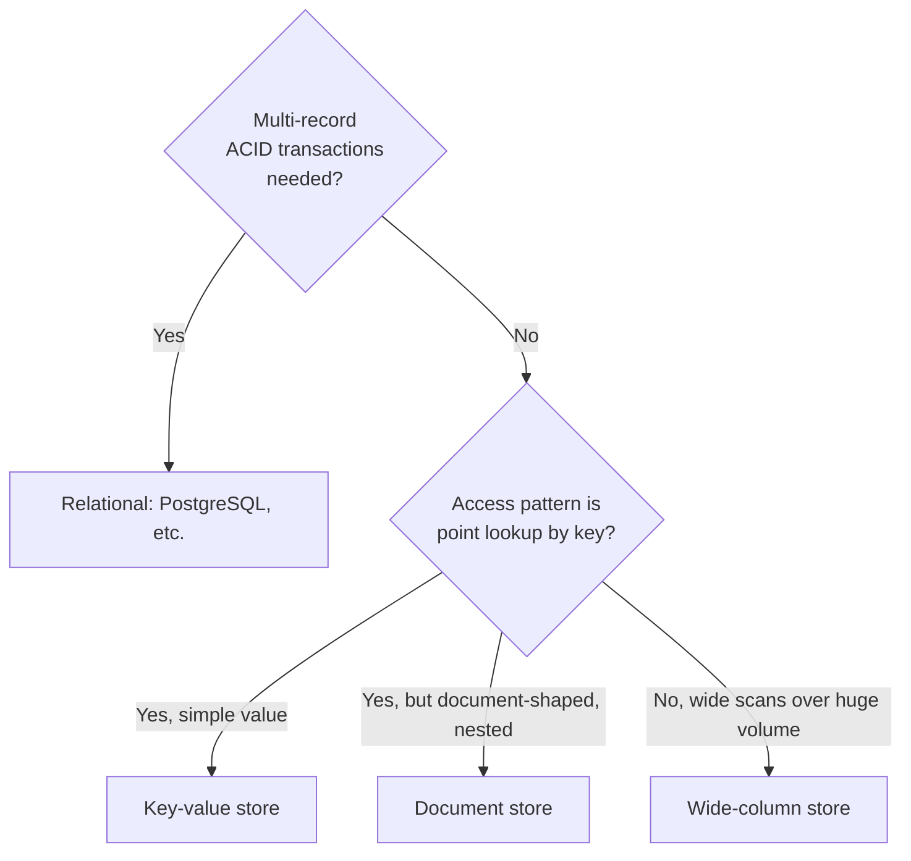

# T-617 / T-811 · Storage Selection Trade-offs

**IWI 6.90 · Advanced tier**

## Table of Contents

1. [The concept](#1-the-concept)
2. [Why it exists](#2-why-it-exists)
3. [The access-pattern method](#3-the-access-pattern-method)
4. [Trade-offs](#4-trade-offs)
5. [Interview questions](#5-interview-questions)
6. [Common mistakes](#6-common-mistakes)
7. [Staff-level discussion](#7-staff-level-discussion)
8. [Summary](#8-summary)
9. [Key Takeaways](#9-key-takeaways)
10. [Cheat Sheet](#10-cheat-sheet)
11. [Flashcards](#11-flashcards)
12. [Practice Exercises](#12-practice-exercises)
13. [Additional Reading](#13-additional-reading)
14. [Official References](#14-official-references)

---

## 1. The concept

Storage selection ("SQL vs NoSQL," more precisely "which storage engine fits this access pattern") is answered by working backward from the queries the system actually needs to serve — not from a general reputation ("Postgres is for structured data, Mongo is for flexible data"). The same logical data can be correctly stored in a relational table, a document store, a key-value store, or a wide-column store, depending entirely on how it's read and written, at what volume, and under what consistency requirement.

## 2. Why it exists

Choosing storage by reputation rather than access pattern produces two recurring failures: relational databases forced into extreme normalization for data that's always read as one document (adding join cost with no corresponding benefit), and document stores used for data with real relational structure and multi-record transactional requirements (losing consistency guarantees the application then has to reimplement badly, by hand, in the application layer).

## 3. The access-pattern method

Answer these, in order, before naming a technology:

1. **What are the actual read and write patterns?** Point lookups by key? Range scans? Complex joins across many entity types? Full-text search?
2. **What's the consistency requirement, per operation?** Does this specific write need to be immediately visible to a subsequent read (strong consistency), or is a short staleness window acceptable (eventual)?
3. **What's the transactional scope?** Does a single logical operation need to atomically touch multiple records/aggregates?
4. **What's the volume and growth shape?** Read-heavy or write-heavy? Predictable growth or bursty?

Only after answering these does a technology choice become a conclusion rather than a guess.

## 4. Trade-offs

| Category | Wins when | Costs |
|---|---|---|
| **Relational (PostgreSQL)** | Multi-entity transactions, ad-hoc queries/joins, strong consistency by default | Schema changes require migration discipline; horizontal write scaling is harder |
| **Document (MongoDB-style)** | Data is naturally read/written as one self-contained document, flexible schema | Cross-document transactions are weaker/newer; denormalization risks the update-anomaly class of bugs |
| **Key-value** | Simple point lookups at very high throughput | No query flexibility beyond the key; relational structure has to live elsewhere |
| **Wide-column (Cassandra-style)** | Massive write volume, time-series-like access patterns, tunable consistency | Query patterns must be designed in at schema-design time — ad-hoc queries are expensive or impossible |

## 5. Interview questions

### Q1. Choose between PostgreSQL and DynamoDB for a given workload. Defend it, then argue the opposite.

- **Expected answer:** works through the §3 method for the specific workload given, reaches a defensible choice, then genuinely argues the other side rather than restating a weaker version of the same argument.
- **Common mistakes:** picking a database by reputation ("DynamoDB scales better") without reference to the actual access pattern.
- **Follow-up questions:** "What specific access pattern would flip your answer?"
- **Senior-level expectations:** reaches a defensible choice using the method.
- **Staff-level expectations:** the "argue the opposite" half is genuinely argued, not a token concession — naming the specific access-pattern change that would flip the decision.

### Q2. When would polyglot persistence (multiple storage technologies in one system) be worth its operational cost?

- **Expected answer:** when a single component's access pattern is different enough from the rest of the system that forcing one storage technology for everything creates a real, measurable cost (e.g., search needing a dedicated text-search engine alongside the primary relational store).
- **Common mistakes:** treating polyglot persistence as a default good practice rather than a cost/benefit call — every additional storage technology is an additional operational burden (backup, monitoring, on-call expertise).
- **Follow-up questions:** "What's the operational cost of adding a second storage technology, concretely?"
- **Senior-level expectations:** identifies at least one legitimate polyglot use case.
- **Staff-level expectations:** names the operational cost side explicitly and unprompted — extra backup/monitoring/on-call surface area, and weighs it against the access-pattern benefit.

## 6. Common mistakes

- Choosing storage technology from reputation or trend rather than the §3 method.
- Treating "NoSQL" as one category — a document store, a key-value store, and a wide-column store have almost nothing in common except "not traditionally relational."
- Adding a second storage technology (polyglot persistence) without weighing its ongoing operational cost against the specific access-pattern win it buys.

## 7. Staff-level discussion

At Staff scope, a storage decision is a **multi-year commitment with a real migration cost**, and the honest framing is closer to "which set of trade-offs can this team operate confidently for the system's expected lifetime" than "which technology is theoretically best-suited." A team with deep PostgreSQL operational experience choosing PostgreSQL for a workload that's *technically* slightly better suited to a document store, because the team's operational maturity outweighs the marginal technical fit, is frequently the *better* Staff-level answer — naming this explicitly, rather than pure technology fit, is a differentiator.

## 8. Summary

Storage selection should follow from the actual access pattern (read/write shape, consistency requirement, transactional scope, volume) — not from a technology's reputation. Each storage category (relational, document, key-value, wide-column) wins under specific, nameable conditions and loses under others; a defensible answer works through the method and names the specific condition that would flip the decision.

## 9. Key Takeaways

- Work backward from access pattern, consistency requirement, and transactional scope — never forward from technology reputation.
- "NoSQL" is not one category — document, key-value, and wide-column stores solve different problems.
- Polyglot persistence has a real, ongoing operational cost that must be weighed against its access-pattern benefit.
- Team operational maturity with a given technology is a legitimate, Staff-level factor in the decision, not just technical fit.

## 10. Cheat Sheet

See §3's decision flowchart.

## 11. Flashcards

1. **Q: What's the first question in storage selection?** A: What are the actual read/write access patterns — not "which technology is trendy."
2. **Q: Name the four storage categories in this chapter.** A: Relational, document, key-value, wide-column.
3. **Q: What's the hidden cost of polyglot persistence?** A: Ongoing operational burden — backup, monitoring, on-call expertise — for every additional storage technology.

(Full week-level deck: `08-flashcards.md`.)

## 12. Practice Exercises

1. Take a system you know. Run its primary data store through the §3 method — would the same technology be chosen today, working from access patterns, or was it chosen for another reason?
2. Construct a workload where a document store is clearly correct, and a second workload (same domain, different access pattern) where it clearly is not.

## 13. Additional Reading

- Martin Kleppmann, *Designing Data-Intensive Applications*, Ch. 2 "Data Models and Query Languages" and Ch. 3 "Storage and Retrieval"

## 14. Official References

- [PostgreSQL documentation](https://www.postgresql.org/docs/current/) — relational baseline for comparison
