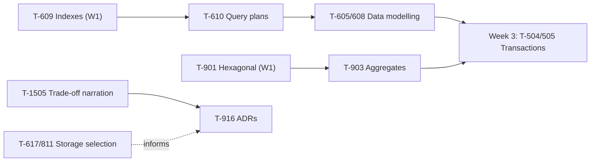

# Week 2 Study Pack — Query Plans, Data Modelling, Trade-off Narration

**Plan:** A (Interview Emergency Sprint) · default workload 20h/week · see `00-project/learning-roadmap.md` §3, Week 2, for full context
**Topics:** T-610 (Query planning/`EXPLAIN`) · T-605 (Entity mapping, join tables) · T-608 (SQL fundamentals) · T-903 (DDD tactical — aggregates) · T-617/T-811 (Storage selection) · T-1505 (Trade-off narration) · T-916 (ADRs)
**Prerequisites:** T-609 ✔ (Week 1), T-901 ✔ (Week 1)

## Table of Contents

1. [Objective](#objective)
2. [Why this week, in this order](#why-this-week-in-this-order)
3. [Dependency graph](#dependency-graph)
4. [Files in this pack](#files-in-this-pack)
5. [Daily schedule](#daily-schedule-20hweek-baseline)
6. [Workload variants](#workload-variants)
7. [Exit criteria](#exit-criteria--all-must-pass-before-starting-week-3)

---

## Objective

Move from "I know what an index is" (Week 1) to "I can read a plan and defend a modelling decision." Complete the second half of the named interview-feedback block. Begin the trade-off vocabulary (T-1505) that every remaining week depends on.

## Why this week, in this order

T-610 is unusable without Week 1's T-609 — reading a query plan requires already knowing what the planner is choosing *between*. T-903 (aggregates) completes the persistence-agnostic domain thread opened by Week 1's T-901. T-1505 (trade-off narration) is scheduled now, not later, because every remaining week produces trade-off answers and the four-beat structure has to exist before it's needed under pressure.

## Dependency graph

## Files in this pack

| # | File | Purpose |
|---|---|---|
| 1 | `README.md` | This file |
| 2 | `01-query-planning-and-explain.md` | T-610 — full chapter, 3 real diagnosed query plans |
| 3 | `02-data-modelling-join-tables.md` | T-605/T-608 — full chapter, real executed many-to-many demonstration |
| 4 | `03-ddd-tactical-aggregates.md` | T-903 — full chapter |
| 5 | `04-storage-selection-tradeoffs.md` | T-617/T-811 — full chapter |
| 6 | `05-trade-off-narration-and-adrs.md` | T-1505/T-916 — the four-beat structure |
| 7 | `06-answer-frameworks.md` | Nine-layer treatment for this week's Deep topics |
| 8 | `07-java-coding-practice.md` | 8 problems, all compiled and run, plus the monotonic-stack errata |
| 9 | `08-flashcards.md` | 14 cards for this week's Deep topics |
| 10 | `09-week-2-mock-interview.md` | 30-min mock; candidate/interviewer sections hard-separated |
| 11 | `10-adr-exercise.md` | ADR-001 template + one fully worked example |
| 12 | `11-week-2-checklist.md` | Day-by-day checklist with a fall-behind priority order |
| 13 | `resources.md` | Primary sources, classified by authority |
| — | `MANIFEST.md` | Every file, verification status, real checksums |

## Daily schedule (20h/week baseline)

| Day | Track A — Technical (2h) | Track B — Coding (~0.85h) | Track C — Performance (~0.85h) |
|---|---|---|---|
| Mon | Query planning: read `EXPLAIN ANALYZE` line by line | LC 704, LC 35 — exact boundary conditions | Build L1+L2 for T-610 |
| Tue | Nested loop vs hash vs merge join; when the planner picks each | LC 33 — rotated-array variant | Build L5+L6 — production example + trade-offs |
| Wed | Data modelling: many-to-many trap, run the lab yourself | LC 875 — search on the answer space | Build L3 deep dive for T-610 |
| Thu | DDD aggregates: boundary = transaction boundary | LC 20, LC 155 | Trade-off narration drill: the four-beat structure |
| Fri | Storage selection: access-pattern method | **LC 739 — write it, understand why a values-only stack can't work, then verify the index-based fix** | Deliver `query-plan-analysis.md` and `ADR-001.md` |
| Sat | — | LC 208 — design coding | Story 3 (production incident), Story 4 (technical debt) |
| Sun | Weekly review against exit criteria | — | 30-min self-mock, `EXPLAIN` walkthrough required |

## Workload variants

- **10h/week:** keep Mon/Wed/Fri Track A, LC 704 / LC 875 / LC 739, and the `query-plan-analysis.md` deliverable only (defer `ADR-001.md` to Week 6 revision).
- **30h/week:** add the full follow-up-question sets from `01-…` and `02-…`, plus 3 additional query-plan scenarios of your own construction, and run a partner mock instead of self-recorded.

## Exit criteria — all must pass before starting Week 3

- [ ] Read an unfamiliar `EXPLAIN ANALYZE` aloud and identify the bottleneck node without prompting
- [ ] `query-plan-analysis.md` produced with three real before/after plans (this pack's own lab counts if run yourself; see `01-…` §3)
- [ ] `ADR-001.md` complete, using `10-adr-exercise.md`'s template
- [ ] Can model many-to-many both ways (naive join table vs. explicit join entity) and state the trigger for needing the explicit entity, unprompted
- [ ] 4 STAR stories total (2 from Week 1 + Stories 3–4 this week)
- [ ] 8+ problems solved in Java this week (16+ cumulative), including the LC 739 monotonic-stack correction
- [ ] Deliver any technical answer using the four-beat trade-off structure (`05-…`) without prompting
