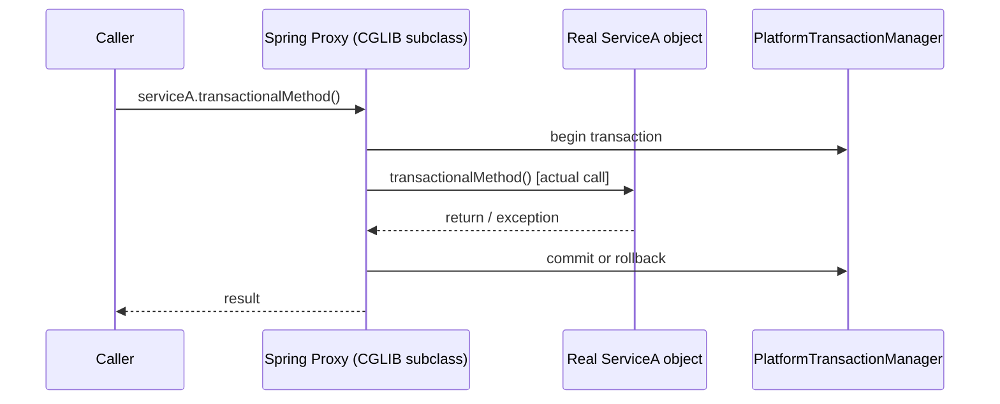

# T-503 / T-504 / T-505 · Spring Transactions, Proxies, and Propagation

**IWI 8.15 · Advanced tier · Highest-IWI single Spring topic in the register**

**Verification note:** every claim in this chapter is backed by a real, executed Spring Framework 6.1.14 demo — no Spring Boot, no Maven, plain jars from Maven Central on a hand-built classpath. Source and full output: `practice/java/week-03/spring-demos/`.

## Table of Contents

1. [The concept — AOP proxies](#1-the-concept--aop-proxies)
2. [Why it exists](#2-why-it-exists)
3. [Demo 1 — self-invocation bypasses the proxy](#3-demo-1--self-invocation-bypasses-the-proxy)
4. [Demo 2 — checked exceptions do not roll back by default](#4-demo-2--checked-exceptions-do-not-roll-back-by-default)
5. [Demo 3 — REQUIRES_NEW commits independently](#5-demo-3--requires_new-commits-independently)
6. [Demo 4 & 5 — readOnly is a hint, enforcement is driver-dependent](#6-demo-4--5--readonly-is-a-hint-enforcement-is-driver-dependent)
7. [Demo 6 — connection-pool exhaustion from a long transaction](#7-demo-6--connection-pool-exhaustion-from-a-long-transaction)
8. [Propagation reference](#8-propagation-reference)
9. [Trade-offs](#9-trade-offs)
10. [Interview questions](#10-interview-questions)
11. [Common mistakes](#11-common-mistakes)
12. [Staff-level discussion](#12-staff-level-discussion)
13. [Summary](#13-summary)
14. [Key Takeaways](#14-key-takeaways)
15. [Cheat Sheet](#15-cheat-sheet)
16. [Flashcards](#16-flashcards)
17. [Practice Exercises](#17-practice-exercises)
18. [Additional Reading](#18-additional-reading)
19. [Official References](#19-official-references)

---

## 1. The concept — AOP proxies

`@Transactional` is not magic bytecode woven into your method — it's implemented as a **proxy** wrapping your bean. Spring creates either a JDK dynamic proxy (if the bean implements an interface) or a CGLIB subclass proxy (if it doesn't), and that proxy is what actually gets injected everywhere the bean is used. The proxy intercepts the call, starts a transaction, invokes the *real* method, and commits or rolls back based on how it returns.



## 2. Why it exists

Declarative transaction management exists so that transaction demarcation — begin, commit, rollback — doesn't have to be hand-written inside every business method. The cost of this convenience is that it only works through the mechanism that makes it declarative in the first place: the proxy. Any call that reaches the target object *without* going through the proxy (self-invocation via `this`, or a call from within the same class) never triggers the interception, and therefore never gets a transaction, no matter what the annotation says.

## 3. Demo 1 — self-invocation bypasses the proxy

```java
static class ServiceA {
    @Transactional
    public boolean transactionalMethod() {
        return TransactionSynchronizationManager.isActualTransactionActive();
    }
    public boolean callViaSelfInvocation() {
        return this.transactionalMethod(); // bypasses the proxy entirely
    }
}
```

**Real output:**
```
Called through the Spring-managed proxy:      isActualTransactionActive() = true
Called via self-invocation (this.method()):   isActualTransactionActive() = false
RESULT: CONFIRMED -- self-invocation bypasses the transactional proxy.
```

**Three real fixes**, in order of general preference:
1. **Split the method into a separate bean** and call it via dependency injection — the call now goes through the proxy (this is exactly what Demo 3's `REQUIRES_NEW` example does with `AuditLogService`).
2. **Self-inject via `ApplicationContext.getBean(getClass())`** or `@Lookup`, obtaining the proxy from within the class — works, but a code smell most teams avoid.
3. **`AopContext.currentProxy()`** with `exposeProxy = true` on `@EnableAspectJAutoProxy` — retrieves the current proxy explicitly; more explicit than option 2, still adds a Spring-specific dependency into what should be plain business logic.

## 4. Demo 2 — checked exceptions do not roll back by default

```java
@Transactional
public void placeOrderDefaultRollbackRule(int id, boolean throwChecked) throws OrderPlacementFailedException {
    jdbc.update("INSERT INTO orders (id, note) VALUES (?, ?)", id, "default-rule");
    if (throwChecked) throw new OrderPlacementFailedException("simulated downstream failure");
}
```

**Real output:**
```
Default rollback rule, checked exception thrown -> row count: 1 (row survived the exception: true)
rollbackFor=Exception.class, checked exception thrown -> row count: 1 (row 2 correctly rolled back: true)
RESULT: CONFIRMED -- default rule does NOT roll back on a checked exception; rollbackFor fixes it.
```

Spring's default rollback rule rolls back on `RuntimeException` and `Error`, but **not** on checked exceptions — this mirrors EJB's original convention, and it means a checked `OrderPlacementFailedException` thrown after a successful `INSERT` leaves that `INSERT` committed. The fix, `@Transactional(rollbackFor = Exception.class)`, is demonstrated in the same run: with it, the identical checked exception correctly rolls back the row.

## 5. Demo 3 — REQUIRES_NEW commits independently

```java
@Transactional(propagation = Propagation.REQUIRES_NEW)
public void recordAttempt(String note) {
    jdbc.update("INSERT INTO audit_log (note) VALUES (?)", note);
}
// ... called from inside a DIFFERENT outer @Transactional method that later throws
```

**Real output:**
```
orders table row count (outer transaction, should be rolled back): 0
audit_log table row count (REQUIRES_NEW, should have survived): 1
RESULT: CONFIRMED -- REQUIRES_NEW committed independently despite the outer rollback.
```

**Real use case:** an audit log entry that must survive even if the operation it's auditing later fails — exactly the scenario demonstrated. **Deadlock risk:** `REQUIRES_NEW` suspends the outer transaction's connection and obtains a new one; if the inner transaction needs a row lock the (suspended) outer transaction already holds, the inner transaction blocks on a lock that will never be released until the inner transaction itself completes — a genuine self-deadlock risk unique to this propagation level, worth naming unprompted.

## 6. Demo 4 & 5 — readOnly is a hint, enforcement is driver-dependent

Identical code, `@Transactional(readOnly = true)`, attempting a write, on two different databases:

**H2 (real output):**
```
Write inside @Transactional(readOnly=true) SUCCEEDED (no exception).
RESULT: readOnly is a HINT here, not an enforced constraint -- driver-dependent behavior, exactly as documented.
```

**PostgreSQL (real output):**
```
Write inside @Transactional(readOnly=true) FAILED on PostgreSQL:
  UncategorizedSQLException: ERROR: cannot execute INSERT in a read-only transaction
RESULT: CONFIRMED -- PostgreSQL's JDBC driver enforces connection.setReadOnly(true) by rejecting the write at the database level.
```

Spring's `readOnly` flag calls `connection.setReadOnly(true)` on the underlying JDBC connection (plus, for Hibernate, sets the flush mode to avoid unnecessary dirty-checking) — **what happens next is entirely up to the driver.** PostgreSQL's driver takes the hint seriously and rejects writes at the database level; H2, in this test, did not. This is the correction to "readOnly prevents writes" as a blanket claim — it depends on the specific database.

## 7. Demo 6 — connection-pool exhaustion from a long transaction

Two threads each hold a connection for 6 seconds inside a `@Transactional` method (simulating a forgotten `Thread.sleep`, a slow external HTTP call, or an oversized report query run inside a transaction); a pool of size 2 has no connection left for a third, unrelated, fast request.

**Real output:**
```
Pool size = 2, connectionTimeout = 2000ms
Third request FAILED after 2010ms waiting for a connection: CannotCreateTransactionException
RESULT: CONFIRMED -- pool exhaustion under a small pool size with long-held connections causes a real connection-acquisition timeout for a completely unrelated, fast request.
```

**Why this matters in production:** a transaction that holds its connection open for the duration of a slow external call (§9's cost row) doesn't just slow down that one request — it removes a connection from the shared pool for every *other* request for the same duration, and at a small enough pool size, an unrelated fast endpoint starts failing with no code change of its own.

## 8. Propagation reference

| Propagation | Behavior | Real use case (this chapter) |
|---|---|---|
| `REQUIRED` (default) | Joins an existing transaction, or starts one if none exists | The default for almost everything |
| `REQUIRES_NEW` | Suspends any existing transaction, always starts a new independent one | Audit logging that must survive the caller's rollback (Demo 3) |
| `SUPPORTS` | Joins if a transaction exists, runs non-transactionally otherwise | Read methods usable both inside and outside a transaction |
| `MANDATORY` | Requires an existing transaction; throws if none exists | Enforcing that a method is never called outside a transaction |
| `NOT_SUPPORTED` | Suspends any existing transaction, runs without one | Rarely needed; occasionally for a long-running non-transactional operation |
| `NEVER` | Throws if a transaction exists | Enforcing the opposite of `MANDATORY` |
| `NESTED` | A true savepoint-based nested transaction, if the driver supports it | Partial rollback within a larger transaction |

## 9. Trade-offs

| Approach | Benefit | Cost |
|---|---|---|
| Declarative `@Transactional` | No manual transaction demarcation code | Only works through the proxy — self-invocation and internal calls silently don't get it |
| `REQUIRES_NEW` for audit/logging | Survives caller rollback | Real deadlock risk against a suspended outer transaction holding a needed lock (§5) |
| `readOnly = true` | Query-planner and ORM flush-mode hints, sometimes real write rejection | Enforcement is driver-dependent — never rely on it as your only write-prevention mechanism |
| Long-lived transactions | Simpler code (one boundary for a multi-step operation) | Directly reduces pool availability for every other concurrent request (Demo 6) |

## 10. Interview questions

### Q1. Method A calls `@Transactional` method B in the same class. What happens, and why? Three fixes.

- **Expected answer:** no transaction starts for B — the call bypasses the proxy entirely, as demonstrated in Demo 1; the three fixes from §3.
- **Common mistakes:** believing Spring "somehow" still applies the transaction via bytecode magic; not knowing any fix beyond "extract to another bean."
- **Follow-up questions:** "Why does extracting to another bean fix it?" *(The call to a different bean is a normal Spring-managed reference — it goes through that bean's proxy.)*
- **Senior-level expectations:** correctly explains the proxy mechanism and names at least one fix.
- **Staff-level expectations:** names all three fixes with their trade-offs, and explains specifically why CGLIB (not JDK dynamic proxies) is used when `ServiceA` has no interface.

### Q2. Your method threw a checked exception. Did it roll back? Why is that the default?

- **Expected answer:** no, per Demo 2; the default mirrors EJB's original convention (checked exceptions were conventionally "expected, recoverable" business outcomes, not failures).
- **Common mistakes:** assuming any exception thrown inside `@Transactional` rolls back.
- **Follow-up questions:** "How would you fix it, two ways?" *(`rollbackFor = Exception.class` on the method, or throw an unchecked exception instead.)*
- **Senior-level expectations:** correctly states the default and one fix.
- **Staff-level expectations:** explains the historical EJB-convention reasoning, not just "that's the rule."

### Q3. `REQUIRES_NEW` — give a real use case and name the deadlock risk.

- **Expected answer:** the audit-log use case (Demo 3) and the suspended-transaction lock-wait risk (§5).
- **Common mistakes:** naming a use case but not the deadlock risk, or vice versa.
- **Follow-up questions:** "How would you detect this deadlock risk before it happens in production?"
- **Senior-level expectations:** states both the use case and the risk.
- **Staff-level expectations:** proposes a detection method (lock-wait timeout monitoring, or reviewing whether `REQUIRES_NEW` methods ever touch rows the outer transaction has already locked).

### Q4. Where does the transaction boundary belong, and defend it.

- **Expected answer:** the application-service / use-case layer, consistent with Week 1's T-901 — never inside the domain, never spanning an HTTP call.
- **Common mistakes:** placing `@Transactional` on a controller method (too broad — includes serialization, potentially the HTTP response) or on a repository method (too narrow — can't coordinate multiple repository calls atomically).
- **Follow-up questions:** "What's wrong with putting `@Transactional` on the controller?"
- **Senior-level expectations:** places the boundary correctly.
- **Staff-level expectations:** connects it back to T-901's port/adapter boundary explicitly.

### Q5. There's an HTTP call inside a transaction. What breaks, and at what load?

- **Expected answer:** the transaction's connection is held for the HTTP call's entire duration; at even moderate concurrent load, this exhausts the connection pool exactly as demonstrated in Demo 6, causing unrelated fast requests to time out waiting for a connection.
- **Common mistakes:** describing only "it's slow" without connecting it to pool exhaustion for *other* requests.
- **Follow-up questions:** "How would you fix it?" *(Make the HTTP call before opening the transaction, or after it commits; never inside it.)*
- **Senior-level expectations:** names the pool-exhaustion mechanism.
- **Staff-level expectations:** quantifies the blast radius — a slow dependency inside a transaction doesn't just slow its own request, it can take down unrelated endpoints sharing the same connection pool, exactly as Demo 6 shows with real numbers.

## 11. Common mistakes

- Assuming `@Transactional` "just works" regardless of how the method is called — it only works through the proxy.
- Assuming any thrown exception triggers a rollback.
- Treating `readOnly = true` as a guaranteed write-prevention mechanism across all databases.
- Making an external network call (HTTP, another service) from inside a transaction boundary.

## 12. Staff-level discussion

Every failure mode in this chapter — self-invocation, checked-exception surprises, `readOnly` inconsistency, pool exhaustion — has the same root cause: **treating a declarative, proxy-based mechanism as if it were a language-level guarantee.** A Staff-level engineer doesn't just know the individual rules; they reason from the proxy mechanism itself to predict *new* failure modes not explicitly listed here (e.g., "what happens if this bean is also wrapped by a caching proxy — which proxy runs first, and does that change anything about the transaction boundary?"). This chapter's demos were deliberately built and run rather than described specifically because the proxy mechanism produces behavior that's easy to state incorrectly from memory and cheap to verify directly.

## 13. Summary

`@Transactional` is a proxy-based mechanism, not a language feature — every one of its surprising behaviors (self-invocation, checked-exception non-rollback, driver-dependent `readOnly` enforcement) follows directly from that fact. `REQUIRES_NEW` provides real independent-commit semantics at the cost of a genuine deadlock risk against a suspended outer transaction. A long-held transaction's cost isn't just its own latency — it removes a connection from the shared pool for every other concurrent request.

## 14. Key Takeaways

- `@Transactional` only works through the Spring-managed proxy; self-invocation bypasses it entirely.
- Default rollback: unchecked exceptions and `Error`, not checked exceptions — use `rollbackFor` to change this.
- `REQUIRES_NEW` commits independently of the outer transaction, but risks deadlocking against a lock the suspended outer transaction holds.
- `readOnly = true` enforcement is driver-dependent — verified different on H2 vs. PostgreSQL in this chapter.
- A transaction that holds its connection for an external call reduces pool availability for every other concurrent request.

## 15. Cheat Sheet

See §8's propagation reference table.

## 16. Flashcards

1. **Q: Why does self-invocation break `@Transactional`?** A: The call never passes through the Spring-managed proxy that starts the transaction.
2. **Q: Does a checked exception roll back a `@Transactional` method by default?** A: No — only `RuntimeException`/`Error`, unless `rollbackFor` says otherwise.
3. **Q: Real use case for `REQUIRES_NEW`?** A: An audit log entry that must survive even if the calling operation later rolls back.
4. **Q: Is `readOnly = true` guaranteed to prevent writes?** A: No — enforcement is driver-dependent (confirmed: not enforced on H2, enforced on PostgreSQL).
5. **Q: What's the production cost of an HTTP call inside a transaction?** A: It holds a pooled connection for the call's duration, reducing pool availability for every other concurrent request.

(Full week-level deck: `05-flashcards.md`.)

## 17. Practice Exercises

1. Reproduce all 6 demos yourself: `practice/java/week-03/spring-demos/`.
2. Modify Demo 3 (`REQUIRES_NEW`) to construct the deadlock scenario described in §5 — have the outer transaction lock a row the inner `REQUIRES_NEW` transaction then tries to update.
3. Take a method in a system you know annotated `@Transactional`. Confirm: is it ever called via self-invocation from within the same class? If so, does that call actually need a transaction?

## 18. Additional Reading

- Martin Kleppmann, *Designing Data-Intensive Applications*, Ch. 7 (also referenced in `02-isolation-levels-and-write-skew.md`)

## 19. Official References

- [Spring Framework documentation — Transaction Management](https://docs.spring.io/spring-framework/reference/data-access/transaction.html)
- [Spring Framework documentation — AOP Proxies](https://docs.spring.io/spring-framework/reference/core/aop/proxying.html)
