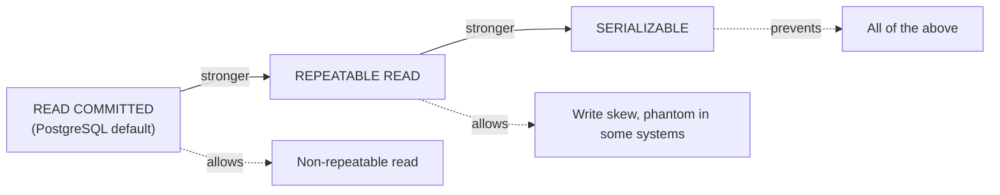

# T-611 · Isolation Levels and Write Skew

**IWI 7.95 · Advanced tier · The discriminating question this chapter builds toward: "explain write skew with a concrete example."**

**Verification note:** the write-skew reproduction and prevention in §3 are real, executed PostgreSQL 16 output from two genuinely concurrent `psql` sessions. Source: `practice/sql/week-03/`.

## Table of Contents

1. [The concept](#1-the-concept)
2. [Why it exists](#2-why-it-exists)
3. [Write skew, reproduced and prevented](#3-write-skew-reproduced-and-prevented)
4. [Isolation levels, walked through](#4-isolation-levels-walked-through)
5. [Trade-offs](#5-trade-offs)
6. [Interview questions](#6-interview-questions)
7. [Common mistakes](#7-common-mistakes)
8. [Staff-level discussion](#8-staff-level-discussion)
9. [Summary](#9-summary)
10. [Key Takeaways](#10-key-takeaways)
11. [Cheat Sheet](#11-cheat-sheet)
12. [Flashcards](#12-flashcards)
13. [Practice Exercises](#13-practice-exercises)
14. [Additional Reading](#14-additional-reading)
15. [Official References](#15-official-references)

---

## 1. The concept

An isolation level defines how much one transaction can see of another transaction's uncommitted or concurrent work. Weaker isolation allows more concurrency (less blocking, more throughput) at the cost of more possible anomalies; stronger isolation prevents more anomalies at the cost of more blocking, retries, or serialization failures.



## 2. Why it exists

Without isolation, concurrent transactions reading and writing the same data can produce results that couldn't happen if the transactions ran one after another — the entire premise of "transaction" as a unit of work would be meaningless. But full isolation between every transaction (true serial execution) has a real throughput cost, so isolation levels exist as a spectrum of trade-offs between correctness guarantees and concurrency — and picking the wrong one silently allows a specific, nameable class of bug rather than announcing it.

## 3. Write skew, reproduced and prevented

**The scenario:** an `on_call` table with an invariant — at least one doctor must always be on call. Alice and Bob are both currently on call. Each, independently, checks "is at least one other doctor on call?" before going off call themselves.

**At `REPEATABLE READ` — the anomaly occurs.** Both transactions run concurrently; each reads `on_call_count = 2` from its own consistent snapshot (the other doctor hasn't committed their change yet), so both proceed to go off call:

```
Alice's transaction: SELECT count(*) -> 2, UPDATE Alice off-call, COMMIT (succeeds)
Bob's transaction:   SELECT count(*) -> 2, UPDATE Bob off-call,   COMMIT (succeeds)

Final state: Alice = false, Bob = false
```

**Zero doctors on call — the invariant is violated**, even though neither transaction did anything individually incorrect and each one's own snapshot was perfectly consistent. This is write skew: two transactions each read a shared state, and each writes to a *different* row based on that shared read, and the combination of their two writes breaks an invariant that spans both rows — no single-row conflict exists for `REPEATABLE READ` to detect.

**At `SERIALIZABLE` — the anomaly is prevented.** Identical code, only the isolation level changed:

```
Alice's transaction: SELECT count(*) -> 2, UPDATE Alice off-call, COMMIT -> FAILS:
  ERROR: could not serialize access due to read/write dependencies among transactions
  DETAIL: Reason code: Canceled on identification as a pivot, during commit attempt.
  HINT: The transaction might succeed if retried.

Bob's transaction:   SELECT count(*) -> 2, UPDATE Bob off-call,   COMMIT (succeeds)

Final state: Alice = true, Bob = false
```

PostgreSQL's Serializable Snapshot Isolation (SSI) detected the dangerous read-write dependency structure between the two transactions and aborted one of them at commit time with a real, specific error — **the application must retry the aborted transaction**, at which point it will re-read the now-current state (Bob already off call) and correctly refuse to also go off call. The invariant survives.

## 4. Isolation levels, walked through

| Level | Prevents | Still allows | Mechanism (PostgreSQL) |
|---|---|---|---|
| **READ COMMITTED** (default) | Dirty reads | Non-repeatable reads, write skew, phantoms | Each statement sees a fresh snapshot as of its own start |
| **REPEATABLE READ** | Non-repeatable reads within one transaction | Write skew (§3) | One snapshot for the whole transaction, taken at its start |
| **SERIALIZABLE** | Write skew and all weaker anomalies | Nothing — behaves *as if* transactions ran one at a time | REPEATABLE READ's snapshot, plus runtime dependency tracking (SSI) that aborts transactions forming a dangerous cycle |

**Two transactions read a balance and both write** — walking this at each level: at READ COMMITTED, the second writer's `UPDATE` blocks until the first commits, then re-reads the row and applies its own change on top (correct, assuming a properly-guarded `UPDATE ... WHERE balance = ?` rather than a read-then-write race) — but a naive read-then-write in application code, not guarded by the `UPDATE`'s own atomicity, can still lose an update. At REPEATABLE READ, the second transaction's `UPDATE` on a row already modified by the first (uncommitted) transaction blocks, then on the first's commit, the second transaction gets a serialization error rather than silently overwriting — PostgreSQL specifically prevents lost updates this way even at REPEATABLE READ. At SERIALIZABLE, the same protection applies plus the write-skew protection from §3.

## 5. Trade-offs

| Level | Benefit | Cost |
|---|---|---|
| READ COMMITTED | Highest concurrency, PostgreSQL's default for a reason | Application code must be written defensively against non-repeatable reads and write skew |
| REPEATABLE READ | Consistent snapshot for the whole transaction | Write skew still possible (§3); more serialization failures than READ COMMITTED under contention |
| SERIALIZABLE | Strongest guarantee — behaves as if transactions ran serially | Real throughput cost from SSI's dependency tracking; **application must implement retry-on-serialization-failure**, or transactions silently fail under contention |

## 6. Interview questions

### Q1. Two transactions read a balance and both write. Walk it at READ COMMITTED, REPEATABLE READ, SERIALIZABLE.

- **Expected answer:** §4's walkthrough — highlighting that PostgreSQL prevents lost updates even at READ COMMITTED via row-level locking on `UPDATE`, but naive read-then-write application logic can still race.
- **Common mistakes:** claiming READ COMMITTED allows lost updates unconditionally — PostgreSQL's `UPDATE` statement itself takes a row lock, so a single atomic `UPDATE ... SET balance = balance - ?` doesn't lose updates even at READ COMMITTED; the race only appears with a separate read-then-conditionally-write pattern in application code.
- **Follow-up questions:** "Does `SELECT ... FOR UPDATE` change this?" *(Yes — it takes the row lock at read time, preventing the interleaving even for an explicit read-then-write pattern.)*
- **Senior-level expectations:** correctly distinguishes atomic `UPDATE` from application-level read-then-write.
- **Staff-level expectations:** names `SELECT ... FOR UPDATE` as the READ-COMMITTED-compatible fix for the read-then-write pattern, without needing to escalate the whole transaction to SERIALIZABLE.

### Q2. Explain write skew with a concrete example. *(the discriminating question)*

- **Expected answer:** the exact §3 scenario — two transactions, each reading a shared multi-row state and writing to a *different* row, whose combination violates an invariant neither transaction's own single-row change would violate alone.
- **Common mistakes:** confusing write skew with a lost update (a lost update is a *same-row* conflict; write skew is fundamentally a *cross-row* invariant violation) — this conflation is extremely common and is exactly what makes this "the discriminating question."
- **Follow-up questions:** "Why doesn't REPEATABLE READ catch this, when it does catch a lost update?"
- **Senior-level expectations:** gives a correct, concrete write-skew example (on-call doctors, or an equivalent like "two bank overdraft protections checked independently").
- **Staff-level expectations:** explains precisely *why* REPEATABLE READ misses it (each transaction's own single-row write has no conflict; the violated invariant spans rows neither transaction locked) while correctly stating it also prevents lost updates (a same-row case) — the distinction between the two anomaly classes, not just naming both.

### Q3. Estimate QPS and storage for a system with 10M DAU. Show every assumption.

- **Expected answer:** works the estimation math explicitly (see `03-system-design-method.md` §3), stating every assumption rather than presenting a bare number.
- **Common mistakes:** giving a final number with no visible assumptions, making it unreviewable and unfalsifiable.
- **Follow-up questions:** "What's your assumption on peak-to-average ratio, and why that number?"
- **Senior-level expectations:** produces a reasoned estimate with stated assumptions.
- **Staff-level expectations:** revises an assumption live and shows how the estimate changes, demonstrating the estimate is a working model, not a memorized number.

## 7. Common mistakes

- Conflating write skew with a lost update — they are different anomaly classes, prevented by different mechanisms.
- Assuming READ COMMITTED always risks lost updates — PostgreSQL's atomic `UPDATE` prevents this for the common case; the risk is specifically in application-level read-then-write logic.
- Choosing SERIALIZABLE everywhere without accounting for the retry logic it requires in application code.

## 8. Staff-level discussion

Choosing an isolation level is a **cross-cutting architectural decision, not a per-query tuning knob** — SERIALIZABLE's correctness guarantee is only real if every code path touching the affected tables both uses it *and* implements retry-on-serialization-failure; a single READ COMMITTED code path touching the same invariant reintroduces the anomaly regardless of what every other path does. This is why the Staff-level answer to "should we use SERIALIZABLE" is rarely "yes, everywhere" or "no, never" — it's "which specific invariants are cross-row, and are all the code paths that could violate them prepared to retry."

## 9. Summary

Isolation levels trade concurrency for correctness guarantees. Write skew — two transactions each reading a shared multi-row state and writing to different rows in a way that jointly violates an invariant — is real, reproducible, and specifically *not* caught by REPEATABLE READ even though REPEATABLE READ does prevent same-row lost updates. SERIALIZABLE catches it by tracking read-write dependencies and aborting one of the conflicting transactions, which means the application must be written to retry.

## 10. Key Takeaways

- Write skew is a cross-row invariant violation, not a same-row lost update — the distinction is the whole point of the discriminating question.
- PostgreSQL prevents same-row lost updates even at READ COMMITTED via row-level `UPDATE` locking.
- REPEATABLE READ does not prevent write skew — verified via real reproduction in this chapter.
- SERIALIZABLE prevents it by aborting one transaction at commit time — the application must retry.
- Isolation-level choice is architectural, not per-query — every code path touching the invariant must cooperate.

## 11. Cheat Sheet

See §4's isolation-level table.

## 12. Flashcards

1. **Q: What's the difference between a lost update and write skew?** A: Lost update is a same-row conflict; write skew is a cross-row invariant violation where each transaction's own single-row write looks fine in isolation.
2. **Q: Does REPEATABLE READ prevent write skew?** A: No — confirmed via real reproduction; it prevents same-row lost updates but not cross-row invariant violations.
3. **Q: What does SERIALIZABLE do differently?** A: Tracks read-write dependencies across transactions (SSI) and aborts one transaction at commit time if a dangerous cycle is detected.
4. **Q: What must application code do to safely use SERIALIZABLE?** A: Implement retry-on-serialization-failure — an aborted transaction is expected, recoverable behavior, not an error to surface to the user.

(Full week-level deck: `05-flashcards.md`.)

## 13. Practice Exercises

1. Reproduce §3 yourself: `practice/sql/week-03/write-skew-setup.sql` and `write-skew-tx.sh`.
2. Construct a second write-skew example in a different domain (e.g., meeting-room double-booking, inventory oversell across two warehouses) and verify it reproduces at REPEATABLE READ and is prevented at SERIALIZABLE.
3. Identify one invariant in a system you know that spans multiple rows. Determine which isolation level (and which code paths) would need to change to actually guarantee it.

## 14. Additional Reading

- Martin Kleppmann, *Designing Data-Intensive Applications*, Ch. 7 "Transactions," pp. 233–251 (weak isolation, including the write-skew section this chapter's demonstration follows)

## 15. Official References

- [PostgreSQL documentation, Ch. 13 "Concurrency Control"](https://www.postgresql.org/docs/current/mvcc.html) — §13.2 isolation levels, §13.3 explicit locking
