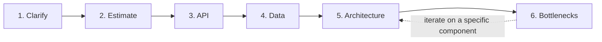

# T-801 / T-802 · System Design Method and Estimation

**IWI 8.65 · Staff-Level tier · Highest-IWI topic in the entire register**

## Table of Contents

1. [The concept — a repeatable procedure, not inspiration](#1-the-concept--a-repeatable-procedure-not-inspiration)
2. [Why it exists](#2-why-it-exists)
3. [The six phases](#3-the-six-phases)
4. [Estimation — the math, worked](#4-estimation--the-math-worked)
5. [Trade-offs](#5-trade-offs)
6. [Interview questions](#6-interview-questions)
7. [Common mistakes](#7-common-mistakes)
8. [Staff-level discussion](#8-staff-level-discussion)
9. [Summary](#9-summary)
10. [Key Takeaways](#10-key-takeaways)
11. [Cheat Sheet](#11-cheat-sheet)
12. [Flashcards](#12-flashcards)
13. [Practice Exercises](#13-practice-exercises)
14. [Additional Reading](#14-additional-reading)
15. [Official References](#15-official-references)

---

## 1. The concept — a repeatable procedure, not inspiration

A system design interview is not a test of having memorized the "right" architecture for a famous problem — it's a test of whether you have a **repeatable procedure** that produces a defensible design under time pressure, for a problem you may never have seen before. The six-phase method below is that procedure. Candidates who fail this round most often don't fail on technical knowledge; they fail because they jump straight to components ("we'll need a load balancer, a cache, a database...") without first establishing what the system actually needs to do, at what scale, which makes every subsequent decision unjustifiable when challenged.



## 2. Why it exists

Without an explicit procedure, two failure modes dominate: (a) diving into components immediately, producing a design with no stated justification for any choice, unable to defend why a cache belongs *here* rather than *there*; (b) spending disproportionate time on one phase (usually a beloved technology) while never reaching estimation or bottleneck analysis at all. The six-phase method exists specifically to force estimation to happen *before* architecture, so that later architectural decisions ("do we need a cache," "do we shard the database") are answered by the numbers established in phase 2, not by reflex.

## 3. The six phases

### Phase 1 — Clarify (2–3 min)

State the scope explicitly before designing anything. What does the system need to do, for whom, and — critically — what is explicitly **out of scope**. A design interview that never states what's excluded is a design interview where the candidate is guessing what the interviewer wants, silently.

*Questions to ask:* Who are the users? What's the core action (write-heavy, read-heavy, both)? What's explicitly out of scope for this session?

### Phase 2 — Estimate (3–5 min)

Work the numbers — see §4. This phase exists to make every later architectural decision falsifiable: "we need a cache" becomes justifiable only once you've stated the read QPS that makes a database alone insufficient.

### Phase 3 — API (2–3 min)

Define the core endpoints/interface at the boundary of the system — just enough to pin down what a client actually calls, not full request/response schemas. This phase also functions as a second clarification pass: writing `POST /rides {pickup, dropoff}` immediately surfaces questions (does the client also send a payment method here, or later?) that Phase 1 might have missed.

### Phase 4 — Data (3–5 min)

What's the core data model, and — per `04-storage-selection-tradeoffs.md`'s method — what storage technology fits the access pattern established in Phase 2. This is where Week 2's storage-selection method gets applied for real, against numbers Phase 2 just produced.

### Phase 5 — Architecture (10–15 min)

Draw the system: services, data stores, caches, queues — and **justify every box against Phase 2's numbers**, not by default reflex. "We need a cache" is not architecture; "reads are 50,000/s and the database alone tops out around 8,000/s reads at acceptable latency, so a cache in front of the read path is required at this scale" is.

### Phase 6 — Bottlenecks (5–10 min)

Name at least three specific failure modes for the design just drawn, and how each is mitigated. This phase is frequently skipped by candidates running low on time — doing so is itself a scored gap, since it's the phase most directly testing production judgment rather than architecture knowledge.

## 4. Estimation — the math, worked

**Estimate QPS and storage for a system with 10M DAU. Show every assumption.**

```
Assumption: each DAU performs an average of 5 core actions/day (writes)
Total daily writes = 10,000,000 × 5 = 50,000,000 writes/day

Average write QPS = 50,000,000 / 86,400 seconds ≈ 580 writes/s

Assumption: peak-to-average ratio of 3x (typical for a consumer app with
daytime usage concentration -- this assumption is the single most
important number to state explicitly, since the final architecture is
sized to PEAK, not average)
Peak write QPS ≈ 580 × 3 ≈ 1,740 writes/s

Assumption: read:write ratio of 10:1 (typical for a content/feed-style system)
Peak read QPS ≈ 17,400 reads/s

Assumption: each write record averages 500 bytes
Storage per day = 50,000,000 × 500 bytes ≈ 25 GB/day
Storage per year ≈ 25 GB × 365 ≈ 9.1 TB/year (before replication factor)

Assumption: 3x replication for durability
Total storage per year ≈ 27.3 TB/year
```

**Why every assumption is stated explicitly, not just the final number:** an unstated assumption is unfalsifiable — the interviewer cannot challenge "3x peak ratio" if it was never said aloud, which means the whole estimate reads as a memorized number rather than a reasoned model. A Staff-level answer revises an assumption live when challenged ("if this is B2B rather than consumer, the peak ratio might be closer to 1.5x during business hours") and shows the estimate change, proving it's a working model.

## 5. Trade-offs

| Approach | Benefit | Cost |
|---|---|---|
| Following all six phases in order | Every architectural decision is defensible against a stated number | Feels slower at first than "just start drawing boxes" — the discipline has to be practiced to become fast |
| Skipping estimation, going straight to architecture | Feels more "impressive" faster | Every subsequent decision is unjustifiable when challenged — this is the single most common Mid-level failure pattern |
| Skipping bottleneck analysis to save time | More time spent on the "impressive" architecture phase | Directly loses the production-judgment signal, which is disproportionately weighted at Senior/Staff level |

## 6. Interview questions

### Q1. Walk me through your design method before you start drawing anything.

- **Expected answer:** the six phases, in order, stated explicitly before diving in.
- **Common mistakes:** starting to draw components immediately without narrating a method at all.
- **Follow-up questions:** "Why estimate before designing the architecture?"
- **Senior-level expectations:** follows the method even if not narrated explicitly upfront.
- **Staff-level expectations:** states the method explicitly, unprompted, before phase 1 even begins — signaling procedure discipline from the first second.

### Q2. Estimate QPS and storage for a system with 10M DAU. Show every assumption.

- **Expected answer:** §4's worked math, with every assumption stated.
- **Common mistakes:** presenting a bare final number with no visible reasoning.
- **Follow-up questions:** "What if the peak-to-average ratio is actually 5x instead of 3x — how does that change your architecture?"
- **Senior-level expectations:** produces the estimate with assumptions stated.
- **Staff-level expectations:** revises live when challenged and shows the downstream architectural consequence of the changed assumption (e.g., "at 5x peak, the single-cache design from phase 5 might need to become a sharded cache").

## 7. Common mistakes

- Jumping to components before establishing scale — the single most common failure pattern at every level below Staff.
- Presenting an estimate with no stated assumptions, making it unfalsifiable and unreviewable.
- Running out of time before phase 6 (bottlenecks) — this is a scored gap, not just an unfortunate time crunch, since it's the phase most directly testing production judgment.
- Treating the six phases as a rigid script rather than a discipline — phase 6 often surfaces a bottleneck that sends you back to revise phase 5, and that iteration is expected, not a failure of the method.

## 8. Staff-level discussion

At Staff scope, the six-phase method is also a **communication tool for a design review**, not just an interview technique — a design doc that skips straight to architecture without stated scale assumptions invites exactly the same "why did you choose this" challenge from a real reviewer that an interviewer would raise. The discipline of stating assumptions explicitly, estimating before architecting, and naming bottlenecks unprompted is the same discipline that makes a design doc defensible to a skeptical staff engineering review board — this method is not interview-specific theater, it's the actual practice.

## 9. Summary

A repeatable six-phase procedure — Clarify, Estimate, API, Data, Architecture, Bottlenecks — converts a system design interview from "recall the right architecture" into "demonstrate a defensible reasoning process," which is what's actually being evaluated. Estimation must happen before architecture specifically so later decisions are justified by numbers rather than reflex, and every assumption in an estimate must be stated explicitly so it can be challenged and revised live.

## 10. Key Takeaways

- Six phases, in order: Clarify → Estimate → API → Data → Architecture → Bottlenecks.
- Estimation before architecture — every architectural choice should trace back to a number from phase 2.
- State every assumption explicitly; an unstated assumption can't be challenged or revised.
- Bottleneck analysis (phase 6) is frequently skipped under time pressure and is a scored gap when it is.
- The method is a real design-review discipline, not interview-specific theater.

## 11. Cheat Sheet

See §3's six-phase flowchart.

## 12. Flashcards

1. **Q: Name the six phases, in order.** A: Clarify, Estimate, API, Data, Architecture, Bottlenecks.
2. **Q: Why estimate before designing the architecture?** A: So every architectural decision (e.g., "we need a cache") is justified by a specific number, not reflex.
3. **Q: What's the single most important assumption to state explicitly in a QPS estimate?** A: The peak-to-average ratio — the architecture must be sized to peak, not average.
4. **Q: What's the most commonly skipped phase, and why does it matter?** A: Phase 6, bottlenecks — it's the phase most directly testing production judgment, and skipping it under time pressure is a scored gap.

(Full week-level deck: `05-flashcards.md`.)

## 13. Practice Exercises

1. Run the six-phase procedure, 25 minutes, phase discipline only (correctness of the final design is not the goal this week), against three problems of your choosing.
2. Redo §4's estimation with a B2B, business-hours-only usage pattern instead of consumer — show how the peak-to-average assumption and the resulting architecture change.
3. Apply the full method to `08-design-exercise-ride-hailing.md`'s problem, 45 minutes, timed.

## 14. Additional Reading

- The System Design Primer (github.com/donnemartin/system-design-primer) — broad component reference to draw from during phase 5

## 15. Official References

- No single official specification governs system design method — this chapter's six phases are this programme's own synthesis, flagged here for transparency rather than attributed to an external source.
