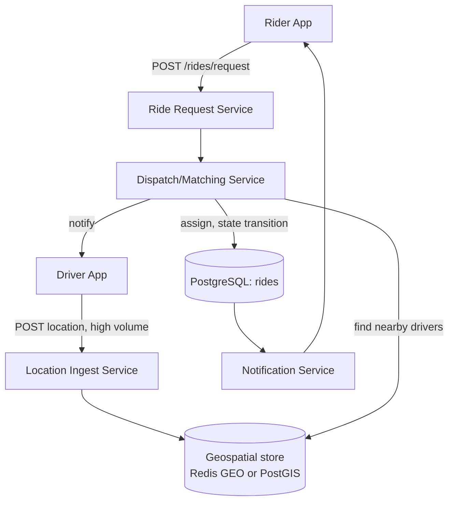

# Design Exercise — Ride-Hailing Dispatch System

**45 minutes, timed, full six-phase method from `03-system-design-method.md`.** Do this yourself, on paper or a whiteboard, before reading the worked notes below — they're a calibration reference, not a script to follow.

## Table of Contents

1. [Phase 1 — Clarify](#phase-1--clarify)
2. [Phase 2 — Estimate](#phase-2--estimate)
3. [Phase 3 — API](#phase-3--api)
4. [Phase 4 — Data](#phase-4--data)
5. [Phase 5 — Architecture](#phase-5--architecture)
6. [Phase 6 — Bottlenecks](#phase-6--bottlenecks)
7. [Exit check](#exit-check)

---

## Phase 1 — Clarify

**In scope:** a rider requests a ride; the system finds and dispatches a nearby available driver; both parties track the ride to completion. **Out of scope for this session:** payment processing, surge pricing algorithm details, driver onboarding/verification. **Core action:** a location-driven matching problem — write-heavy on location updates, read-heavy on "find nearby drivers."

## Phase 2 — Estimate

```
Assumption: 5M daily active riders, 500K daily active drivers
Assumption: each active driver sends a location update every 4 seconds while online,
            averaging 6 online hours/day
Location updates/driver/day = (6 × 3600) / 4 = 5,400
Total location writes/day = 500,000 × 5,400 = 2.7 billion/day
Average write QPS = 2.7B / 86,400 ≈ 31,250 writes/s

Assumption: peak-to-average ratio of 2x for driver location updates (drivers
            online during a ride are already captured; this is a steadier
            signal than rider-initiated request volume)
Peak location-write QPS ≈ 62,500/s

Assumption: 2M ride requests/day, peak-to-average ratio of 4x (concentrated
            in commute hours, unlike the steadier location-update stream)
Average ride-request QPS = 2,000,000 / 86,400 ≈ 23/s
Peak ride-request QPS ≈ 93/s
```

**Why two different peak-to-average ratios were used deliberately:** location updates are a continuous background stream from already-online drivers, while ride requests concentrate sharply around commute windows — using the same ratio for both would understate one or overstate the other. This distinction is exactly the kind of thing a Staff-level candidate states unprompted.

## Phase 3 — API

```
POST /rides/request          {riderId, pickup: {lat, lng}, dropoff: {lat, lng}}
  -> {rideId, status: "MATCHING"}

GET  /rides/{rideId}         -> {status, driverId?, driverLocation?}

POST /drivers/{driverId}/location   {lat, lng, timestamp}
  -> 202 Accepted (fire-and-forget, high volume, no client wait needed)

POST /rides/{rideId}/accept  {driverId}   -- driver-side acceptance
```

## Phase 4 — Data

**Rides:** relational (PostgreSQL) — a ride has strong consistency needs (exactly one driver assigned, a clear state machine `REQUESTED → MATCHING → ACCEPTED → IN_PROGRESS → COMPLETED`), and the volume (2M/day) is well within relational scale. **Driver location:** *not* relational at this write volume — a purpose-built structure. The access pattern is "find all drivers within radius R of point P, updated within the last N seconds" — this is a geospatial index problem specifically, matching Week 2's storage-selection method (§3 of `04-storage-selection-tradeoffs.md`): work from the access pattern, not from reputation. A geospatial-indexed store (PostgreSQL with PostGIS, or Redis with its geospatial commands for the hottest, most time-sensitive tier) fits; a plain relational table with a naive `WHERE lat BETWEEN ... AND lng BETWEEN ...` does not scale to 62,500 writes/s with useful query latency.

## Phase 5 — Architecture



**Justified against Phase 2's numbers:** the location-ingest path is architecturally separate from the ride-request path specifically because its write volume (62,500/s peak) is roughly 700x the ride-request volume (93/s peak) — collapsing them into one service would force the low-volume, strongly-consistent ride-state logic to scale alongside the high-volume, more-tolerant-of-staleness location stream, which is the wrong coupling.

## Phase 6 — Bottlenecks

1. **Geospatial store as a single point of contention.** At 62,500 writes/s, a single-node geospatial store becomes the bottleneck. Mitigation: shard by geographic region (a driver's location updates only need to be visible to a match search in the same region), which also bounds the "nearby drivers" query to a single shard in the common case.
2. **Race condition: two ride requests matched to the same driver simultaneously.** Mitigation: the assignment step must be a single atomic operation (a conditional update — "assign this driver only if still unassigned" — the same class of guard as Week 3's write-skew lesson: an unguarded read-then-write here reproduces exactly the write-skew anomaly from `02-isolation-levels-and-write-skew.md`, just in application logic instead of SQL).
3. **Stale location data leading to a bad match.** A driver who went offline 30 seconds ago but whose last location update is still in the geospatial store could be matched and then fail to accept. Mitigation: a TTL on location entries (matching the ~4-second update interval from Phase 2 with some slack, e.g., 15 seconds) so stale entries age out of match candidacy automatically.

## Exit check

- [ ] All six phases completed within 45 minutes
- [ ] At least one architectural decision (Phase 5) explicitly traced back to a Phase 2 number
- [ ] At least 3 bottlenecks named with mitigations, not just named
- [ ] The write-skew connection in bottleneck #2 recognized as the same anomaly class from `02-isolation-levels-and-write-skew.md`, not treated as an unrelated new concept
