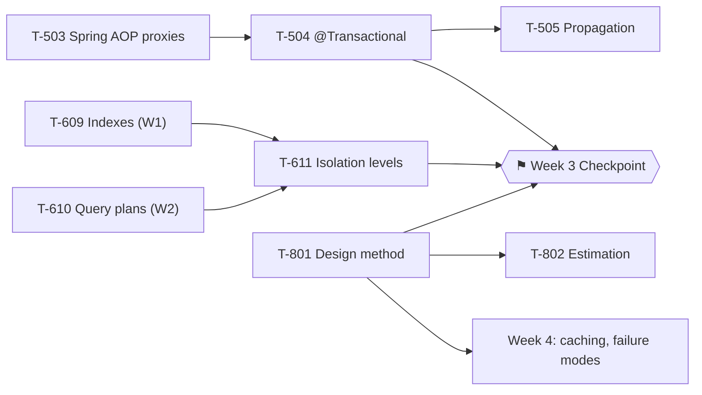

# Week 3 Study Pack — Transactions, Isolation, Design Method

**⚑ CHECKPOINT WEEK.** Plan: A · default workload 20h/week · see `00-project/learning-roadmap.md` §3, Week 3
**Topics:** T-504 (`@Transactional`) · T-505 (Propagation) · T-611 (Isolation levels) · T-503 (Spring AOP proxies) · T-801 (Design method) · T-802 (Estimation)
**Prerequisites:** T-609 ✔, T-610 ✔ (Weeks 1–2)

## Table of Contents

1. [Objective](#objective)
2. [Why this week, in this order](#why-this-week-in-this-order)
3. [Dependency graph](#dependency-graph)
4. [Files in this pack](#files-in-this-pack)
5. [Daily schedule](#daily-schedule-20hweek-baseline)
6. [The Week 3 Checkpoint](#the-week-3-checkpoint)
7. [Exit criteria](#exit-criteria)

---

## Objective

Close the highest-IWI Spring gap (T-504, IWI 8.15) and the highest-IWI database gap remaining after Weeks 1–2 (T-611). Acquire a repeatable system-design procedure (T-801) so Weeks 4–6 have a method to hang design content on, rather than improvising structure each time. **This week ends with the first gated checkpoint** — a go/no-go on whether to keep adding new topics or spend Week 4 consolidating instead.

## Why this week, in this order

T-503 (Spring AOP proxy mechanics) is scheduled first because self-invocation's failure (Week 1 taught the general hexagonal-architecture version of "know your boundaries"; this week teaches the Spring-specific mechanism) is unexplainable without understanding that `@Transactional` is implemented as a proxy wrapping the bean — the same proxy mechanism that made hexagonal architecture's ports/adapters distinction matter in Week 1. T-504 depends on T-503 for exactly this reason. T-801 (design method) is scheduled now, not deferred, so Weeks 4–6's design exercises have a procedure to execute rather than reinventing structure under time pressure each week.

## Dependency graph

## Files in this pack

| # | File | Purpose |
|---|---|---|
| 1 | `README.md` | This file |
| 2 | `01-transactions-and-propagation.md` | T-503/504/505 — full chapter, 5 real executed Spring demos |
| 3 | `02-isolation-levels-and-write-skew.md` | T-611 — full chapter, real write-skew reproduction and prevention |
| 4 | `03-system-design-method.md` | T-801/802 — the six-phase procedure and estimation math |
| 5 | `04-java-coding-practice.md` | 6 tree problems, all compiled and run |
| 6 | `05-flashcards.md` | 16 cards |
| 7 | `06-week-3-checkpoint-mock.md` | The 60-minute combined technical/design checkpoint round |
| 8 | `07-week-3-checkpoint-rubric.md` | Six-dimension pass/fail rubric for the checkpoint |
| 9 | `08-design-exercise-ride-hailing.md` | Full six-phase method applied to a ride-hailing dispatch system |
| 10 | `09-week-3-checklist.md` | Day-by-day checklist |
| 11 | `resources.md` | Sources classified by authority |
| — | `MANIFEST.md` | Every file, verification status, real checksums |

## Daily schedule (20h/week baseline)

| Day | Track A — Technical (2h) | Track B — Coding (~0.85h) | Track C — Performance (~0.85h) |
|---|---|---|---|
| Mon | AOP proxies: why self-invocation breaks `@Transactional` | LC 104, LC 226 — recursion invariant first | Build L1+L2 for T-504 |
| Tue | Propagation: `REQUIRES_NEW`, checked-exception rollback rule | LC 98 — the ancestor-bound trap | Build L5+L6 — run the 5 Spring demos yourself |
| Wed | Isolation levels: READ COMMITTED → REPEATABLE READ → SERIALIZABLE | LC 235 — BST-specific LCA | Build L3 deep dive for T-504/T-611 |
| Thu | **Write skew — reproduce it yourself, then prevent it with SERIALIZABLE** | LC 102, LC 199 | Design method drill: run the six-phase procedure, 25 min, phase discipline only |
| Fri | Design method + estimation: QPS/storage math with real assumptions | — | Design method drill #2 |
| Sat | — | — | Story 5 (mentoring), Story 6 (a failure you owned); design method drill #3; full ride-hailing design, 45 min |
| Sun | Weekly review against exit criteria | — | **⚑ Week 3 Checkpoint — 60-min combined round** |

## The Week 3 Checkpoint

This is the first gated go/no-go point in the programme. See `06-week-3-checkpoint-mock.md` and `07-week-3-checkpoint-rubric.md` for the full format and pass criteria.

**If 4 of 6 dimensions fail: stop adding new topics.** Spend Week 4 consolidating Weeks 1–3 material instead of moving forward, and repeat the checkpoint before proceeding. Adding breadth on a weak foundation is the specific failure mode this checkpoint exists to catch.

## Exit criteria

- [ ] Explain self-invocation's failure via the AOP proxy mechanism, not just "it doesn't work"
- [ ] State the default checked-exception rollback rule and its fix (`rollbackFor`) unprompted
- [ ] Reproduce write skew yourself and explain why `SERIALIZABLE` prevents it (not just that it does)
- [ ] Run all six phases of the design method unprompted on an unseen problem
- [ ] 6+ tree problems solved with written retrospectives (24+ cumulative)
- [ ] 6 STAR stories total
- [ ] Week 3 Checkpoint completed and scored — see §6 for the pass bar
