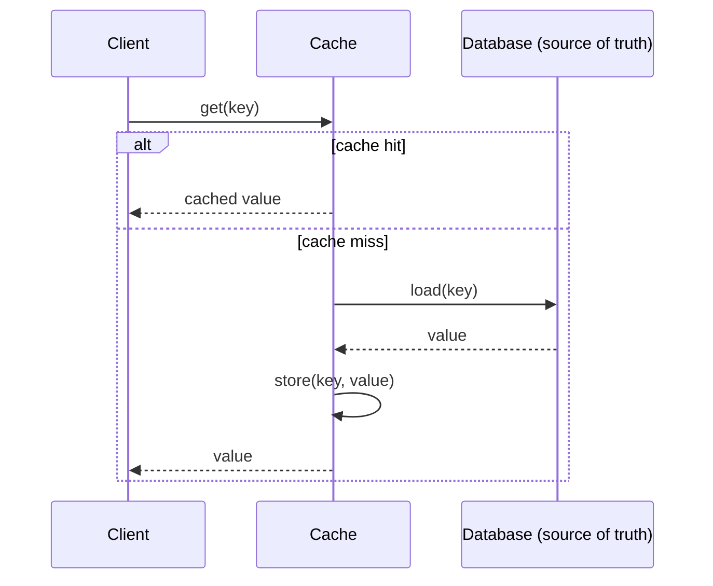

# T-804 · Caching Strategies and Invalidation

**IWI 8.45 · Staff-Level tier · 3rd-ranked topic in the Mandatory Core**

**Verification note:** the cache-stampede reproduction in §4 is real, executed Java — 50 genuinely concurrent threads, real thread pools, real measured database-call counts. Source: `practice/java/week-04/failure-modes/`.

## Table of Contents

1. [The concept](#1-the-concept)
2. [Why it exists](#2-why-it-exists)
3. [Invalidation strategies and their failure modes](#3-invalidation-strategies-and-their-failure-modes)
4. [Cache stampede, reproduced and fixed](#4-cache-stampede-reproduced-and-fixed)
5. [Hot-key mitigation](#5-hot-key-mitigation)
6. [Trade-offs](#6-trade-offs)
7. [Interview questions](#7-interview-questions)
8. [Common mistakes](#8-common-mistakes)
9. [Staff-level discussion](#9-staff-level-discussion)
10. [Summary](#10-summary)
11. [Key Takeaways](#11-key-takeaways)
12. [Cheat Sheet](#12-cheat-sheet)
13. [Flashcards](#13-flashcards)
14. [Practice Exercises](#14-practice-exercises)
15. [Additional Reading](#15-additional-reading)
16. [Official References](#16-official-references)

---

## 1. The concept

A cache trades storage and staleness risk for latency: a value computed or fetched once is kept somewhere faster to read than its source of truth, and served from there until it's invalidated or expires. Every caching decision reduces to three questions: **when does a cached value get written**, **when does it get removed or refreshed**, and **what happens to a request that arrives during the gap between those two events**.



## 2. Why it exists

A database sized for its data volume and durability requirements is very often not sized for its *read* volume — read replicas help, but every read still costs a query. A cache exists specifically to absorb read traffic that would otherwise repeatedly re-derive or re-fetch the same value, at the cost of a new correctness question the database alone never had: **can the cached copy and the source of truth disagree, and for how long is that acceptable?**

## 3. Invalidation strategies and their failure modes

| Strategy | Mechanism | Failure mode |
|---|---|---|
| **TTL (time-to-live)** | Entry expires automatically after a fixed duration | Serves stale data for up to the full TTL window after a write; too short a TTL defeats the cache's purpose under load |
| **Write-through** | Every write updates the cache and the database together, synchronously | Write latency now includes the cache; a partial failure (DB succeeds, cache write fails) leaves them disagreeing |
| **Write-behind (write-back)** | Write goes to the cache first, database updated asynchronously | Data loss window if the cache fails before the async write completes |
| **Cache-aside (lazy loading)** | Application checks cache, falls through to DB on miss, populates cache | The gap between "DB write" and "cache invalidation" is exactly where cache/DB disagreement (§7 Q1) lives |
| **Explicit invalidation on write** | The write path explicitly deletes/updates the affected cache key | Requires the write path to know every cache key that could be affected — easy to miss one on a complex write |

**How cache and database end up disagreeing (§7 Q1's answer):** the classic race is a cache-aside read racing a concurrent write — a read misses the cache, starts loading from the (still old) database value, and finishes populating the cache with that stale value **after** a concurrent write has already updated the database and invalidated the cache. The cache now holds a value older than the one the database currently has, indefinitely (until the next TTL expiry or explicit invalidation), because nothing else will trigger a refresh. Detection: compare a sample of cache values against the database periodically, or instrument invalidation misses. Fix: a short TTL as a backstop even when explicit invalidation is used, or a versioned cache key that includes a data version so a stale write can never overwrite a newer one.

## 4. Cache stampede, reproduced and fixed

**Cache stampede (thundering herd):** when a hot cache entry expires, every concurrent request for that key misses at once and independently falls through to the database — instead of one database load, the database receives as many concurrent loads as there were concurrent requests.

```java
// Naive cache-aside -- no coordination between concurrent misses
String value = cache.get("hot-key");
if (value == null) {
    value = loadFromDatabase(); // EVERY concurrent thread that misses does this independently
    cache.put("hot-key", value);
}
```

**Real, measured result — 50 concurrent requests for the same just-expired key:**

```
--- Naive cache-aside (no coordination) ---
Database load calls made: 50 (should be 1 with coordination)

--- Single-flight (request coalescing) fix ---
Database load calls made: 1 (coordination working as intended)
```

**The fix — single-flight / request coalescing:** the first thread to observe a miss registers an in-flight marker (a `CompletableFuture` in the demo) for that key; every other concurrent thread that also misses finds the marker and waits on it instead of issuing its own database call.

```java
CompletableFuture<String> future = new CompletableFuture<>();
CompletableFuture<String> existing = inFlight.putIfAbsent(key, future);
if (existing == null) {
    String loaded = loadFromDatabase();
    cache.put(key, loaded);
    future.complete(loaded);
    inFlight.remove(key);
} else {
    existing.join(); // wait for the in-flight load; no database call of our own
}
```

**Three distinct fixes for stampede, per the interview question (§7 Q4):** (1) single-flight/request coalescing, demonstrated above; (2) probabilistic early expiration — refresh a cache entry slightly *before* its TTL, with a random jitter per key so many keys don't expire in lockstep; (3) a stale-while-revalidate policy — serve the (slightly) stale value immediately while one request in the background refreshes it, so no client ever waits on the reload at all.

## 5. Hot-key mitigation

**A single key takes 40% of traffic — three mitigations:** (1) **local (in-process) caching** of the hot key in addition to the shared cache, trading a small staleness window for eliminating a network hop entirely for the hottest key; (2) **key sharding** — replicate the hot value under several suffixed keys (`hot-key:0` .. `hot-key:9`) and have clients pick one at random, spreading load across multiple cache nodes/shards for what was logically one key; (3) **read-through CDN or edge caching**, if the value is client-facing content, moving the hot path away from the origin cache entirely.

## 6. Trade-offs

| Approach | Benefit | Cost |
|---|---|---|
| TTL-only invalidation | Simple, self-healing (bounded staleness) | Guaranteed staleness window, even without any failure |
| Explicit invalidation | Can be immediate/correct | Requires the write path to know every affected key; easy to miss one |
| Single-flight coalescing | Eliminates stampede entirely | Slightly more complex; the "first" request's latency is now shared by all waiters (acceptable — they were all going to wait for a load anyway) |
| Stale-while-revalidate | Zero request ever waits on a reload | A short window of guaranteed staleness by design, not just as a failure mode |

## 7. Interview questions

### Q1. Cache and database disagree. How did it happen, how do you detect it, how do you fix it?

- **Expected answer:** §3's race — a cache-aside read populates a stale value *after* a concurrent write already invalidated/updated the cache; detection via sampling or instrumented invalidation misses; fix via short backstop TTL or versioned keys.
- **Common mistakes:** describing only "the cache didn't get updated" without the specific race condition that causes it.
- **Follow-up questions:** "Would a shorter TTL alone fully fix this?" *(No — it bounds the staleness window but doesn't eliminate the race; it's a backstop, not a fix for the race itself.)*
- **Senior-level expectations:** describes the race correctly.
- **Staff-level expectations:** proposes both a detection method and a structural fix (versioned keys), not just "add a shorter TTL."

### Q2. Your cache dies at peak. Walk through what happens to the database.

- **Expected answer:** every request that was previously served from cache now falls through to the database simultaneously — effectively a stampede across the *entire* cached working set, not just one key, and the database, sized for a cache-assisted read load, is likely to fall over.
- **Common mistakes:** treating this as "the cache is just slower now" rather than "the database now receives 100% of read traffic it was never sized for."
- **Follow-up questions:** "What would you do to prevent total outage in this scenario?"
- **Senior-level expectations:** identifies the full-stampede nature of the failure.
- **Staff-level expectations:** proposes a circuit breaker or graceful-degradation strategy (serving slightly stale data, rate-limiting reads, or failing some requests fast) rather than letting every request hit the now-defenseless database.

### Q3. One key takes 40% of traffic. Three mitigations.

- **Expected answer:** §5 — local caching, key sharding, edge/CDN caching.
- **Common mistakes:** naming only one mitigation.
- **Follow-up questions:** "Which of these three would you reach for first, and why?"
- **Senior-level expectations:** names at least two mitigations.
- **Staff-level expectations:** reasons about which mitigation fits the specific access pattern (e.g., key sharding for a write-heavy hot key vs. local caching for a read-only one).

### Q4. Cache stampede — what is it and give three distinct fixes.

- **Expected answer:** the §4 definition and the three fixes (single-flight, probabilistic early expiration, stale-while-revalidate).
- **Common mistakes:** describing only the symptom (many DB calls) without the mechanism (uncoordinated concurrent misses).
- **Follow-up questions:** "Why does single-flight not just move the latency problem instead of solving it?" *(Because all the waiting requests were already going to have to wait for a database load regardless — coalescing them into one load doesn't make any individual request slower than it already had to be, it just removes the other 49 redundant database calls.)*
- **Senior-level expectations:** names at least two fixes correctly.
- **Staff-level expectations:** all three, plus the reasoning behind why coalescing doesn't just relocate the latency cost.

## 8. Common mistakes

- Treating TTL as sufficient invalidation without considering the concurrent-write race in §3.
- Not considering what happens to the database specifically when the *entire* cache — not just one key — becomes unavailable.
- Proposing a single stampede fix without recognizing the three distinct mechanisms address different situations (a fix requiring code changes at read time vs. one requiring a background refresh process).

## 9. Staff-level discussion

Caching decisions are ultimately a statement about how much staleness a specific piece of data can tolerate, and that tolerance is rarely uniform across a system — pricing data might tolerate zero staleness while a "likes count" might tolerate minutes. A Staff-level caching design doesn't apply one invalidation strategy uniformly; it partitions data by staleness tolerance first and picks the mechanism per partition, which is the same "access-pattern-first" discipline as Week 2's storage-selection method (`04-storage-selection-tradeoffs.md`) applied to a different axis (staleness tolerance instead of query shape).

## 10. Summary

Caching trades latency for a new correctness question: how stale can a cached value be, and what happens to a request during the gap between a write and its cache reflecting it. Cache stampede — many concurrent misses independently reloading the same key — is real and measurable (50 database calls vs. 1, reproduced in this chapter) and is fixed by coordinating concurrent misses, not by any change to the cache's expiration policy alone.

## 11. Key Takeaways

- Every caching decision reduces to: when is a value written, when is it invalidated, and what happens during the gap.
- Cache/database disagreement is a specific race, not a vague "sync issue" — a stale read can populate the cache *after* a concurrent write already invalidated it.
- Cache stampede is real and measurable: 50 concurrent misses → 50 database calls without coordination, 1 with single-flight.
- A cache dying at peak is a full-working-set stampede against a database sized for cache-assisted load, not just "things get slower."
- Staleness tolerance varies by data type — partition caching strategy accordingly, don't apply one policy uniformly.

## 12. Cheat Sheet

See §3's invalidation-strategy table and §5's hot-key mitigations.

## 13. Flashcards

1. **Q: How does cache/database disagreement typically happen?** A: A cache-aside read populates a stale value after a concurrent write already invalidated the cache — a race, not a generic sync bug.
2. **Q: What happens to the database when the entire cache dies at peak?** A: It receives a full-working-set stampede — every previously cached read now falls through simultaneously, against a database sized assuming cache assistance.
3. **Q: Name three cache-stampede fixes.** A: Single-flight/request coalescing, probabilistic early expiration with jitter, stale-while-revalidate.
4. **Q: Three hot-key mitigations?** A: Local in-process caching, key sharding across suffixed keys, edge/CDN caching.

(Full week-level deck: `05-flashcards.md`.)

## 14. Practice Exercises

1. Reproduce the cache-stampede demo yourself: `practice/java/week-04/failure-modes/CacheStampedeDemo.java`.
2. Implement probabilistic early expiration (fix #2 from §4) as an alternative to single-flight, and reason about when you'd prefer one over the other.
3. Take a cached value in a system you know. Classify its staleness tolerance, and check whether its current invalidation strategy actually matches that tolerance or is over/under-engineered for it.

## 15. Additional Reading

- AWS Builders' Library — ["Caching challenges and strategies"](https://aws.amazon.com/builders-library/caching-challenges-and-strategies/)

## 16. Official References

- No single official specification governs caching strategy — this chapter draws on widely-documented industry patterns (cache-aside, write-through, single-flight) rather than one canonical source.
