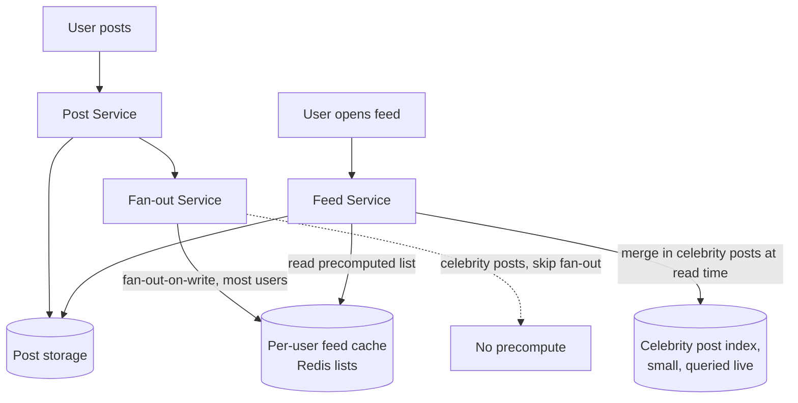

# Design Exercise — News Feed

**45 minutes, timed, full six-phase method.** Caching and fan-out are mandatory discussion points. Do this yourself before reading the worked notes below.

## Table of Contents

1. [Phase 1 — Clarify](#phase-1--clarify)
2. [Phase 2 — Estimate](#phase-2--estimate)
3. [Phase 3 — API](#phase-3--api)
4. [Phase 4 — Data](#phase-4--data)
5. [Phase 5 — Architecture](#phase-5--architecture)
6. [Phase 6 — Bottlenecks](#phase-6--bottlenecks)
7. [Exit check](#exit-check)

---

## Phase 1 — Clarify

**In scope:** users follow other users; a user's feed shows recent posts from people they follow, roughly reverse-chronological. **Out of scope:** ranking/relevance algorithm details, ads, comments. **Core action:** overwhelmingly read-heavy (feed views vastly outnumber posts created).

## Phase 2 — Estimate

```
Assumption: 50M DAU, average 20 feed views/day
Read QPS = (50,000,000 × 20) / 86,400 ≈ 11,570/s average
Peak (3x) ≈ 34,700/s

Assumption: 5M posts/day
Write QPS = 5,000,000 / 86,400 ≈ 58/s average -- read:write ratio is roughly 200:1

Assumption: 1% of users are "celebrities" with >1M followers each
This 1% drives a disproportionate share of fan-out cost per post (Phase 6).
```

**The read:write ratio (≈200:1) is the single number that most justifies caching here** — it's stated explicitly in Phase 2 specifically so Phase 5's "we need a cache" is a traceable consequence of this number, not a reflex.

## Phase 3 — API

```
GET  /feed?cursor={cursor}&limit=20   -- keyset pagination, per study-packs/week-04/03-api-design.md
POST /posts                            {content}
POST /follow/{userId}
```

## Phase 4 — Data

**Posts:** relational or wide-column, keyed by post ID, indexed by author + created_at. **Follow graph:** a dedicated store optimized for "who does X follow" and "who follows X" — at this scale, a graph-shaped access pattern, though often implemented on a relational store with the right indexes rather than a dedicated graph database, per Week 2's storage-selection method (work from access pattern, not technology reputation). **Feed cache:** a per-user precomputed list of post IDs (not full post content — content is fetched separately, keeping the feed cache small and fast to update).

## Phase 5 — Architecture



**Justified against Phase 2's numbers:** a 200:1 read:write ratio justifies precomputing feeds at write time (fan-out-on-write) for most users, since the cost of updating N followers' cached feeds on one post is paid once and amortized across every subsequent read — but this inverts for the 1% celebrity case (Phase 6), which is exactly why the architecture splits fan-out strategy by follower count rather than applying one approach uniformly.

## Phase 6 — Bottlenecks

1. **Celebrity fan-out cost.** A post from a user with 10M followers, if fanned out on write, means 10M feed-cache writes for one post — a write amplification the read:write ratio doesn't justify for this specific case. **Mitigation:** hybrid fan-out — skip precomputation for high-follower-count authors; merge their posts into a follower's feed at *read* time instead (fan-out-on-read), accepting slightly higher per-read cost for a rare case in exchange for avoiding a catastrophic write spike.
2. **Feed cache stampede on a viral post.** If a post suddenly goes viral and many users' feed caches expire or need updating near-simultaneously, this is exactly the cache-stampede mechanism from `01-caching-strategies.md` §4 — the mitigation (single-flight coalescing, or simply not using a TTL-based invalidation for this specific cache in favor of explicit updates) is directly reused from this week's own chapter.
3. **Deep pagination on a long-lived feed session.** A user scrolling far back should use keyset pagination (`03-api-design.md` §3), not `OFFSET`, or the same ~3,000x-at-depth cost measured this week applies directly here.

## Exit check

- [ ] All six phases completed within 45 minutes
- [ ] Fan-out discussed explicitly, including the celebrity-case trade-off (fan-out-on-write vs. fan-out-on-read), not just one approach
- [ ] Caching discussed and traced back to the Phase 2 read:write ratio
- [ ] At least one bottleneck explicitly connects to a specific mechanism from this week's chapters (stampede, pagination) rather than a generic "add more caching"
