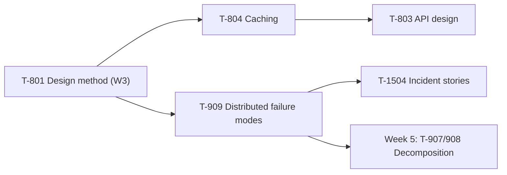

# Week 4 Study Pack — Caching, Failure Modes, API Design

**Plan:** A (Interview Emergency Sprint) · default workload 20h/week · see `00-project/learning-roadmap.md` §3, Week 4
**Topics:** T-804 (Caching) · T-909 (Distributed failure modes) · T-803 (API design) · T-1504 (Incident stories) · T-1207 (Incident response)
**Prerequisites:** T-801 ✔, T-802 ✔ (Week 3)

## Table of Contents

1. [Objective](#objective)
2. [Why this week, in this order](#why-this-week-in-this-order)
3. [Dependency graph](#dependency-graph)
4. [Files in this pack](#files-in-this-pack)
5. [Daily schedule](#daily-schedule-20hweek-baseline)
6. [Exit criteria](#exit-criteria)

---

## Objective

Acquire the three components that appear in nearly every system-design round: caching, distributed failure modes, and API design. Shift the behavioral track from *writing* stories to *delivering* them — every story from Weeks 1–4 gets compressed to a spoken 2-minute version this week, recorded.

## Why this week, in this order

T-804 (caching) and T-909 (distributed failure modes) rank 3rd and 4th in the Mandatory Core, and both are unusable without Week 3's T-801 design method — a cache or a retry policy without a procedure to justify *when* to reach for it produces an unstructured answer. T-1504 (incident stories) is scheduled alongside T-909 deliberately: the same real incident supplies both the technical failure-mode analysis and the STAR story.

## Dependency graph

## Files in this pack

| # | File | Purpose |
|---|---|---|
| 1 | `README.md` | This file |
| 2 | `01-caching-strategies.md` | T-804 — summary + link; full chapter now canonical at `syllabus/11-system-design/caching-strategies-and-invalidation.md` |
| 3 | `02-distributed-failure-modes.md` | T-909 — summary + link; full chapter now canonical at `syllabus/10-distributed-systems/distributed-systems-failure-modes.md` |
| 4 | `03-api-design.md` | T-803 — summary + link; full chapter now canonical at `syllabus/07-api-design/api-design.md` |
| 5 | `04-java-coding-practice.md` | 5 graph problems, all compiled and run, Union-Find and topological sort from scratch |
| 6 | `05-flashcards.md` | 16 cards |
| 7 | `06-failure-modes-deliverable.md` | The `failure-modes.md` template + a fully worked example |
| 8 | `07-week-4-mock-interview.md` | 45-min full system-design round |
| 9 | `08-design-exercise-news-feed.md` | Summary + link; full design now canonical at `architecture-atlas/news-feed-system.md` |
| 10 | `09-week-4-checklist.md` | Day-by-day checklist |
| 11 | `resources.md` | Sources classified by authority |
| — | `MANIFEST.md` | Every file, verification status, real checksums |

## Daily schedule (20h/week baseline)

| Day | Track A — Technical (2h) | Track B — Coding (~0.7h) | Track C — Performance (~1h) |
|---|---|---|---|
| Mon | Cache invalidation strategies and their failure modes | LC 200, LC 133 | Build L1+L2 for T-804 |
| Tue | **Reproduce the cache-stampede demo yourself** | LC 207 | Build L5+L6 — production example + trade-offs |
| Wed | Distributed failure modes: timeouts, retries, the amplification mechanism | LC 210 | **Reproduce the retry-storm demo yourself** |
| Thu | Split-brain and fencing tokens; reproduce that demo too | LC 547 — Union-Find from scratch | Story 7 (cross-team influence) |
| Fri | API design: pagination, why not `OFFSET` — **reproduce the pagination lab** | — | Story 8 (migration you led) |
| Sat | — | — | **Delivery drill: all 8 stories to 2-minute spoken versions, recorded** |
| Sun | Weekly review against exit criteria | — | 45-min full design mock, partner strongly preferred |

## Exit criteria

- [ ] Explain cache invalidation strategies with the failure mode of each, unprompted
- [ ] Explain retry amplification without notes, ideally citing the real numbers from this week's demo
- [ ] `failure-modes.md` complete for a real system (`06-failure-modes-deliverable.md`)
- [ ] All 8 stories delivered in ≤ 2 minutes, recorded
- [ ] 32+ coding problems cumulative
- [ ] Design round completed with all six phases and ≥ 3 named failure modes
