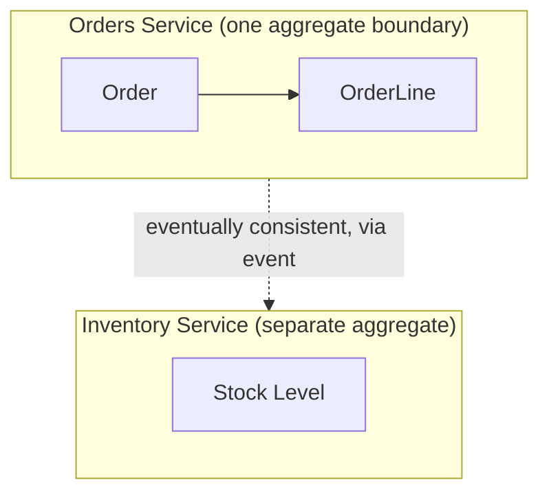

# T-907 / T-908 · Microservice Decomposition and the Monolith Trade-off

**IWI 8.40 / 7.90 · Staff-Level tier · A judgment topic — the expected answer is frequently "don't"**

## Table of Contents

1. [The concept](#1-the-concept)
2. [Why it exists](#2-why-it-exists)
3. [Where to draw a boundary](#3-where-to-draw-a-boundary)
4. [When to merge services back together](#4-when-to-merge-services-back-together)
5. [Trade-offs](#5-trade-offs)
6. [Interview questions](#6-interview-questions)
7. [Common mistakes](#7-common-mistakes)
8. [Staff-level discussion](#8-staff-level-discussion)
9. [Summary](#9-summary)
10. [Key Takeaways](#10-key-takeaways)
11. [Cheat Sheet](#11-cheat-sheet)
12. [Flashcards](#12-flashcards)
13. [Practice Exercises](#13-practice-exercises)
14. [Additional Reading](#14-additional-reading)
15. [Official References](#15-official-references)

---

## 1. The concept

Microservice decomposition is the decision to split a system along boundaries such that each resulting service can be developed, deployed, and scaled independently. The word "independently" carries the entire weight of the decision: a split that still requires two services to deploy together, or to share a database transaction, has paid the cost of distribution (network calls, eventual consistency, operational overhead) without receiving the benefit (independence) that's supposed to justify it.

## 2. Why it exists

A monolith's principal failure mode at scale is not technical — it's organizational: many teams committing to one deployable unit means one team's bad deploy can block or break every other team's work, and the blast radius of any change is the entire system by default. Microservices exist to give teams independently deployable, independently scalable units of ownership. The mistake this topic exists to correct is treating microservices as a technical best practice applicable regardless of team size or structure — Conway's Law is not a suggestion here; it's the actual mechanism by which service boundaries either match or fight the organization's communication structure.

## 3. Where to draw a boundary

**Not one table over, and not "wherever the code looks messy."** The correct boundary follows the same test as Week 2's aggregate boundary (`03-ddd-tactical-aggregates.md`): draw the line where a strong, single-transaction consistency requirement does *not* cross it. If two pieces of data must be updated atomically together, they belong in the same service (or, more precisely, the same aggregate, which very often *is* the same service). If they can tolerate eventual consistency between them, that's the natural place to cut.

**This directly answers "why there rather than one table over":** a table-by-table split ignores transactional cohesion entirely; an aggregate-boundary split draws the line exactly where the codebase already has to reason about consistency independently, because Week 2's domain modelling already did that work.

**Two services need one transaction — now what?** This is a strong signal the boundary was drawn in the wrong place, or that eventual consistency (a saga, an outbox pattern) has to replace the transaction. Reaching for a distributed transaction (two-phase commit) to paper over a bad boundary is treating the symptom; the honest answer is often "these two things shouldn't have been split," or "this needs to become an explicitly eventually-consistent workflow, not a disguised single transaction."

## 4. When to merge services back together

Merge services back together when: (a) they are *always* deployed together in practice, meaning the independence the split was supposed to buy was never actually realized; (b) the majority of cross-service calls between them are synchronous and on the critical path, meaning the network hop is pure latency cost with no independence benefit; (c) the operational burden (on-call surface area, monitoring, deployment pipelines) for the split pair measurably exceeds the benefit gained, which is a real, common outcome of over-eager early decomposition.

**You have four engineers. Does microservices still make sense? Defend it.** Generally, no — the honest answer, and the Staff-level signal, is recognizing that microservices' organizational benefit (independent teams, independent deploys) requires *multiple, separately-scheduled teams* to exist in the first place. Four engineers are very likely one team, in which case a well-modularized monolith (clear internal module boundaries, matching the same aggregate-boundary discipline, but one deployable unit) captures nearly all the code-organization benefit of microservices with none of the distributed-systems tax (network calls, eventual consistency, multiplied operational surface area). This is one of the highest-signal answers in the entire register precisely because so many candidates answer "yes" reflexively.

## 5. Trade-offs

| Benefit of splitting | Cost of splitting |
|---|---|
| Independent deployment per team | Every cross-service call becomes a network call — new failure modes (Week 4's entire chapter) |
| Independent scaling per component | Distributed transactions become sagas — eventual consistency, more complex failure/compensation logic |
| Smaller blast radius per deploy | Multiplied operational surface — more services to monitor, alert on, and staff on-call for |
| Team autonomy matching Conway's Law | A team of four gets none of the "multiple team" benefit and all of the distributed-systems cost |

## 6. Interview questions

### Q1. Where exactly do you draw a service boundary, and why there rather than one table over?

- **Expected answer:** the §3 aggregate-boundary test — draw the line where strong single-transaction consistency is not required across it, not at an arbitrary table split.
- **Common mistakes:** proposing a boundary based on code organization or team preference rather than the consistency requirement.
- **Follow-up questions:** "How does this connect to the aggregate boundaries from Week 2?" *(They are frequently, though not always, the same line — both are answering "what must be consistent together.")*
- **Senior-level expectations:** proposes a boundary using a consistency-driven test.
- **Staff-level expectations:** explicitly connects the service boundary to the aggregate-boundary concept from `03-ddd-tactical-aggregates.md`, naming it directly.

### Q2. Two services need one transaction. Now what?

- **Expected answer:** treat it as a signal the boundary may be wrong, or replace the transaction with a saga/eventual-consistency workflow rather than reaching for distributed two-phase commit.
- **Common mistakes:** proposing a distributed transaction as the default fix.
- **Follow-up questions:** "What does a saga look like for this specific case?"
- **Senior-level expectations:** proposes eventual consistency as the general direction.
- **Staff-level expectations:** explicitly questions whether the boundary itself was drawn correctly before proposing a saga as the fix.

### Q3. When would you merge two services back together?

- **Expected answer:** §4's three signals — always co-deployed, mostly synchronous critical-path calls between them, or operational cost exceeding benefit.
- **Common mistakes:** treating microservices as a one-way door that's never reconsidered.
- **Follow-up questions:** "How would you actually detect the 'always co-deployed' signal in practice?" *(Deployment history — if every deploy of service A is followed within minutes by a deploy of service B, they're not actually independent.)*
- **Senior-level expectations:** names at least one merge-back signal.
- **Staff-level expectations:** proposes a concrete detection method (deployment correlation) rather than a purely qualitative judgment.

### Q4. You have four engineers. Does microservices still make sense? Defend it.

- **Expected answer:** generally no — per §4, the organizational benefit requires multiple independently-scheduled teams, which four engineers very likely are not.
- **Common mistakes:** defending microservices unconditionally as a technical best practice.
- **Follow-up questions:** "What would change your answer?"
- **Senior-level expectations:** answers no, with reasoning.
- **Staff-level expectations:** names the specific condition that would flip the answer (the team splitting into genuinely separate, independently-scheduled sub-teams) rather than a vague "it depends."

## 7. Common mistakes

- Drawing service boundaries by table or by code-file proximity instead of by consistency requirement.
- Reaching for a distributed transaction (2PC) as the default fix when two services need coordinated updates.
- Treating decomposition as a one-way door — never considering that a split might need to be reversed.
- Defending microservices as inherently superior regardless of team size.

## 8. Staff-level discussion

The single most differentiating thing a candidate can do on this topic is state, unprompted, that the *organizational* structure — not the technical elegance of the split — is the primary justification for microservices, and that a team too small to have this organizational problem gains little from paying the distributed-systems tax. This is Conway's Law taken seriously as a design constraint, not a footnote: service boundaries that fight the organization's actual communication structure produce exactly the coordination overhead microservices were supposed to eliminate, just relocated from code-merge conflicts to cross-team API negotiation.

## 9. Summary

A service boundary should follow the same consistency-driven test as an aggregate boundary: split where strong transactional consistency is not required across the line. Two services needing one transaction is a signal to question the boundary, not a cue to reach for distributed 2PC. Services should be merged back together when they're always co-deployed, mostly synchronous, or costing more operationally than they return — and a team of four engineers is very likely better served by a well-modularized monolith than by microservices at all.

## 10. Key Takeaways

- Draw service boundaries where strong consistency requirements do not cross — the same test as an aggregate boundary.
- Two services needing one transaction signals a possibly-wrong boundary, not a need for distributed 2PC.
- Merge services back when co-deployment, synchronous coupling, or operational cost outweigh the split's benefit.
- Microservices' benefit is fundamentally organizational (independent teams) — a small team gains little and pays the full distributed-systems cost.

## 11. Cheat Sheet

See §5's trade-off table.

## 12. Flashcards

1. **Q: What's the actual test for where to draw a service boundary?** A: Where strong single-transaction consistency is NOT required across the line — the same test as an aggregate boundary.
2. **Q: Two services need one transaction — what does that signal?** A: The boundary may be wrong, or the operation needs to become an explicitly eventually-consistent saga, not a distributed transaction.
3. **Q: Name a concrete signal that two services should be merged back.** A: They are always co-deployed together (detectable via deployment-history correlation).
4. **Q: Should a 4-engineer team default to microservices?** A: Generally no — the organizational benefit requires multiple independently-scheduled teams, which a team that size very likely isn't.

(Full week-level deck: `05-flashcards.md`.)

## 13. Practice Exercises

1. Take a system you know (or the ride-hailing/news-feed designs from Weeks 3–4). Identify one service boundary and check it against the consistency test in §3 — does it actually hold?
2. Construct a scenario where "two services need one transaction" and design the saga that replaces it.
3. Argue, in writing, for merging two specific services back together in a system you know, using at least one of §4's three signals with real (or plausibly real) evidence.

## 14. Additional Reading

- Sam Newman, *Building Microservices*, 2nd ed., Ch. 1–3

## 15. Official References

- No single official specification governs microservice decomposition — this chapter draws on widely-cited industry practice (Newman's work, Conway's Law) rather than one canonical source.
