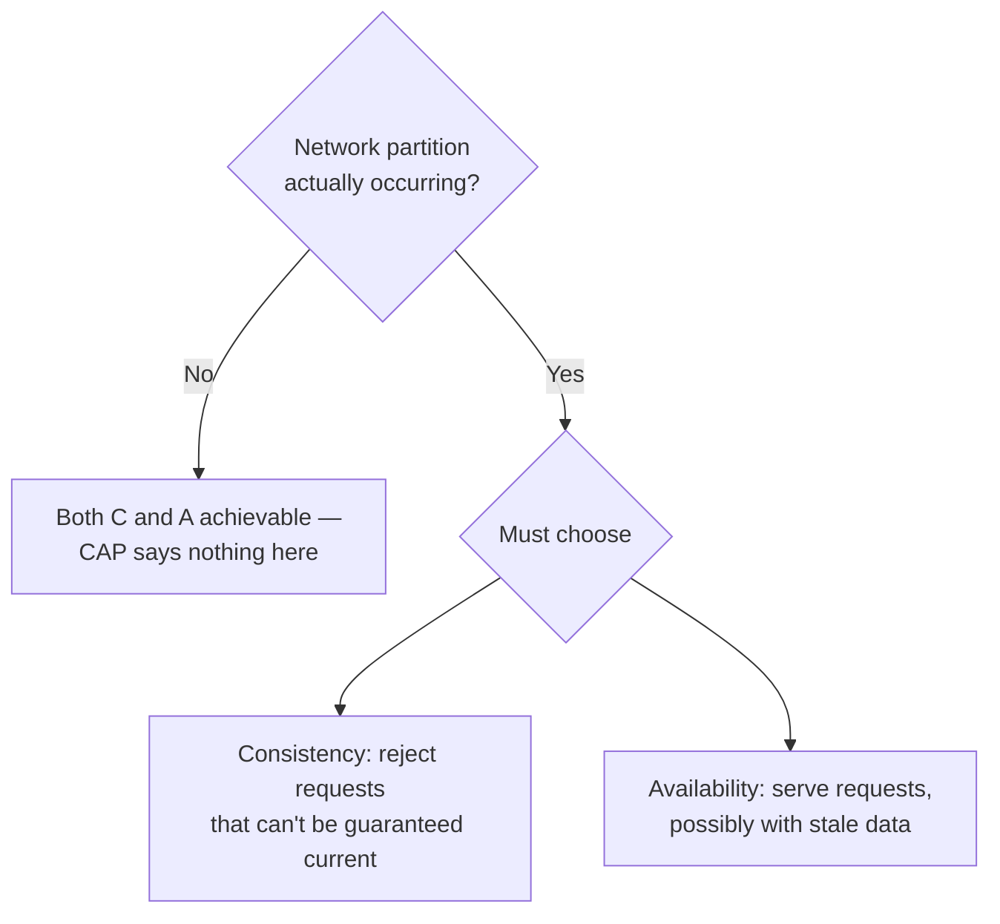

# T-807 · CAP Theorem and Consistency Models

**IWI 7.10 · Advanced tier**

## Table of Contents

1. [The concept](#1-the-concept)
2. [Why it exists](#2-why-it-exists)
3. [What a system actually gives up during a partition](#3-what-a-system-actually-gives-up-during-a-partition)
4. [Eventual vs. strong consistency, for the user](#4-eventual-vs-strong-consistency-for-the-user)
5. [Trade-offs](#5-trade-offs)
6. [Interview questions](#6-interview-questions)
7. [Common mistakes](#7-common-mistakes)
8. [Staff-level discussion](#8-staff-level-discussion)
9. [Summary](#9-summary)
10. [Key Takeaways](#10-key-takeaways)
11. [Cheat Sheet](#11-cheat-sheet)
12. [Flashcards](#12-flashcards)
13. [Practice Exercises](#13-practice-exercises)
14. [Additional Reading](#14-additional-reading)
15. [Official References](#15-official-references)

---

## 1. The concept

CAP states that a distributed system, during an actual network partition, must choose between **Consistency** (every read sees the most recent write, or an error) and **Availability** (every request receives a non-error response, possibly with stale data) — it cannot have both while the partition lasts. Outside of a partition, a well-designed system can be both consistent and available; CAP is specifically a statement about the partition case, not a permanent, always-active trade-off.

## 2. Why it exists

CAP exists to correct a naive intuition that a distributed system can simply be "consistent and available" as a permanent design goal, full stop. The theorem forces the honest question: when the network genuinely fails to deliver a message between two nodes (not "if" — this happens in every real distributed system eventually), which guarantee does this specific system relax? A system that has never explicitly answered this question hasn't avoided the trade-off — it has an undefined, untested behavior during a partition, which is worse than a deliberate choice either way.

## 3. What a system actually gives up during a partition

**The Staff-level answer to this question is never "it depends" in the abstract — it names the actual system and the actual guarantee relaxed:**

- A **CP** system (e.g., a strongly consistent configuration store like `etcd` or `ZooKeeper`) refuses to serve a read or accept a write on the minority side of a partition, returning an error rather than risk returning stale or conflicting data. **What it gives up:** availability, specifically for the partitioned-off minority.
- An **AP** system (e.g., DNS, or a shopping cart service designed to always accept an "add to cart") continues to serve reads and writes on both sides of a partition, accepting that the two sides may now disagree and will need to be reconciled once the partition heals. **What it gives up:** consistency, specifically the guarantee that a read reflects the most recent write from the other side.

**Applied to a specific example (a session store for a web application):** during a partition, this system chooses availability — a user should never be logged out because of a network blip between data centers — accepting that a session update made on one side might not be visible on the other side until the partition heals. The specific, nameable thing given up is: a session attribute changed on side A (e.g., "user upgraded to premium") may not be visible to a request served from side B until reconciliation completes.

## 4. Eventual vs. strong consistency, for the user

**Strong consistency, from the user's perspective:** "the moment I make a change, every subsequent read — from me or anyone else, from any replica — reflects it." No stale reads, ever, at the cost of higher write latency (the write must propagate/confirm before being acknowledged) and reduced availability during a partition.

**Eventual consistency, from the user's perspective:** "the moment I make a change, *I* might not see it reflected immediately if my next read happens to hit a different replica, and neither might anyone else — but it will converge eventually." This is invisible and irrelevant for a "likes" counter (nobody notices a one-second lag); it is very visible and consequential for "did my payment go through" (a user re-submitting because they didn't see confirmation is a direct, costly, real-world failure mode connecting straight back to `02-idempotency.md`).

**Why this framing (not the technical definition) is what the interviewer is checking for:** a candidate who states the formal definitions correctly but can't say which specific user-facing behavior changes has memorized the theorem without being able to apply it to a design decision — which is the entire point of asking it in a system-design context rather than a pure definitions quiz.

## 5. Trade-offs

| Choice during partition | User-facing consequence | When it's the right call |
|---|---|---|
| CP (consistency) | Some requests fail outright during the partition | Financial ledgers, inventory counts where overselling is worse than unavailability, configuration/coordination stores |
| AP (availability) | Requests succeed but may return stale data | Social feeds, session stores, shopping carts, anything where staleness is more tolerable than an error |

## 6. Interview questions

### Q1. CAP — what does a system actually give up during a partition? Be specific about your own system.

- **Expected answer:** §3's pattern — name the actual system, state whether it's CP or AP, and name the *specific* guarantee relaxed (e.g., "a session update on one side isn't visible on the other until reconciliation"), not an abstract restatement of the theorem.
- **Common mistakes:** reciting "consistency, availability, partition tolerance, pick two" without ever naming what a real system actually does or what a user actually experiences.
- **Follow-up questions:** "What would the user actually see during this trade-off?"
- **Senior-level expectations:** correctly classifies a real or hypothetical system as CP or AP.
- **Staff-level expectations:** ties the classification to a specific, user-visible consequence, as in §3's session-store example.

### Q2. What is the difference between eventual and strong consistency for the user?

- **Expected answer:** §4's framing — strong consistency means no stale reads ever, at a latency/availability cost; eventual consistency means a possible temporary staleness window, invisible for low-stakes data and consequential for high-stakes data (e.g., payment confirmation).
- **Common mistakes:** giving the formal definition without connecting it to what the user actually experiences.
- **Follow-up questions:** "Give one example where eventual consistency is clearly fine, and one where it clearly isn't."
- **Senior-level expectations:** gives the correct formal distinction.
- **Staff-level expectations:** produces both example types unprompted and explicitly connects the "payment didn't appear to go through" case to the idempotency mechanism from `02-idempotency.md`.

## 7. Common mistakes

- Treating CAP as an always-active, permanent trade-off rather than a statement specifically about partition behavior.
- Answering the "what does your system give up" question in the abstract, without naming an actual system or actual user-facing consequence.
- Assuming eventual consistency is uniformly acceptable across an entire system rather than assessing it per data type (exactly the "staleness tolerance varies" lesson from Week 4's caching chapter, applied at the consistency-model level instead of the caching level).

## 8. Staff-level discussion

The most sophisticated version of this topic isn't picking CP or AP for an entire system — it's recognizing that **different data within the same system legitimately warrants different consistency models**, exactly mirroring `01-caching-strategies.md`'s "partition by staleness tolerance" lesson. A well-designed e-commerce system is strongly consistent about inventory counts (overselling is a real, costly failure) while being eventually consistent about a "recently viewed" list (staleness there is imperceptible) — treating the whole system as needing one uniform consistency model is the mistake this discussion exists to correct.

## 9. Summary

CAP is a statement about partition behavior specifically, not a permanent trade-off — during a real network partition, a system must choose to reject some requests (consistency) or serve possibly-stale data (availability). The Staff-level answer names the actual system and the actual user-facing consequence, not the abstract theorem. Eventual vs. strong consistency should be assessed per data type within a system, not applied uniformly.

## 10. Key Takeaways

- CAP applies specifically during an actual partition — outside of one, both C and A are achievable.
- A good answer names a real system, classifies it CP or AP, and states the specific guarantee given up.
- Eventual consistency's acceptability depends entirely on the specific data's staleness tolerance — invisible for a like-count, consequential for a payment confirmation.
- Different data within one system can and should have different consistency models.

## 11. Cheat Sheet

See §5's trade-off table.

## 12. Flashcards

1. **Q: Does CAP apply outside of an actual network partition?** A: No — CAP is specifically a statement about partition behavior; both C and A are achievable when no partition is occurring.
2. **Q: What does a CP system do during a partition?** A: Refuses requests it can't guarantee are current, on the partitioned-off side — trading availability for consistency.
3. **Q: What does an AP system do during a partition?** A: Continues serving requests on both sides, accepting the sides may disagree until reconciliation — trading consistency for availability.
4. **Q: Should one consistency model apply uniformly across a whole system?** A: No — different data types warrant different models (e.g., strong for inventory, eventual for a recently-viewed list).

(Full week-level deck: `05-flashcards.md`.)

## 13. Practice Exercises

1. Take a system you know (or the ride-hailing/news-feed/payment designs from Weeks 3–5). For each major data type in it, classify whether strong or eventual consistency is appropriate, and justify each choice individually rather than picking one model for the whole system.
2. Write out, in concrete user-facing terms, what a specific user would experience during a partition for a system you classify as AP.

## 14. Additional Reading

- Eric Brewer, ["CAP Twelve Years Later: How the 'Rules' Have Changed"](https://www.infoq.com/articles/cap-twelve-years-later-how-the-rules-have-changed/) — the original theorem's author revisiting and refining it

## 15. Official References

- Martin Kleppmann, *Designing Data-Intensive Applications*, Ch. 9 "Consistency and Consensus," pp. 321–345
