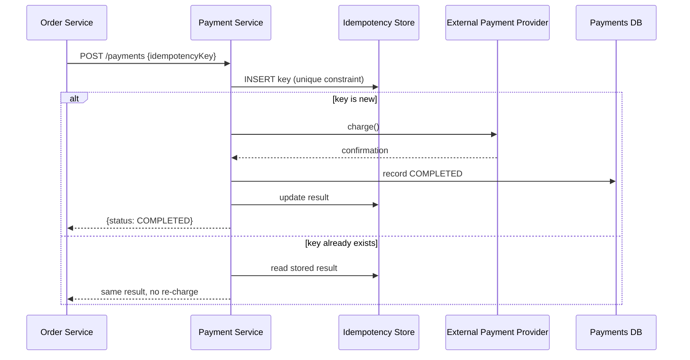

# Design Exercise — Payment Processing System

**45 minutes, timed, full six-phase method.** Idempotency and exactly-once semantics are mandatory discussion points. Do this yourself before reading the worked notes below.

## Table of Contents

1. [Phase 1 — Clarify](#phase-1--clarify)
2. [Phase 2 — Estimate](#phase-2--estimate)
3. [Phase 3 — API](#phase-3--api)
4. [Phase 4 — Data](#phase-4--data)
5. [Phase 5 — Architecture](#phase-5--architecture)
6. [Phase 6 — Bottlenecks](#phase-6--bottlenecks)
7. [Exit check](#exit-check)

---

## Phase 1 — Clarify

**In scope:** accept a payment request, charge via an external payment provider, record the result durably, notify the initiating service. **Out of scope:** fraud detection, multi-currency conversion logic, refunds. **Core action:** low volume relative to a feed or messaging system, but every single request has direct financial consequences — correctness matters more than raw throughput here.

## Phase 2 — Estimate

```
Assumption: 500,000 payment attempts/day across the platform
Average QPS = 500,000 / 86,400 ≈ 5.8/s
Peak (3x, concentrated around specific sale events) ≈ 17/s

This is a LOW-QPS, HIGH-CONSEQUENCE system -- worth stating explicitly,
since it inverts the usual "estimate to justify scale-driven
architecture" pattern from Weeks 3-4. The architecture here is driven
by correctness requirements, not throughput.
```

## Phase 3 — API

```
POST /payments   {orderId, amount, idempotencyKey}
  -> {paymentId, status: "PENDING" | "COMPLETED" | "FAILED"}

GET  /payments/{paymentId}   -> {status, confirmationId?}
```

**The idempotency key is part of the API contract from the start** — not retrofitted later — because this endpoint's entire design center is "what happens on a retry," per `02-idempotency.md`.

## Phase 4 — Data

**Payments table:** relational (PostgreSQL), strongly consistent — this is exactly the kind of data Week 5's CAP chapter (`03-cap-and-consistency.md` §5) identifies as warranting CP behavior, not AP: a payment record must not be lost or duplicated, ever, even at the cost of rejecting a request during a partition. **Idempotency keys table:** the exact mechanism from `02-idempotency.md` §3 — a `UNIQUE` key column, status, result, TTL.

## Phase 5 — Architecture



**Justified against Phase 2's numbers:** at only ~17 peak QPS, this system is not architected for throughput (no need for sharding, aggressive caching, or async fan-out) — every architectural choice here is in service of the correctness requirement from Phase 1, which is the honest, stated reason this design looks different in shape from Weeks 3–4's high-QPS designs.

## Phase 6 — Bottlenecks

1. **The external payment provider itself is slow or degraded.** Per `02-distributed-failure-modes.md` §3, naive retries here would amplify load on an already-struggling provider *and* risk a double charge without the idempotency mechanism already designed in. Mitigation: the idempotency key (already in the design) plus exponential backoff with jitter for the provider call specifically.
2. **Exactly-once is not actually achievable end-to-end without care at the boundary.** The payment service can guarantee it processes its own logic exactly once (via the idempotency key), but the call to the *external* provider is still an at-least-once-delivery problem from the payment service's perspective — the provider itself must also be idempotent-request-aware (most real providers, including Stripe, require and support this) for true end-to-end exactly-once behavior. Stating this limitation explicitly, rather than claiming "exactly-once" as an unqualified guarantee, is the Staff-level answer here.
3. **The idempotency store itself is a new single point of failure for every payment.** Mitigation: it needs the same CP treatment as the payments table itself — this is not a component that can be relaxed to eventual consistency without reintroducing the exact race the whole design exists to prevent.

## Exit check

- [ ] All six phases completed within 45 minutes
- [ ] Idempotency mechanism designed in from Phase 3 (API), not added as an afterthought in Phase 5
- [ ] The limitation of "exactly-once" (dependent on the external provider also supporting idempotent requests) stated explicitly, not claimed as an unqualified guarantee
- [ ] CAP/consistency choice for the payments and idempotency data explicitly justified as CP, connecting back to `03-cap-and-consistency.md`
