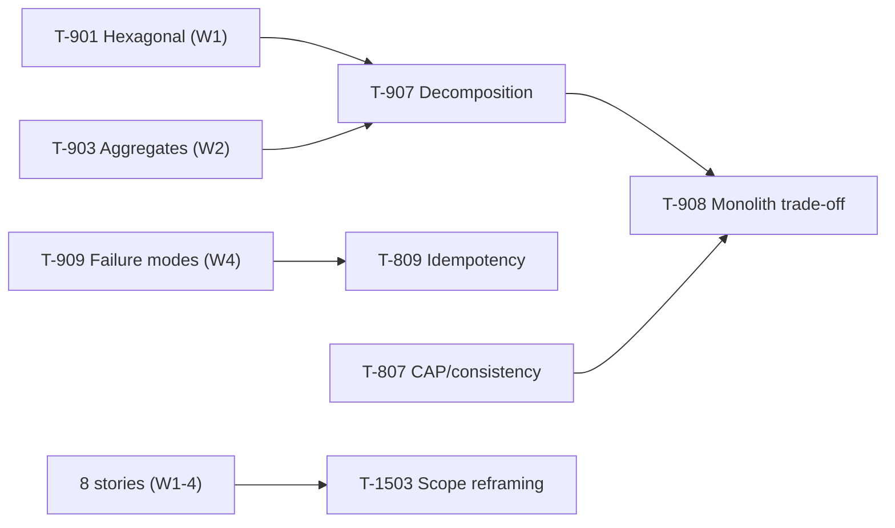

# Week 5 Study Pack — Decomposition, Idempotency, Consistency

**Plan:** A (Interview Emergency Sprint) · default workload 20h/week · see `00-project/learning-roadmap.md` §3, Week 5
**Topics:** T-907 (Decomposition) · T-908 (Monolith trade-off) · T-809 (Idempotency) · T-807 (CAP/consistency) · T-1503 (Scope & influence)
**Prerequisites:** T-901 ✔, T-903 ✔ (Week 1/2), T-909 ✔ (Week 4)

## Table of Contents

1. [Objective](#objective)
2. [Why this week, in this order](#why-this-week-in-this-order)
3. [Dependency graph](#dependency-graph)
4. [Files in this pack](#files-in-this-pack)
5. [Daily schedule](#daily-schedule-20hweek-baseline)
6. [Exit criteria](#exit-criteria)

---

## Objective

Acquire the Staff-signal architecture judgment topics — the ones where the expected answer is frequently *"don't do it"* rather than *"here's how."* These are judgment traps that need Weeks 1–4's foundation to answer credibly, not topics that can be learned in isolation.

## Why this week, in this order

Decomposition and the monolith trade-off are judgment calls that require Week 1's hexagonal-architecture boundary discipline and Week 2's aggregate-boundary discipline (`T-903`) to reason about correctly — a service boundary is, not coincidentally, very often the same line as an aggregate boundary. T-809 (idempotency) connects directly back to Week 4's distributed failure modes (`T-909`) — an idempotency key is the structural fix to the exact retry-ambiguity problem that chapter identified. T-1503 (scope and influence) is scheduled only now because it's a *rewrite* of existing stories, not new material — by this week, 8 stories already exist to reframe.

## Dependency graph

## Files in this pack

| # | File | Purpose |
|---|---|---|
| 1 | `README.md` | This file |
| 2 | `01-microservice-decomposition.md` | T-907/908 — summary + link; full chapter now canonical at `handbook/architecture/microservice-decomposition-and-monolith-tradeoff.md` |
| 3 | `02-idempotency.md` | T-809 — summary + link; full chapter now canonical at `handbook/system-design/idempotency.md` |
| 4 | `03-cap-and-consistency.md` | T-807 — summary + link; full chapter now canonical at `handbook/system-design/cap-theorem-and-consistency-models.md` |
| 5 | `04-java-coding-practice.md` | LC 380, 706, 622 — all compiled and run, including the exact audited Circular Queue errata fix |
| 6 | `05-flashcards.md` | 14 cards |
| 7 | `06-decomposition-analysis-deliverable.md` | `decomposition-analysis.md` template + worked example, counter-argument included |
| 8 | `07-story-scope-reframing.md` | T-1503 — rewrite Stories 1, 4, 7, 8 for scope and influence |
| 9 | `08-week-5-behavioral-mock.md` | 45-min behavioral round, 6 questions |
| 10 | `09-design-exercise-payment-processing.md` | Full six-phase design; idempotency and exactly-once mandatory |
| 11 | `10-week-5-checklist.md` | Day-by-day checklist |
| 12 | `resources.md` | Sources classified by authority |
| — | `MANIFEST.md` | Every file, verification status, real checksums |

## Daily schedule (20h/week baseline)

| Day | Track A — Technical (2h) | Track B — Coding (~0.8h) | Track C — Performance (~0.8h) |
|---|---|---|---|
| Mon | Service boundaries: where, and why not one table over | LC 380 | Build L1+L2 for T-907 |
| Tue | The monolith trade-off; when to merge services back | LC 706 — HashMap from scratch | Build L5+L6 — production example + trade-offs |
| Wed | Idempotency: full mechanism — **reproduce the demo yourself** | LC 622 — the errata fix | Build L3 deep dive for T-809 |
| Thu | CAP and consistency: what a system actually gives up in a partition | — | Story-scope reframing: Stories 1, 4 |
| Fri | Finish CAP chapter; begin `decomposition-analysis.md` | — | Story-scope reframing: Stories 7, 8 |
| Sat | Finish `decomposition-analysis.md`, including the counter-argument | — | Full payment-processing design, 45 min timed |
| Sun | Weekly review against exit criteria | — | 45-min behavioral mock, 6 questions, partner preferred |

## Exit criteria

- [ ] Argue both sides of a decomposition decision and reach a defended recommendation
- [ ] Explain idempotency end-to-end, including the concurrent-duplicate case, unprompted
- [ ] `decomposition-analysis.md` complete with a genuine counter-argument (operational cost, latency inflation, transaction fragmentation, on-call burden)
- [ ] 4 stories reframed for scope and influence
- [ ] 40+ coding problems cumulative
- [ ] Behavioral mock scored ≥ 3.5/5 average across the six dimensions
