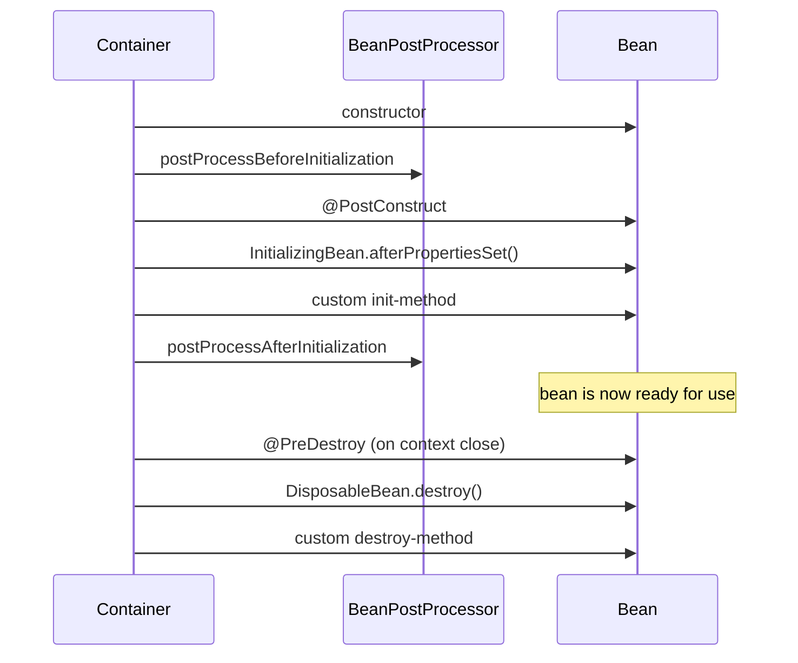

# T-506 / T-501 · Spring Auto-Configuration and Bean Lifecycle

**IWI 7.30 · Advanced tier · Prerequisite:** T-503 (Week 3) — auto-configuration and proxying are two different mechanisms that interact

**Verification note:** the lifecycle order and the `@Async`+`@Transactional` behavior in this chapter are real, executed Spring Framework 6.1.14 output. Source: `practice/java/week-07/spring-internals/`.

## Table of Contents

1. [The concept](#1-the-concept)
2. [Why it exists](#2-why-it-exists)
3. [Bean lifecycle order, observed](#3-bean-lifecycle-order-observed)
4. [Auto-configuration internals](#4-auto-configuration-internals)
5. [The `@Async` + `@Transactional` gotcha, reproduced](#5-the-async--transactional-gotcha-reproduced)
6. [Trade-offs](#6-trade-offs)
7. [Interview questions](#7-interview-questions)
8. [Common mistakes](#8-common-mistakes)
9. [Staff-level discussion](#9-staff-level-discussion)
10. [Summary](#10-summary)
11. [Key Takeaways](#11-key-takeaways)
12. [Cheat Sheet](#12-cheat-sheet)
13. [Flashcards](#13-flashcards)
14. [Practice Exercises](#14-practice-exercises)
15. [Additional Reading](#15-additional-reading)
16. [Official References](#16-official-references)

---

## 1. The concept

Every Spring bean passes through a fixed sequence of lifecycle callbacks between construction and being ready for use, and a mirrored sequence on shutdown. Auto-configuration is a separate mechanism layered on top: a set of `@Configuration` classes, each guarded by conditions (`@ConditionalOnClass`, `@ConditionalOnMissingBean`, etc.), that Spring Boot evaluates and applies automatically based on what's on the classpath and what the application has already defined itself.

## 2. Why it exists

The lifecycle callbacks exist because different integration points need to hook in at different, precise moments: a `BeanPostProcessor` needs to run *before* any bean's own initialization to have a chance to wrap or modify it (this is literally how `@Transactional` proxies get created); `@PostConstruct` needs to run *after* dependency injection completes, since it typically uses injected fields. Auto-configuration exists to eliminate boilerplate `@Configuration` classes for common integrations (a `DataSource`, a `JdbcTemplate`, a `RestTemplate`) while still allowing the application to override any of it by simply defining its own bean — which is exactly what `@ConditionalOnMissingBean` checks for.

## 3. Bean lifecycle order, observed



**Real, observed output** (`practice/java/week-07/spring-internals/BeanLifecycleDemo.java`):

```
3. constructor
4. BeanPostProcessor.postProcessBeforeInitialization
5. @PostConstruct
6. InitializingBean.afterPropertiesSet()
7. custom init-method (from @Bean(initMethod=...))
8. BeanPostProcessor.postProcessAfterInitialization
(context fully refreshed -- bean is now ready for use)
9. @PreDestroy
10. DisposableBean.destroy()
11. custom destroy-method (from @Bean(destroyMethod=...))
```

**Why `postProcessBeforeInitialization` matters specifically:** this is the exact hook `@Transactional`'s proxy machinery uses — the `BeanPostProcessor` for transaction management wraps the raw bean in a proxy *before* `@PostConstruct` even runs, which is why the proxy, not the raw object, is what gets injected everywhere else in the container.

## 4. Auto-configuration internals

An auto-configuration class is a normal `@Configuration` class, activated conditionally:

```java
@Configuration
@ConditionalOnClass(DataSource.class)          // only if the DataSource class is on the classpath
@ConditionalOnMissingBean(DataSource.class)     // only if the application hasn't defined its own
public class DataSourceAutoConfiguration {
    @Bean
    DataSource dataSource() { /* sensible default */ }
}
```

**Why `@ConditionalOnMissingBean` is the mechanism that makes auto-configuration "just work":** it means auto-configuration always runs *last*, after the application's own `@Configuration` classes have been processed — if the application already defined a `DataSource` bean, the condition is false and the auto-configured default is silently skipped. This ordering guarantee (application config wins, auto-config only fills gaps) is what lets a developer override exactly one bean without disabling auto-configuration entirely.

## 5. The `@Async` + `@Transactional` gotcha, reproduced

Stacking `@Async` and `@Transactional` on the same method is a well-known real gotcha — the transaction itself works correctly (it starts on whichever thread the async executor actually runs the method on), but a `void @Async` method returns to its caller **immediately**, before the transactional work even executes:

```java
@Async
@Transactional
public void doWorkAndFail() {
    jdbc.update("INSERT INTO work_log (id) VALUES (1)");
    throw new RuntimeException("simulated failure");
}
```

**Real output:**

```
Calling the @Async @Transactional method...
Call returned after 12ms. Exception visible to caller: false
(At this point the caller has NO idea whether the operation succeeded, failed, or is still running on the async executor thread.)

[test observer] async work actually completed: true
GRAVE: Unexpected exception occurred invoking async method: ...
[test observer] row count after the exception: 0 (0 means the transaction correctly rolled back, even though it ran on a different thread)
```

**Reading this precisely:** the transaction is entirely correct (row count 0 confirms the rollback). The "unexpected" part is purely about *visibility*: the caller's method call returned in 12ms with no exception, and the actual failure — including the real rollback — happened invisibly on a background thread, surfaced only in Spring's default uncaught-exception log line. A caller relying on a try/catch around this call to detect failure will never see one.

## 6. Trade-offs

| Approach | Benefit | Cost |
|---|---|---|
| `@PostConstruct`/`@PreDestroy` | Simple, annotation-based, no Spring-specific interface needed | Runs only within a Spring-managed bean; not portable to non-Spring construction |
| `InitializingBean`/`DisposableBean` | Explicit, typed interface | Couples the class directly to Spring's API |
| `@Async` alone (returning `void`) | Simplest fire-and-forget syntax | No way for the caller to observe success, failure, or completion at all |
| `@Async` returning `CompletableFuture` | Caller can observe success/failure via `.get()`/exception handling | Requires the caller to actually call `.get()` or attach a callback — easy to forget, silently reverting to the same blind-spot |

## 7. Interview questions

### Q1. Explain why `@Transactional` on an `@Async` method behaves unexpectedly.

- **Expected answer:** the real mechanism from §5 — the transaction itself works correctly on the executor thread, but a void async method returns to its caller before the work runs, so any failure (including the correct rollback) is invisible to the caller unless a `Future`/`CompletableFuture` is used and awaited.
- **Common mistakes:** claiming the transaction itself doesn't work correctly — it does; the surprise is about caller visibility, not transactional correctness.
- **Follow-up questions:** "How would you fix this so the caller can react to the failure?"
- **Senior-level expectations:** correctly separates "the transaction rolled back correctly" from "the caller can't see it."
- **Staff-level expectations:** proposes returning `CompletableFuture<T>` (or a custom `AsyncUncaughtExceptionHandler` for void methods) and states the trade-off of each fix.

### Q2. What does `@ConditionalOnMissingBean` actually guarantee about ordering?

- **Expected answer:** auto-configuration classes are processed after application-defined configuration, so the condition correctly reflects whether the application already supplied its own bean.
- **Common mistakes:** describing the condition without the ordering guarantee that makes it reliable.
- **Follow-up questions:** "What would break if auto-configuration ran BEFORE application config?"
- **Senior-level expectations:** states the ordering guarantee.
- **Staff-level expectations:** explains the failure mode if the ordering were reversed — the application's own bean definition would arrive too late to prevent the auto-configured default from also being created, likely producing a bean-conflict error or silently the wrong bean winning depending on definition order.

## 8. Common mistakes

- Believing `@Transactional` "doesn't work" on `@Async` methods — it works; the surprise is about visibility, not correctness.
- Using `@PostConstruct` for logic that depends on other beans' own `@PostConstruct` having already run — initialization order across beans isn't guaranteed by lifecycle phase alone.
- Assuming auto-configuration can't be overridden without disabling it entirely — `@ConditionalOnMissingBean` exists specifically so a single bean can be overridden.

## 9. Staff-level discussion

The `@Async`+`@Transactional` gotcha is a specific instance of a general Staff-level principle: **any mechanism that changes which thread executes code changes what "the caller" can observe**, and every async boundary in a system needs an explicit answer to "how does the caller find out this failed." This is the same underlying concern as Week 4's distributed failure modes (ambiguity about whether an operation succeeded) recreated *within a single process* — the fix (a `CompletableFuture` the caller actually awaits) is the in-process analogue of Week 5's idempotency-key mechanism: moving the burden of resolving ambiguity to a mechanism designed for it, rather than hoping a bare method call communicates enough.

## 10. Summary

Bean lifecycle callbacks fire in a fixed, observable order — constructor, `BeanPostProcessor.before`, `@PostConstruct`, `InitializingBean`, custom init-method, `BeanPostProcessor.after`, then the mirror sequence on shutdown. Auto-configuration layers conditional bean creation on top, ordered to run after application configuration specifically so `@ConditionalOnMissingBean` reliably detects an application override. Stacking `@Async` and `@Transactional` produces a correct transaction with an invisible failure path — reproduced with real numbers (12ms return, no exception visible, correct rollback happening silently).

## 11. Key Takeaways

- Lifecycle order: constructor → `BeanPostProcessor.before` → `@PostConstruct` → `InitializingBean` → custom init → `BeanPostProcessor.after`.
- `@Transactional`'s proxy is created via a `BeanPostProcessor`, before `@PostConstruct` even runs.
- `@ConditionalOnMissingBean` relies on auto-configuration running after application configuration.
- `@Async` + `@Transactional`: the transaction is correct; the caller's visibility into failure is the actual gotcha.

## 12. Cheat Sheet

See §3's lifecycle sequence diagram.

## 13. Flashcards

1. **Q: What's the correct bean lifecycle order?** A: Constructor → `BeanPostProcessor.before` → `@PostConstruct` → `InitializingBean.afterPropertiesSet()` → custom init-method → `BeanPostProcessor.after`.
2. **Q: What mechanism creates a `@Transactional` proxy?** A: A `BeanPostProcessor`, running in `postProcessBeforeInitialization` — before `@PostConstruct`.
3. **Q: What does `@ConditionalOnMissingBean` rely on?** A: Auto-configuration running after application configuration, so the check reflects whether the application already defined its own bean.
4. **Q: Is `@Transactional` broken on an `@Async` method?** A: No — the transaction works correctly; the caller just can't see a void method's failure without a `Future`/`CompletableFuture`.

(Full week-level deck: `05-flashcards.md`.)

## 14. Practice Exercises

1. Reproduce both demos yourself: `practice/java/week-07/spring-internals/`.
2. Modify `AsyncTransactionalDemo` to return a `CompletableFuture<Void>` instead of `void`, and confirm the caller can now observe the exception via `.get()`.
3. Add a second `BeanPostProcessor` to the lifecycle demo and confirm both processors' before/after callbacks interleave in registration order.

## 15. Additional Reading

- [Spring Framework documentation — Bean Factory](https://docs.spring.io/spring-framework/reference/core/beans/factory-nature.html)

## 16. Official References

- [Spring Framework documentation — Task Execution and Scheduling (`@Async`)](https://docs.spring.io/spring-framework/reference/integration/scheduling.html)
- [Spring Boot documentation — Auto-configuration](https://docs.spring.io/spring-boot/reference/using/auto-configuration.html)
