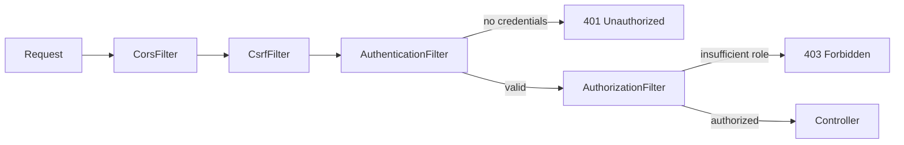

# T-511 · Spring Security Filter Chain

**IWI 7.20 · Advanced tier**

**Verification note:** the trace in §3 is real, executed output from a plain-Java reproduction of Spring Security's `Filter`/`FilterChain` mechanism. Source: `practice/java/week-07/security/SecurityFilterChainDemo.java`.

## Table of Contents

1. [The concept](#1-the-concept)
2. [Why it exists](#2-why-it-exists)
3. [A request traced through the chain](#3-a-request-traced-through-the-chain)
4. [Trade-offs](#4-trade-offs)
5. [Interview questions](#5-interview-questions)
6. [Common mistakes](#6-common-mistakes)
7. [Staff-level discussion](#7-staff-level-discussion)
8. [Summary](#8-summary)
9. [Key Takeaways](#9-key-takeaways)
10. [Cheat Sheet](#10-cheat-sheet)
11. [Flashcards](#11-flashcards)
12. [Practice Exercises](#12-practice-exercises)
13. [Additional Reading](#13-additional-reading)
14. [Official References](#14-official-references)

---

## 1. The concept

Spring Security intercepts every HTTP request through a chain of servlet filters — a chain-of-responsibility pipeline where each filter can inspect the request, do work, and either call the next filter or short-circuit the chain entirely (returning a response directly, e.g., a 401 or 403). The order of filters in the chain is not incidental — it's the entire security model: authentication must run before authorization, because authorization needs to know *who* the request is before it can decide *what* they're allowed to do.

## 2. Why it exists

Without an ordered, composable chain, every endpoint would need to hand-roll its own authentication and authorization checks, with no guarantee of consistency across the application. The chain exists so cross-cutting security concerns — CORS, CSRF, authentication, authorization — are applied uniformly, in a guaranteed order, before a request ever reaches application code.

## 3. A request traced through the chain



**Real trace, valid token, non-admin path:**
```
CorsFilter: checking origin
CsrfFilter: checking CSRF token (skipped for stateless API)
AuthenticationFilter: parsing Authorization header
AuthenticationFilter: token valid, principal set to user-42
AuthorizationFilter: checking user-42 has access to /orders
CONTROLLER: request reached the actual endpoint handler
```

**Real trace, no `Authorization` header — short-circuits at authentication:**
```
CorsFilter: checking origin
CsrfFilter: checking CSRF token (skipped for stateless API)
AuthenticationFilter: parsing Authorization header
AuthenticationFilter: NO credentials -- SHORT-CIRCUITING chain, returning 401
(Notice: CONTROLLER line never appears -- the chain stopped at the auth filter.)
```

**Real trace, valid token, wrong role for `/admin` — short-circuits at authorization, a separate later gate:**
```
... AuthenticationFilter: token valid, principal set to user-42
AuthorizationFilter: checking user-42 has access to /admin
AuthorizationFilter: principal lacks required role -- SHORT-CIRCUITING, returning 403
(authenticated successfully, but never reached the controller)
```

**The Staff-level detail worth naming explicitly:** authentication succeeding does *not* imply authorization succeeds — they are two separate, sequential gates, and Scenario 3 demonstrates a request that passes the first and fails the second, which is exactly the distinction a "401 vs 403" question is probing for.

## 4. Trade-offs

| Approach | Benefit | Cost |
|---|---|---|
| Filter-chain short-circuiting | Cheap rejection of unauthorized requests before any business logic runs | Every filter added is on the critical path of every request, even ones that will be rejected early |
| Stateless (JWT-based) authentication in the chain | No session store lookup per request | The chain cannot revoke a still-valid token (see `03-oauth2-oidc-and-jwt.md`) |
| Method-level security (`@PreAuthorize`) instead of/in addition to filter-level | Finer-grained, closer to the specific operation | Runs later than the filter chain — a request that should have been rejected at the edge still incurs some processing cost first |

## 5. Interview questions

### Q1. Trace an authenticated request through your security filter chain.

- **Expected answer:** the §3 trace pattern — name the filters in order, and what each does.
- **Common mistakes:** describing authentication and authorization as one combined step.
- **Follow-up questions:** "What's the difference between what happens on a 401 versus a 403?"
- **Senior-level expectations:** traces the chain correctly with the two gates distinguished.
- **Staff-level expectations:** explains why the ORDER specifically matters — authorization is meaningless without an established principal from authentication first.

### Q2. Why does CORS/CSRF filtering happen before authentication in the chain?

- **Expected answer:** these are lower-level HTTP/browser-security concerns that should be resolved before spending any effort on the more expensive authentication check — rejecting a malformed or disallowed-origin request early is cheaper.
- **Common mistakes:** not having a reasoned ordering principle, just reciting a memorized filter list.
- **Follow-up questions:** "Would you ever put authentication before CORS handling?"
- **Senior-level expectations:** gives a plausible ordering rationale.
- **Staff-level expectations:** frames it as a general principle (cheapest, most decisive rejection checks run earliest) rather than a memorized specific order.

## 6. Common mistakes

- Conflating authentication (who is this) with authorization (what are they allowed to do) as a single step.
- Assuming a successfully authenticated request is automatically authorized for every endpoint.
- Placing expensive checks (e.g., a database-backed permission lookup) earlier in the chain than cheap ones (CORS origin check), wasting work on requests that could have been rejected for free.

## 7. Staff-level discussion

The filter chain is a concrete instance of a general architectural pattern — ordering cross-cutting concerns from cheapest/most-decisive to most expensive/most-specific — that shows up throughout distributed systems design, not just in one framework's security layer. A Staff-level engineer designing a new cross-cutting concern (rate limiting, request logging, feature-flag evaluation) reaches for the same ordering discipline: what's the cheapest check that can reject the most requests, and does it run first.

## 8. Summary

A security filter chain is an ordered chain-of-responsibility: each filter can act and either pass the request along or short-circuit the chain entirely. Authentication and authorization are two distinct, sequential gates — a request can pass the first and fail the second, producing a 403 rather than a 401. The real trace in this chapter demonstrates both short-circuit points explicitly, not just describes them.

## 9. Key Takeaways

- Filters form a chain-of-responsibility; any filter can short-circuit the rest.
- Authentication (who) and authorization (what they can do) are separate, sequential gates.
- A 401 means authentication failed; a 403 means authentication succeeded but authorization didn't.
- Order cross-cutting concerns from cheapest/most-decisive to most expensive/most-specific.

## 10. Cheat Sheet

See §3's flowchart.

## 11. Flashcards

1. **Q: What's the difference between a 401 and a 403?** A: 401 = authentication failed (who are you?); 403 = authentication succeeded but authorization failed (you're known, but not allowed).
2. **Q: Can a filter chain short-circuit before reaching the controller?** A: Yes — any filter can return a response directly instead of calling the next filter.
3. **Q: Why do CORS/CSRF checks typically run before authentication?** A: They're cheaper, more decisive rejections — reject early before spending effort on the more expensive authentication check.

(Full week-level deck: `05-flashcards.md`.)

## 12. Practice Exercises

1. Reproduce the trace demo yourself: `practice/java/week-07/security/SecurityFilterChainDemo.java`.
2. Add a rate-limiting filter to the chain, placed correctly relative to the existing filters, and justify its position using the "cheapest/most-decisive first" principle.
3. Use this chapter's trace as the basis for `06-security-chain-trace-deliverable.md`.

## 13. Additional Reading

- [Spring Security documentation — Architecture](https://docs.spring.io/spring-security/reference/servlet/architecture.html)

## 14. Official References

- [Jakarta Servlet specification — Filter](https://jakarta.ee/specifications/servlet/) — the underlying `Filter`/`FilterChain` interfaces this pattern is built on
