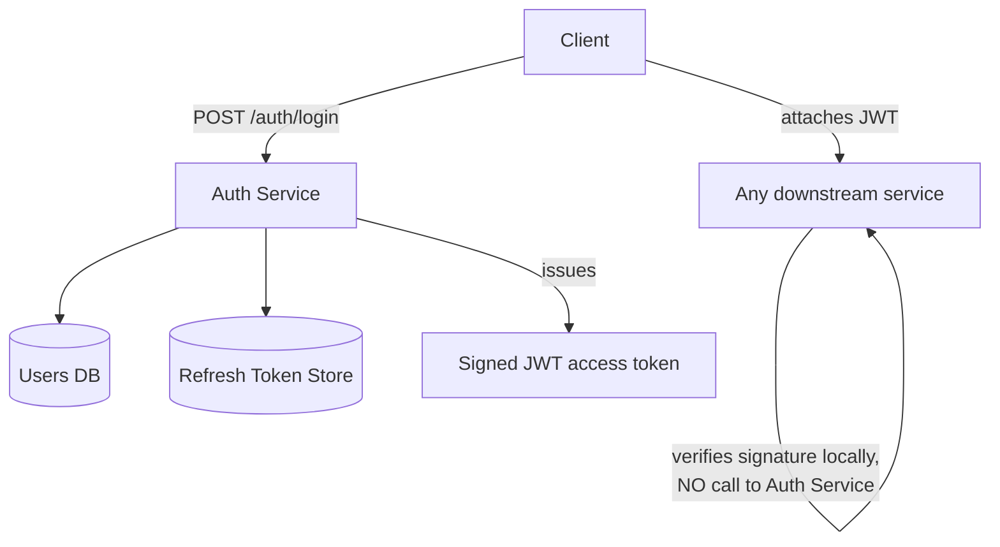

# Design Exercise — Authentication Service

**45 minutes, timed, full six-phase method.** Do this yourself before reading the worked notes below.

## Table of Contents

1. [Phase 1 — Clarify](#phase-1--clarify)
2. [Phase 2 — Estimate](#phase-2--estimate)
3. [Phase 3 — API](#phase-3--api)
4. [Phase 4 — Data](#phase-4--data)
5. [Phase 5 — Architecture](#phase-5--architecture)
6. [Phase 6 — Bottlenecks](#phase-6--bottlenecks)
7. [Exit check](#exit-check)

---

## Phase 1 — Clarify

**In scope:** issue access/refresh tokens after credential verification, validate tokens for other services, support logout. **Out of scope:** social login providers, MFA implementation details. **Core action:** token issuance is low-volume (one per login); token *validation* is extremely high-volume (every request to every downstream service).

## Phase 2 — Estimate

```
Assumption: 2M logins/day -> token issuance average QPS ~= 23/s, peak (3x) ~= 69/s
Assumption: every downstream request validates a token; total platform
            traffic is ~50,000 QPS peak (matching Week 4's news-feed estimate)
Token VALIDATION load ~= 50,000/s -- roughly 700x the issuance load.

This asymmetry is the single number that should drive the whole design:
issuance can afford a database round-trip; validation cannot.
```

## Phase 3 — API

```
POST /auth/login        {username, password} -> {accessToken, refreshToken}
POST /auth/refresh       {refreshToken} -> {accessToken}
POST /auth/logout        {refreshToken} -> 204
(validation is NOT a network call downstream services make per-request --
see Phase 5)
```

## Phase 4 — Data

**Users/credentials:** relational, strongly consistent. **Refresh tokens:** relational or key-value, with the ability to invalidate on logout (this is exactly the stateful check idempotency and JWT revocation both need, per Weeks 5 and 7). **Access tokens:** not stored at all — per `03-oauth2-oidc-and-jwt.md`, a JWT's whole design point is that validating it requires no storage lookup.

## Phase 5 — Architecture



**Justified against Phase 2's numbers:** the 700x validation-to-issuance ratio is exactly why downstream services verify the JWT's signature *locally* (using a shared secret or the auth service's public key) rather than calling back to the auth service on every request — a synchronous validation call at 50,000 QPS would make the auth service a availability-critical bottleneck for the entire platform, whereas local signature verification is a pure CPU operation with no network dependency at all.

## Phase 6 — Bottlenecks

1. **Refresh-token store becomes a bottleneck at scale.** Mitigation: this is comparatively low volume (one refresh per access-token expiry window, not per request), so a standard relational store with an index on the token easily handles it — worth stating explicitly that not every component needs the same scaling treatment.
2. **Revocation gap.** Per `03-oauth2-oidc-and-jwt.md` §4, a compromised access token remains valid until it expires — mitigated by keeping access-token expiry short (minutes) and only doing the expensive, revocable check (refresh token validity) at the much-lower-volume refresh step.
3. **Key rotation.** If the signing key is ever compromised, every downstream service verifying locally needs the new key distributed before old tokens signed with the compromised key can be rejected — this is a real operational bottleneck (key distribution latency) worth naming, not something the JWT format itself solves.

## Exit check

- [ ] All six phases completed within 45 minutes
- [ ] The issuance-vs-validation asymmetry stated explicitly in Phase 2 and traced through to the local-verification architecture decision in Phase 5
- [ ] The revocation gap named as a bottleneck, connecting explicitly to `03-oauth2-oidc-and-jwt.md`
- [ ] Key rotation named as a real operational bottleneck, not glossed over
