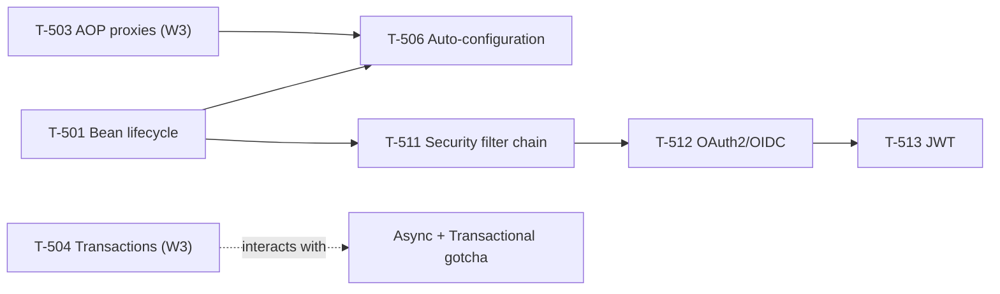

# Week 7 Study Pack — Spring Depth + Security

**Plan B, Week 7 — first week beyond Plan A's 6-week sprint.** See `00-project/learning-roadmap.md` §4, Week 7.
**Topics:** T-506 (Auto-configuration) · T-501 (Bean lifecycle) · T-511 (Security filter chain) · T-512 (OAuth2/OIDC) · T-513 (JWT)
**Prerequisites:** T-503 ✔, T-504 ✔, T-505 ✔ (Week 3)

## Table of Contents

1. [Objective](#objective)
2. [Why this week, in this order](#why-this-week-in-this-order)
3. [Dependency graph](#dependency-graph)
4. [Files in this pack](#files-in-this-pack)
5. [Daily schedule](#daily-schedule-10hweek-study--10h-practice)
6. [Exit criteria](#exit-criteria)

---

## Objective

Extend Week 3's proxy-mechanics foundation into two directions that both depend on it: how Spring assembles a bean (lifecycle, auto-configuration) and how a security filter chain — itself a pipeline of proxied/wrapped components — processes a request. Plan B's first genuinely new-topic week after Plan A's 6-week sprint and Week 6's consolidation.

## Why this week, in this order

Auto-configuration internals are unusable without Week 3's `T-503` proxy mechanics — conditional bean creation and the proxying that wraps the result are two different mechanisms that interact, and understanding one without the other produces exactly the surface-level answer this programme exists to avoid. The security filter chain's ordering only makes sense once the container lifecycle (this week's `T-501`) is understood — a filter is itself a bean, subject to the same lifecycle and potential proxying as anything else in the container.

## Dependency graph

## Files in this pack

| # | File | Purpose |
|---|---|---|
| 1 | `README.md` | This file |
| 2 | `01-spring-auto-configuration-and-lifecycle.md` | T-506/501 — summary + link; full chapter now canonical at `handbook/spring/auto-configuration-and-bean-lifecycle.md` |
| 3 | `02-spring-security-filter-chain.md` | T-511 — summary + link; full chapter now canonical at `handbook/spring/security-filter-chain.md` |
| 4 | `03-oauth2-oidc-and-jwt.md` | T-512/513 — summary + link; full chapter now canonical at `handbook/security/oauth2-oidc-and-jwt.md` |
| 5 | `04-java-coding-practice.md` | LC 46, 78, 39, 22 — all compiled and run, including the errata #3 fix |
| 6 | `05-flashcards.md` | 14 cards |
| 7 | `06-security-chain-trace-deliverable.md` | `security-chain-trace.md` template + worked example |
| 8 | `07-week-7-mock-interview.md` | 45-min Spring technical round |
| 9 | `08-design-exercise-authentication-service.md` | Summary + link; full design now canonical at `architecture-atlas/authentication-service.md` |
| 10 | `09-week-7-checklist.md` | Day-by-day checklist |
| 11 | `resources.md` | Sources classified by authority |
| — | `MANIFEST.md` | Every file, verification status, real checksums |

## Daily schedule (10h/week study + 10h practice)

| Day | Track A — Technical (2h) | Track B — Coding (~1.4h) | Track C — Performance (~1.4h) |
|---|---|---|---|
| Mon | Bean lifecycle and auto-configuration — **reproduce the lifecycle demo yourself** | LC 46 — errata drill, reproduce the buggy vs fixed permute | Build L1+L2 for T-506 |
| Tue | The `@Async`+`@Transactional` gotcha — **reproduce that demo too** | LC 78 | Build L5+L6 — production example + trade-offs |
| Wed | Security filter chain — **reproduce the trace demo** | LC 39 | Build L3 deep dive for T-511 |
| Thu | OAuth2/OIDC concepts; JWT mechanics — **reproduce the JWT demo** | LC 22 | Story 9 (design review) |
| Fri | Finish JWT chapter; begin `security-chain-trace.md` | — | Story 10 (technical debt advocacy) |
| Sat | Finish `security-chain-trace.md` | — | Full authentication-service design, 45 min timed |
| Sun | Weekly review against exit criteria | — | 45-min Spring technical mock |

## Exit criteria

- [ ] Explain why `@Transactional` on an `@Async` method behaves unexpectedly, citing the real demo's numbers (12ms return, exception invisible to caller, correct rollback anyway)
- [ ] Explain JWT revocation honestly — you cannot, without a stateful check that undoes the point of a stateless token — and name both real mitigations
- [ ] `security-chain-trace.md` complete, tracing one authenticated request through every filter
- [ ] 2 more stories (9–10), for 10 total
- [ ] All 4 backtracking problems solved, including a from-memory explanation of the errata #3 fix
