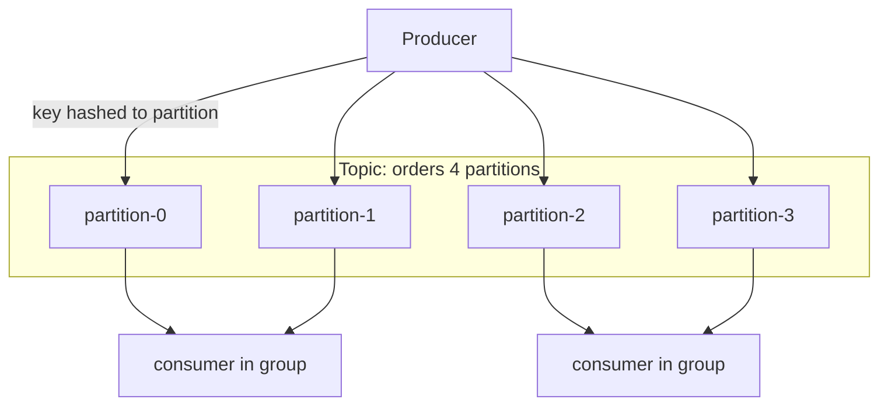

# T-701 · Kafka Architecture Fundamentals

**IWI 6.40 · Core tier**

**Verification note:** every partition/broker fact in this chapter is exercised directly by the demos in `practice/java/week-08/kafka/` (real single-broker KRaft cluster, 4-partition topic) — see `MANIFEST.md` for exact reproduce commands. Replication/ISR mechanics are described from the blueprint (`00-project/knowledge-architecture-blueprint.md` §5.8) since the practice environment runs a single broker and cannot itself demonstrate a multi-broker ISR shrink/expand; that gap is stated explicitly rather than faked.

## Table of Contents

1. [The concept](#1-the-concept)
2. [Why it exists](#2-why-it-exists)
3. [Topics, partitions, and what "ordering" actually means](#3-topics-partitions-and-what-ordering-actually-means)
4. [Replication and the ISR](#4-replication-and-the-isr)
5. [Trade-offs](#5-trade-offs)
6. [Interview questions](#6-interview-questions)
7. [Common mistakes](#7-common-mistakes)
8. [Staff-level discussion](#8-staff-level-discussion)
9. [Summary](#9-summary)
10. [Key Takeaways](#10-key-takeaways)
11. [Cheat Sheet](#11-cheat-sheet)
12. [Flashcards](#12-flashcards)
13. [Practice Exercises](#13-practice-exercises)
14. [Additional Reading](#14-additional-reading)
15. [Official References](#15-official-references)

---

## 1. The concept

A Kafka **topic** is a durable, append-only log, split into an ordered set of **partitions** for parallelism. Each partition is an independent, strictly-ordered sequence of records, each assigned a monotonically increasing **offset**. Partitions are distributed across **brokers**; each partition has one **leader** broker (handles all reads/writes for that partition) and zero or more **follower** replicas that copy the leader's log.

## 2. Why it exists

A single append-only log gives total order but caps throughput at one machine's disk/network. Splitting a topic into partitions lets Kafka parallelize both writes (many partitions, many leaders, spread across brokers) and reads (one consumer per partition, in parallel) — at the cost of only guaranteeing order *within* a partition, not across the topic. That cost is the single most consequential thing to understand about Kafka, and the most commonly misunderstood (§7).

## 3. Topics, partitions, and what "ordering" actually means



**Real output** (`ProducerPartitionKeyDemo`, `orders` topic, 4 partitions) — the same key always lands on the same partition, proving ordering is per-key/per-partition, not global:

```
== same key -> same partition, every time ==
key=customer-42 value=order-0 -> partition=1 offset=0
key=customer-42 value=order-1 -> partition=1 offset=1
key=customer-42 value=order-2 -> partition=1 offset=2
key=customer-42 value=order-3 -> partition=1 offset=3
key=customer-42 value=order-4 -> partition=1 offset=4
key=customer-42 value=order-5 -> partition=1 offset=5
== different keys -> spread across partitions ==
key=customer-1   -> partition=1 offset=6
key=customer-2   -> partition=2 offset=0
key=customer-3   -> partition=2 offset=1
key=customer-4   -> partition=1 offset=7
key=customer-5   -> partition=2 offset=2
key=customer-6   -> partition=3 offset=0
```

`customer-42`'s six records land on partition 1 in strict offset order 0→5: total order **for that key**. But interleave two different customers' records and there is no guaranteed relative order between them — they may sit on different partitions entirely, consumed by different consumers, in parallel, with no cross-partition ordering guarantee at all. Partition count is chosen at topic-creation time and is effectively immutable afterward for keyed topics: adding partitions changes every key's `hash(key) % partitionCount` mapping, silently breaking the very ordering guarantee the key was chosen to provide.

## 4. Replication and the ISR

Each partition has a leader and `replication.factor - 1` followers. The **In-Sync Replica set (ISR)** is the subset of replicas (leader + followers) that are fully caught up with the leader within `replica.lag.time.max.ms`. A record is only considered **committed** once every replica in the ISR has it. If a follower falls behind, it's dropped from the ISR — shrinking the ISR trades durability for availability (fewer replicas need to ack a write, so writes keep flowing even if the cluster is degraded). This directly feeds `acks=all` semantics in `02-producer-semantics-and-partition-keys.md`: `acks=all` means "wait for the full **current** ISR," not "wait for `replication.factor` replicas" — if the ISR has shrunk to just the leader, `acks=all` provides no more durability than `acks=1` until `min.insync.replicas` is also set and enforced.

**Unclean leader election** (`unclean.leader.election.enable=true`) allows a broker outside the ISR to become leader if no in-sync replica is available — trading data loss (the out-of-sync replica is missing recent records) for availability (the partition stays writable at all). Leaving it disabled (the safer default) means an unavailable ISR makes the partition unavailable for writes until an in-sync replica returns.

## 5. Trade-offs

| Decision | Benefit | Cost |
|---|---|---|
| More partitions | More parallelism (producers, consumers) | More open file handles/broker, more memory, longer rebalances, higher end-to-end latency per partition metadata sync |
| Higher `replication.factor` | Survives more simultaneous broker failures | More disk, more inter-broker replication traffic |
| `unclean.leader.election.enable=true` | Partition stays available during an ISR outage | Silent data loss on failover |
| Fewer, wider partitions per topic | Simpler operations, less rebalance churn | Caps maximum consumer parallelism at the partition count |

## 6. Interview questions

### Q1. Does Kafka guarantee ordering?

- **Expected answer:** Only within a single partition. No guarantee across partitions, so no guarantee across the topic as a whole.
- **Common mistakes:** Answering "yes" unconditionally — the single most consequential misconception per the blueprint (§5.8).
- **Follow-up questions:** "You need per-customer ordering. How do you achieve it?"
- **Senior-level expectations:** Names the partition key as the mechanism (route by customer ID so all of one customer's records hit one partition).
- **Staff-level expectations:** Also names the failure mode: changing partition count later remaps every key, silently breaking that guarantee for existing data — and states the operational consequence (partition count is a one-way door for keyed topics).

### Q2. One partition is taking 60% of the traffic. What's happening and how do you fix it?

- **Expected answer:** Key skew — a small number of key values (e.g., one very active customer, or a bad hashing choice) dominate the traffic, and since the key deterministically maps to one partition, that partition becomes a hot partition.
- **Common mistakes:** Reaching for "add more partitions" without addressing the skew — new partitions don't help a single hot key, they just remap the whole keyspace (and break existing ordering, per Q1).
- **Follow-up questions:** "What if the skew is inherent to the business — one customer really is 60% of volume?"
- **Senior-level expectations:** Proposes a compound key (e.g., `customerId + bucket`) to spread one logical entity's traffic across several partitions while accepting a weaker (bucketed) ordering guarantee.
- **Staff-level expectations:** Frames it as a genuine trade-off between throughput and ordering granularity, not a free fix, and discusses detecting skew via per-partition throughput metrics before it becomes an incident.

## 7. Common mistakes

- Believing Kafka provides global, topic-wide ordering (it provides per-partition ordering only).
- Treating "more partitions" as a free scalability lever without accounting for rebalance cost, file-handle pressure, and the one-way-door nature of the key-to-partition mapping.
- Assuming `replication.factor=3` alone means three replicas are always available to serve a failover — the ISR can shrink below that at any time.

## 8. Staff-level discussion

Partition count is one of the few genuinely irreversible decisions in a Kafka deployment for a keyed topic — this is the same category of decision as a database shard key (`T-614`) or a URL scheme in a public API: cheap to get right at design time, extremely expensive to change once data and ordering guarantees depend on it. A Staff-level engineer sizes partition count from projected peak throughput and consumer parallelism needs up front, rather than treating it as a value to tune reactively, precisely because "just repartition it" is not actually an option once the topic is in production with ordering-dependent consumers.

## 9. Summary

Kafka splits a topic into independently-ordered partitions to parallelize throughput; the price is that ordering is guaranteed only within a partition, never across the topic. Partition assignment is deterministic by key, making per-key ordering achievable but partition count effectively fixed. Replication with an ISR provides durability, but `acks=all` is only as strong as the current ISR — not the configured `replication.factor` — which is why `min.insync.replicas` (§`02`) matters.

## 10. Key Takeaways

- Ordering is per-partition, not per-topic.
- Partition-to-key mapping is deterministic and effectively permanent once keyed data exists.
- The ISR, not `replication.factor`, is what `acks=all` actually waits on.
- Hot partitions come from key skew, not partition count — more partitions doesn't fix a skewed key.

## 11. Cheat Sheet

See §3's diagram and the real trace above.

## 12. Flashcards

1. **Q: What does Kafka guarantee about ordering?** A: Total order within a partition only; no guarantee across partitions.
2. **Q: What is the ISR?** A: The set of replicas (leader + followers) fully caught up with the leader within the configured lag threshold.
3. **Q: Why is changing partition count on a keyed topic dangerous?** A: It changes every key's `hash(key) % partitionCount` mapping, silently remapping and breaking existing per-key ordering.

(Full week-level deck: `06-flashcards.md`.)

## 13. Practice Exercises

1. Reproduce the trace: `practice/java/week-08/kafka/src/ProducerPartitionKeyDemo.java` (see `MANIFEST.md` for run instructions).
2. Given a topic with 8 partitions and a customer ID key, calculate which partition `customer-123` lands on for `hash("customer-123") % 8` and verify against a real run.
3. Design a compound key strategy (§6 Q2) for a hypothetical single customer generating 60% of traffic, and write out the trade-off you're accepting.

## 14. Additional Reading

- [Kafka documentation — Design](https://kafka.apache.org/documentation/#design)

## 15. Official References

- [KIP-500 — Replace ZooKeeper with a Self-Managed Metadata Quorum (KRaft)](https://cwiki.apache.org/confluence/display/KAFKA/KIP-500) — the mode this week's practice cluster runs in
