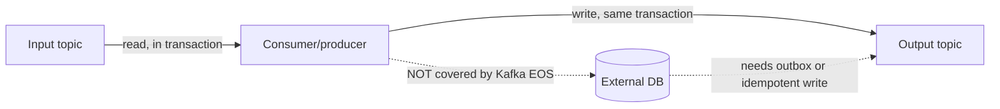

# T-704 · Delivery Semantics & Exactly-Once Processing

**IWI 8.00 · Advanced tier · highest-weighted topic in this week's cluster**

**Verification note:** the duplicate-processing and lost-processing traces in §3 are real, executed output from `practice/java/week-08/kafka/src/DeliverySemanticsDemo.java` — actual offset commits against a live broker, not a simulated description.

## Table of Contents

1. [The concept](#1-the-concept)
2. [Why it exists](#2-why-it-exists)
3. [At-least-once and at-most-once, traced](#3-at-least-once-and-at-most-once-traced)
4. [Is exactly-once real?](#4-is-exactly-once-real)
5. [Trade-offs](#5-trade-offs)
6. [Interview questions](#6-interview-questions)
7. [Common mistakes](#7-common-mistakes)
8. [Staff-level discussion](#8-staff-level-discussion)
9. [Summary](#9-summary)
10. [Key Takeaways](#10-key-takeaways)
11. [Cheat Sheet](#11-cheat-sheet)
12. [Flashcards](#12-flashcards)
13. [Practice Exercises](#13-practice-exercises)
14. [Additional Reading](#14-additional-reading)
15. [Official References](#15-official-references)

---

## 1. The concept

Delivery semantics describe what a consumer can guarantee about how many times each record gets processed, given that "commit the offset" and "process the record" are two separate operations that can be interrupted independently. There are exactly three possible orderings of those two operations relative to a crash, and each produces a different guarantee: **at-most-once**, **at-least-once**, and (with more machinery) **exactly-once**.

## 2. Why it exists

A consumer cannot atomically "process a record and record that it did so" as one step against two different systems (Kafka's offset store and whatever the processing side-effect touches — a database write, an email send, a downstream publish) without extra coordination. Delivery semantics is the vocabulary for stating precisely what happens to that gap when a crash lands inside it.

## 3. At-least-once and at-most-once, traced

**Real output, at-least-once (commit AFTER processing) — a crash before commit causes redelivery:**
```
== at-least-once: commit AFTER processing ==
-- attempt 1: process batch, crash before commit --
  processed 18 records, simulating crash BEFORE commitSync()
-- attempt 2 (same group, no commit landed): reprocess from last committed offset --
  processed 18 records, committed successfully
attempt 1 processed 18 records (uncommitted) + attempt 2 processed 18 records (redelivered)
= 36 total deliveries for 18 unique records -> duplicates observed
```

**Real output, at-most-once (commit BEFORE processing) — a crash after commit but before processing loses the batch entirely:**
```
== at-most-once: commit BEFORE processing ==
-- attempt 1: commit offsets immediately on poll, then crash before processing --
  committed offsets for 18 records, simulating crash BEFORE processing them
-- attempt 2 (same group, offsets already committed): poll returns nothing left --
  committed and processed 0 records (0 expected -- backlog was already drained by attempt 1's commit)
attempt 1 committed offsets for 0 records but crashed before processing them
+ attempt 2 processed 0 records = 0 records actually processed out of 18 -> loss observed
```

The two traces are mirror images of the same underlying fact: **the order of "commit" relative to "process" determines which failure mode you get, and there is no ordering of just those two steps that avoids both.** Commit-after-processing risks duplicates (safe default: reprocessing a record is usually cheaper than losing one). Commit-before-processing risks silent loss (rarely the right default; occasionally acceptable for genuinely disposable data like best-effort metrics).

## 4. Is exactly-once real?

Yes, but scoped narrowly — this is the blueprint's named follow-up: *"Is exactly-once real? Explain precisely what Kafka provides and what it doesn't."* Kafka's exactly-once semantics (EOS) covers the **transactional read-process-write loop entirely within Kafka**: a consumer reads from an input topic, a producer writes to an output topic, and both the consumed offsets and the produced records commit as one atomic transaction (`transactional.id`, `isolation.level=read_committed` on downstream consumers). If the process crashes mid-transaction, the whole transaction is rolled back — nothing partially applied is ever visible to a `read_committed` consumer.

**What it does NOT cover:** any write to a system outside Kafka — a database row, an HTTP call, a file write. If a consumer reads a Kafka record and writes to Postgres as its side effect, there is no built-in atomicity between "the Kafka offset committed" and "the Postgres row committed" — that gap is closed either by the **transactional outbox pattern** (T-618: write the DB row and the outbound event in the same DB transaction, then a separate publisher reads the outbox and produces to Kafka) or by making the external write **idempotent** at the consumer boundary (T-809) so redelivery is safe regardless of how many times it happens.



## 5. Trade-offs

| Approach | Guarantee | Cost |
|---|---|---|
| Commit after processing (at-least-once) | No silent loss | Consumer must tolerate/dedupe reprocessing |
| Commit before processing (at-most-once) | No duplicate processing | Silent loss on crash — rarely acceptable |
| Kafka transactional EOS (Kafka-to-Kafka only) | True exactly-once within Kafka | Higher latency (transaction coordinator round-trip); doesn't extend past Kafka |
| Idempotent consumer (dedupe key at the write boundary) | Effectively exactly-once end-to-end, including external systems | Requires a durable dedupe key and a lookup/upsert on every write |

## 6. Interview questions

### Q1. Is exactly-once real? Explain precisely what Kafka provides and what it doesn't.

- **Expected answer:** Real, but scoped to the transactional read-process-write loop within Kafka; does not extend to external systems without an outbox or idempotent consumer.
- **Common mistakes:** Flatly saying "yes, Kafka is exactly-once" or flatly saying "no such thing, it's marketing" — both are wrong; the honest answer is the scoped one.
- **Follow-up questions:** "Your consumer writes to Kafka AND Postgres. How do you make that exactly-once end-to-end?"
- **Senior-level expectations:** States the Kafka-to-Kafka scope correctly.
- **Staff-level expectations:** Proposes the outbox pattern or idempotent-write mechanism unprompted, and explains why a dual-write (write DB, then separately produce to Kafka, no coordination) can never be made safe without one of those.

### Q2. Consumer crashes after processing but before committing. What happens, and how do you make that safe?

- **Expected answer:** At-least-once redelivery of the same batch on restart (§3's real trace); made safe by ensuring the processing side-effect is idempotent (e.g., an upsert keyed by record ID, not an unconditional insert or increment).
- **Common mistakes:** Treating "the crash is the bug" rather than accepting redelivery as expected and designing the processing step to tolerate it.
- **Follow-up questions:** "What if the side effect is sending an email — you can't 'idempotently' unsend one?"
- **Senior-level expectations:** Names idempotency keys / dedupe tables as the general mechanism.
- **Staff-level expectations:** For genuinely non-idempotent side effects (emails, payments), proposes a dedupe check (has this record ID already triggered this side effect?) as a separate durable state check before performing the action — converting a non-idempotent action into an idempotent operation from the caller's perspective.

## 7. Common mistakes

- Believing Kafka provides end-to-end exactly-once by default, including writes to external systems.
- Choosing commit-before-processing (at-most-once) without a deliberate reason — it's rarely the right default.
- Treating redelivery under at-least-once as a bug to eliminate rather than a condition to design the processing step to tolerate.

## 8. Staff-level discussion

The commit-vs-process ordering problem in this chapter is a specific instance of the general **dual-write problem** — any time two systems must both be updated as a result of one logical event, and there's no shared transaction spanning both, one of three outcomes is being chosen: risk duplication, risk loss, or invest in a coordinating mechanism (transactions, outbox, idempotency). This shows up identically in T-618 (Saga/Outbox) and in any service publishing an event as a side effect of a database write. A Staff-level engineer names which of the three the system is choosing, explicitly, for every dual-write in a design — rather than leaving it as an unstated assumption that surfaces as a production incident.

## 9. Summary

At-least-once and at-most-once are two sides of the same coin: whichever of "commit" or "process" happens first survives a crash, and the other is redone or lost. Both traces in §3 are real, not theoretical. Kafka's exactly-once semantics is real but scoped to Kafka-to-Kafka transactional pipelines; extending the guarantee to external systems requires an outbox or an idempotent consumer, not a Kafka setting.

## 10. Key Takeaways

- Commit-after-processing risks duplicates (usually the safer default).
- Commit-before-processing risks silent loss (rarely acceptable).
- Kafka EOS is real for Kafka-to-Kafka; it does not cover external system writes.
- The outbox pattern and idempotent consumers are the two mechanisms that close the external-system gap.

## 11. Cheat Sheet

| Question | Answer |
|---|---|
| Commit before or after processing? | After, by default — accept redelivery, design for idempotency |
| Is Kafka exactly-once? | Yes, Kafka-to-Kafka, transactionally; no, not to external systems without extra work |
| How to make an external write safe under redelivery? | Idempotency key / dedupe check, or transactional outbox |

## 12. Flashcards

1. **Q: What causes at-least-once duplicate processing?** A: Committing the offset AFTER processing; a crash between processing and commit causes redelivery.
2. **Q: What causes at-most-once silent loss?** A: Committing the offset BEFORE processing; a crash after commit but before processing means that record is never retried.
3. **Q: Does Kafka's exactly-once cover a write to an external database?** A: No — only the Kafka-to-Kafka transactional read-process-write loop; external writes need an outbox or idempotent consumer.

(Full week-level deck: `06-flashcards.md`.)

## 13. Practice Exercises

1. Reproduce both traces: `practice/java/week-08/kafka/src/DeliverySemanticsDemo.java`.
2. Design an idempotency-key scheme for a consumer that charges a payment on each record — what's the key, where is it stored, and what happens on redelivery?
3. Use this chapter as the primary source for `05-kafka-guarantees-deliverable.md`'s "delivery semantics" row.

## 14. Additional Reading

- [Kafka documentation — Semantics of exactly-once](https://kafka.apache.org/documentation/#semantics)

## 15. Official References

- [KIP-98 — Exactly Once Delivery and Transactional Messaging](https://cwiki.apache.org/confluence/display/KAFKA/KIP-98+-+Exactly+Once+Delivery+and+Transactional+Messaging)
