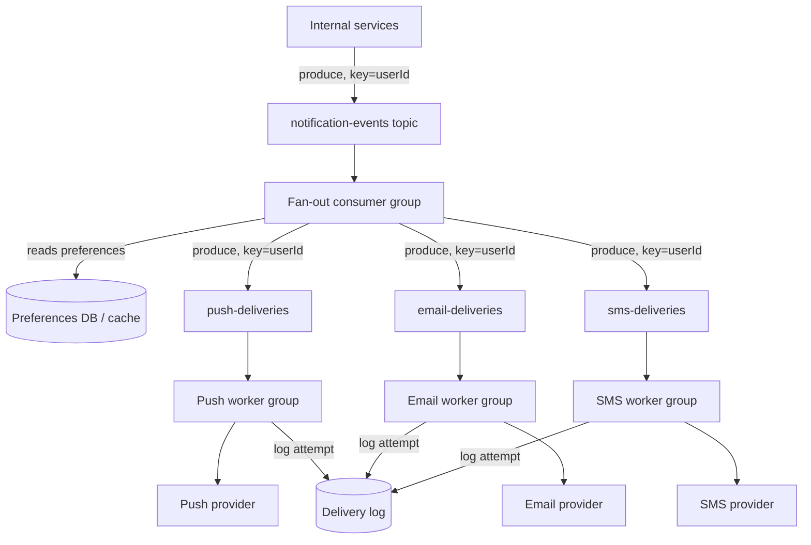

# Design Exercise — Notification System

**45 minutes, timed, full six-phase method.** Per `00-project/learning-roadmap.md` §4 Week 8. Do this yourself before reading the worked notes below.

## Table of Contents

1. [Phase 1 — Clarify](#phase-1--clarify)
2. [Phase 2 — Estimate](#phase-2--estimate)
3. [Phase 3 — API](#phase-3--api)
4. [Phase 4 — Data](#phase-4--data)
5. [Phase 5 — Architecture](#phase-5--architecture)
6. [Phase 6 — Bottlenecks](#phase-6--bottlenecks)
7. [Exit check](#exit-check)

---

## Phase 1 — Clarify

**In scope:** accept a notification event from any internal service (order shipped, password changed, comment reply), fan it out to the channels the user has enabled (push, email, SMS), respect per-user preferences and rate limits. **Out of scope:** the actual push/email/SMS provider integrations (treated as external APIs), rich templating engine. **Core action:** a fan-out and delivery-guarantee problem, not a storage problem — the interesting decisions are about how events flow, not schema design.

## Phase 2 — Estimate

```
Assumption: 20M DAU, average 3 notification-triggering events/user/day
            -> 60M events/day -> ~700 events/s average, ~2,100/s peak (3x)
Assumption: each event fans out to up to 3 channels (push+email+SMS)
            -> up to 6,300 downstream delivery attempts/s peak
Assumption: a viral/breaking-change event (e.g., a mass password-reset
            trigger) can spike a single event TYPE by 50x briefly.

The fan-out multiplier (1 event -> up to 3 deliveries) and the spike
tolerance requirement are the two numbers that should drive partitioning
and consumer-group sizing decisions in Phase 5.
```

## Phase 3 — API

```
POST /notifications/send
  {userId, type, payload, channels?: [push|email|sms]}
  -> 202 Accepted {notificationId}
  (fire-and-forget from the caller's perspective -- the caller does not
  block on actual delivery, which may retry over seconds to minutes)

GET /notifications/{id}/status -> {delivered: [...], failed: [...], pending: [...]}
PUT /users/{id}/notification-preferences {channels enabled per type}
```

## Phase 4 — Data

**User preferences:** relational or key-value, read on every event (high read, low write — cache aggressively). **Delivery log:** append-only, one row per (notificationId, channel) attempt, used for the status endpoint and idempotency checks on retry (§Phase 6). **The event stream itself is not "stored" as a queryable table** — Kafka topics are the transport, not the system of record for delivery state; the delivery log is.

## Phase 5 — Architecture



**Justified against this week's topics:**

- **Partition key = `userId`, throughout every topic in the pipeline** (T-705). Guarantees one user's notifications process in order relative to each other — a "password changed" notification must never be delivered after a later "password change reverted" for the same user, even under retries and rebalances.
- **A per-channel topic downstream of a single fan-out consumer** (T-701/T-703), rather than one worker doing all three deliveries inline, isolates a slow/down channel (e.g., a degraded SMS provider) from the other two — push and email consumer groups keep draining independently, only SMS backs up.
- **Delivery is at-least-once, deliberately** (T-704): each worker commits its offset AFTER a provider call succeeds, not before, so a crash mid-delivery redelivers the notification. Trades an occasional duplicate push (annoying) for never silently dropping one (unacceptable for "your payment failed") — the same commit-after-processing default from `04-delivery-semantics-and-exactly-once.md`.
- **The delivery log doubles as the idempotency boundary** (T-704 §4, T-809): each worker checks `(notificationId, channel)` against the log before calling the provider, so at-least-once redelivery from Kafka doesn't become an actually-duplicate SMS — the dedupe check converts a non-idempotent action into an idempotent one.

## Phase 6 — Bottlenecks

1. **A single hot user isn't the risk here — a single hot event TYPE is.** A mass-triggering event (e.g., a security incident forcing 5M simultaneous password-reset notifications) doesn't concentrate on one partition the way a busy customer would (Phase 2's spike scenario) — it's already spread across all users' keys. The real bottleneck is downstream: the push/email/SMS provider's own rate limits, which worker groups must respect via a token-bucket limiter (T-808) rather than the partitioning scheme.
2. **Preference-DB read load.** Every event triggers a preferences lookup in the fan-out consumer; at 2,100 events/s peak this is a straightforward cache-in-front-of-DB problem, worth naming as the one place a slow dependency directly throttles the pipeline's consumer lag.
3. **Consumer lag as an SLO, not just a metric** (T-707): a growing lag on the SMS topic during a provider outage is expected and should page differently than a growing lag on the fan-out topic itself, which means the whole pipeline is falling behind — alerting has to distinguish "one channel degraded" from "the pipeline degraded."

## Exit check

- [ ] All six phases completed within 45 minutes
- [ ] Partition key choice (`userId`) justified explicitly against a concrete ordering requirement, not asserted
- [ ] At-least-once delivery chosen deliberately, with the idempotency mechanism that makes it safe named explicitly
- [ ] Distinguished the "hot event type" scenario from the "hot partition" scenario from `01-kafka-architecture-fundamentals.md` — they are not the same failure mode
