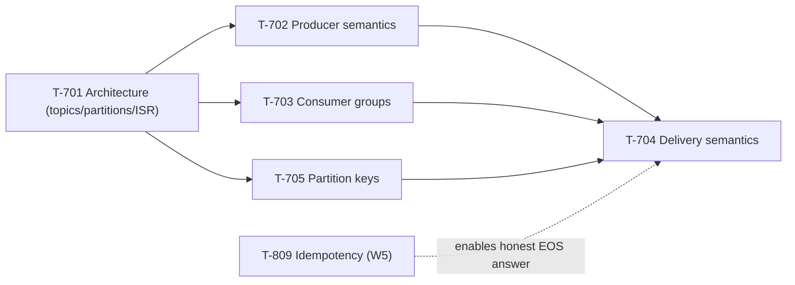

# Week 8 Study Pack — Kafka Semantics

**Plan B, Week 8 — first messaging-systems week.** See `00-project/learning-roadmap.md` §4, Week 8.
**Topics:** T-701 (Architecture) · T-702 (Producer semantics) · T-703 (Consumer groups) · T-704 (Delivery semantics) · T-705 (Partition keys)
**Why now:** T-704 is 13th in the Mandatory Core register and needs Week 5's `T-809` idempotency to explain end-to-end exactly-once honestly — this week is where that dependency actually pays off.

## Table of Contents

1. [Objective](#objective)
2. [Why this week, in this order](#why-this-week-in-this-order)
3. [Dependency graph](#dependency-graph)
4. [Files in this pack](#files-in-this-pack)
5. [Daily schedule](#daily-schedule-10hweek-study--10h-practice)
6. [Exit criteria](#exit-criteria)

---

## Objective

Move Kafka coverage from API vocabulary (what the original knowledge base had: 15 rows averaging ~117 characters) to **semantics under failure** — what each guarantee actually costs, and precisely where it breaks. The four topics beyond T-701 are, per the blueprint, "effectively one competence": what guarantees exist, what they cost, and where they break — this week treats them as one connected cluster rather than four independent chapters.

## Why this week, in this order

T-701 (architecture: topics, partitions, brokers, the ISR) has to come first because everything else in the cluster is stated in terms of it — "ordering" (T-705), "durability" (T-702), and "exactly-once" (T-704) are all specific claims about partition and replica behavior, not free-standing facts. T-703 (consumer groups) depends on T-701's partition model directly (assignment is partition-to-consumer). T-704 (delivery semantics) comes last because it's the synthesis point — the blueprint calls it the highest-IWI topic in the cluster (8.00) precisely because getting it right requires the producer-side (T-702) and consumer-side (T-703) mechanics already in place.

## Dependency graph

## Files in this pack

| # | File | Purpose |
|---|---|---|
| 1 | `README.md` | This file |
| 2 | `01-kafka-architecture-fundamentals.md` | T-701 — full chapter, real partition-routing trace against a live broker |
| 3 | `02-producer-semantics-and-partition-keys.md` | T-702/705 — full chapter, real `acks`/idempotence config + partition-key trace |
| 4 | `03-consumer-groups-and-rebalancing.md` | T-703 — full chapter, real consumer-group rebalance trace |
| 5 | `04-delivery-semantics-and-exactly-once.md` | T-704 — full chapter, real at-least-once/at-most-once traces |
| 6 | `05-java-coding-practice.md` | LC 70, 198, 322, 300 (T-1411 DP part 1), all compiled and run |
| 7 | `06-flashcards.md` | 14 cards |
| 8 | `07-kafka-guarantees-deliverable.md` | `kafka-guarantees.md` template + full worked answers |
| 9 | `08-week-8-mock-interview.md` | 45-min messaging deep-dive |
| 10 | `09-design-exercise-notification-system.md` | Full six-phase design of a notification system |
| 11 | `10-week-8-checklist.md` | Day-by-day checklist |
| 12 | `resources.md` | Sources classified PRIMARY/BOOK/TOOL/SECONDARY |

## Daily schedule (10h/week study + 10h practice)

See `10-week-8-checklist.md` for the day-by-day breakdown. Shape: Monday–Thursday, one chapter + one demo reproduction + one coding problem per day; Friday–Saturday, the `kafka-guarantees.md` deliverable and the design exercise; Sunday, the mock interview.

## Exit criteria

- [ ] Can state precisely what Kafka guarantees about ordering, and why partition count is effectively permanent for a keyed topic
- [ ] Can explain why `acks=all` alone doesn't prevent loss, unprompted, naming `min.insync.replicas`
- [ ] Can diagnose a consumer group rebalancing every 30 seconds from first principles (`max.poll.interval.ms`)
- [ ] Can state exactly what Kafka's exactly-once semantics covers and what it doesn't, and name both fixes for the external-system gap (outbox, idempotent consumer)
- [ ] `kafka-guarantees.md` completed with all ten guarantee rows
- [ ] All 4 DP problems solved with derivations, not memorized recurrences
- [ ] Notification-system design completed in 45 minutes with the partition-key and delivery-semantics decisions explicitly justified
- [ ] 45-min mock interview completed and scored
