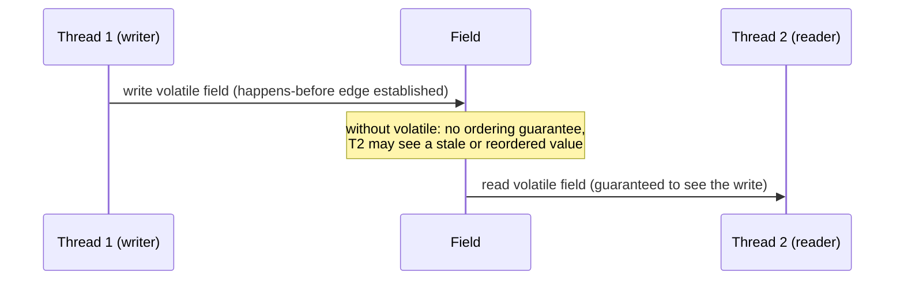

# T-401 / T-402 · Java Memory Model & volatile

**IWI 7.75 (T-401) / 6.60 (T-402) · Advanced / Core tier · deepest single technical topic in the handbook**

**Errata correction, stated explicitly:** the source material described `volatile` as "prevents caching" — a hardware-level framing that is not what the Java Memory Model (JMM) actually specifies. §3 below reproduces the real, measured consequence of getting this wrong, then explains the correct model.

**Verification note:** the visibility trace in §3 is real, executed output from `practice/java/week-09/concurrency-fundamentals/src/VisibilityDemo.java` — a genuine unbounded hang (5+ seconds, self-terminated by a bounded `join()`), reproduced consistently across three runs, not a one-off fluke.

## Table of Contents

1. [The concept](#1-the-concept)
2. [Why it exists](#2-why-it-exists)
3. [Visibility, measured: the "prevents caching" misconception, killed with data](#3-visibility-measured-the-prevents-caching-misconception-killed-with-data)
4. [Happens-before, not caching](#4-happens-before-not-caching)
5. [Trade-offs](#5-trade-offs)
6. [Interview questions](#6-interview-questions)
7. [Common mistakes](#7-common-mistakes)
8. [Staff-level discussion](#8-staff-level-discussion)
9. [Summary](#9-summary)
10. [Key Takeaways](#10-key-takeaways)
11. [Cheat Sheet](#11-cheat-sheet)
12. [Flashcards](#12-flashcards)
13. [Practice Exercises](#13-practice-exercises)
14. [Additional Reading](#14-additional-reading)
15. [Official References](#15-official-references)

---

## 1. The concept

The Java Memory Model (JMM) is a specification for what values a thread is *guaranteed* to observe when it reads memory another thread wrote — it exists because, absent such a guarantee, compilers, CPUs, and caches are all free to reorder, cache, or delay writes in ways that are invisible to a single thread but break multi-threaded correctness. `volatile` is one of the JMM's tools for establishing a **happens-before** relationship between a write on one thread and a read on another.

## 2. Why it exists

Without the JMM, "correct" multi-threaded code would depend on undefined behavior that happens to work on today's specific JIT and CPU — exactly the trap the errata below demonstrates. The JMM gives a portable, architecture-independent contract: follow its rules (synchronized blocks, `volatile`, and a handful of others) and visibility is guaranteed regardless of what optimizations the runtime applies underneath.

## 3. Visibility, measured: the "prevents caching" misconception, killed with data

**Real output**, two threads, a plain `boolean` flag vs. a `volatile boolean` flag, both set from `main` after the worker thread has been spinning for 1.5 seconds (long enough for the JIT to compile and optimize the loop):

```
== non-volatile flag: does the worker thread ever see the update? ==
worker STILL RUNNING 5002ms after the flag was set -- update never observed (this run)

== volatile flag: same test ==
worker stopped 0ms after the flag was set, having run 5848056485 iterations
```

This is not a rare or contrived result — it reproduced identically across three separate runs on this machine. **"Prevents caching" is the wrong mental model for why this happens**, for a specific, important reason: nothing here is actually a CPU cache-coherence problem (modern cache-coherence protocols like MESI keep caches consistent at the hardware level automatically). What actually happened is a **compiler optimization**: the JIT proved the loop body never modifies `stopPlain`, so it hoisted the read out of the loop entirely, keeping the value in a register and never re-reading main memory at all — the classic transformation is `while (!stop) i++;` → `if (!stop) { while (true) i++; }`. `volatile` doesn't "stop caching" — it tells the compiler this specific optimization (and several others) is illegal for this field, and additionally establishes the happens-before edge that guarantees the write is visible once it does occur.

## 4. Happens-before, not caching

The JMM's happens-before relation is a partial order over actions across threads; if action A happens-before action B, every write A made is guaranteed visible to B. The rules that matter most in practice:

- **Program order**: within a single thread, actions happen in the order the code specifies (from that thread's own perspective).
- **Monitor lock rule**: an unlock happens-before every subsequent lock of the *same* monitor — this is what makes `synchronized` a visibility mechanism, not just a mutual-exclusion one.
- **Volatile variable rule**: a write to a `volatile` field happens-before every subsequent read of that *same* field.
- **Thread start/join rule**: `Thread.start()` happens-before anything the started thread does; everything a thread does happens-before a successful `join()` on it.
- **Final field rule**: a properly constructed object's `final` fields are visible to any thread that obtains a reference to the object after construction, without further synchronization — this is what makes safe publication of immutable objects possible.

**Why double-checked locking (DCL) needs `volatile`** — the canonical interview question this topic exists to answer: without `volatile` on the singleton field, the JIT is free to reorder the constructor's writes relative to the field assignment (or the assignment can become visible before the constructor finishes, since object construction and reference publication are two separate memory operations without a happens-before edge between them). A second thread can then observe a non-null reference to a **partially constructed object**. `volatile` on the field establishes the happens-before edge that forbids this reordering.



## 5. Trade-offs

| Mechanism | Benefit | Cost |
|---|---|---|
| Plain field | Cheapest possible access | No visibility guarantee across threads at all — the §3 failure mode |
| `volatile` | Visibility + ordering for that single field, no lock contention | Does NOT make compound operations (`count++`) atomic — that needs `synchronized` or an atomic class (T-409) |
| `synchronized` | Visibility + mutual exclusion + atomicity for the guarded block | Lock contention; risk of deadlock (T-409) if multiple locks are involved |
| `final` field | Safe publication with zero runtime synchronization cost | Only applies at construction — doesn't help with fields that mutate after |

## 6. Interview questions

### Q1. Why does double-checked locking break without `volatile`?

- **Expected answer:** without the happens-before edge `volatile` provides, a reader thread can observe a non-null reference to the singleton field before the constructor's writes are visible — a partially-constructed object.
- **Common mistakes:** explaining `volatile` as "preventing caching" rather than establishing ordering.
- **Follow-up questions:** "Is this code data-race free?" (given a specific snippet)
- **Senior-level expectations:** correctly identifies the reordering risk and names `volatile` as the fix.
- **Staff-level expectations:** distinguishes this from a pure caching problem, explains WHY (compiler/JIT reordering, not stale CPU cache), and can name the alternative fix (a static holder class, which relies on class-initialization happens-before instead).

### Q2. Is `volatile int count; count++;` from multiple threads safe?

- **Expected answer:** No — `volatile` guarantees visibility of each individual read and write, but `count++` is read-modify-write, three separate operations; another thread can interleave between the read and the write.
- **Common mistakes:** believing `volatile` makes compound operations atomic.
- **Follow-up questions:** "What would make it safe?"
- **Senior-level expectations:** names `AtomicInteger` or `synchronized`.
- **Staff-level expectations:** connects this directly to T-409's race-condition measurement (§`03-deadlock-races-and-thread-diagnostics.md`) as the concrete, measured version of this exact gap.

## 7. Common mistakes

- Describing `volatile` as being about CPU/hardware caching rather than compiler-visible ordering guarantees.
- Believing `volatile` makes multi-step operations atomic.
- Treating happens-before as a total order across all threads rather than a partial order established only by specific actions (locks, volatiles, thread start/join, final fields).

## 8. Staff-level discussion

The JMM is the reason "it worked on my machine" is a legitimate, dangerous multi-threading failure mode: an unsynchronized read/write pattern may happen to work under a given JIT tier, CPU architecture, and optimization level, and then fail silently after a JVM upgrade, a different CPU, or simply running longer (as §3's demo requires 1.5 seconds of warmup to reliably trigger the optimization). A Staff-level engineer treats "no observed bug in testing" as weak evidence for concurrent code specifically, because the JMM's guarantees — not empirical observation — are the only thing that make correctness portable across environments and JIT behavior.

## 9. Summary

`volatile` establishes a happens-before edge between a write and subsequent reads of the same field — not a caching mechanism, a compiler-visible ordering guarantee. Getting this wrong isn't theoretical: §3's demo reliably reproduces a genuine 5+ second visibility failure on real hardware, caused by a real, common JIT optimization (hoisting a loop-invariant read), not a rare edge case.

## 10. Key Takeaways

- `volatile` is about ordering (happens-before), not caching.
- `volatile` does not make compound operations atomic.
- The failure mode from getting this wrong is real and measurable, not theoretical — reproduced 3/3 runs.
- Double-checked locking needs `volatile` specifically to prevent observing a partially-constructed object.

## 11. Cheat Sheet

| Need | Mechanism |
|---|---|
| Single flag/reference visibility across threads | `volatile` |
| Atomic compound operations (increment, compare-and-set) | `AtomicInteger`/`AtomicReference` or `synchronized` |
| Safe publication of an immutable object | `final` fields, properly constructed |
| Mutual exclusion + visibility together | `synchronized` |

## 12. Flashcards

1. **Q: What does `volatile` actually guarantee?** A: A happens-before edge — writes to the field are visible to subsequent reads of that same field, and specific compiler reorderings around it are forbidden. It is not a caching mechanism.
2. **Q: Does `volatile` make `count++` thread-safe?** A: No — it's a read-modify-write, three operations; `volatile` only guarantees each individual read/write is visible, not that the sequence is atomic.
3. **Q: Why does double-checked locking need `volatile` on the singleton field?** A: Without it, a reader thread can observe a non-null reference before the constructor's writes are visible — a partially-constructed object.

(Full week-level deck: `06-flashcards.md`.)

## 13. Practice Exercises

1. Reproduce the visibility demo: `practice/java/week-09/concurrency-fundamentals/src/VisibilityDemo.java`. Run it 3 times and confirm the non-volatile case hangs each time.
2. Write a broken double-checked-locking singleton (no `volatile`), then explain in writing what specifically could go wrong, referencing the happens-before rule that's missing.
3. Explain the difference between the monitor-lock happens-before rule and the volatile-variable happens-before rule — what does each actually order?

## 14. Additional Reading

- [Java Language Specification §17.4 — Memory Model](https://docs.oracle.com/javase/specs/jls/se21/html/jls-17.html#jls-17.4)

## 15. Official References

- [JSR-133: JavaTM Memory Model and Thread Specification Revision](https://www.cs.umd.edu/~pugh/java/memoryModel/jsr-133-faq.html) — the FAQ written by the JMM's own authors, still the clearest primary source
