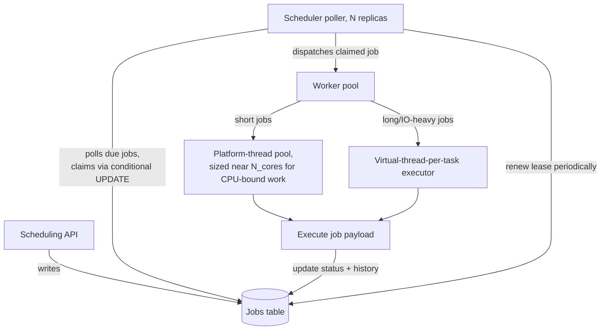

# Design Exercise — Distributed Job Scheduler

**45 minutes, timed, full six-phase method.** Per `00-project/learning-roadmap.md` §4 Week 9. Do this yourself before reading the worked notes below.

## Table of Contents

1. [Phase 1 — Clarify](#phase-1--clarify)
2. [Phase 2 — Estimate](#phase-2--estimate)
3. [Phase 3 — API](#phase-3--api)
4. [Phase 4 — Data](#phase-4--data)
5. [Phase 5 — Architecture](#phase-5--architecture)
6. [Phase 6 — Bottlenecks](#phase-6--bottlenecks)
7. [Exit check](#exit-check)

---

## Phase 1 — Clarify

**In scope:** schedule one-off and recurring (cron-style) jobs, guarantee each runs at-least-once at or after its scheduled time, support cancellation and retries with backoff. **Out of scope:** the job payloads' actual business logic (opaque work units), a UI. **Core action:** distinguishing this from Week 8's notification-system design — that system reacted to events as they arrived; this system must itself decide *when* work becomes due, so a component has to continuously ask "what's due now?" rather than react to an inbound stream.

## Phase 2 — Estimate

```
Assumption: 5M scheduled jobs/day, average ~58 jobs/s, peak (4x) ~230/s
Assumption: 10% of jobs are recurring (cron-style), re-enqueuing themselves
            after each run -- the recurring set is a small, mostly-static
            working set (~50K distinct schedules) that must be re-evaluated
            continuously, separate from the one-off job volume above
Assumption: job execution time varies widely: p50 ~200ms, p99 ~30s -- this
            spread is the number that should drive worker-pool design
            (Week 9's T-406/T-410 material directly): a pool sized for the
            p50 case starves under the p99 tail unless something isolates
            long-running jobs from short ones.
```

## Phase 3 — API

```
POST /jobs                  {runAt | cronExpr, payload, maxRetries?} -> {jobId}
DELETE /jobs/{jobId}        -> 204 (cancel, if not yet started)
GET /jobs/{jobId}           -> {status: scheduled|running|succeeded|failed|cancelled}
(workers do NOT expose an API -- they pull work from the scheduling
store/queue described in Phase 5, they are not called directly)
```

## Phase 4 — Data

**Job definitions:** relational, one row per job — `id`, `runAt`, `cronExpr` (nullable), `status`, `payload`, `attemptCount`, `maxRetries`, `lockedBy`, `lockedUntil`. **The `lockedBy`/`lockedUntil` pair prevents two scheduler instances from picking up the same due job** — a worker claims via a conditional update (`UPDATE jobs SET lockedBy=?, lockedUntil=now()+leaseSeconds WHERE id=? AND (lockedUntil IS NULL OR lockedUntil < now())`), the same optimistic-claim pattern as a distributed lock lease, deliberately avoiding a true distributed lock service as unnecessary complexity here. **Execution history:** append-only, one row per attempt — makes retry/backoff decisions auditable and is the idempotency boundary (Week 5's `T-809`, same role as in Week 8's notification design) if a job's execution needs to be safe against being picked up twice during a lease-expiry race.

## Phase 5 — Architecture



**Justified against this week's topics:**

- **Two separate execution pools, not one** (T-406/T-410): the p50-vs-p99 spread from Phase 2 is exactly the CPU-bound-vs-IO-bound sizing distinction from `02-executors-and-thread-pool-sizing.md` — short (CPU-bound) jobs get a platform pool sized near `N_cores`; long-running (IO-bound) jobs get a virtual-thread-per-task executor, so slow jobs can't starve the short-job pool the way one shared, undersized pool would (§`02` §3's unbounded-queue trap: a single shared pool with an unbounded queue lets p99 jobs pile up behind short ones with no visibility).
- **Lease-based claiming, not a distributed lock** (T-409): a true distributed lock (e.g., Zookeeper/etcd) solves a more general problem than needed and introduces its own failure mode — a lock holder crashing while holding it. The lease pattern (claim with expiry, periodically renewed) self-heals: a crashed poller's claimed jobs become claimable again once the lease expires, no failure detection or explicit unlock needed. Same "avoid the general mechanism when a narrower one avoids its failure mode" judgment as choosing `AtomicInteger` over `synchronized` for a single counter (§`03` §6 Q2).
- **Multiple poller replicas via conditional-update claim, not leader election**: avoids a single point of failure without leader-election's own complexity — every replica independently polls and races to claim due jobs; the database's atomic conditional update (not application-level locking) prevents double-claiming, sidestepping the deadlock-risk category from `03-deadlock-races-and-thread-diagnostics.md` entirely (no multi-lock acquisition to order incorrectly).

## Phase 6 — Bottlenecks

1. **The Jobs table's due-job query becomes a hot, contended row range as poller replicas scale.** Every poller runs roughly the same `SELECT ... WHERE runAt <= now() AND lockedUntil < now()` query; at high replica counts this becomes read-contention and wasted conditional-update conflicts. Mitigation: partition the due-job query space by `id % pollerCount` or similar, so pollers aren't all racing for the identical row set.
2. **Lease expiry is a genuine trade-off, not a free parameter.** Too short: a slow-but-healthy worker's lease expires mid-execution, another poller reclaims and re-executes concurrently — exactly the idempotency requirement from Phase 4. Too long: a genuinely crashed worker's job sits unclaimed for the full duration before retry, hurting the p99 tail. Set from Phase 2's p99 execution time, with periodic renewal for legitimately long jobs, not intuition.
3. **The recurring-job re-enqueue step, if it fails silently, stops an entire cron schedule from ever running again** — a different failure mode than a single job failing (which retries per Phase 4's history), since a failed re-enqueue has no natural retry trigger of its own. Mitigation: its own monitoring (last-successful-reschedule timestamp per cron job, alerting if it falls behind cadence), separate from individual job-execution monitoring.

## Exit check

- [ ] All six phases completed within 45 minutes
- [ ] The p50/p99 execution-time spread named explicitly in Phase 2 and traced through to the two-pool architecture decision in Phase 5
- [ ] Lease-based claiming chosen deliberately over a distributed lock, with the specific failure mode it avoids (crashed lock holder) stated
- [ ] Practiced the mid-round-change response from `08-week-9-checkpoint.md` Round 3: given "jobs now need exactly-once execution," revise Phase 4's idempotency boundary rather than bolting on a patch
