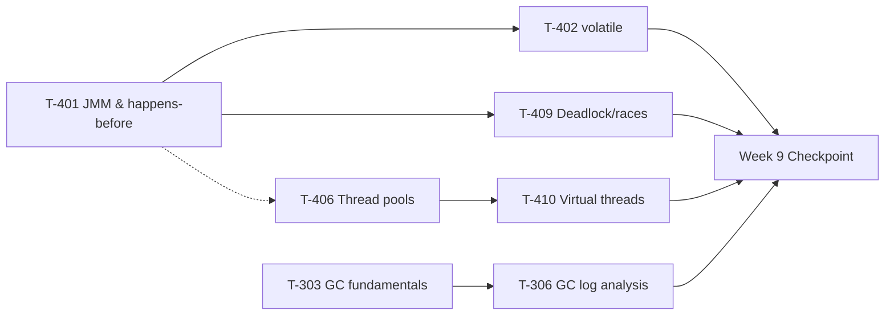

# Week 9 Study Pack — Concurrency + JVM · Checkpoint

**Plan B, Week 9 — the first checkpoint since Week 6.** See `00-project/learning-roadmap.md` §4, Week 9.
**Topics:** T-401 (JMM) · T-402 (volatile ⛔ errata) · T-406 (Thread pools) · T-409 (Deadlock/races ⛔ errata) · T-410 (Virtual threads) · T-303/T-306 (GC + tuning)
**Why now:** two ⛔ errata topics this week — material the source workspace had memorized wrong (`volatile` as "prevents caching"; a thread-lifecycle diagram missing `TIMED_WAITING`). T-401 is the deepest single technical topic in the whole handbook (S=8) and needs the study rhythm established over the previous eight weeks. Virtual threads are now standard in 2026-era Senior Java loops.

## Table of Contents

1. [Objective](#objective)
2. [Why this week, in this order](#why-this-week-in-this-order)
3. [Dependency graph](#dependency-graph)
4. [Files in this pack](#files-in-this-pack)
5. [Daily schedule](#daily-schedule-12hweek-study--8h-practice)
6. [Exit criteria](#exit-criteria)

---

## Objective

Correct two verified-wrong pieces of memorized material (the errata above) while building the deepest technical topic in the register (JMM/happens-before) and adding the two concurrency/JVM skills the blueprint calls genuinely demonstrable rather than recitable: reading a GC log, and reasoning about virtual-thread pinning. Also the first full checkpoint since Week 6 — the exit gate spans the entire W1–W9 register, not just this week's material.

## Why this week, in this order

The JMM (T-401) comes first because `volatile` (T-402), the deadlock/thread-diagnostics chapter (T-409), and even the virtual-threads pinning discussion (T-410) are all specific claims about happens-before and visibility — none independently comprehensible without it. Thread pool sizing (T-406) comes next because virtual threads (T-410) are best understood as the answer to the specific IO-bound sizing problem T-406 exposes. GC (T-303/T-306) is deliberately last and semi-independent — it shares the "JVM" domain but not a direct dependency chain with the concurrency topics, and closes the week with the "diagnose from an artifact" skill the checkpoint itself tests.

## Dependency graph

## Files in this pack

| # | File | Purpose |
|---|---|---|
| 1 | `README.md` | This file |
| 2 | `01-java-memory-model-and-volatile.md` | T-401/402 — summary + link; full chapter now canonical at `syllabus/02-java/concurrency/java-memory-model-and-volatile.md` |
| 3 | `02-executors-and-thread-pool-sizing.md` | T-406 — summary + link; full chapter now canonical at `syllabus/02-java/concurrency/executors-and-thread-pool-sizing.md` |
| 4 | `03-deadlock-races-and-thread-diagnostics.md` | T-409 — summary + link; full chapter now canonical at `syllabus/02-java/concurrency/deadlock-race-conditions-and-thread-diagnostics.md` |
| 5 | `04-virtual-threads.md` | T-410 — summary + link; full chapter now canonical at `syllabus/02-java/concurrency/virtual-threads.md` |
| 6 | `05-gc-fundamentals-and-log-analysis.md` | T-303/306 — summary + link; full chapter now canonical at `syllabus/02-java/jvm-internals/gc-fundamentals-and-log-analysis.md` |
| 7 | `06-java-coding-practice.md` | LC 1114/1115/1116 (concurrency) + LC 62/1143/416/5 (DP part 2), all compiled and run |
| 8 | `07-flashcards.md` | 16 cards |
| 9 | `08-week-9-checkpoint.md` | Full 3-round loop + the roadmap's own checkpoint scorecard |
| 10 | `09-design-exercise-distributed-job-scheduler.md` | Summary + link; full design now canonical at `architecture-atlas/distributed-job-scheduler.md` |
| 11 | `10-week-9-checklist.md` | Day-by-day checklist |
| 12 | `resources.md` | Sources classified PRIMARY/BOOK/TOOL/SECONDARY |

## Daily schedule (12h/week study + 8h practice)

See `10-week-9-checklist.md` for the day-by-day breakdown. Shape: Monday–Friday, one chapter + one demo reproduction + coding practice per day; Saturday, the design exercise; Sunday, the full 3-round checkpoint loop with scorecard.

## Exit criteria

- [ ] Can explain `volatile` via happens-before, not caching, unprompted — the checkpoint's own named Java-fluency pass bar
- [ ] Can state all six real `Thread.State` values and diagnose a live deadlock via `ThreadMXBean`
- [ ] Can explain what changes for IO-bound workloads under virtual threads AND name pinning as the regression case, unprompted
- [ ] Can read a real GC log and extract pause type, before/after occupancy, and trend — not recite collector algorithm names
- [ ] All 7 coding problems solved with derivations, not memorized patterns
- [ ] Distributed-job-scheduler design completed in 45 minutes with the pool-sizing and lease-vs-lock decisions explicitly justified
- [ ] Full 3-round checkpoint completed, scorecard filled in honestly (partial passes are useful signal, not failure)
