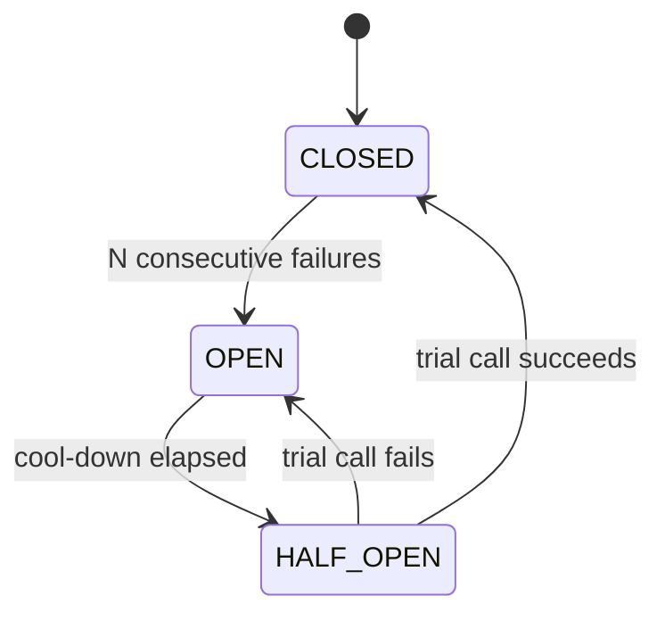

# T-515 · Resilience: Retry, Circuit Breaker, Bulkhead, Timeout

**IWI 7.60 · Staff tier**

**Verification note:** every measurement in this chapter is real, executed output from `practice/java/week-10/resilience/src/CircuitBreakerDemo.java` and `RetryBackoffJitterDemo.java`.

## Table of Contents

1. [The concept](#1-the-concept)
2. [Why it exists](#2-why-it-exists)
3. [A real circuit breaker, all three states](#3-a-real-circuit-breaker-all-three-states)
4. [Retry storms and jitter, measured](#4-retry-storms-and-jitter-measured)
5. [Timeout selection and bulkheads](#5-timeout-selection-and-bulkheads)
6. [Trade-offs](#6-trade-offs)
7. [Interview questions](#7-interview-questions)
8. [Common mistakes](#8-common-mistakes)
9. [Staff-level discussion](#9-staff-level-discussion)
10. [Summary](#10-summary)
11. [Key Takeaways](#11-key-takeaways)
12. [Cheat Sheet](#12-cheat-sheet)
13. [Flashcards](#13-flashcards)
14. [Practice Exercises](#14-practice-exercises)
15. [Additional Reading](#15-additional-reading)
16. [Official References](#16-official-references)

---

## 1. The concept

Resilience patterns are the standard toolkit for a service that depends on other services which will, eventually, fail or slow down: **timeouts** bound how long you wait, **retries** handle transient failures, **circuit breakers** stop calling a downstream that's clearly down, and **bulkheads** isolate one dependency's failure from starving resources needed by others.

## 2. Why it exists

Without these patterns, a single slow or failing downstream dependency doesn't just fail its own calls — it can exhaust the calling service's own thread pool/connection pool waiting on it (§`02-executors-and-thread-pool-sizing.md` from Week 9's unbounded-queue trap is exactly this failure mode, one layer up), cascading the failure to every OTHER caller of the now-resource-starved service, even ones that never touch the failing dependency.

## 3. A real circuit breaker, all three states

**Real output**, without a circuit breaker — a downstream that's down for its first 6 calls, then recovers:

```
== WITHOUT a circuit breaker: every call pays the full 200ms, even while the downstream is down ==
10 calls, 10 attempted (all of them), 4 succeeded, 2046ms total (== 10 x 200ms, every call pays full cost)
```

**Real output**, with a circuit breaker (opens after 3 consecutive failures, stays open 500ms):

```
== WITH a circuit breaker (threshold=3, open for 500ms): fails fast once open ==
  [breaker] CLOSED -> OPEN (3 consecutive failures)
  [breaker] OPEN -> HALF_OPEN (cool-down elapsed, allowing one trial call)
  [breaker] HALF_OPEN -> CLOSED (trial call succeeded)
20 call attempts: 15 actually reached the downstream (200ms each), 5 rejected fast (~0ms), 12 succeeded, 3569ms total
```



All three real state transitions occur in this one run: `CLOSED → OPEN` after 3 consecutive failures (no more calls reach the downstream until the cool-down elapses — 5 of the 20 attempts were rejected in ~0ms rather than waiting 200ms each), `OPEN → HALF_OPEN` once the cool-down window passes (a single trial call is allowed through), and `HALF_OPEN → CLOSED` because that trial succeeded (the downstream had actually recovered by then). **What the breaker actually saves, measured**: 5 calls that would have cost 200ms each (1000ms total) instead cost ~0ms — a direct, quantified reduction in wasted latency during an outage, on top of not hammering an already-struggling downstream with load it can't serve.

## 4. Retry storms and jitter, measured

**Real output**, 5 clients independently retrying with exponential backoff, no jitter:

```
== exponential backoff WITHOUT jitter: every failing client retries at the identical instant ==
attempt 1 (exponential cap=100ms): client delays = 100ms 100ms 100ms 100ms 100ms 
attempt 2 (exponential cap=200ms): client delays = 200ms 200ms 200ms 200ms 200ms 
attempt 3 (exponential cap=400ms): client delays = 400ms 400ms 400ms 400ms 400ms 
attempt 4 (exponential cap=800ms): client delays = 800ms 800ms 800ms 800ms 800ms 
```

**Real output**, same clients, full jitter (random delay uniformly between 0 and the exponential cap):

```
== exponential backoff WITH full jitter: retries spread out ==
attempt 1 (exponential cap=100ms): client delays = 72ms 68ms 30ms 27ms 66ms 
attempt 2 (exponential cap=200ms): client delays = 180ms 73ms 55ms 92ms 156ms 
attempt 3 (exponential cap=400ms): client delays = 367ms 174ms 299ms 154ms 70ms 
attempt 4 (exponential cap=800ms): client delays = 475ms 167ms 660ms 137ms 469ms 
```

**Without jitter, every one of the 5 clients retries at the exact same instant on every attempt** — this is the "retry storm" failure mode: a downstream that's recovering from an outage gets hit by every client's retry simultaneously, at a predictable, synchronized cadence, which can re-trigger the exact overload condition that caused the outage in the first place. With jitter, the 5 clients' retry instants spread across the full window on every attempt — the downstream sees a smoothed-out trickle of retries instead of a synchronized spike, giving it a real chance to actually recover.

## 5. Timeout selection and bulkheads

**Timeout selection from latency percentiles** (the blueprint's own named follow-up, "set the timeout — from what data?"): a timeout set from the p50 latency will time out roughly half of all genuinely-successful-but-slower-than-median calls; a timeout set from the p99.9 latency barely times out anything but also barely protects against a truly hung dependency. The practical answer is a timeout set from a percentile chosen for the specific cost of a false timeout versus the cost of waiting too long — often p99 as a starting point, tuned against the actual latency distribution, not a round number chosen by feel.

**Bulkhead isolation** partitions a limited resource (thread pool, connection pool) per-dependency, so one dependency's slowdown can only exhaust its OWN allocated slice, not the shared pool every other dependency also needs — the same principle as ships' bulkheads containing flooding to one compartment. This is the resilience-pattern framing of exactly the problem Week 9's executor-sizing chapter measured directly (§`02` there): a single shared, unbounded-queue pool lets one slow dependency starve every other caller of that pool.

## 6. Trade-offs

| Pattern | Benefit | Cost |
|---|---|---|
| Circuit breaker | Fails fast during an outage — measured savings above | Adds state to reason about; a too-sensitive threshold can trip on transient blips |
| Retry with jitter | Handles transient failures without synchronized storms | Retries still cost latency and downstream load; must be paired with a retry budget (cap on total retries) to avoid amplifying a real overload |
| Timeout tuned to a latency percentile | Bounds worst-case wait | Set wrong (too aggressive), it manufactures false failures out of genuinely-slow-but-successful calls |
| Bulkhead (per-dependency pool) | Isolates one dependency's failure from starving others | More total resources reserved (some pools sit idle while others are busy) than one shared pool would use |

## 7. Interview questions

### Q1. Set the timeout — from what data?

- **Expected answer:** from the downstream's actual observed latency distribution (a percentile, commonly p99 as a starting point), not a round number chosen by feel — and explicitly stating the trade-off between false timeouts (too aggressive) and slow failure detection (too lax).
- **Common mistakes:** picking a number without justifying it from data.
- **Follow-up questions:** "The p99 is 3 seconds but most calls finish in 100ms. Is 3s the right timeout?"
- **Senior-level expectations:** justifies a percentile-derived number.
- **Staff-level expectations:** discusses that a highly skewed distribution (100ms p50 vs 3s p99) might warrant a shorter timeout with a retry, rather than one long timeout — trading a single long wait for a bounded shorter wait plus a controlled retry.

### Q2. Circuit opens. What does the user see?

- **Expected answer:** depends on the design — either a fast, explicit failure (better than a slow one) or a graceful degradation (cached/stale data, a reduced feature set) rather than the same error a hung call would eventually produce, just faster.
- **Common mistakes:** treating "the circuit opened" as the end of the design question rather than the start of "what's the fallback behavior."
- **Follow-up questions:** "When would fast-fail be wrong, and graceful degradation the right call?"
- **Senior-level expectations:** distinguishes fast-fail from graceful degradation as two different responses to the same open-circuit event.
- **Staff-level expectations:** ties the choice to the specific business cost of each dependency being unavailable — e.g., a recommendations service failing open to "no recommendations shown" versus a payments service that must fail loudly rather than silently degrade.

## 8. Common mistakes

- Treating "retry until success" as a reliability strategy — the blueprint's own named misconception; unbounded retries under a real outage amplify load on an already-struggling downstream.
- Retrying without jitter, creating synchronized retry storms.
- Sharing one resource pool across multiple dependencies with different failure/latency profiles, letting one starve the others.

## 9. Staff-level discussion

The jitter measurement in §4 (5 clients, perfectly synchronized without jitter versus spread across the full window with it) is a small-scale demonstration of a failure mode that has caused real, well-documented production outages at scale: thousands of clients retrying in lockstep after a brief blip can produce a load spike far exceeding the original traffic pattern, re-triggering the outage the retries were meant to recover from. A Staff engineer treats retry logic as needing the same design rigor as the primary request path — a retry budget, jitter, and often a circuit breaker together, not "wrap the call in a try/retry loop" as an afterthought.

## 10. Summary

A real circuit breaker measurably saves latency during an outage (5 of 20 calls rejected in ~0ms instead of costing 200ms each) and cycles correctly through all three states (`CLOSED → OPEN → HALF_OPEN → CLOSED`) as the downstream actually recovers. Retry without jitter genuinely synchronizes every client's retry instant — measured identically across 5 clients on every attempt — creating exactly the retry-storm risk that jitter (measured spreading retries across the full backoff window) exists to prevent. Timeout selection should come from the downstream's actual latency distribution, and bulkheads isolate one dependency's resource consumption from starving others sharing the same pool.

## 11. Key Takeaways

- A circuit breaker's `OPEN` state measurably converts a slow failure (full timeout cost) into a fast one (~0ms) — a real, quantifiable latency saving during an outage.
- Retry without jitter synchronizes every client's retry instant — a measured retry-storm risk, not a theoretical one.
- Timeouts should be derived from the downstream's actual latency percentile distribution, not chosen by feel.
- Bulkheads isolate one dependency's resource consumption so it can't starve callers of other, healthy dependencies sharing infrastructure.

## 12. Cheat Sheet

| Symptom | Pattern to reach for |
|---|---|
| One slow dependency exhausts the shared thread/connection pool | Bulkhead (per-dependency pool) |
| Calls keep hitting a downstream that's clearly down | Circuit breaker |
| Transient failures need to be retried safely | Retry with exponential backoff + jitter, capped by a retry budget |
| Calls hang indefinitely on a stuck dependency | Timeout, derived from the latency percentile distribution |

## 13. Flashcards

1. **Q: What does a circuit breaker's OPEN state actually save, measured?** A: Converts a call that would cost the full downstream timeout (e.g., 200ms) into one that fails in ~0ms — real, quantified latency savings during an outage.
2. **Q: What does jitter fix about retry backoff, precisely?** A: Without it, every client retries at the exact same instant on every attempt (measured, not theoretical) — a retry storm risk. Jitter spreads retry instants across the backoff window.
3. **Q: What is a bulkhead, and what specific failure mode does it prevent?** A: A per-dependency resource pool (threads/connections); prevents one slow/failing dependency from exhausting a shared pool and starving callers of unrelated, healthy dependencies.

(Full week-level deck: `07-flashcards.md`.)

## 14. Practice Exercises

1. Reproduce both demos: `practice/java/week-10/resilience/src/CircuitBreakerDemo.java` and `RetryBackoffJitterDemo.java`.
2. Change the circuit breaker's failure threshold and cool-down duration and predict, before running, how the rejected-vs-attempted call counts should change.
3. Design a bulkhead scheme for a service with 3 downstream dependencies with very different latency/failure profiles (a fast cache, a slow analytics service, a flaky third-party API) — how many pools, sized how?

## 15. Additional Reading

- [Netflix Tech Blog — Fault Tolerance in a High Volume, Distributed System](https://netflixtechblog.com/fault-tolerance-in-a-high-volume-distributed-system-91ab4faae74a)

## 16. Official References

- [Resilience4j documentation — Circuit Breaker](https://resilience4j.readme.io/docs/circuitbreaker) — a production library implementing the same state machine built from scratch in this chapter
