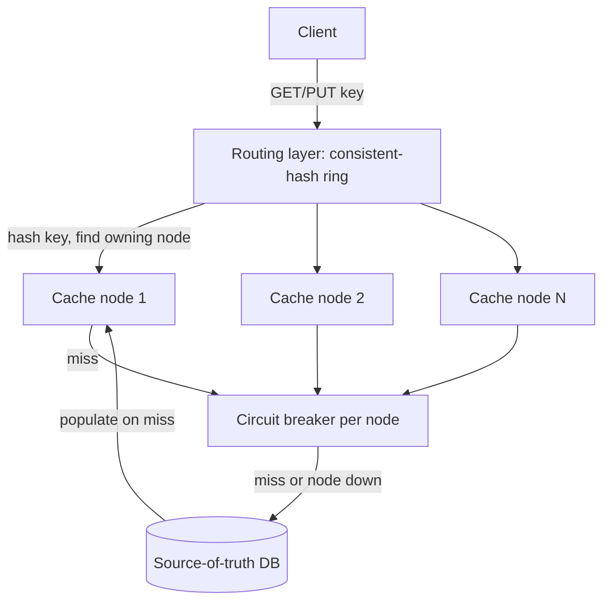

# Design Exercise — Distributed Cache

**45-60 minutes, timed, full six-phase method.** Per `00-project/learning-roadmap.md` §4 Week 10. Do this yourself before reading the worked notes below.

## Table of Contents

1. [Phase 1 — Clarify](#phase-1--clarify)
2. [Phase 2 — Estimate](#phase-2--estimate)
3. [Phase 3 — API](#phase-3--api)
4. [Phase 4 — Data](#phase-4--data)
5. [Phase 5 — Architecture](#phase-5--architecture)
6. [Phase 6 — Bottlenecks](#phase-6--bottlenecks)
7. [Exit check](#exit-check)

---

## Phase 1 — Clarify

**In scope:** a key-value cache sharded across multiple nodes, sitting in front of a slower source-of-truth database, with a defined eviction policy and defined behavior on cache-node failure. **Out of scope:** the cache's own persistence/durability (pure cache — losing a node's data is acceptable, since the database remains the source of truth), building the underlying database itself. **Core action:** the same tension named explicitly in this week's resilience chapter — what happens to traffic that WOULD have hit a now-unavailable cache node: fall through to the database (safe, but a latency/load spike) or serve stale/nothing (fast, but wrong data or a miss storm)?

## Phase 2 — Estimate

```
Assumption: 500K reads/s peak, 95% cache hit rate at steady state
            -> cache serves ~475K reads/s, database serves ~25K reads/s
            (the 20x ratio is the number that makes a cache worth building
            at all -- state it explicitly, it's the design's justification)
Assumption: 10 cache nodes, each holding roughly an even 1/10 share via
            consistent hashing (T-806) -- so each node serves ~47.5K reads/s
Assumption: a single node failure removes ~1/10 of cache capacity
            instantly; per T-806's measured 9.2% redistribution number,
            most of that traffic should land on a NEW correct node
            (not degrade to a full database hit) once the ring rebalances
            -- but rebalancing isn't instant, so there's a real window
            where ~10% of keys briefly miss.
```

## Phase 3 — API

```
GET /cache/{key}      -> {value, found: bool} (client-facing; internally
                          routes to the correct shard via consistent hashing)
PUT /cache/{key}       {value, ttlSeconds?} -> 204
DELETE /cache/{key}    -> 204
(no cross-key operations exposed -- multi-get is a client-side concern,
 issuing N single-key requests routed independently, since keys can land
 on different shards)
```

## Phase 4 — Data

**In-memory, per node**: a hash map with an eviction policy (LRU by default — evict the least-recently-used entry when memory budget is exceeded) and a per-entry TTL. **No persistence** — a node restart or failure means that node's data is gone, acceptable per Phase 1's scope (the database is the source of truth; a cold node just means a temporary spike of cache misses for the keys it owned, not data loss). **The routing layer's own state**: which physical node owns which portion of the consistent-hash ring — must be consistently known by every client (or a shared routing tier), because two clients disagreeing about ring ownership would send the same key to different nodes, silently defeating the cache.

## Phase 5 — Architecture



**Justified against this week's topics:**

- **Consistent hashing with virtual nodes for key routing** (T-806): directly reuses `03-consistent-hashing.md`'s measured result — adding or removing a cache node remaps only ~10% of keys (10-node ring) rather than ~92.5% under naive `hash % N`, the difference between "a node failure causes a brief, bounded miss-rate blip" and "a node failure invalidates almost the entire cache at once," a self-inflicted load spike onto the database exactly when the system is already degraded.
- **A circuit breaker per cache node, not a shared one** (T-515, bulkhead principle): if one physical node goes down, calls to IT should fail fast and fall through to the database — calls to every OTHER healthy node must be unaffected. A single shared breaker would incorrectly treat one node's failure as a signal to stop trying ALL of them — the shared-pool-starvation failure mode from `04-resilience-patterns.md` §5's bulkhead discussion, one level up from thread pools to cache-node connections.
- **Fall-through-to-database on a cache miss OR a downed node, not stale-serve-or-fail**: given Phase 1's "cache durability doesn't matter, DB is source of truth," always falling through to correct, current data is strictly safer than failing the request or serving unboundedly stale data — the cost is the latency/load spike Phase 6 names, which is why the circuit breaker (fail fast toward the DB rather than waiting out a dead node's timeout) matters here.

## Phase 6 — Bottlenecks

1. **The "thundering herd" on cache-node failure, quantified from Phase 2.** A node holding ~47.5K reads/s going down means ~47.5K reads/s suddenly falling through to the database (until the ring rebalances and some of that traffic finds a new correct cache node) — Phase 2's numbers show a real, sudden ~2x load increase on the database (25K → up to 72.5K/s) if it was already near its previous 25K/s steady-state capacity. Mitigation: size the database's headroom explicitly for at least one full node's worth of fallback traffic, not just steady-state load.
2. **Hot keys defeat sharding regardless of hash quality** (same distinction as `03-consistent-hashing.md` §6 Q2 — consistent hashing solves rebalancing cost, not hot-key distribution). A single viral key can saturate one physical node's capacity even with perfectly even ring distribution overall. Mitigation: detect hot keys (per-key request-rate monitoring) and replicate JUST that key across multiple nodes (client picks one at random), rather than fixing it via the general sharding scheme.
3. **Cache stampede on a popular key's simultaneous expiry**: many concurrent requests for the same just-expired key all miss at once and hit the database simultaneously — a distinct failure mode from 6.1 (many DIFFERENT keys falling through due to node failure) and 6.2 (one key overloading one node while cached). Mitigation: a short-lived per-key "recompute lock" (only one request per key queries the database on a miss; others wait briefly for that result) — the identical retry-storm problem from `04-resilience-patterns.md`, triggered by key expiry instead of a downstream failure.

## Exit check

- [ ] All six phases completed within 45-60 minutes
- [ ] Consistent hashing's measured redistribution number (not just its name) used to justify the node-failure blast-radius claim in Phase 6.1
- [ ] Per-node (not shared) circuit breakers justified explicitly against the bulkhead principle from `04-resilience-patterns.md`
- [ ] All three Phase 6 bottlenecks correctly distinguished as different failure shapes (node failure vs hot key vs stampede), not conflated into one generic "cache can get overloaded" statement
