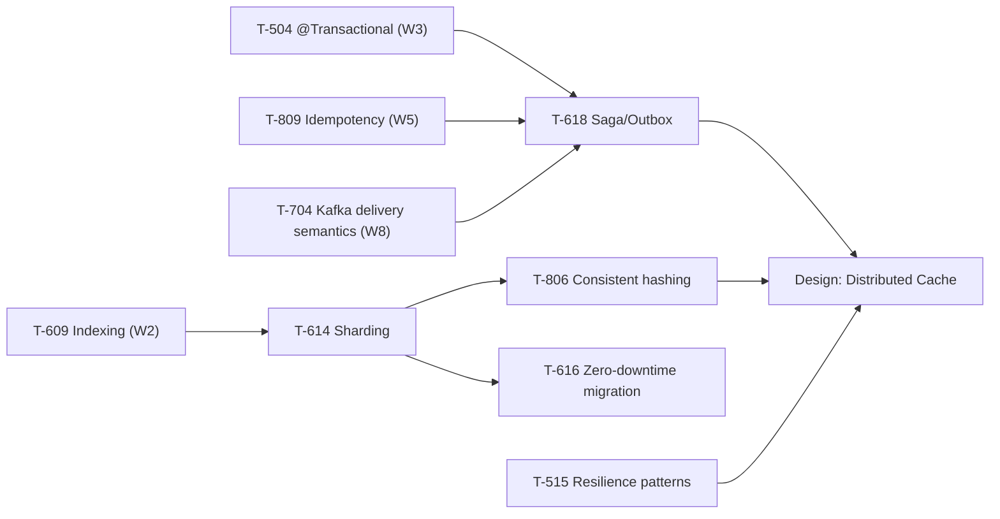

# Week 10 Study Pack — Distributed Data + Resilience

**Plan B, Week 10.** See `00-project/learning-roadmap.md` §4, Week 10.
**Topics:** T-618 (Saga/Outbox) · T-614 (Sharding) · T-806 (Consistent hashing) · T-515 (Resilience patterns) · T-616 (Zero-downtime migration)
**Why now:** T-618 is explicitly the convergence point of three earlier threads — Week 3's transaction semantics, Week 5's idempotency, and Week 8's Kafka delivery semantics (which named "an outbox or an idempotent consumer" as the fix for exactly the gap this week closes with real, running code).

## Table of Contents

1. [Objective](#objective)
2. [Why this week, in this order](#why-this-week-in-this-order)
3. [Dependency graph](#dependency-graph)
4. [Files in this pack](#files-in-this-pack)
5. [Daily schedule](#daily-schedule-10hweek-study--10h-practice)
6. [Exit criteria](#exit-criteria)

---

## Objective

Build a genuinely working transactional outbox (this week's named deliverable) rather than describing the pattern, and connect four supporting Staff-tier topics — sharding, consistent hashing, resilience patterns, zero-downtime migration — that all share one underlying discipline: reasoning precisely about what breaks, and by how much, when a distributed system's topology changes or a dependency fails, backed by real measured numbers rather than qualitative descriptions.

## Why this week, in this order

T-618 (Saga/Outbox) comes first because it's the week's centerpiece deliverable and because it directly closes a gap two earlier weeks explicitly left open. Sharding (T-614) and consistent hashing (T-806) are grouped next as one data-distribution thread — the same underlying question (how does data map to nodes, and what happens when node count changes) at two different layers, a database's own partitions and a general hashing scheme. Resilience patterns (T-515) and zero-downtime migration (T-616) close the week as two different flavors of "how do you keep serving correctly while something around you is failing or changing" — one for a downstream dependency, one for your own schema.

## Dependency graph

## Files in this pack

| # | File | Purpose |
|---|---|---|
| 1 | `README.md` | This file |
| 2 | `01-saga-outbox-and-distributed-transactions.md` | T-618 — summary + link; full chapter now canonical at `handbook/system-design/distributed-transactions-saga-and-outbox.md` |
| 3 | `02-sharding-and-partitioning-strategies.md` | T-614 — summary + link; full chapter now canonical at `handbook/databases/table-partitioning-and-sharding-strategies.md` |
| 4 | `03-consistent-hashing.md` | T-806 — summary + link; full chapter now canonical at `handbook/system-design/data-partitioning-and-consistent-hashing.md` |
| 5 | `04-resilience-patterns.md` | T-515 — summary + link; full chapter now canonical at `handbook/system-design/resilience-patterns.md` |
| 6 | `05-zero-downtime-migration.md` | T-616 — summary + link; full chapter now canonical at `handbook/databases/zero-downtime-schema-migration.md` |
| 7 | `06-java-coding-practice.md` | LC 215/347/23/295 (heaps), all compiled and run |
| 8 | `07-flashcards.md` | 16 cards |
| 9 | `08-outbox-implementation-deliverable.md` | The week's named deliverable — full working outbox walkthrough |
| 10 | `09-week-10-mock-architecture-round.md` | 60-min architecture round |
| 11 | `10-design-exercise-distributed-cache.md` | Full six-phase design |
| 12 | `11-week-10-checklist.md` | Day-by-day checklist |
| 13 | `resources.md` | Sources classified PRIMARY/BOOK/TOOL/SECONDARY |

## Daily schedule (10h/week study + 10h practice)

See `11-week-10-checklist.md` for the day-by-day breakdown. Shape: Monday–Friday, one chapter (or the deliverable) + one demo reproduction + coding practice per day; Saturday, the design exercise; Sunday, the 60-min architecture mock.

## Exit criteria

- [ ] Can prove — with real numbers, not description — that a plain dual write loses events and the transactional outbox doesn't (at the cost of at-least-once delivery)
- [ ] Can state why shard-key selection is a one-way door and name the migration technique for recovering from a wrong choice
- [ ] Can explain, with the measured 92.5%-vs-9.2% numbers, why consistent hashing exists
- [ ] Can walk through a circuit breaker's full CLOSED→OPEN→HALF_OPEN→CLOSED cycle and state what it measurably saves
- [ ] Can explain why `CREATE INDEX CONCURRENTLY` exists and what it costs in exchange, with real timing numbers
- [ ] `outbox-implementation.md` completed with your own reproduced output and at least one production gap named
- [ ] All 4 coding problems solved with derivations, not memorized patterns
- [ ] Distributed-cache design completed in 45-60 minutes with the per-node-circuit-breaker and consistent-hashing decisions explicitly justified
- [ ] 60-min architecture mock completed and scored
