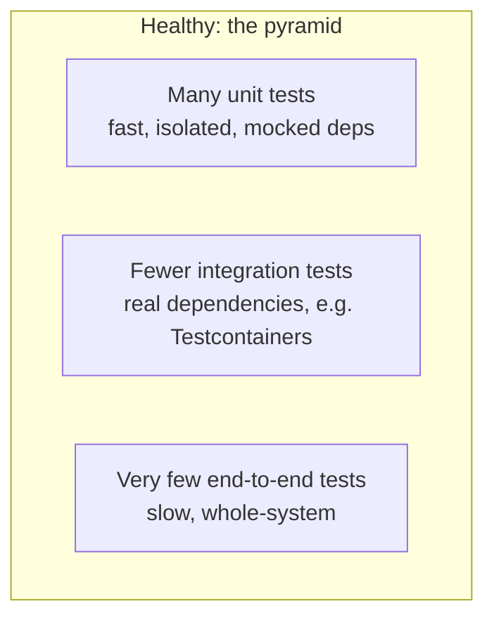

# T-1101 / T-1103 · Test Strategy, the Pyramid & Test Doubles

**IWI 7.00 (T-1101) / 6.40 (T-1103) · Core tier**

**Verification note:** the test run in §3 is real, executed output from `practice/java/week-11/testing/src/PaymentServiceUnitTest.java` against a real Mockito mock, via JUnit 5's console launcher (no Maven/Gradle).

## Table of Contents

1. [The concept](#1-the-concept)
2. [Why it exists](#2-why-it-exists)
3. [A real mock, verifying behavior not just a return value](#3-a-real-mock-verifying-behavior-not-just-a-return-value)
4. [The pyramid, and the ice-cream-cone anti-pattern](#4-the-pyramid-and-the-ice-cream-cone-anti-pattern)
5. [Trade-offs](#5-trade-offs)
6. [Interview questions](#6-interview-questions)
7. [Common mistakes](#7-common-mistakes)
8. [Staff-level discussion](#8-staff-level-discussion)
9. [Summary](#9-summary)
10. [Key Takeaways](#10-key-takeaways)
11. [Cheat Sheet](#11-cheat-sheet)
12. [Flashcards](#12-flashcards)
13. [Practice Exercises](#13-practice-exercises)
14. [Additional Reading](#14-additional-reading)
15. [Official References](#15-official-references)

---

## 1. The concept

Test strategy is the discipline of deciding **what to test at which level** — unit, integration, or end-to-end — rather than writing tests reactively. A **test double** (mock, stub, fake, spy) stands in for a real dependency so a unit test can isolate the logic actually under test from everything that logic merely calls.

## 2. Why it exists

Without a deliberate strategy, teams default to one of two failure modes: too few tests (bugs ship), or the **ice-cream-cone anti-pattern** — many slow, brittle end-to-end tests and almost no fast unit tests, the inverse of what actually catches bugs cheaply. Test doubles exist because testing `PaymentService`'s retry logic against a REAL payment gateway would require that gateway to actually fail on command, on demand, repeatably — normally impossible; a mock makes "fail twice, then succeed" a one-line setup.

## 3. A real mock, verifying behavior not just a return value

**Real output**, `PaymentService` retrying a mocked `PaymentGateway` that fails twice then succeeds:

```
├─ JUnit Jupiter ✔
│  └─ PaymentServiceUnitTest ✔
│     ├─ exhaustsRetriesAndReturnsFalseOnPermanentFailure() ✔
│     ├─ succeedsOnThirdAttemptAfterTwoFailures() ✔
│     └─ succeedsImmediatelyWithNoRetriesNeeded() ✔

Test run finished after 460 ms
[3 tests successful, 0 tests failed]
```

```java
PaymentGateway gateway = mock(PaymentGateway.class);
doThrow(new RuntimeException("network blip"))
        .doThrow(new RuntimeException("network blip"))
        .doNothing()
        .when(gateway).charge(anyString(), anyLong());

PaymentService service = new PaymentService(gateway, 3);
boolean result = service.processPayment("cust-1", 5000);

assertTrue(result);
verify(gateway, times(3)).charge("cust-1", 5000); // asserts the INTERACTION, not just the outcome
```

**The `verify(gateway, times(3))` line is the entire point of a mock over a stub**: it's not enough that `processPayment` returned `true` — the test also proves the retry logic called the gateway exactly 3 times with the exact arguments expected, something no assertion on a return value alone could confirm. A third test (`succeedsImmediatelyWithNoRetriesNeeded`) proves the inverse just as precisely: `verify(gateway, times(1))` confirms the service does NOT retry when the first attempt already succeeded — a wasted-retry bug would be invisible to a test that only checked the boolean result.

## 4. The pyramid, and the ice-cream-cone anti-pattern



The pyramid shape is deliberate, not aesthetic: unit tests are cheap to write and run (§3's suite ran in 460ms including JVM startup), so there should be many of them, covering logic branches precisely; end-to-end tests are expensive and flaky (real network, real timing, real infrastructure), so there should be few, covering only the critical paths a unit or integration test genuinely cannot. The **ice-cream-cone anti-pattern** inverts this — many slow end-to-end tests, few unit tests — usually because it FEELS more thorough to test "the whole system" than to test units in isolation, but it produces a slow, flaky suite that developers learn to ignore or skip, which is worse than no suite at all.

**What to mock, and what not to**: mock dependencies that are slow, external, or non-deterministic (network calls, payment gateways, clocks) — anything that would make the test slow or flaky for reasons unrelated to the logic being tested. Do NOT mock the thing the test exists to verify — a repository test that mocks the database (as opposed to using a real one, per `02-integration-testing-against-real-dependencies.md`) tests nothing but its own assumptions about what the database does, not whether the actual SQL is correct.

## 5. Trade-offs

| Level | Speed | What it catches | What it misses |
|---|---|---|---|
| Unit (mocked deps) | Fast (§3: 460ms for 3 tests, JVM-startup-dominated) | Logic bugs, branch coverage, exact interaction counts | Anything about how the real dependency actually behaves |
| Integration (real deps) | Slower (real Docker, real network round-trips) | Real behavior of the boundary code (SQL correctness, serialization, real error codes) | Doesn't need to cover every logic branch — that's the unit layer's job |
| End-to-end | Slowest, most brittle | Whether the whole system actually works together | Expensive to maintain; a good target is "a handful of critical paths," not comprehensive coverage |

## 6. Interview questions

### Q1. Where do you draw the unit/integration line?

- **Expected answer:** unit tests cover the logic under test in isolation, with test doubles standing in for anything slow/external/non-deterministic; integration tests exist specifically to verify the REAL behavior of a boundary (a repository against a real database, a client against a real API) that a mock would just assume correct rather than verify.
- **Common mistakes:** mocking the exact thing an integration test exists to check (e.g., mocking the database in a repository test).
- **Follow-up questions:** "Your team wants to mock the database in every repository test for speed. Convince me that's wrong."
- **Senior-level expectations:** correctly identifies that a mocked-database repository test only verifies the test's own assumptions, not real SQL correctness.
- **Staff-level expectations:** connects this to a concrete failure mode — a real production incident where mocked tests passed but a real migration/schema mismatch broke in production, and the mocked test suite gave false confidence.

### Q2. What does coverage percentage actually measure?

- **Expected answer:** that lines/branches were executed at least once — nothing about whether the assertions in those tests are meaningful, or whether the right things were checked. High coverage with weak assertions is common and gives false confidence.
- **Common mistakes:** treating coverage percentage as a target rather than a diagnostic (the blueprint's own named misconception for this topic).
- **Follow-up questions:** "A file has 100% coverage and a bug in production. How?"
- **Senior-level expectations:** explains that coverage doesn't verify assertion quality.
- **Staff-level expectations:** frames coverage as a DIAGNOSTIC for finding untested code, not a QUALITY target — a coverage requirement can perversely incentivize tests written to hit lines rather than to catch bugs, and names flakiness itself as a more useful design signal (a flaky test is often revealing a real race condition or hidden dependency, not just "a bad test").

## 7. Common mistakes

- Treating coverage percentage as a quality target rather than a diagnostic tool for finding untested code.
- Mocking the exact dependency an integration test exists to verify (mocking the database in a repository test).
- Building an ice-cream-cone test suite — many slow end-to-end tests, few fast unit tests — because it feels more thorough.

## 8. Staff-level discussion

The choice of what to mock is itself an architectural decision, not a testing detail: a codebase where business logic is cleanly separated from IO (the same hexagonal/ports-and-adapters discipline from earlier architecture material) makes unit testing natural, because the logic layer has few or no external dependencies to mock in the first place. A codebase where business logic and IO are tangled together forces either extensive mocking (brittle, testing implementation detail rather than behavior) or pushes everything to slow integration/end-to-end tests (the ice-cream cone). A Staff engineer treats "this code is hard to unit test" as a signal about the code's structure, not just a testing problem to work around with more mocks.

## 9. Summary

A test double (mock) lets `PaymentServiceUnitTest` verify BOTH the outcome (retry eventually succeeds) AND the interaction (exactly 3 calls, exact arguments) of retry logic against a dependency that would be nearly impossible to make fail on command for real — real, executed in 460ms including JVM startup. The testing pyramid's shape (many fast unit tests, fewer integration tests, very few end-to-end tests) reflects a real cost/coverage trade-off; inverting it (the ice-cream-cone anti-pattern) produces a slow, flaky suite for the sake of feeling thorough.

## 10. Key Takeaways

- A mock lets a test assert the exact interaction (call count, arguments), not just the return value.
- Mock what's slow/external/non-deterministic; never mock the exact thing an integration test exists to verify.
- Coverage percentage measures execution, not assertion quality — a diagnostic, not a target.
- The pyramid shape (many unit, fewer integration, very few end-to-end) reflects real cost/coverage trade-offs.

## 11. Cheat Sheet

| Situation | Test level |
|---|---|
| Pure business logic, no IO | Unit test, no mocks needed |
| Logic that calls a slow/external/flaky dependency | Unit test, mock the dependency |
| Code whose whole job IS talking to a real system (DB, API client) | Integration test, real dependency |
| A handful of critical, whole-system user flows | End-to-end test, sparingly |

## 12. Flashcards

1. **Q: What does `verify(gateway, times(3))` prove that `assertTrue(result)` alone cannot?** A: That the retry logic called the dependency the exact expected number of times with the exact arguments — the interaction, not just the outcome.
2. **Q: What's wrong with mocking the database in a repository test?** A: It only verifies the test's own assumptions about what the database does — it never checks real SQL correctness.
3. **Q: What does coverage percentage actually measure?** A: Execution (lines/branches run at least once) — nothing about assertion quality. A diagnostic tool, not a quality target.

(Full week-level deck: `07-flashcards.md`.)

## 13. Practice Exercises

1. Reproduce: `practice/java/week-11/testing/src/PaymentServiceUnitTest.java` via the console launcher (see `README.md` in that directory).
2. Write a 4th test case for `PaymentService` covering `maxAttempts = 1` (no retries possible at all) and predict the exact `verify()` call count before running it.
3. Identify one piece of business logic from an earlier week's practice code (e.g., `CircuitBreaker` from Week 10) that's hard to unit test as currently structured, and explain what about its structure makes it hard.

## 14. Additional Reading

- [Martin Fowler — TestPyramid](https://martinfowler.com/bliki/TestPyramid.html)

## 15. Official References

- [Mockito documentation](https://javadoc.io/doc/org.mockito/mockito-core/latest/org/mockito/Mockito.html)
