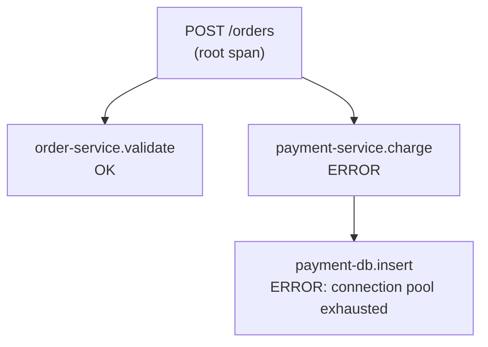

# T-1205 · Logging, Metrics, Tracing & OpenTelemetry

**IWI 6.90 · Staff tier**

**Verification note:** the trace in §3 is real, executed output from `practice/java/week-11/tracing/src/TracingDemo.java`, using the real OpenTelemetry Java SDK (not a diagram of what a trace looks like).

## Table of Contents

1. [The concept](#1-the-concept)
2. [Why it exists](#2-why-it-exists)
3. [A real distributed trace, executed](#3-a-real-distributed-trace-executed)
4. [Logs, metrics, and traces are complementary, not redundant](#4-logs-metrics-and-traces-are-complementary-not-redundant)
5. [Trade-offs](#5-trade-offs)
6. [Interview questions](#6-interview-questions)
7. [Common mistakes](#7-common-mistakes)
8. [Staff-level discussion](#8-staff-level-discussion)
9. [Summary](#9-summary)
10. [Key Takeaways](#10-key-takeaways)
11. [Cheat Sheet](#11-cheat-sheet)
12. [Flashcards](#12-flashcards)
13. [Practice Exercises](#13-practice-exercises)
14. [Additional Reading](#14-additional-reading)
15. [Official References](#15-official-references)

---

## 1. The concept

A **span** represents one unit of work (an HTTP request, a database call) with a start time, duration, and status. A **trace** is a tree of spans sharing one `traceId`, reconstructing the full path a single request took across services. **OpenTelemetry (OTel)** is the vendor-neutral standard API/SDK for producing this data, so instrumentation doesn't lock a codebase to one specific observability vendor.

## 2. Why it exists

`03-percentiles-tail-latency-and-coordinated-omission.md` established that a slow p99 is real and worth caring about — but a percentile alone doesn't say WHERE in a multi-service request the time went. Tracing exists to answer exactly that: given a slow (or failed) request, which specific downstream call, in which specific service, actually caused it.

## 3. A real distributed trace, executed

**Real output**, a simulated request (`POST /orders`) that calls an order-validation step (succeeds) and a payment step (which itself calls a database, which fails):

```
'order-service.validate' : 889ba9722928321ef6ddda8b315baf4e c7a01645cfd579bd INTERNAL
'payment-db.insert'      : 889ba9722928321ef6ddda8b315baf4e 71782e03d32aa31d INTERNAL
'payment-service.charge' : 889ba9722928321ef6ddda8b315baf4e 869a0257119f7fe4 INTERNAL
'POST /orders'           : 889ba9722928321ef6ddda8b315baf4e 43a86499714f5379 INTERNAL {http.route=/orders, http.method=POST}
```

**Every one of the 4 spans shares the identical `traceId` (`889ba9...`)** — the first hex string after each span name — while each has its own unique `spanId` (the second hex string). This is the entire mechanism that lets a tracing backend reconstruct the call tree: given any one span, a query for "everything sharing this `traceId`" returns the whole request's path, in this case revealing that `POST /orders` → `payment-service.charge` → `payment-db.insert` is the specific chain where the failure actually originated (set via `dbCall.setStatus(StatusCode.ERROR, "connection pool exhausted")` and `recordException()` in the source, propagated up through `payment.setStatus()` and `root.setStatus()`) — without tracing, only "the order failed" would be visible, not which of potentially many downstream calls was the actual cause.



## 4. Logs, metrics, and traces are complementary, not redundant

- **Logs**: discrete events with arbitrary detail ("connection pool exhausted, pool size=10, active=10") — the richest detail, but expensive to store at full volume and hard to correlate across services without a shared trace ID embedded in each log line.
- **Metrics**: aggregated numbers over time (request rate, error rate, p99 latency) — cheap to store and query at any volume, but they tell you THAT something is wrong, never WHICH specific request or WHY.
- **Traces**: the specific path one request took, and where time/failure was spent within it — expensive to capture for every single request at scale (hence sampling in production), but the only one of the three that directly answers "why was THIS request slow/broken."

The practical pattern: metrics tell you something's wrong (a dashboard alert fires on rising p99 or error rate); a trace for a representative slow/failed request tells you WHERE; logs for that specific trace ID give the full detail of WHY. Using only one of the three leaves a real gap — metrics alone can't localize a problem to a specific span; logs alone can't be aggregated cheaply enough to alert on; traces alone are too expensive to be the sole signal for "is anything wrong right now."

## 5. Trade-offs

| Signal | Cost to capture at full volume | What it answers |
|---|---|---|
| Metrics | Cheap — pre-aggregated | "Is something wrong, right now, in aggregate?" |
| Logs | Moderate — grows with event volume and detail | "What exactly happened, in detail, for this one thing?" |
| Traces | Expensive at 100% sampling — usually sampled in production | "Where, in a multi-service call chain, did the time/failure happen?" |

## 6. Interview questions

### Q1. Trace a request across seven services.

- **Expected answer:** every span shares the request's `traceId`; each service's span is a child of whichever upstream call invoked it; querying the tracing backend for that `traceId` reconstructs the full tree, and the span with the ERROR status (or the longest duration) localizes the actual problem.
- **Common mistakes:** describing tracing in the abstract without naming the `traceId`/`spanId` mechanism that actually makes reconstruction possible.
- **Follow-up questions:** "Two of the seven services don't propagate the trace context. What breaks?"
- **Senior-level expectations:** correctly describes the shared-traceId, parent-child-spanId mechanism.
- **Staff-level expectations:** identifies that a service failing to propagate trace context breaks the chain at exactly that point — the trace becomes two disconnected trees instead of one, and answers "why context propagation must be part of every service's instrumentation, not just the ones a team happens to own."

### Q2. Pauses hit 4 seconds. Diagnose from this log. [connects to Week 9's GC-log-reading skill]

- **Expected answer:** this is explicitly the same "diagnose from an artifact" skill as Week 9's GC log chapter, generalized — the artifact might be a GC log, a trace, or a metrics dashboard, and the discipline (read what's actually there before proposing a fix) is identical regardless of which artifact type is handed over.
- **Common mistakes:** treating each observability signal type as requiring a completely separate diagnostic skill rather than recognizing the shared discipline.
- **Follow-up questions:** "You have a trace AND a GC log for the same slow request. Which do you check first?"
- **Senior-level expectations:** proposes checking the trace first to localize WHERE the time went, then the GC log if the slow span itself points at JVM-level behavior rather than a downstream call.
- **Staff-level expectations:** explicitly sequences the diagnostic: metrics alerted something's wrong → trace localizes which span → logs/GC-log/EXPLAIN-plan for that specific span's system give the detailed why — the same three-signal funnel regardless of which artifact type ends up being the answer.

## 7. Common mistakes

- Relying on only one of logs/metrics/traces and being surprised it can't answer questions it was never designed to answer.
- Instrumenting some services with trace propagation and not others, silently breaking trace reconstruction at exactly the boundary that matters most.
- Treating tracing, GC-log-reading, and query-plan-reading as unrelated skills rather than the same "diagnose from an artifact" discipline applied to different artifact types.

## 8. Staff-level discussion

The 4-span trace in §3 is a small-scale version of what makes microservices architectures debuggable at all — without a shared `traceId` threading through every service boundary, a slow or failed request in a system with dozens of services becomes nearly impossible to root-cause, because no single service's own logs contain the full picture. A Staff engineer treats trace-context propagation as a non-negotiable requirement for any new service in a distributed system, in the same category as authentication or logging itself — not an optional nice-to-have added after the fact, because retrofitting it into a system with untraced gaps is far more expensive than building it in from the start.

## 9. Summary

A real OpenTelemetry trace — 4 spans, one root and a nested parent-child chain — shares a single `traceId` across every span, which is the entire mechanism that lets a tracing backend reconstruct which specific downstream call (here, a database insert inside the payment service) actually caused a failure that would otherwise just look like "the order failed" from the outside. Logs, metrics, and traces are complementary: metrics detect that something's wrong in aggregate, traces localize where in a call chain, logs give the full detail of why — no single one of the three substitutes for the others.

## 10. Key Takeaways

- A trace's spans share one `traceId`; parent-child relationships reconstruct the call tree.
- Metrics detect, traces localize, logs explain — three different, complementary signals.
- Trace-context propagation must be consistent across every service boundary, or the trace tree breaks exactly where it matters most.
- "Diagnose from an artifact" (a trace, a GC log, a query plan) is one shared discipline, not three separate skills.

## 11. Cheat Sheet

| Question | Signal to reach for |
|---|---|
| Is anything wrong right now? | Metrics/dashboard |
| Where in the call chain did this specific request fail/slow down? | A trace for that request |
| Why, in full detail, did that specific span fail? | Logs for that trace ID |

## 12. Flashcards

1. **Q: What single piece of data lets a tracing backend reconstruct a whole multi-service request's path?** A: A shared `traceId` across every span in that request, with parent-child `spanId` relationships.
2. **Q: What does a metric alone fail to tell you that a trace can?** A: WHICH specific request, and WHERE in its call chain, the problem occurred — metrics only show aggregate trends.
3. **Q: Why is inconsistent trace-context propagation across services a serious problem?** A: It breaks the trace tree exactly at the boundary where propagation is missing, turning one reconstructable trace into disconnected fragments.

(Full week-level deck: `07-flashcards.md`.)

## 13. Practice Exercises

1. Reproduce: `practice/java/week-11/tracing/src/TracingDemo.java` and confirm all 4 spans share the same `traceId` in your own run.
2. Add a 5th span (a cache-lookup step before validation) and verify it appears with the same `traceId` and a distinct `spanId` in your output.
3. Design the metrics-to-trace-to-log escalation path for a real alert ("p99 latency for `/orders` exceeded 2s") — what metric fires the alert, what would you query to find a representative trace, and what would you look for in that trace's spans?

## 14. Additional Reading

- [OpenTelemetry documentation — Traces](https://opentelemetry.io/docs/concepts/signals/traces/)

## 15. Official References

- [OpenTelemetry Java SDK](https://github.com/open-telemetry/opentelemetry-java) — the library used directly in this chapter's real demo
