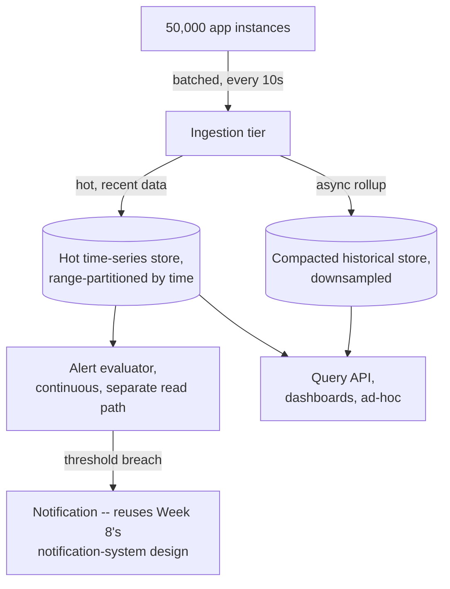

# Design Exercise — Metrics/Monitoring System

**45 minutes, timed, full six-phase method.** Per `00-project/learning-roadmap.md` §4 Week 11. Do this yourself before reading the worked notes below.

## Table of Contents

1. [Phase 1 — Clarify](#phase-1--clarify)
2. [Phase 2 — Estimate](#phase-2--estimate)
3. [Phase 3 — API](#phase-3--api)
4. [Phase 4 — Data](#phase-4--data)
5. [Phase 5 — Architecture](#phase-5--architecture)
6. [Phase 6 — Bottlenecks](#phase-6--bottlenecks)
7. [Exit check](#exit-check)

---

## Phase 1 — Clarify

**In scope:** ingest time-series metrics (counters, gauges, histograms) from thousands of application instances, support aggregation queries (rate, percentiles, sums over time windows), and alert when a query result crosses a threshold. **Out of scope:** distributed tracing and log aggregation (separate systems, per `04-logging-metrics-tracing-and-opentelemetry.md`'s point that metrics/traces/logs are complementary, not one unified system). **Core action:** the central tension is the write path — millions of individual metric points arriving continuously — versus the read path — infrequent but expensive aggregation queries (percentiles especially, directly named in `03-percentiles-tail-latency-and-coordinated-omission.md` as expensive to compute correctly, not just to store).

## Phase 2 — Estimate

```
Assumption: 50,000 application instances, each emitting ~200 distinct
            time series (per-endpoint rate/error/duration -- RED,
            per-resource utilization/saturation -- USE), each reporting
            every 10 seconds
            -> 50,000 * 200 / 10s = 1,000,000 data points/s ingested
Assumption: histogram-type metrics (for percentile queries) are the
            expensive case -- a naive design storing every raw
            observation for later percentile computation at query time
            would need to retain individual latency samples, not just
            aggregates, directly colliding with T-1204's own point that
            percentiles can't be correctly computed by averaging
            pre-aggregated percentiles from different instances.
Assumption: alert evaluation needs to run continuously against recent
            data -- this is a SEPARATE read path from ad-hoc dashboard
            queries, with a different latency requirement (alerts need
            to fire within ~1 minute of a real threshold breach;
            dashboard queries can tolerate a few seconds).
```

## Phase 3 — API

```
POST /ingest        {series: "http.duration", tags: {service, endpoint},
                      timestamp, value} -> 202 Accepted (fire-and-forget
                      from the client's perspective, per-instance batched)
GET /query           {series, tags?, aggregation: rate|sum|p50|p99|...,
                       from, to, step} -> [{timestamp, value}, ...]
POST /alerts         {series, tags?, condition, threshold, forDuration}
                      -> {alertId}
```

## Phase 4 — Data

**Write path: time-series storage**, partitioned by time (recent data hot, older data rolled up and compacted) — the same range-partitioning discussion as `study-packs/week-10/02-sharding-and-partitioning-strategies.md`, applied to time instead of a business key, exactly the natural fit range partitioning is good at (unlike Week 10's hash-partitioned `events` example, time-series data has an inherent, queryable order hash partitioning would destroy). **Histograms specifically need pre-aggregated sketches (e.g., HdrHistogram or t-digest), not raw samples retained forever** — the direct fix for Phase 2's percentile-computation concern: a sketch can be merged across instances and time windows while still supporting reasonably accurate percentile queries, without retaining every observation indefinitely. **Alert state**: which alerts are currently firing, since when — needs its own small, low-latency store, decoupled from the bulk time-series data, since alert evaluation must stay fast regardless of how large the historical metrics store has grown.

## Phase 5 — Architecture



**Justified against this week's topics:**

- **Histogram sketches, not raw samples, for the write path** (T-1204): follows directly from `03`'s lesson that percentiles can't simply be averaged across instances/windows the way a sum or rate can — storing every raw latency observation from 50,000 instances indefinitely would collide with Phase 2's ingestion volume within days; a mergeable sketch (HdrHistogram/t-digest) is the standard fix, trading small, bounded accuracy loss for genuinely feasible storage.
- **A separate, fast alert-evaluation path, not the same query path as dashboards** (RED/USE, T-1201, and the resilience-pattern bulkhead principle from Week 10 §5): an ad-hoc, expensive percentile dashboard query must never slow down or starve alert evaluation, since a delayed alert during a real incident is directly worse than a slow dashboard — the same bulkhead-isolation reasoning applied to a monitoring system's own internal architecture, not just an external dependency.
- **Time-based range partitioning for the hot store, not hash partitioning** (explicit contrast with Week 10's `02-sharding-and-partitioning-strategies.md`): time-series queries are almost always range queries over a time window ("last 1 hour," "last 7 days"), which range partitioning serves directly with pruning (skip partitions outside the queried range) — hash partitioning by time would destroy that locality, the same Week 10 lesson applied to choosing the RIGHT partitioning scheme for THIS dominant access pattern.

## Phase 6 — Bottlenecks

1. **The ingestion tier is the system's own RED "Rate" at its most extreme** (1,000,000 points/s from Phase 2) — needs the same lesson as Week 8's Kafka producer chapter: batching per-instance (each app instance batches its own 200 series into one request per 10s interval, not 200 separate requests) is what makes this volume tractable at all, directly reusing `study-packs/week-08/02-producer-semantics-and-partition-keys.md`'s batching-for-throughput reasoning.
2. **A cardinality explosion in tags is a specific, distinct failure mode from raw ingestion volume.** If a tag value is high-cardinality (e.g., accidentally tagging metrics by a raw user ID instead of a bounded dimension like `service`/`endpoint`), the number of DISTINCT time series can explode combinatorially, each needing its own storage and index entry — a genuinely different problem from "too many data points" (Phase 2's concern); no amount of ingestion-tier scaling fixes a cardinality problem, it requires enforcing bounded-cardinality tags at the client/schema level.
3. **The alert evaluator itself needs monitoring** — the same "who watches the watcher" problem as any system whose entire purpose is detecting failure elsewhere. If the alert evaluator's own query against the hot store starts timing out (e.g., the hot store is under unusual load), alerts silently stop firing at exactly the moment something else is also going wrong — mitigation: a simple, separate heartbeat/dead-man's-switch check confirming the alert evaluator itself is still running and successfully evaluating, alerting if THAT check goes silent.

## Exit check

- [ ] All six phases completed within 45 minutes
- [ ] Histogram-sketch storage justified explicitly against `03`'s percentile-computation lesson, not just asserted as a design choice
- [ ] Time-based range partitioning chosen and explicitly contrasted with Week 10's hash-partitioned example — the SAME topic (partitioning), a DIFFERENT correct choice for this system's actual access pattern
- [ ] Cardinality explosion named as a distinct failure mode from raw ingestion volume, with a different fix (bounded tags, not more scaling)
