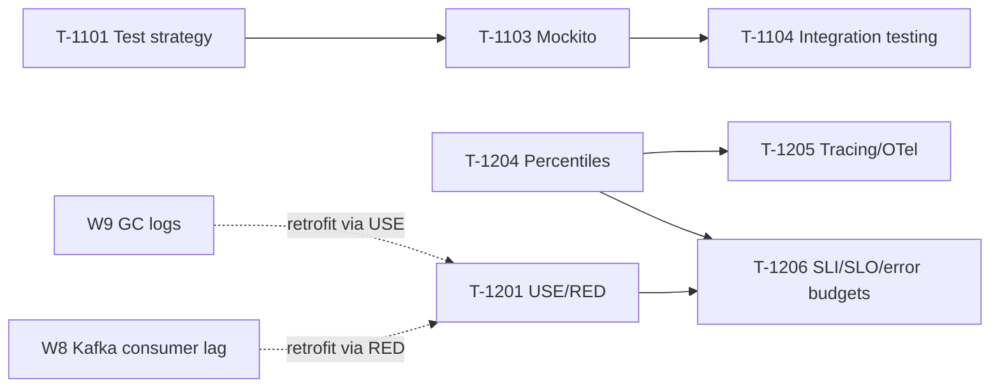

# Week 11 Study Pack — Testing, Observability, Performance

**Plan B, Week 11.** See `00-project/learning-roadmap.md` §4, Week 11.
**Topics:** T-1101 (Test strategy) · T-1103 (Mockito) · T-1104 (Testcontainers) · T-1205 (Tracing/OTel) · T-1206 (SLI/SLO) · T-1201 (USE/RED) · T-1204 (Percentiles)
**Why now:** these topics supply the vocabulary that makes an incident or scaling story credible — scheduled deliberately late because they're most valuable as a **retrofit onto stories that already exist**, not new material studied in isolation. No new behavioral story is introduced this week; Stories 3, 7, and 11 (production incident, cross-team influence, scaling/performance) get retrofitted with this week's precision instead.

## Table of Contents

1. [Objective](#objective)
2. [Why this week, in this order](#why-this-week-in-this-order)
3. [Dependency graph](#dependency-graph)
4. [Files in this pack](#files-in-this-pack)
5. [Daily schedule](#daily-schedule-8hweek-study--12h-practice)
6. [Exit criteria](#exit-criteria)

---

## Objective

Build genuine testing and observability skills — a real Mockito-based unit test, a real integration test against live Postgres, a real distributed trace, a measured coordinated-omission gap, a real 30-day error-budget simulation — and use all five to retrofit precision onto incident/scaling stories already built in earlier weeks, per this week's own explicit instruction.

## Why this week, in this order

Test strategy and doubles (T-1101/T-1103) come first because integration testing (T-1104) is defined in direct contrast to what a mock verifies. Percentiles (T-1204) come before tracing (T-1205) because tracing's value proposition — localizing WHERE in a call chain time went — only matters once percentiles have established THAT the tail is worth caring about in the first place. Performance methodology and error budgets (T-1201/T-1206) close the week because they're the vocabulary layer that ties everything — GC logs from Week 9, Kafka consumer lag from Week 8, the resilience patterns from Week 10 — into one coherent diagnostic and decision-making frame.

## Dependency graph

## Files in this pack

| # | File | Purpose |
|---|---|---|
| 1 | `README.md` | This file |
| 2 | `01-test-strategy-and-test-doubles.md` | T-1101/1103 — full chapter, real Mockito unit test |
| 3 | `02-integration-testing-against-real-dependencies.md` | T-1104 — full chapter, real Postgres integration test |
| 4 | `03-percentiles-tail-latency-and-coordinated-omission.md` | T-1204 — full chapter, real closed-loop vs. open-loop measurement |
| 5 | `04-logging-metrics-tracing-and-opentelemetry.md` | T-1205 — full chapter, real 4-span OpenTelemetry trace |
| 6 | `05-performance-methodology-and-slo-error-budgets.md` | T-1201/1206 — full chapter, real 30-day error-budget simulation |
| 7 | `06-java-coding-practice.md` | 15-problem mixed review, all compiled and run |
| 8 | `07-flashcards.md` | 16 cards |
| 9 | `08-week-11-mock-behavioral.md` | 45-min behavioral mock, full 6-question set + retrofit checklist |
| 10 | `09-design-exercise-metrics-monitoring-system.md` | Full six-phase design |
| 11 | `10-week-11-checklist.md` | Day-by-day checklist |
| 12 | `resources.md` | Sources classified PRIMARY/BOOK/TOOL/SECONDARY |

## Daily schedule (8h/week study + 12h practice)

See `10-week-11-checklist.md` for the day-by-day breakdown. Shape: Monday–Friday, one chapter + one demo reproduction + 3 mixed-review coding problems per day, with the Stories 3/7/11 retrofit spanning Thursday–Friday; Saturday, the design exercise; Sunday, the behavioral mock.

## Exit criteria

- [ ] Can explain what a mock verifies that a return-value assertion cannot, with the real `verify(times(3))` example
- [ ] Can state why mocking a database in a repository test defeats the point of that test
- [ ] Can explain coordinated omission and cite this pack's own measured gap (p99: 500ms closed-loop vs. 830ms open-loop)
- [ ] Can explain what a shared `traceId` makes possible that logs or metrics alone cannot
- [ ] Can compute and interpret an error budget's daily burn rate, not just its monthly aggregate
- [ ] All 15 mixed-review problems solved, patterns named not just answers produced
- [ ] Metrics/monitoring-system design completed in 45 minutes with histogram-sketch and time-partitioning decisions explicitly justified
- [ ] Stories 3, 7, and 11 retrofitted with this week's vocabulary — confirmed via `08-week-11-mock-behavioral.md`'s checklist
- [ ] 45-min behavioral mock completed and scored
