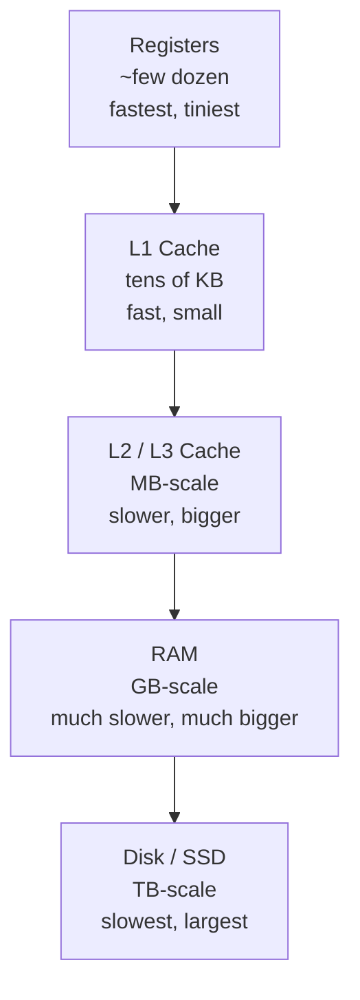

# Memory Hierarchy: Caches, RAM, and Virtual Memory

[How a Computer Executes a Program](how-a-computer-executes-a-program.md) draws a line between a CPU register — "dramatically faster" than RAM — and everything else, without saying how much faster, or what sits between the two. This topic fills that gap: memory is not one uniform resource with one uniform access cost, but a hierarchy of physically distinct storage tiers, each faster and smaller than the one below it, and the difference between the fastest and slowest tier a single Java program routinely touches is not a rounding error — it's close to two orders of magnitude, measured directly below.

## 1. Why This Matters

[Algorithmic Complexity and Big-O](algorithmic-complexity-and-big-o-from-first-principles.md) treats `array[i]` as an O(1) operation — one constant unit of cost, no matter what `i` is or how large the array is. That's true for *how many operations happen*; it is quietly false for *how long each operation takes*, and this chapter measures exactly how false, directly, with real hardware. A program that touches memory in a cache-friendly pattern and a program that touches the exact same amount of memory in a cache-hostile pattern can differ in wall-clock time by an order of magnitude while having *identical* Big-O complexity — a gap no algorithmic-complexity analysis alone will ever reveal, and one that shows up constantly in real production performance work, disguised as "this should be fast, why isn't it."

This is also the missing foundation underneath two chapters this repository already teaches with real, measured evidence but no citable foundation to point back to: [False Sharing and Cache-Line Contention](../16-performance-jvm/false-sharing-and-cache-line-contention.md), whose entire ~16x measured slowdown is a consequence of the cache-line mechanics this chapter introduces, and [Memory-Mapped Files and Zero-Copy I/O](../16-performance-jvm/memory-mapped-files-and-zero-copy-io.md), whose ~28x measured random-access speedup is a direct consequence of the virtual-memory page-fault mechanism this chapter introduces.

## 2. Prerequisites

[How a Computer Executes a Program](how-a-computer-executes-a-program.md) — specifically its distinction between a CPU register and RAM (Section 5), which this chapter takes as its starting point and fills in with everything in between.

## 3. Foundation (L1)

**A computer does not have "memory" — it has several physically different kinds of memory, arranged in a hierarchy, trading capacity for speed at every step.** Near the CPU: a handful of registers, then a small, extremely fast on-chip cache. Farther away: a larger, slower cache, then RAM, then — farther still — disk. Each tier down is dramatically larger and dramatically slower than the one above it:



**This chapter measures the top four tiers directly**, on real hardware, using a technique designed specifically to reveal genuine access latency rather than an artifact of the CPU's own prediction hardware (Section 5). The headline, real result: the same single-element read costs **roughly 1.4 nanoseconds when the data fits in the smallest cache, and roughly 95 nanoseconds once the data no longer fits anywhere but RAM — a ~68x difference for what Big-O analysis calls the identical "O(1) array access" in both cases.**

## 4. Core Concepts (L2)

**A cache doesn't store individual bytes — it stores fixed-size chunks called cache lines**, typically 64 bytes on modern hardware. Reading even a single `int` (4 bytes) pulls its entire 64-byte cache line into the cache; the next 15 `int`s in the same array are now already present, free, the moment you ask for them. This single fact is the mechanism behind two opposite-sounding real phenomena this repository measures elsewhere: it's *why* [False Sharing and Cache-Line Contention](../16-performance-jvm/false-sharing-and-cache-line-contention.md) can measure a real ~16x slowdown from independent variables that happen to share a line, and it's *why* sequential array access is so much faster than the same number of random accesses to the same array — demonstrated directly in Section 10 below.

**This is exactly why data layout, not just algorithm choice, has a real performance consequence.** Two access patterns with identical Big-O:

- **Sequential access** (`for (int i = 0; i < n; i++) sum += arr[i];`) reads consecutive cache lines in order — each cache-line fetch serves roughly 16 subsequent `int` reads for free, and the CPU's hardware **prefetcher** (Section 5) can often bring the *next* line in before it's even asked for.
- **Random access** to the same array touches a different, unpredictable cache line almost every time — no prefetch benefit, and frequently no reuse of an already-cached line at all.

**Virtual memory adds a second, independent layer of indirection on top of this cache hierarchy, for a completely different reason: process isolation**, which [The OS Process/Thread Model](os-process-thread-model.md) introduces at the "why does one process's bug not corrupt another's memory" level. The mechanism underneath that guarantee: every memory address a program uses is a **virtual address**, translated by the CPU's memory management unit into a real physical address using a per-process mapping the operating system controls, organized in fixed-size chunks called **pages** (commonly 4 KiB). A process's virtual address space can — and, for any process that hasn't touched all of it yet, usually does — contain pages with no physical memory backing them at all yet. The first time a program touches such a page, the CPU raises a **page fault**, trapping into the operating system, which finds or allocates a physical page, updates the translation, and resumes the program — invisibly to the program itself, except for the real, measurable time that trap costs.

## 5. How It Works Internally (L3)

**The `practice/` demo for this topic measures cache and RAM latency directly using pointer chasing over a random single-cycle permutation** (Sattolo's algorithm), not a simple sequential-read loop — deliberately, because a naive sequential-read benchmark would measure the hardware prefetcher's effectiveness, not raw access latency. Two properties make pointer chasing the right tool:

1. **A random permutation defeats the prefetcher.** The next index to visit (`next[idx]`) is not predictable from the current one, so the CPU cannot speculatively fetch it ahead of time the way it could for a sequential scan.
2. **Chasing a dependent pointer chain defeats out-of-order execution's ability to overlap independent loads.** Each read's *address* depends on the *previous read's result*, so the CPU genuinely cannot start the next read before the current one completes — the measured time per step is close to the honest, serialized latency of one real memory access.

Run on this machine (Apple M4, OpenJDK 21.0.12) across working-set sizes from 4 KiB to 256 MiB, real captured results (full table in Section 10):

| Working set | ns/access |
|---|---|
| 4 KiB – 64 KiB | ~1.39 (flat) |
| 128 KiB – 256 KiB | 1.48 → 3.64 |
| 512 KiB – 8 MiB | 4.9 → 8.8 |
| 16 MiB → 32 MiB | 17.06 → 55.95 |
| 64 MiB – 256 MiB | 80.8 → 95.3 (flattening) |

**These cliffs are not arbitrary — they line up with this exact machine's real, `sysctl`-reported cache sizes.** `sysctl hw.perflevel0.l1dcachesize` reports 131,072 bytes (128 KiB) for this machine's performance cores, matching the demo's own L1 cliff almost exactly (flat through 64 KiB, breaking by 256 KiB). More strikingly, `sysctl hw.perflevel0.l2cachesize` reports exactly 16,777,216 bytes (16 MiB) — and the single largest cliff in the entire measured run is precisely the 16 MiB → 32 MiB step. This is the chapter's central, concrete evidence: cache capacity is not an abstraction, it is a real, discoverable number on the machine your code is actually running on, and crossing it has a real, measured cost.

**Virtual memory's page-fault mechanism is measured indirectly, via its real consequence, in [Memory-Mapped Files and Zero-Copy I/O](../16-performance-jvm/memory-mapped-files-and-zero-copy-io.md)** rather than re-derived here: that chapter's real ~28x random-access speedup for memory-mapped files over ordinary positional reads is explained entirely by the difference between paying a real syscall on *every* access (ordinary I/O) versus paying kernel cost only on a genuine page fault — first touch of a not-yet-resident page — with every subsequent access to an already-faulted-in page being an ordinary, cache-hierarchy-governed memory read, exactly as measured in this chapter's own table.

## 6. Practical Usage

- **Preferring array-backed, contiguous data structures over pointer-heavy ones for hot iteration paths** — an `ArrayList` iterated in order benefits from every mechanism in Section 4 and Section 5 (spatial locality, prefetch); a `LinkedList` of the same logical size, with nodes scattered across the heap in allocation order rather than logical order, gets almost none of it, despite both being "O(n) to iterate."
- **Recognizing "cache miss" or "TLB miss" in profiler hardware-counter output as a specific, actionable signal** — not generic noise — pointing at exactly the mechanism Section 4 and Section 5 describe, rather than at application logic.
- **Reasoning about row-major vs. column-major traversal order for a 2D array** as a real, measurable locality decision (Section 17), not a stylistic one.

## 7. Examples

```java
// Sattolo's algorithm -- a permutation that is a single cycle covering
// all n indices, defeating the prefetcher when chased.
private static int[] buildSingleCyclePermutation(int n, long seed) {
    int[] next = new int[n];
    for (int i = 0; i < n; i++) next[i] = i;
    Random random = new Random(seed);
    for (int i = n - 1; i > 0; i--) {
        int j = random.nextInt(i); // strictly less than i
        int tmp = next[i]; next[i] = next[j]; next[j] = tmp;
    }
    return next;
}

// Each step's address depends on the previous step's result --
// defeats out-of-order execution's ability to overlap loads.
private static long chase(int[] next, long steps) {
    int idx = 0;
    for (long s = 0; s < steps; s++) idx = next[idx];
    return idx;
}
```

Real captured output (excerpt — full table in Section 10):

```text
size_bytes,size_elements,ns_per_access
65536,16384,1.391
16777216,4194304,17.059
33554432,8388608,55.954
268435456,67108864,95.311
```

## 8. Common Mistakes

- **Treating O(1) array access as "constant time" in the everyday sense — the same number of nanoseconds regardless of context.** Section 10's own numbers show a ~68x range for the identical operation; O(1) means "doesn't grow with input size," not "always equally fast."
- **Assuming a `LinkedList` and an `ArrayList` perform comparably for sequential iteration because both are O(n).** The real difference is entirely a Section 4/5 locality effect, invisible to a Big-O analysis, visible immediately in wall-clock time.
- **Reaching for "add more RAM" to fix a cache-locality problem.** More RAM changes nothing about how often a hot loop's working set exceeds L1 or L2 — a different, much smaller resource than total system memory (the same Staff-level pattern [How a Computer Executes a Program](how-a-computer-executes-a-program.md)'s Section 13 names for stack size and thread count: identify which specific physical resource is actually exhausted before adding more of the wrong one).

## 9. Edge Cases

- **A working set small enough to live entirely in registers or L1 shows no measurable Big-O-vs-wall-clock gap at all** — Section 10's flat 4 KiB–64 KiB region is the demonstration: every access there costs the same, because every access is served from the same tier.
- **NUMA (non-uniform memory access) multi-socket servers add a further layer this chapter's single-socket measurement does not cover**: RAM attached to a different CPU socket than the one running the thread is real RAM, but reaching it costs meaningfully more than reaching locally-attached RAM. Not measured here — flagged honestly as a real, further layer rather than asserted with an invented number.
- **Virtual memory can be backed by disk (swap), not just physical RAM**, once physical RAM itself is exhausted — a page fault for a swapped-out page costs disk latency, not RAM latency, silently turning "just a memory access" into a cost several orders of magnitude larger again than even this chapter's slowest measured RAM number.

## 10. Performance Implications

Full real, measured results from `practice/java/cs-foundations/memory-hierarchy-and-cache-latency/`, OpenJDK 21.0.12, Apple M4:

| Size (bytes) | Size (elements) | ns/access |
|---|---|---|
| 4,096 | 1,024 | 1.390 |
| 8,192 | 2,048 | 1.400 |
| 16,384 | 4,096 | 1.389 |
| 32,768 | 8,192 | 1.392 |
| 65,536 | 16,384 | 1.391 |
| 131,072 | 32,768 | 1.483 |
| 262,144 | 65,536 | 3.641 |
| 524,288 | 131,072 | 4.877 |
| 1,048,576 | 262,144 | 5.805 |
| 2,097,152 | 524,288 | 5.583 |
| 4,194,304 | 1,048,576 | 7.478 |
| 8,388,608 | 2,097,152 | 8.796 |
| 16,777,216 | 4,194,304 | 17.059 |
| 33,554,432 | 8,388,608 | 55.954 |
| 67,108,864 | 16,777,216 | 80.821 |
| 134,217,728 | 33,554,432 | 91.042 |
| 268,435,456 | 67,108,864 | 95.311 |

**Honest reading.** The demo does not claim a distinct, clean third cliff separating "L2" from "L3" the way the classic x86 three-level model suggests — Apple Silicon's actual hierarchy (a per-cluster L2, then a shared system-level cache, then DRAM) doesn't map cleanly onto that model, and the data reflects that: one sharp L1 cliff, then a single dominant step (16 MiB → 32 MiB) from L2 capacity into what is most likely a blend of system-level cache and DRAM rather than two independently visible cliffs. What the data supports cleanly and repeatably, without overclaiming a specific three-tier story: a ~68x latency range across the tested range, and the largest single jump landing exactly at this machine's own reported L2 capacity.

## 11. Trade-offs

| Choice | Gains | Costs |
|---|---|---|
| Contiguous array layout | Full benefit of spatial locality and hardware prefetch (Section 4, Section 10) | Less flexible for frequent insertion/removal in the middle than a linked structure |
| Pointer-heavy layout (linked lists, trees of scattered node objects) | O(1) insertion/removal at a known position | Each traversal step is a potential cache miss (Section 5's pointer-chase mechanism, applied unintentionally) |
| Larger cache lines (a hardware design choice, not a software one) | More free locality benefit per access for genuinely sequential data | Larger blast radius for [False Sharing](../16-performance-jvm/false-sharing-and-cache-line-contention.md) — more unrelated variables can land on the same line |
| Memory-mapped I/O for random-access-heavy workloads | Pays page-fault cost once per page instead of a syscall per access (Section 5, and the real ~28x measurement in [Memory-Mapped Files and Zero-Copy I/O](../16-performance-jvm/memory-mapped-files-and-zero-copy-io.md)) | No advantage, and real complexity cost, for workloads that were already sequential |

## 12. Senior-Level Considerations (L3)

A Senior engineer treats a profiler's cache-miss or TLB-miss counters as a **specific, named resource being exhausted**, the same discipline [How a Computer Executes a Program](how-a-computer-executes-a-program.md)'s Section 12 asks of native/JIT frames in a flame graph — not as opaque "system overhead" to scroll past. Choosing between an array-backed and a pointer-heavy data structure for a genuinely hot path is a real, evidence-backed decision (Section 10, Section 11), not a matter of taste; the same reasoning explains why `ArrayList` is the default recommendation over `LinkedList` for nearly all sequential-iteration use cases in modern Java code, independent of what either structure's Big-O table says.

## 13. Staff/System-Level Considerations (L4)

At Staff scope, this chapter's real leverage is recognizing that **"memory" is not one undifferentiated resource, any more than "JVM memory" is one undifferentiated resource** — the same distinction [How a Computer Executes a Program](how-a-computer-executes-a-program.md)'s Section 13 draws between stack exhaustion and heap exhaustion applies one layer further down: a workload that's slow because its working set doesn't fit in cache will not get faster from more total RAM, more heap, or a bigger instance type, because none of those changes the *cache* capacity the hot loop actually needs — the same class of mistake as adding more threads to a CPU-bound system.

This chapter is also the concrete foundation underneath two real, measured Staff-relevant findings already documented elsewhere in this repository: [False Sharing and Cache-Line Contention](../16-performance-jvm/false-sharing-and-cache-line-contention.md)'s real ~16x measured cost of unintentional cache-line sharing under concurrent writes, and [Memory-Mapped Files and Zero-Copy I/O](../16-performance-jvm/memory-mapped-files-and-zero-copy-io.md)'s real ~28x measured advantage of page-fault-based access over syscall-per-access for random I/O — both are this exact hierarchy's mechanics, applied to a real system design decision, not independent phenomena.

## 14. Production Scenarios

No existing `production-cookbook/` entry roots in CPU cache-hierarchy latency specifically — this repository's cookbook entries touching "cache" (e.g., `hot-mutable-cache-driving-g1-pause-growth-via-rset-pressure.md`, `gradual-latency-degradation-from-an-unbounded-cache-and-growing-old-generation.md`) are about application-level caches (Hibernate L2, in-process object caches) and their GC consequences, a different concern from this chapter's hardware cache hierarchy. Rather than force a fit, this chapter points to its own two real, directly-grounded, in-repo applied consequences instead:

- **[False Sharing and Cache-Line Contention](../16-performance-jvm/false-sharing-and-cache-line-contention.md)** — a real, measured ~16x slowdown from cache-line-granularity contention (Section 13).
- **[Memory-Mapped Files and Zero-Copy I/O](../16-performance-jvm/memory-mapped-files-and-zero-copy-io.md)** — a real, measured ~28x random-access speedup, explained by this chapter's own page-fault mechanism (Section 5).

## 15. Interview Questions

### Question 1 — Why can two pieces of code with identical Big-O complexity have dramatically different real performance?

**Why interviewers ask it.** It tests whether a candidate's performance intuition stops at algorithmic complexity, or extends to the physical hardware the algorithm actually runs on — a gap that shows up constantly in real "this should be fast" production debugging.

**Expected answer.** Big-O counts operations, not their cost; memory is a hierarchy of physically different storage tiers with very different access latencies (Section 3), and access *pattern* — sequential vs. random, cache-line-friendly vs. not — determines which tier actually serves each access, independent of the algorithm's asymptotic complexity.

**Minimum acceptable answer.** Knows that "some memory accesses are faster than others" without necessarily naming cache levels or a specific mechanism.

**Strong Senior answer.** Names cache lines and spatial locality specifically, and can describe or cite a concrete measured example — ideally this chapter's own pointer-chase data, or the `ArrayList`-vs-`LinkedList` real-world case from Section 6/12.

**Staff-level extension.** Connects this to a resource-identification principle (Section 13): recognizes that fixing a cache-locality problem requires changing data layout or access pattern, not adding more of an unrelated resource like total RAM.

**Common mistakes.** Treating O(1) as a literal, constant number of nanoseconds; assuming identical Big-O implies comparable real-world performance in all cases.

**Follow-up questions.** "If two arrays are the same total size, why might iterating one be faster than iterating the other?" (Layout/alignment relative to cache-line boundaries, and whether access is sequential or scattered.) "Does adding more RAM fix a cache-miss-bound hot loop?" (No — cache capacity, a much smaller resource than total RAM, is what's actually exhausted.)

### Question 2 — What is a page fault, and why does it matter for I/O-heavy code?

**Why interviewers ask it.** It checks whether a candidate understands virtual memory as a real mechanism with a real cost, rather than an invisible implementation detail — directly relevant to explaining why memory-mapped I/O can outperform ordinary reads.

**Expected answer.** A page fault is the CPU trapping into the operating system when a program touches a virtual memory page with no physical backing yet resolved; the OS resolves it (finds/allocates the physical page, updates the address translation) and resumes the program. It matters for I/O because memory-mapped file access pays this cost only once per page (first touch), while ordinary positional reads pay a real syscall on *every* access, regardless of data size — the real, measured mechanism behind [Memory-Mapped Files and Zero-Copy I/O](../16-performance-jvm/memory-mapped-files-and-zero-copy-io.md)'s ~28x random-access advantage.

**Minimum acceptable answer.** Knows a page fault involves the operating system and has some real cost, even without precise mechanism detail.

**Strong Senior answer.** Can distinguish this from a cache miss (a hardware-only event, no OS trap) and explain specifically why the advantage concentrates in random/scattered access rather than sequential access (Section 5).

**Staff-level extension.** Recognizes the trade-off is access-pattern-dependent, not universal (Section 11) — recommending memory-mapped I/O for an already-sequential workload would add real complexity for no measured benefit.

**Common mistakes.** Confusing a page fault with a cache miss, or claiming memory mapping is "always faster" without qualifying by access pattern.

**Follow-up questions.** "Is a page fault always slow?" (A *minor* fault, resolved from RAM the OS already has, is comparatively cheap; a *major* fault requiring disk I/O — including swap — is far more expensive, Section 9.) "Why doesn't ordinary sequential file reading benefit as much?" (It's already close to optimal via OS read-ahead/buffering; the syscall-per-access cost that memory mapping avoids is proportionally smaller when each syscall already transfers a large, useful chunk.)

## 16. Coding/Practice Exercises

- Run [`MemoryLatencyDemo.java`](../../practice/java/cs-foundations/memory-hierarchy-and-cache-latency/src/MemoryLatencyDemo.java) on your own machine, read your own `sysctl` (macOS) or `/proc/cpuinfo` and `lscpu` (Linux) cache sizes, and confirm whether your own cliffs line up with your own hardware's reported cache capacities the way Section 5 shows for this machine.
- Modify the demo to use `long[]` instead of `int[]` (8 bytes/element instead of 4) and predict, before running, whether the cliffs will shift to smaller or larger element counts — then measure and check against your prediction.
- Write a second benchmark that reads the *same* array both sequentially and via the existing random-cycle chase, at a size larger than your machine's LLC, and measure the real sequential-vs-random gap directly (Section 4's claim, made concrete).

## 17. Debugging Exercises

**Symptom:** a matrix-multiplication routine processes the same total number of elements and has the identical O(n³) complexity whether the inner loop iterates row-major or column-major over one of the matrices, but one order runs measurably, repeatably slower in production profiling than the other.

**Diagnose:** identify that a 2D array in Java (an array of arrays) or a flattened 1D array stores one dimension contiguously — row-major storage means consecutive elements of the *same row* are adjacent in memory, one cache line apart. Iterating in the matching order (row-major traversal of row-major storage) reads sequential, cache-line-friendly addresses; iterating in the mismatched order (column-major traversal of row-major storage) jumps by an entire row's width on every single access, defeating spatial locality and the prefetcher almost as thoroughly as this chapter's own deliberately-random pointer chase. Confirm by profiling cache-miss hardware counters for both orders if available, or simply by measuring wall-clock time for both orders directly, the same way Section 10's own table was produced.

## 18. Design Exercises

**Design constraint:** you're building an in-memory graph structure that will be traversed very frequently in a hot path (e.g., a dependency graph walked on every request), and need to choose between a contiguous adjacency-array representation and a pointer-linked, node-per-object representation, for a graph large enough that it will not fit in any on-chip cache.

Using this chapter's evidence, argue for the contiguous adjacency-array representation for the hot traversal path: node and edge data laid out as primitive arrays (indices, not object references) gets the real, measured locality and prefetch benefits Section 4 and Section 10 demonstrate, the same reasoning that made a primitive `long[]` the fix in [False Sharing and Cache-Line Contention](../16-performance-jvm/false-sharing-and-cache-line-contention.md) once an array of object references (`AtomicLong[]`) was shown not to control physical memory layout. State the real cost this trade-off accepts in return: adjacency arrays are far more expensive to mutate (inserting or removing a node/edge means shifting or rebuilding array regions) than a pointer-linked structure — the right choice only if the workload is traversal-heavy and mutation-light, which most hot-path graph traversal workloads genuinely are.

## 19. Further Reading

- Ulrich Drepper, [*What Every Programmer Should Know About Memory*](https://people.freebsd.org/~lstewart/articles/cpumemory.pdf) — the canonical, deep treatment of cache hierarchy, prefetching, and the pointer-chasing measurement technique this chapter's own demo uses, at a depth well beyond what any interview needs.
- Silberschatz, Galvin, and Gagne, *Operating System Concepts* — the standard reference for virtual memory, paging, and page-fault handling at full depth, for anyone who wants the complete mechanism below Section 4's summary.
- [False Sharing and Cache-Line Contention](../16-performance-jvm/false-sharing-and-cache-line-contention.md) and [Memory-Mapped Files and Zero-Copy I/O](../16-performance-jvm/memory-mapped-files-and-zero-copy-io.md) — this chapter's two real, measured, in-repo applied consequences, referenced throughout Sections 5, 11, and 13 above.

## 20. Mastery Checklist

| Level | You can... | Verify with |
|---|---|---|
| L1 | Name the memory hierarchy's tiers in order (registers, L1, L2/L3, RAM, disk) and state, correctly, that each tier down trades speed for capacity | [Section 3](#3-foundation-l1) |
| L2 | Explain what a cache line is, why sequential access benefits from it and random access doesn't, and what a page fault is at a conceptual level | [Section 4](#4-core-concepts-l2) |
| L3 | Explain the pointer-chasing measurement technique, why it defeats both prefetching and out-of-order execution, and correctly read this chapter's own real cache-cliff data against this machine's real reported cache sizes | [Section 5](#5-how-it-works-internally-l3), [Section 10's real measurements](#10-performance-implications) |
| L4 | Diagnose a production symptom (Section 17) as a specific, named locality problem rather than reaching for "add more RAM," and design a data structure's physical layout deliberately around this chapter's evidence (Section 18) | [Debugging Exercise](#17-debugging-exercises), [Section 13](#13-staffsystem-level-considerations-l4) |
