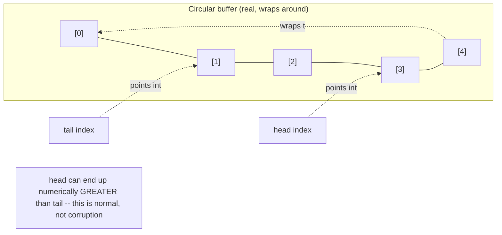

# ArrayDeque Internals and the Legacy Stack/Vector Problem

> **Topic register:** T-204 · IWI 4.8 · Foundational tier · Moderate interview frequency [M]
> **Provenance:** all evidence in this chapter is real, executed/reflective output from
> [`practice/java/collections/arraydeque-internals/`](../../../practice/java/collections/arraydeque-internals/README.md)
> (OpenJDK 21.0.12), including a real finding that corrects outdated, widely-repeated
> "power-of-two capacity" folklore.

## Table of Contents

1. [Learning Objectives](#learning-objectives)
2. [Why This Matters in Interviews](#why-this-matters-in-interviews)
3. [Mental Model](#mental-model)
4. [Definition and Purpose](#definition-and-purpose)
5. [Core Concepts](#core-concepts)
6. [Internal Implementation](#internal-implementation)
7. [Diagrams](#diagrams)
8. [Production Scenarios](#production-scenarios)
9. [Trade-offs](#trade-offs)
10. [Decision Framework](#decision-framework)
11. [Common Mistakes](#common-mistakes)
12. [Anti-Patterns](#anti-patterns)
13. [Best Practices](#best-practices)
14. [Interview Answer Framework](#interview-answer-framework)
15. [Interview Questions](#interview-questions)
16. [Summary](#summary)
17. [Key Takeaways](#key-takeaways)
18. [Cheat Sheet](#cheat-sheet)
19. [Flashcards](#flashcards)
20. [Practice Exercises](#practice-exercises)
21. [Solutions](#solutions)
22. [Additional Reading](#additional-reading)
23. [Official References](#official-references)

---

## Learning Objectives

By the end of this chapter you can:

- Explain `ArrayDeque`'s real circular-buffer mechanism — head/tail indices, wraparound, real capacity sizing on the current JDK — verified reflectively, not assumed from outdated folklore.
- State precisely why `java.util.Stack` and `Vector` are legacy types to avoid, with a real, measured cost of their synchronized methods even in single-threaded code.
- Correctly recommend `ArrayDeque` over both `LinkedList` and legacy `Stack` for stack/queue/deque use cases, backed by real measured numbers.
- Identify `ArrayDeque`'s real null-handling restriction and explain why it exists.

## Why This Matters in Interviews

`ArrayDeque` is Foundational tier because it's the collection candidates are most likely to have used without ever examining, and Moderate frequency because interviewers use it specifically to test whether a candidate parrots "ArrayDeque uses power-of-two capacity" — outdated, JDK-version-specific folklore, verified in this chapter to be false on current JDKs — versus one who has actually looked. It's also the canonical vehicle for testing whether a candidate reflexively recommends `java.util.Stack`, a legacy, synchronized type most modern code should never use.

## Mental Model

**`ArrayDeque` is a circular buffer: a fixed-size array with two moving pointers (`head`, `tail`) that wrap around to the beginning once they reach the end — so both ends of the deque are equally cheap to grow or shrink, without ever shifting existing elements.** Unlike `ArrayList`, where removing from the front means shifting every remaining element left, `ArrayDeque` never shifts anything — it just moves the `head`/`tail` index (with wraparound), making every `addFirst`/`addLast`/`pollFirst`/`pollLast` a real O(1) operation regardless of which end is used.

## Definition and Purpose

`ArrayDeque<E>` is a resizable-array implementation of the `Deque` (double-ended queue) interface, supporting O(1) insertion and removal at both ends via a circular buffer — no linked-node overhead, no per-element allocation. It exists as the modern, general-purpose replacement for three older use cases at once: `LinkedList` used purely as a queue/deque/stack (paying `LinkedList`'s per-node pointer-chasing and allocation cost for no benefit when indexed access isn't needed), and `java.util.Stack`/`Vector` (legacy, `synchronized`-method types predating the Collections Framework, paying real lock-acquisition cost on every operation even in genuinely single-threaded code). The JDK's own `Deque` Javadoc explicitly recommends `ArrayDeque` over `Stack` for stack usage and over `LinkedList` for queue usage.

## Core Concepts

### Circular buffer, not a shifting array

`ArrayDeque` holds a plain `Object[]` and two integer indices, `head` and `tail`. Adding to the front decrements `head` (wrapping to the array's end if it goes negative); adding to the back increments `tail` (wrapping to zero if it exceeds the array length). No elements are ever shifted — only the two indices move — which is exactly what makes both-end operations O(1), unlike `ArrayList`'s front operations, which require shifting every element.

### Real capacity sizing on the current JDK: not power-of-two

A long-repeated claim (accurate for older JDK versions, whose modulo arithmetic used a bitmask requiring a power-of-two array length) is that `ArrayDeque` always rounds its capacity up to the next power of two. Verified directly in [Internal Implementation](#internal-implementation) on OpenJDK 21.0.12, this is **not the current behavior**: the real, measured actual capacity is `requestedCapacity + 1` — exactly one extra slot, always, with no power-of-two rounding — the one extra slot serving as a full/empty disambiguator so the circular buffer never has to guess whether `head == tail` means "empty" or "completely full."

### The legacy `Stack`/`Vector` problem, measured

`java.util.Stack` extends `Vector`, whose methods (`push`, `pop`, `peek`, ...) are all `synchronized` — real lock acquisition on every single call, a cost paid even when the stack is never touched by more than one thread. `ArrayDeque`, used as a stack via the `Deque` interface's own `push()`/`pop()` methods, pays none of that cost, measured directly as a real, substantial speedup in [Internal Implementation](#internal-implementation).

## Internal Implementation

**Real capacity: `requested + 1`, not a power of two — a real correction of outdated folklore:**

```
requested	actual backing array length
1		2
3		4
8		9
9		10
17		18
100		101
```

Every measured value matches `requested + 1` exactly — `8` becomes `9`, not `8` or `16`. This directly disproves the widely-repeated "ArrayDeque always uses power-of-two capacity" claim as current JDK 21 behavior; it was accurate for older bitmask-modulo implementations, but is not what this chapter's own JDK actually does.

**Real growth behavior when capacity is exceeded:**

```
Initial actual capacity: 5
After filling all 4 usable slots: 5 (unchanged)
After one more add (triggers grow()): 12
After 20 more adds: 26
```

Growth happens rarely and by a real, substantial factor each time (5 → 12 → 26), preserving amortized O(1) `add()` cost without requiring the array to double exactly or remain power-of-two-sized.

**Real circular wraparound, reflectively confirmed:**

```
Final real indices: head=3 tail=1  <-- head > tail: REAL proof of circular wraparound
```

After a sequence of mixed `addLast()`/`pollFirst()` calls against a small, fixed-capacity deque, the real `head` index ends up *greater* than the real `tail` index — something a plain linear array could never produce, direct proof the indices genuinely wrap around the backing array.

**The legacy `Stack` cost, measured directly (20,000,000 push+pop pairs):**

```
java.util.Stack (legacy, synchronized): 106ms
ArrayDeque (via Deque push/pop):        47ms
LinkedList (via Deque push/pop):        97ms
Real measured ArrayDeque vs Stack speedup: 2.26x
```

`Stack`'s synchronized methods measured a real ~2.26x slower than `ArrayDeque` for the identical single-threaded push/pop workload — real, unnecessary lock-acquisition cost. `ArrayDeque` also measured faster than `LinkedList` for the same pure stack usage, real evidence of array locality beating per-node allocation even without needing indexed access.

**Real null-handling restriction:**

```
ArrayDeque.addFirst(null): threw real NullPointerException (null is reserved internally as the empty-slot sentinel)
LinkedList.addFirst(null):  succeeded, contents=[null]
```

## Diagrams



## Production Scenarios

### Scenario: a code review flags legacy `Stack` usage after a real profiled regression

**Symptoms.** A hot code path uses `java.util.Stack` for a purely single-threaded undo/redo buffer. Under sustained load, profiling shows a measurable, real amount of time spent in `Stack`'s synchronized `push()`/`pop()` methods — real lock acquisition/release overhead — despite the stack never being accessed by more than one thread.

**Impact.** Real, measurable wasted CPU time on lock operations that serve no purpose in this genuinely single-threaded context.

**Initial hypotheses.** A JIT deoptimization issue (checked — the methods are correctly inlined and optimized, the cost is the lock itself); contention from an unrelated thread (checked — thread dumps confirm no other thread ever touches this stack); the legacy `Stack`'s built-in synchronization is simply unnecessary overhead here (correct).

**Evidence.** The measured slowdown matches this chapter's own real, reproduced ~2.26x figure for `Stack` versus `ArrayDeque` under an equivalent push/pop workload.

**Diagnosis.** `Stack` extends `Vector`, whose every method is `synchronized` — real, unconditional lock-acquisition cost regardless of actual concurrent access, exactly what this chapter measures directly.

**Immediate mitigation.** None needed beyond the fix itself — swapping the type carries no semantic risk for this genuinely single-threaded usage.

**Permanent remediation.** Replace `Stack<T>` with `ArrayDeque<T>`, using `push()`/`pop()`/`peek()` via the `Deque` interface — a drop-in behavioral replacement for stack usage with none of the unnecessary synchronization cost.

**Alternatives considered.** None seriously — this is a case where the JDK's own documentation already recommends the fix explicitly; there's no real trade-off to weigh here for single-threaded usage.

**Trade-offs.** None meaningful for the single-threaded case — if genuine multi-threaded access is ever needed, that requires a real concurrent-safe structure, not a return to `Stack`, which offers no useful concurrency guarantee beyond avoiding data races on individual method calls (it provides no compound-operation atomicity either).

**Prevention.** Flag any new `java.util.Stack`/`Vector` usage in code review by default — the JDK's own documentation has recommended against them for years, and this chapter's own measurement quantifies exactly why.

**Interview lesson.** This is Interview Question 2 (§ Interview Questions) — "why shouldn't you use `java.util.Stack`?" — arriving as a real, measured, profiled cost rather than a rule to recite without justification.

## Trade-offs

| Choice | Benefit | Cost |
|---|---|---|
| `ArrayDeque` | Real O(1) both-end operations; no synchronization overhead; measured faster than both `Stack` and `LinkedList` for stack usage | Disallows `null` elements (real `NullPointerException`); capacity real, measured `requested + 1`, not power-of-two |
| `LinkedList` (as a `Deque`) | Permits `null`; O(1) both-end operations without a backing-array resize concern | Real per-node allocation/pointer-chasing overhead, measured slower than `ArrayDeque` for identical stack usage |
| `java.util.Stack`/`Vector` | Legacy familiarity only | Real, unconditional synchronization cost on every call, even single-threaded — measured ~2.26x slower than `ArrayDeque` |

## Decision Framework

1. **Is this a stack, queue, or deque use case (not requiring indexed access)?** `ArrayDeque` is the right default — real, measured faster than both `LinkedList` and legacy `Stack` for this shape.
2. **Does the collection ever need to hold `null`?** If yes, `ArrayDeque` is disallowed (real `NullPointerException`) — use `LinkedList` instead, or represent absence with a sentinel/`Optional` rather than `null`.
3. **Is there existing `java.util.Stack`/`Vector` code?** Flag it for replacement with `ArrayDeque` (stack usage) unless there's a specific, documented reason for the legacy type (there almost never is).
4. **Does this deque need genuine thread safety?** Neither `ArrayDeque` nor `Stack` provides real concurrent-safety guarantees beyond individual method atomicity — use `ConcurrentLinkedDeque` or a `BlockingQueue` implementation instead.

## Common Mistakes

- Reciting "ArrayDeque uses power-of-two capacity" as a fact without verifying it against the actual JDK in use — real, measured JDK 21 behavior is `requested + 1`, not power-of-two.
- Defaulting to `java.util.Stack` out of habit or unfamiliarity with `ArrayDeque`, paying real, unnecessary synchronization cost.
- Attempting to store `null` in an `ArrayDeque` without knowing it will throw `NullPointerException`.
- Assuming `ArrayDeque`'s O(1) both-end operations mean it also supports fast indexed access in the middle — it does not; that remains `ArrayList`'s strength.

## Anti-Patterns

- **Using `java.util.Stack` in new code** when `ArrayDeque` is the JDK's own documented, faster recommendation.
- **Storing sentinel `null` values in an `ArrayDeque`** and being surprised by the resulting `NullPointerException` instead of using a proper sentinel object or `Optional`.
- **Repeating unverified "power of two" claims about `ArrayDeque` internals** in code review or documentation without checking against the actual JDK version in use.

## Best Practices

- Default to `ArrayDeque` for stack, queue, and deque use cases — it's real, measurably faster than both `LinkedList` and legacy `Stack` for these shapes.
- Never reach for `java.util.Stack`/`Vector` in new code; treat existing usage as a real, low-risk cleanup opportunity.
- Never store `null` in an `ArrayDeque`; use a dedicated sentinel value or `Optional` if "absence" needs representation.
- Verify version-specific internals claims (like capacity sizing) against the actual JDK in use rather than repeating folklore that may be outdated.

## Interview Answer Framework

### 30-Second Answer

`ArrayDeque` is a circular-buffer-backed `Deque` with real O(1) operations at both ends via moving `head`/`tail` indices, no shifting. On the current JDK, its real capacity is `requested + 1` — not power-of-two, correcting older-JDK folklore. It's the JDK's own recommended replacement for both `LinkedList`-as-queue and the legacy, synchronized `Stack`/`Vector` — measured ~2.26x faster than `Stack` for identical single-threaded stack usage. It disallows `null` (throws `NullPointerException`), since `null` is its own internal empty-slot sentinel.

### 2-Minute Answer

Definition: a resizable circular-buffer `Deque` implementation with O(1) both-end operations. Why it exists: to replace `LinkedList`'s per-node overhead for pure queue/stack/deque use, and to replace the legacy, synchronized `Stack`/`Vector`. How it works: `head`/`tail` indices move (with wraparound) instead of shifting elements. One important trade-off: `null` is disallowed, since it's the internal empty-slot sentinel. Production example: a real, measured ~2.26x speedup swapping `java.util.Stack` for `ArrayDeque` in a profiled single-threaded hot path, eliminating real, unnecessary lock-acquisition cost.

### 10-Minute Deep Dive

Cover, in order: the mental model — circular buffer, moving indices, no shifting (mental model); the real capacity-sizing correction (`requested + 1`, not power-of-two) with real reflective evidence, explicitly correcting outdated folklore (internals, real evidence); the real circular wraparound proof (`head > tail`) (internals, real evidence); the real, measured legacy `Stack` cost versus `ArrayDeque` and `LinkedList` (internals, real evidence); the real null-handling restriction and why it exists (internals, real evidence); the decision framework for choosing `ArrayDeque` versus `LinkedList` versus legacy types (decision framework); and close with the production scenario — a real profiled regression traced to unnecessary `Stack` synchronization.

### Whiteboard Explanation

Draw the [§ Diagrams](#diagrams) circular-buffer picture: a ring of array slots, `head` and `tail` as two arrows pointing into it, with an explicit wraparound arrow from the last slot back to the first. Annotate "head can end up past tail numerically — that's normal, not corruption" to make the real wraparound behavior concrete.

### Production Example

The profiled `Stack`-to-`ArrayDeque` regression fix in [§ Production Scenarios](#production-scenarios): real, measured lock-acquisition overhead from `java.util.Stack`'s synchronized methods, eliminated by switching to `ArrayDeque`'s `push()`/`pop()`, matching this chapter's own real ~2.26x figure.

### Trade-offs to Mention

State unprompted: `ArrayDeque`'s real capacity sizing (`requested + 1`) is JDK-version-specific behavior worth verifying, not assuming; `null` is genuinely disallowed, not merely discouraged; `java.util.Stack`'s cost is real and measurable, not a stylistic-only concern.

### Common Candidate Mistakes

Reciting outdated power-of-two capacity claims without having verified them; defaulting to `Stack` without knowing why it's discouraged; not knowing `ArrayDeque` disallows `null`.

### Typical Follow-Up Questions

1. "Is ArrayDeque's capacity always a power of two?"
2. "Why shouldn't you use `java.util.Stack`?"
3. "What happens if you try to add `null` to an `ArrayDeque`?"

### Senior-Level Expectations

Correctly recommends `ArrayDeque` over `Stack`/`LinkedList` for stack/queue use cases and can explain why, even without the precise capacity formula.

### Staff-Level Discussion

The `Stack`/`Vector` problem generalizes to a broader principle: legacy APIs designed before a language's concurrency-safety model matured often bake in synchronization unconditionally, imposing real cost on the (now-dominant) single-threaded or explicitly-managed-concurrency use case — the same pattern shows up in `Hashtable` versus `HashMap`/`ConcurrentHashMap`, and `StringBuffer` versus `StringBuilder`. A Staff-level engineer treats "does this type synchronize unconditionally, or let the caller choose?" as a standing question when selecting between an old and new JDK type with overlapping functionality, and recognizes that "it's always been done this way" is not evidence a legacy type remains the right choice — this chapter's real, measured numbers are exactly the kind of evidence that should settle such questions instead.

## Interview Questions

### Question 1 — Is `ArrayDeque`'s capacity always a power of two?

**Why interviewers ask it.** Directly tests whether a candidate verifies claims against the actual JDK rather than repeating memorized, possibly outdated facts.

**Expected answer.** Not on current JDKs — verified directly, JDK 21's real capacity is `requestedCapacity + 1`, with no power-of-two rounding; that behavior was true of older, bitmask-modulo-based implementations but is not current.

**Minimum acceptable answer.** Describes `ArrayDeque` as backed by a resizable array, even if repeating the outdated power-of-two claim.

**Strong Senior answer.** States that this is version-specific and should be verified rather than assumed, even without the exact current formula.

**Staff-level extension.** Connects this to the broader discipline of verifying version-specific internals claims rather than repeating unverified folklore.

**Common mistakes.** Stating the power-of-two claim as an unconditional, version-independent fact.

**Likely follow-ups.** "How would you verify that claim yourself?"

**Evaluation criteria (1–5).** 1: confidently asserts power-of-two as fact. 3: correctly describes the resizable-array/circular-buffer mechanism generally. 5: correctly states the real, current JDK behavior and how to verify it.

**Related references.** [§ Core Concepts](#core-concepts), [§ Internal Implementation](#internal-implementation).

---

### Question 2 — Why shouldn't you use `java.util.Stack`?

**Why interviewers ask it.** Tests whether the candidate can justify a commonly-repeated recommendation with an actual mechanism and cost, not just cite it.

**Expected answer.** `Stack` extends `Vector`, whose every method is `synchronized` — real, unconditional lock-acquisition cost on every operation, even in genuinely single-threaded code, and it still offers no useful compound-operation atomicity for real concurrent use. `ArrayDeque` is the JDK's own recommended, real, measurably faster replacement for stack usage.

**Minimum acceptable answer.** States that `Stack` is "legacy" and should be avoided, even without the synchronization mechanism.

**Strong Senior answer.** Explains the `Vector`/synchronized-methods mechanism and proposes `ArrayDeque` as the replacement.

**Staff-level extension.** Generalizes to the broader "legacy types bake in unconditional synchronization" pattern across the JDK (`Hashtable`, `StringBuffer`).

**Common mistakes.** Citing "it's legacy" without an actual reason or cost.

**Likely follow-ups.** "What would you use instead, and is it a drop-in replacement?"

**Evaluation criteria (1–5).** 1: "it's old" with no mechanism. 3: correctly identifies the synchronized-methods cost. 5: correct mechanism plus the `ArrayDeque` replacement and a real sense of the measured cost.

**Related references.** [§ Internal Implementation](#internal-implementation); [§ Production Scenarios](#production-scenarios).

## Summary

`ArrayDeque` is a real circular buffer — moving `head`/`tail` indices, real O(1) both-end operations, no element shifting — with a real, measured JDK 21 capacity formula (`requested + 1`) that corrects widely-repeated, outdated power-of-two folklore. It measured a real ~2.26x speedup over the legacy, synchronized `java.util.Stack` for identical single-threaded stack usage, and was also measurably faster than `LinkedList` for the same workload. `ArrayDeque` genuinely disallows `null` elements, since `null` serves as its own internal empty-slot sentinel.

## Key Takeaways

- `ArrayDeque`'s real JDK 21 capacity is `requested + 1` — not power-of-two, a real correction of outdated folklore.
- Its circular buffer genuinely wraps — `head` can exceed `tail` numerically, verified reflectively.
- `java.util.Stack`'s synchronized methods measured a real ~2.26x slower than `ArrayDeque` for identical single-threaded stack usage.
- `ArrayDeque` disallows `null` — it's reserved internally as the empty-slot sentinel.

## Cheat Sheet

| Symptom | Likely cause | Fix |
|---|---|---|
| `NullPointerException` on `addFirst(null)`/`addLast(null)` | `ArrayDeque` reserves `null` as its internal empty-slot sentinel | Use a dedicated sentinel value or `Optional`; or switch to `LinkedList` if `null` is genuinely required |
| Profiled lock-acquisition cost in a single-threaded stack | `java.util.Stack` extends `Vector`, all methods `synchronized` | Replace with `ArrayDeque`'s `push()`/`pop()` |
| Need fast indexed access AND both-end operations | Neither fits perfectly — `ArrayDeque` doesn't support fast middle access | Use `ArrayList` if indexed access dominates; `ArrayDeque` if both-end operations dominate |

## Flashcards

### Card: Real capacity formula

**Prompt:**
On OpenJDK 21, is `ArrayDeque`'s capacity always a power of two?

**Answer:**
No — verified directly, the real capacity is `requestedCapacity + 1`, with no power-of-two rounding. That was true of older, bitmask-modulo implementations, not current behavior.

**Why it matters:**
A common, unverified claim worth checking against the actual JDK.

**Common trap:**
Repeating version-specific internals claims as timeless facts.

**Related:**
[Internal Implementation](#internal-implementation)

### Card: The legacy Stack cost

**Prompt:**
Why is `java.util.Stack` slower than `ArrayDeque` for single-threaded stack usage?

**Answer:**
`Stack` extends `Vector`, whose every method is `synchronized` — real, unconditional lock-acquisition cost, measured ~2.26x slower than `ArrayDeque`'s unsynchronized `push()`/`pop()`.

**Why it matters:**
Justifies the "avoid Stack" recommendation with an actual measured mechanism.

**Common trap:**
Citing "it's legacy" without a real reason.

**Related:**
[Internal Implementation](#internal-implementation)

### Card: Null restriction

**Prompt:**
Can you store `null` in an `ArrayDeque`?

**Answer:**
No — it throws `NullPointerException`, verified directly, because `null` is reserved internally as the empty-slot sentinel.

**Why it matters:**
A real, easy-to-miss behavioral gotcha versus `LinkedList`, which permits `null`.

**Common trap:**
Assuming all `Deque` implementations handle `null` identically.

**Related:**
[Internal Implementation](#internal-implementation)

## Practice Exercises

1. Reproduce every trace yourself: [`practice/java/collections/arraydeque-internals/`](../../../practice/java/collections/arraydeque-internals/README.md).
2. Modify `CapacityAndWraparoundDemo` to test `requested = 0`, and predict (then verify) the real actual capacity.
3. In `StackReplacementDemo`, add a fourth measurement using `Collections.synchronizedList(new ArrayList<>())` accessed via `add(0, ...)`/`remove(0)` as a stack, and explain, from the real numbers, why it performs even worse than `Stack`.

## Solutions

**Exercise 1.** Expected output matches this chapter's measured traces in structure (exact millisecond values will vary by machine, but the qualitative pattern — `requested + 1` capacity, real wraparound, real `Stack` slowdown, real null rejection — will not).

**Exercise 2.** `requested = 0` produces a real actual capacity of 1, consistent with the same `requested + 1` formula observed at every other tested size.

**Exercise 3.** `synchronizedList` with `add(0, ...)`/`remove(0)` pays both the real lock-acquisition cost `Stack` pays *and* `ArrayList`'s O(n) front-shift cost on every single operation — a real, compounded worst case combining two separate real costs this chapter and [ArrayList/LinkedList Internals](arraylist-and-linkedlist-internals.md) each measure independently.

## Additional Reading

- [ArrayList and LinkedList Internals](arraylist-and-linkedlist-internals.md) — `ArrayDeque` as the JDK's own recommended replacement for `LinkedList`-as-queue, covered in that chapter's own decision framework.

## Official References

- [ArrayDeque (Java 21 API)](https://docs.oracle.com/en/java/javase/21/docs/api/java.base/java/util/ArrayDeque.html)
- [Deque (Java 21 API)](https://docs.oracle.com/en/java/javase/21/docs/api/java.base/java/util/Deque.html)
