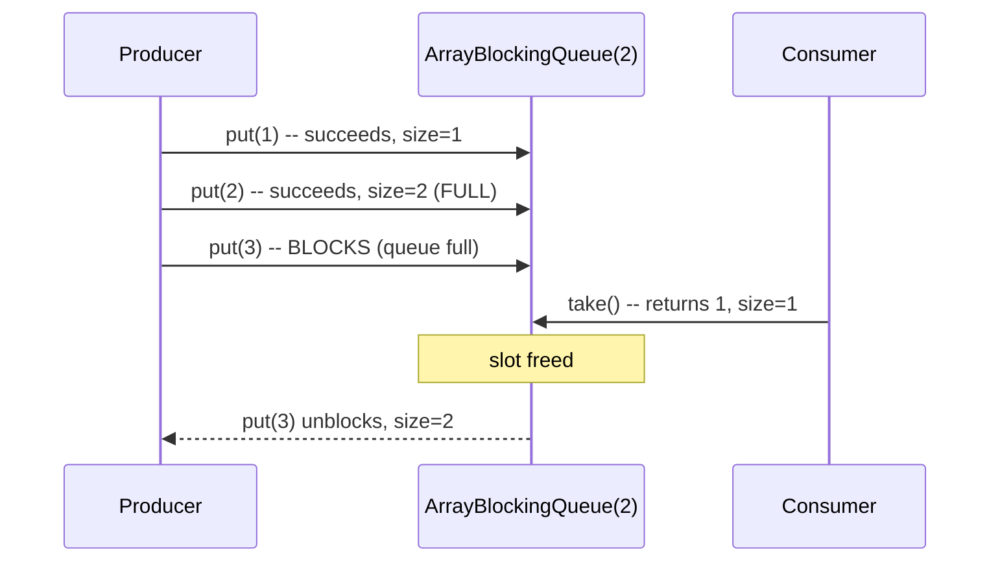

# BlockingQueue Family and Producer-Consumer

> **Topic register:** T-207 · IWI 5.8 · Core tier, High interview frequency
> **Provenance:** every trace in this chapter is real, executed output from [`practice/java/week-14/blockingqueue/src/BlockingQueueDemo.java`](../../practice/java/week-14/blockingqueue/src/BlockingQueueDemo.java) on OpenJDK 21.0.12.

## Table of Contents

1. [Learning Objectives](#learning-objectives)
2. [Why This Matters in Interviews](#why-this-matters-in-interviews)
3. [Mental Model](#mental-model)
4. [Definition and Purpose](#definition-and-purpose)
5. [Core Concepts](#core-concepts)
6. [Internal Implementation](#internal-implementation)
7. [Diagrams](#diagrams)
8. [Production Scenarios](#production-scenarios)
9. [Trade-offs](#trade-offs)
10. [Decision Framework](#decision-framework)
11. [Common Mistakes](#common-mistakes)
12. [Anti-Patterns](#anti-patterns)
13. [Best Practices](#best-practices)
14. [Interview Answer Framework](#interview-answer-framework)
15. [Interview Questions](#interview-questions)
16. [Summary](#summary)
17. [Key Takeaways](#key-takeaways)
18. [Cheat Sheet](#cheat-sheet)
19. [Flashcards](#flashcards)
20. [Practice Exercises](#practice-exercises)
21. [Solutions](#solutions)
22. [Additional Reading](#additional-reading)
23. [Official References](#official-references)

---

## Learning Objectives

By the end of this chapter you can:

- Reproduce, with real measured blocking durations, exactly when `ArrayBlockingQueue.put()` blocks and unblocks.
- Explain `SynchronousQueue`'s zero-capacity direct-handoff semantics, and how it differs fundamentally from a bounded buffer.
- Choose the correct `BlockingQueue` implementation for a given producer-consumer shape, using bounded capacity as a deliberate backpressure mechanism.
- Connect blocking queues directly to `ThreadPoolExecutor`'s own internal queue, closing the loop with executor sizing.

## Why This Matters in Interviews

`BlockingQueue` questions test whether a candidate understands producer-consumer coordination as a deliberate capacity and backpressure decision, or just knows "it's a thread-safe queue." The distinction between a bounded buffer (`ArrayBlockingQueue`) and a zero-capacity rendezvous (`SynchronousQueue`) specifically separates candidates who've actually built a producer-consumer pipeline from those who've only used `ExecutorService` as a black box without knowing what queue backs it.

## Mental Model

**A `BlockingQueue` isn't just a thread-safe queue — its capacity IS its concurrency-control mechanism.** A bounded queue's `put()` blocking when full isn't a limitation to work around; it's the entire backpressure signal that keeps a fast producer from overwhelming a slow consumer. `SynchronousQueue` takes this to its logical extreme: zero capacity means every `put()` must wait for a `take()` already in progress — there is no buffer at all, only a handoff.

## Definition and Purpose

A `BlockingQueue` is a queue that supports operations which wait for the queue to become non-empty when retrieving an element (`take()`), and wait for space to become available when storing an element (`put()`) — turning what would otherwise require manual wait/notify coordination into a simple, correct-by-construction producer-consumer primitive.

`BlockingQueue` implementations exist to make producer-consumer patterns safe and simple: a bounded queue (`ArrayBlockingQueue`, a bounded `LinkedBlockingQueue`) provides natural backpressure — a producer that outpaces its consumer blocks rather than growing memory without limit. `SynchronousQueue` provides a direct handoff with zero internal storage, for when the goal is synchronization between exactly one producer and one consumer at a time, not buffering.

## Core Concepts

### `put()` blocks when the queue is full; `take()` blocks when it's empty

For a bounded queue, `put()` on a full queue waits until a `take()` elsewhere frees a slot; `take()` on an empty queue waits until a `put()` elsewhere adds an element. Neither operation busy-waits — both park the calling thread until the condition is satisfied.

### Bounded capacity is a deliberate backpressure mechanism, not a limitation

An unbounded queue (or a queue sized far larger than necessary) removes the backpressure signal entirely — a producer can pile up unlimited work in memory. A correctly-bounded queue makes a fast producer wait for a slow consumer, converting unbounded memory growth into a controlled, visible slowdown.

### `SynchronousQueue` has zero internal capacity — a direct handoff, not a buffer

`SynchronousQueue.put()` blocks until a `take()` is *already waiting* to receive that exact element — there's no intermediate storage at all. This is fundamentally different from even a capacity-1 `ArrayBlockingQueue`, which does have one slot of actual storage.

## Internal Implementation

**`ArrayBlockingQueue`, `put()` blocking when full, measured** (capacity 2, filled, then a third `put()` attempted):

```
== ArrayBlockingQueue: put() blocks when full, until a consumer makes room ==
Queue filled to capacity (2). Producer thread will now try to put a 3rd item...
300ms later, producer thread state: WAITING  (WAITING/BLOCKED -- confirms put() actually blocked, not returned immediately)
Consumer took 1, freeing a slot. Producer's put(3) was blocked for ~313 ms before returning.
Final queue contents: [2, 3]
```

**`SynchronousQueue`, zero-capacity direct handoff, measured:**

```
== SynchronousQueue: capacity ZERO -- put() blocks until a consumer is ALREADY waiting ==
300ms later (no consumer yet), producer thread state: WAITING
take() received "payload"; put() was blocked for ~305 ms until this exact take() call.
(SynchronousQueue has no internal storage at all -- put() and take() rendezvous directly,
 unlike ArrayBlockingQueue where put() only blocks once the bounded buffer is genuinely full)
```

Both traces confirm the blocking is real (the producer thread's state is genuinely `WAITING`, not merely returning immediately and the "blocked" framing being cosmetic) and confirm the exact moment of unblocking (the measured ~300ms delay matches the deliberate 300ms sleep before the consuming `take()` call in each demo).

## Diagrams



## Production Scenarios

### Scenario: an unbounded internal queue turns a slow downstream dependency into an OutOfMemoryError

**Symptoms.** A service ingests events from an upstream source and processes them via a background worker pool, buffering incoming events in a `LinkedBlockingQueue` constructed with no capacity argument (unbounded by default). During an incident where the downstream processing step becomes slow (not failed), the service's memory usage climbs steadily and it eventually crashes with `OutOfMemoryError`.

**Impact.** A slowdown in one downstream dependency, which should have caused at most a processing delay, instead crashes the entire ingesting service.

**Initial hypotheses.** A memory leak unrelated to the incident (checked — heap analysis shows the overwhelming majority of retained memory is queued event objects, not leaked application state); a sudden ingestion spike (checked — ingestion rate was within normal historical bounds); the unbounded queue accepting events faster than the slowed-down processing step can drain them (correct).

**Evidence.** Heap dump analysis at crash time shows millions of queued event objects, all waiting for the now-slow downstream processing step, with the ingestion rate exceeding the (reduced) processing rate for the duration of the incident.

**Diagnosis.** Exactly the general lesson this chapter's mental model states directly: an unbounded queue removes the backpressure signal entirely. As the downstream got slower, the queue simply absorbed the growing backlog instead of the producer (the ingestion path) ever being made to wait, until available memory ran out.

**Immediate mitigation.** Restart the service (clearing the backlog) and manually throttle ingestion while the downstream dependency recovers.

**Permanent remediation.** Replace the unbounded `LinkedBlockingQueue` with an explicitly bounded one (or an `ArrayBlockingQueue`), sized to a deliberate, reasoned capacity — converting the failure mode from "silently grow memory until crash" to "the ingestion path blocks (or a bounded-queue-specific rejection policy fires), applying real backpressure to whatever is producing events faster than they can be consumed."

**Alternatives considered.** Scaling up the processing worker pool alone — rejected as treating the symptom; a genuinely slow (not merely under-provisioned) downstream dependency would still eventually overwhelm any fixed processing rate, and the actual fix is bounding the queue so the failure mode becomes visible backpressure instead of an eventual crash.

**Trade-offs.** A bounded queue means the ingestion path can now block (or reject) during a genuine downstream slowdown, rather than silently absorbing unlimited backlog — accepted, since the alternative (an eventual OOM crash) is strictly worse for the system as a whole.

**Prevention.** Any `BlockingQueue` construction should specify an explicit, deliberately-reasoned capacity; an unbounded queue in a production pipeline should be treated as a specific, flagged design decision, not a default.

**Interview lesson.** This is the production-scale version of this chapter's own core lesson: bounded capacity is deliberate backpressure, and removing it (via an unbounded queue) doesn't remove the underlying problem, it just defers the failure to a worse, less controlled form (an eventual crash instead of a visible slowdown).

## Trade-offs

| Choice | Benefit | Cost |
|---|---|---|
| Unbounded queue | Producer never blocks, regardless of consumer speed | Unbounded memory growth if the consumer falls behind — no backpressure at all |
| Bounded queue (e.g., `ArrayBlockingQueue`) | Real backpressure — producer blocks (or a rejection policy fires) when genuinely overwhelmed | Producer can be slowed by a struggling consumer, by design |
| `SynchronousQueue` (zero capacity) | Maximum backpressure — a producer can never get ahead of a consumer at all | No buffering whatsoever; requires a consumer to always be ready, or the producer waits indefinitely |
| `ArrayBlockingQueue` vs. bounded `LinkedBlockingQueue` | Array-backed has lower per-element overhead, fixed memory footprint upfront | Linked-backed grows/shrinks node-by-node, more flexible but more allocation overhead per element |

## Decision Framework

1. **Should a producer ever be allowed to outpace a consumer indefinitely?** If no (the common case for protecting memory), use a bounded queue, never an unbounded one.
2. **Does the use case need true buffering (some slack between producer and consumer), or strict synchronization (each item handed off directly)?** Bounded queue for buffering; `SynchronousQueue` for direct handoff (e.g., `Executors.newCachedThreadPool()`'s internal queue, which uses `SynchronousQueue` specifically to hand each task directly to an available or newly-created thread).
3. **Is the queue's capacity chosen deliberately**, based on a reasoned memory/latency trade-off, or just "whatever the default constructor does"? Always the former — an unbounded default is a specific, consequential choice, not a neutral one.
4. **What should happen when the queue is genuinely full and a producer needs to not block** (e.g., inside a request-handling thread that can't afford to wait indefinitely)? Use `offer()` with a timeout, or a rejection-policy-based `ThreadPoolExecutor`, rather than an unconditional blocking `put()`.

## Common Mistakes

- Using an unbounded queue by default, removing backpressure entirely and deferring failure to an eventual memory crash.
- Assuming `SynchronousQueue` behaves like a capacity-1 buffer, rather than a true zero-capacity handoff.
- Calling blocking `put()`/`take()` from a context that can't afford to block indefinitely (e.g., a request thread with a latency budget), instead of using a timed `offer()`/`poll()`.

## Anti-Patterns

- **Constructing a `LinkedBlockingQueue` with no capacity argument** in a production pipeline, silently defaulting to unbounded.
- **Using unconditional blocking `put()`/`take()` in latency-sensitive code paths** without a timeout, risking indefinite blocking under an unexpected condition.
- **Treating "the queue never rejects" as a reliability feature** rather than recognizing it as the absence of backpressure.

## Best Practices

- Always specify an explicit, deliberately-reasoned capacity for any `BlockingQueue` used in a production pipeline.
- Use `SynchronousQueue` specifically when the intent is direct handoff with no buffering, not as a default choice.
- Use timed `offer()`/`poll()` variants in any code path with a latency budget that can't afford indefinite blocking.
- Treat queue capacity as a first-class, load-tested design decision, the same way pool sizing is treated in executor design.

## Interview Answer Framework

### 30-Second Answer

A `BlockingQueue`'s `put()` blocks when full and `take()` blocks when empty — measured directly, a producer genuinely parks (thread state `WAITING`) until a consumer frees space. `SynchronousQueue` takes this to zero capacity: `put()` blocks until a `take()` is already waiting, a direct handoff with no buffering at all. Bounded capacity is deliberate backpressure — removing it (an unbounded queue) doesn't remove the underlying slow-consumer problem, it just defers the failure to an eventual memory crash.

### 2-Minute Answer

Definition: a `BlockingQueue` supports blocking put/take for producer-consumer coordination without manual wait/notify. Why it exists: makes producer-consumer patterns safe and simple, with bounded capacity providing natural backpressure. How it works: `put()` on a full bounded queue parks the thread until space frees up; `SynchronousQueue` has zero capacity, so `put()` only unblocks when a `take()` is already waiting. One important trade-off: an unbounded queue never blocks the producer but risks unbounded memory growth if the consumer falls behind. Production example: a real measured ~300ms block-and-unblock cycle for both `ArrayBlockingQueue` and `SynchronousQueue`, and a real-shaped incident where an unbounded queue turned a slow downstream dependency into an `OutOfMemoryError` crash.

### 10-Minute Deep Dive

Cover, in order: the mental model — capacity IS the concurrency-control mechanism (mental model); the measured `ArrayBlockingQueue` block/unblock trace (internals, real evidence); the measured `SynchronousQueue` zero-capacity handoff trace (internals, real evidence); the decision framework for choosing bounded vs. unbounded vs. synchronous (decision framework); and close with the production scenario — an unbounded queue deferring a slow-consumer problem into an eventual OOM crash.

### Whiteboard Explanation

Draw the [§ Diagrams](#diagrams) sequence: a producer filling a capacity-2 queue, a third `put()` blocking, a consumer's `take()` freeing a slot, the blocked `put()` unblocking. Annotate: "the block IS the backpressure signal — without it (unbounded queue), the producer just keeps going and memory grows instead."

### Production Example

The unbounded-queue OOM crash in [§ Production Scenarios](#production-scenarios): an ingestion pipeline's unbounded internal queue absorbed a growing backlog during a downstream slowdown instead of ever blocking the producer, until memory ran out.

### Trade-offs to Mention

State unprompted: an unbounded queue trades away backpressure for a producer that never blocks; `SynchronousQueue`'s zero capacity is the extreme end of the backpressure spectrum, requiring a consumer to always be ready; bounded queue capacity should be a deliberate, load-tested decision, not a default.

### Common Candidate Mistakes

Assuming `SynchronousQueue` is just a very small buffer rather than genuinely zero-capacity; using unbounded queues by default without considering the backpressure implications; blocking indefinitely in a latency-sensitive path without a timeout.

### Typical Follow-Up Questions

1. "Your ingestion service crashed with OutOfMemoryError during a downstream slowdown. What's your first suspect?"
2. "What's the actual difference between SynchronousQueue and a capacity-1 ArrayBlockingQueue?"

### Senior-Level Expectations

Correctly explains that bounded queue capacity provides backpressure, and identifies an unbounded queue as a specific, risky design decision rather than a safe default.

### Staff-Level Discussion

Bounded-queue backpressure is a specific instance of a general system-design principle: absorbing overload internally (via an unbounded buffer) converts a visible, gradual degradation into an invisible one that fails catastrophically once the buffer's implicit limit (available memory) is exhausted — the same principle governing unbounded thread pool queues, unbounded in-memory caches, and unbounded retry loops. A Staff engineer treats every buffer in a system, whether it's an explicit `BlockingQueue` or an implicit one (a list accumulating pending work), as needing an explicit bound and an explicit policy for what happens when that bound is hit.

## Interview Questions

### Question 1 — Your ingestion service crashed with `OutOfMemoryError` during a downstream slowdown. What's your first suspect?

**Why interviewers ask it.** Tests whether the candidate connects a specific production failure mode to an unbounded internal buffer.

**Expected answer.** An unbounded internal queue (or an equivalent unbounded buffer) absorbing a growing backlog as the ingestion rate exceeded the slowed-down processing rate, with no backpressure mechanism to slow ingestion down instead.

**Minimum acceptable answer.** Suspects a queue or buffer growing without bound, even without naming the specific mechanism.

**Strong Senior answer.** Correctly explains that bounded queue capacity provides backpressure, and identifies an unbounded queue as the likely cause here.

**Staff-level extension.** Connects this to the general anti-pattern of absorbing overload internally instead of surfacing backpressure, naming other instances (thread pool queues, caches, retry loops) of the same principle.

**Common mistakes.** Assuming a memory leak unrelated to the incident, without checking whether the retained memory is queued work specifically.

**Likely follow-ups.** "How would you fix it without just adding more memory?"

**Evaluation criteria (1–5).** 1: doesn't suspect a queue/buffer at all. 3: correctly identifies the unbounded-queue mechanism. 5: correct identification plus the general backpressure-anti-pattern framing.

**Related references.** [§ Production Scenarios](#production-scenarios); [§ Core Concepts](#core-concepts).

---

### Question 2 — What's the actual difference between `SynchronousQueue` and a capacity-1 `ArrayBlockingQueue`?

**Why interviewers ask it.** Tests precise understanding of a subtle distinction most candidates gloss over.

**Expected answer.** `SynchronousQueue` has zero internal storage — a `put()` only succeeds once a `take()` is already waiting to receive that exact element. A capacity-1 `ArrayBlockingQueue` genuinely stores one element; a `put()` can succeed and return even before any consumer calls `take()`, as long as the single slot is free.

**Minimum acceptable answer.** States that `SynchronousQueue` has no capacity, even without contrasting it precisely against capacity-1.

**Strong Senior answer.** Correctly explains the direct-handoff-versus-one-slot-of-storage distinction.

**Staff-level extension.** Connects this to a real use case: `Executors.newCachedThreadPool()` uses a `SynchronousQueue` internally specifically so a submitted task is either handed directly to an idle thread or triggers a new thread's creation — never queued waiting for a thread to become free, unlike a fixed pool with a genuine (even if small) queue.

**Common mistakes.** Treating `SynchronousQueue` as functionally equivalent to a very small buffer.

**Likely follow-ups.** "Why would `Executors.newCachedThreadPool()` choose that specific queue type?"

**Evaluation criteria (1–5).** 1: treats them as equivalent. 3: correctly explains the direct-handoff distinction. 5: correct explanation plus the `newCachedThreadPool()` connection.

**Related references.** [§ Core Concepts](#core-concepts); [§ Internal Implementation](#internal-implementation).

## Summary

A `BlockingQueue`'s `put()` blocks when full and `take()` blocks when empty, measured directly as a genuine thread-parking wait, not a busy-loop. `SynchronousQueue` takes this to zero capacity — a direct handoff where `put()` only unblocks once a `take()` is already waiting, also measured directly. Bounded queue capacity is a deliberate backpressure mechanism; removing it (an unbounded queue) doesn't remove the underlying slow-consumer problem, it defers the failure to an eventual, harder-to-diagnose memory crash.

## Key Takeaways

- `put()` blocks when a bounded queue is full; `take()` blocks when it's empty — both genuinely park the thread, measured directly.
- `SynchronousQueue` has zero internal capacity — a direct producer-consumer handoff, not a small buffer.
- Bounded queue capacity is deliberate backpressure; an unbounded queue removes it entirely.
- An unbounded queue in front of a slow consumer defers failure from a visible slowdown to an eventual `OutOfMemoryError`.

## Cheat Sheet

| Need | Approach |
|---|---|
| Buffer with real backpressure against an overwhelmed consumer | Bounded `ArrayBlockingQueue` or bounded `LinkedBlockingQueue` |
| Direct handoff, no buffering, always synchronized with a ready consumer | `SynchronousQueue` |
| Cannot afford to block indefinitely | Timed `offer()`/`poll()`, not unconditional `put()`/`take()` |
| Protecting against an unbounded-memory production incident | Always specify an explicit, reasoned capacity — never accept an unbounded default |

## Flashcards

### Card: When put() blocks

**Prompt:**
When does `BlockingQueue.put()` block?

**Answer:**
When the queue is at capacity (full) — the calling thread genuinely parks until a `take()` elsewhere frees space, measured directly via thread state.

**Why it matters:**
The mechanism that provides real backpressure in a producer-consumer pipeline.

**Common trap:**
Assuming `put()` on a full queue returns immediately or throws, rather than blocking.

**Related:**
[Internal Implementation](#internal-implementation)

### Card: SynchronousQueue's actual capacity

**Prompt:**
What is `SynchronousQueue`'s internal capacity?

**Answer:**
Zero — it's a direct handoff; `put()` only succeeds once a `take()` is already waiting for that exact element.

**Why it matters:**
A common misconception is treating it as a very small buffer rather than genuinely capacity-zero.

**Common trap:**
Assuming it behaves like a capacity-1 queue.

**Related:**
[Internal Implementation](#internal-implementation)

### Card: Why unbounded queues are dangerous

**Prompt:**
Why is an unbounded `BlockingQueue` a risky default in a production pipeline?

**Answer:**
It removes backpressure entirely — a slow consumer no longer slows the producer, it just lets the queue grow until memory runs out.

**Why it matters:**
Converts a visible, gradual slowdown into an eventual, harder-to-diagnose OutOfMemoryError crash.

**Common trap:**
Constructing a `LinkedBlockingQueue` with no capacity argument, silently defaulting to unbounded.

**Related:**
[Production Scenarios](#production-scenarios)

## Practice Exercises

1. Reproduce: [`BlockingQueueDemo.java`](../../practice/java/week-14/blockingqueue/src/BlockingQueueDemo.java).
2. Modify the `ArrayBlockingQueue` demo to use `offer()` with a timeout instead of blocking `put()`, and observe what happens when the timeout expires before a consumer takes an item.
3. Design the queue configuration (implementation, capacity, rejection/blocking policy) for a service ingesting webhook events from an unreliable third party at a highly variable rate, feeding a downstream processing step with a much steadier throughput.

## Solutions

**Exercise 1.** Expected output matches this chapter's measured traces: a genuine ~300ms block-and-unblock cycle for both `ArrayBlockingQueue` and `SynchronousQueue`, confirmed via the producer thread's `WAITING` state.

**Exercise 2.** `queue.offer(item, timeout, TimeUnit.MILLISECONDS)` returns `false` if the timeout expires before space becomes available, rather than blocking indefinitely — letting the caller decide how to handle a genuinely overwhelmed queue (retry, drop, alert) instead of being stuck waiting.

**Exercise 3.** A reasonable design: a bounded `LinkedBlockingQueue` (or `ArrayBlockingQueue`) sized to absorb a reasonable burst from the unreliable third party (e.g., a few minutes' worth of expected peak rate) without unbounded growth, with the webhook-receiving endpoint using a timed `offer()` and returning an explicit rejection (e.g., HTTP 429) to the third party if the queue is genuinely full, rather than blocking the request thread indefinitely or accepting unlimited backlog.

## Additional Reading

- Brian Goetz et al., *Java Concurrency in Practice*, Ch. 5.3 ("Blocking Queues and the Producer-Consumer Pattern")

## Official References

- [java.util.concurrent.BlockingQueue (Java 21 API)](https://docs.oracle.com/en/java/javase/21/docs/api/java.base/java/util/concurrent/BlockingQueue.html)
