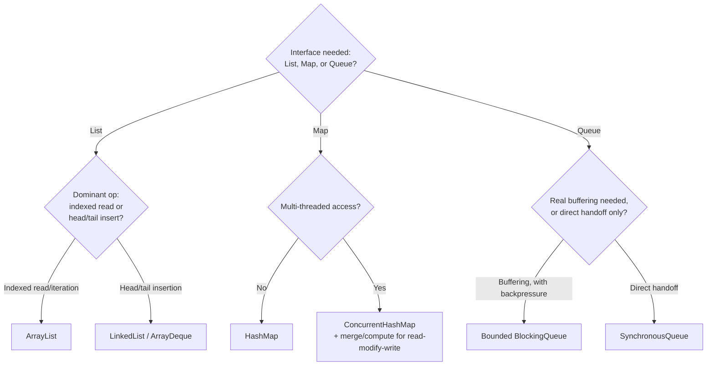

# Collection Selection Decision Matrix

> **Topic register:** T-209 · IWI 5.7 · Core tier, High interview frequency

## Table of Contents

1. [Learning Objectives](#learning-objectives)
2. [Why This Matters in Interviews](#why-this-matters-in-interviews)
3. [Mental Model](#mental-model)
4. [Definition and Purpose](#definition-and-purpose)
5. [Core Concepts](#core-concepts)
6. [Diagrams](#diagrams)
7. [Production Scenarios](#production-scenarios)
8. [Trade-offs](#trade-offs)
9. [Decision Framework](#decision-framework)
10. [Common Mistakes](#common-mistakes)
11. [Anti-Patterns](#anti-patterns)
12. [Best Practices](#best-practices)
13. [Interview Answer Framework](#interview-answer-framework)
14. [Interview Questions](#interview-questions)
15. [Summary](#summary)
16. [Key Takeaways](#key-takeaways)
17. [Cheat Sheet](#cheat-sheet)
18. [Flashcards](#flashcards)
19. [Practice Exercises](#practice-exercises)
20. [Solutions](#solutions)
21. [Additional Reading](#additional-reading)
22. [Official References](#official-references)

---

## Learning Objectives

By the end of this chapter you can:

- Work through a structured decision process for choosing a collection type, rather than defaulting to habit.
- State the specific measured evidence (from this week's other chapters) that justifies each decision branch.
- Explain why "it's a List/Map/Queue" is an incomplete answer, and what question actually determines the right implementation.
- Choose correctly between at least two plausible implementations for a given access pattern, and articulate the trade-off out loud.

## Why This Matters in Interviews

This topic tests synthesis: can a candidate combine what they know about `HashMap`, `ArrayList`/`LinkedList`, `ConcurrentHashMap`, and `BlockingQueue` into a single, principled decision process, rather than only being able to discuss each in isolation? Interviewers use collection-selection questions specifically because the "right" answer depends on articulating a real access pattern first — exactly the skill that separates a candidate who's memorized four separate topics from one who understands them as a coherent, related set of trade-offs.

## Mental Model

**Every collection choice reduces to the same three questions: how is it read, how is it written, and does more than one thread touch it?** `List` vs. `Map` vs. `Queue` is usually obvious from the problem shape; the harder, more interview-relevant decision is which *implementation* of that interface fits the actual read/write pattern — and that decision should always be traceable back to a specific, nameable operation's complexity, not a general reputation ("ArrayList is usually fine").

## Definition and Purpose

Collection selection is the discipline of choosing a specific implementation (not just an interface) based on the actual dominant access pattern a piece of code exhibits — indexed reads versus iteration versus head/tail insertion for lists; single-threaded versus concurrent access for maps; buffering versus direct handoff for queues.

This exists because the JDK deliberately offers multiple implementations of the same interface with different performance characteristics, and defaulting to one out of habit (`ArrayList` for every `List`, `HashMap` for every `Map`) forfeits real, measurable performance available from actually matching the implementation to the access pattern.

## Core Concepts

### List selection: indexed access versus head/tail insertion

`ArrayList` for indexed reads and iteration (O(1) get, measured ~320x faster than `LinkedList` for random access); `LinkedList` (or better, `ArrayDeque`) for frequent head/tail insertion at an already-known position (O(1), measured ~117x faster than `ArrayList` for front-insertion).

### Map selection: single-threaded versus concurrent access, and the hash-quality prerequisite

`HashMap` for single-threaded or externally-synchronized access; `ConcurrentHashMap` for genuine multi-threaded access, using `merge()`/`compute()` for any read-modify-write rather than `get()`+`put()` (measured to lose updates otherwise). Either way, the key type's `hashCode()` distribution quality determines whether the O(1) average case actually holds (measured ~3,076x slowdown for a poor distribution).

### Queue selection: bounded buffering versus direct handoff

A bounded `BlockingQueue` (`ArrayBlockingQueue`, a capacity-limited `LinkedBlockingQueue`) for producer-consumer patterns needing real backpressure (measured: `put()` genuinely blocks when full); `SynchronousQueue` for direct handoff with no buffering at all.

### The dominant-access-pattern question comes first, always

Before naming any specific implementation, state the actual dominant operation the code performs on this structure — this single step prevents most of the common mistakes each individual chapter documents (choosing `LinkedList` "for flexibility," using `get()`+`put()` on a `ConcurrentHashMap`, defaulting to an unbounded queue).

## Diagrams

## Production Scenarios

### Scenario: a code review catches a collection mismatch before it becomes a repeat of three separate known incidents

**Symptoms.** During code review for a new feature, a reviewer notices three separate collection choices in the same pull request that each match a known-bad pattern: an unbounded `LinkedBlockingQueue` for a new ingestion buffer, a `HashMap` shared across a newly-added background thread, and a `LinkedList` used purely for its `get(index)` calls in a hot loop.

**Impact.** Without the review catching all three, the service would likely have reproduced three separate, previously-diagnosed production incidents (an eventual OOM from the unbounded queue, silent corruption from the unsynchronized shared HashMap, and a latency regression from LinkedList's O(n) indexed access) simultaneously, in one release.

**Initial hypotheses.** N/A — this scenario is the successful case: the review process worked as intended.

**Evidence.** Each of the three patterns matches, respectively, this week's `BlockingQueue` chapter's unbounded-queue production scenario, the `ConcurrentHashMap` chapter's plain-HashMap-under-concurrency scenario (here, worse, since a plain `HashMap` was used at all rather than even attempting `ConcurrentHashMap`), and the `ArrayList`/`LinkedList` chapter's indexed-access regression scenario.

**Diagnosis.** All three defects share the same root cause: the collection type was chosen without first stating the actual access pattern (concurrent or not; indexed-read-heavy or not; needing real backpressure or not) — exactly the gap this chapter's decision framework exists to close.

**Immediate mitigation.** The reviewer requests all three be fixed before merge: a bounded queue with an explicit capacity, `ConcurrentHashMap` for the shared map, and `ArrayList` for the indexed-read loop.

**Permanent remediation.** Add "state the dominant access pattern for every new collection field" as an explicit code-review checklist item, specifically because these three mistakes are common enough, and costly enough individually, to warrant a standing process check rather than relying on catching them ad hoc.

**Alternatives considered.** Relying on load testing alone to catch these before production — rejected as a weaker, later, and more expensive signal than a design-time review question that takes seconds to ask.

**Trade-offs.** A small amount of additional review-time overhead per pull request touching a new collection field — accepted, given the alternative demonstrated cost of each individual mistake in this week's other three chapters' production scenarios.

**Prevention.** Making "what is the access pattern for this collection" a standing, explicit review question, rather than trusting that each individual JDK class's trade-offs will be recalled correctly in the moment by whoever writes the code.

**Interview lesson.** This is the synthesis version of all four other chapters' production scenarios: a single review question ("what's the access pattern?") that, applied consistently, would have caught every one of them before it reached production.

## Trade-offs

| Interface | Default choice | Alternative | Switch when |
|---|---|---|---|
| `List` | `ArrayList` | `LinkedList` / `ArrayDeque` | Dominant operation is head/tail insertion at an already-known position, not indexed reads |
| `Map` | `HashMap` | `ConcurrentHashMap` | Accessed from more than one thread — and use `merge()`/`compute()`, never `get()`+`put()`, for any read-modify-write |
| `Queue` | A bounded `BlockingQueue` | `SynchronousQueue` | The intent is direct producer-consumer handoff with zero buffering, not a buffer with backpressure |

## Decision Framework

1. **State the dominant operation for this collection explicitly, in one sentence, before naming any implementation.** ("Mostly indexed reads." "Mostly inserted at the front." "Read and written from multiple threads." "A producer that must never outpace its consumer's buffer.")
2. **Is more than one thread going to touch this collection?** If yes, that alone rules out `HashMap`/`ArrayList` and rules in `ConcurrentHashMap` or an externally-synchronized/immutable alternative.
3. **For a `List`: is the dominant operation indexed access/iteration, or head/tail insertion at an already-known position?** Match to `ArrayList` or `LinkedList`/`ArrayDeque` respectively — never by habit.
4. **For a `Map` under concurrency: does any operation need to read the current value and write a new one based on it?** Use an atomic compound operation (`merge`/`compute`), never a separate `get()` and `put()`.
5. **For a `Queue`: is genuine buffering (with backpressure) needed, or a direct one-to-one handoff?** Bounded `BlockingQueue` for the former, `SynchronousQueue` for the latter — and never an unbounded queue as a default.

## Common Mistakes

- Naming an interface ("it's a List") as if that alone determines the implementation, without stating the access pattern.
- Choosing a collection implementation by habit or reputation rather than by the code's actual dominant operation.
- Treating each of this week's four topics (HashMap, ConcurrentHashMap, BlockingQueue, ArrayList/LinkedList) as unrelated facts rather than instances of the same underlying decision process.

## Anti-Patterns

- **Defaulting to the same collection implementation everywhere** ("we always use ArrayList/HashMap") regardless of the specific access pattern.
- **Choosing a collection based on which one is more familiar** rather than which one matches the measured trade-offs for the actual use case.
- **Reviewing collection choices only for correctness (does it compile, does it satisfy the interface)** without ever asking about the access-pattern fit.

## Best Practices

- State the dominant access pattern explicitly, in writing or out loud, before choosing a collection implementation.
- Treat "what's the access pattern" as a standing code-review question for any new collection field, not an occasional afterthought.
- Revisit a collection choice when the access pattern changes materially (e.g., a list that used to be read-only starts needing frequent front-insertion), rather than assuming the original choice still holds.

## Interview Answer Framework

### 30-Second Answer

Collection selection reduces to three questions: how is it read, how is it written, and is it shared across threads? `ArrayList` for indexed reads (measured ~320x faster than `LinkedList` for random access); `LinkedList`/`ArrayDeque` for head/tail insertion (measured ~117x faster than `ArrayList`); `ConcurrentHashMap` with `merge()`/`compute()` for concurrent maps (a naive `get()`+`put()` measurably loses updates); a bounded `BlockingQueue` for producer-consumer buffering with real backpressure.

### 2-Minute Answer

Definition: collection selection means matching a specific JDK implementation to the actual access pattern, not just satisfying an interface. Why it exists: the JDK deliberately offers multiple implementations per interface with different measured trade-offs, and defaulting to one out of habit forfeits real performance. How it works: state the dominant operation first, then match — indexed access to `ArrayList`, head/tail insertion to `LinkedList`/`ArrayDeque`, concurrent map access to `ConcurrentHashMap` with atomic compound operations, buffered producer-consumer to a bounded `BlockingQueue`. One important trade-off: none of these choices are free — each optimizes one operation at some cost to another. Production example: a code review catching three separate, previously-incident-causing collection mismatches in one pull request, each traceable to skipping the "what's the access pattern" question.

### 10-Minute Deep Dive

Cover, in order: the mental model — every choice reduces to read/write/concurrency questions (mental model); the four sub-decisions (List, Map, concurrent Map, Queue) each grounded in this week's measured evidence (core concepts); the decision framework's explicit "state the access pattern first" discipline (decision framework); and close with the production scenario — a code review catching three separate collection mismatches by applying exactly this framework.

### Whiteboard Explanation

Draw the [§ Diagrams](#diagrams) flowchart: interface needed → List/Map/Queue branch → each branching again on the specific access-pattern question, ending at a concrete implementation. Walk through it live for whatever scenario the interviewer proposes, narrating the access-pattern question at each branch before naming the implementation.

### Production Example

The multi-defect code review in [§ Production Scenarios](#production-scenarios): three separate collection mismatches (unbounded queue, unsynchronized shared HashMap, LinkedList used for indexed access) caught in one review by consistently applying "what's the access pattern" before accepting any collection choice.

### Trade-offs to Mention

State unprompted: no collection implementation is free — every choice optimizes one operation at the expense of another; concurrent access rules out more implementations than single-threaded access; a collection choice should be revisited if the access pattern changes materially over time.

### Common Candidate Mistakes

Naming an interface as if it determines the implementation; defending a collection choice by reputation ("ArrayList is usually fine") rather than by the actual access pattern; treating this week's four topics as unrelated facts rather than one coherent decision process.

### Typical Follow-Up Questions

1. "Walk me through choosing a collection for [a specific access pattern the interviewer describes]."
2. "Your team always uses ArrayList/HashMap by default. When does that default actually hurt?"

### Senior-Level Expectations

Correctly states the dominant-access-pattern question and applies it to reach a defensible collection choice for a given scenario.

### Staff-Level Discussion

The real Staff-level signal on this topic isn't knowing all four of this week's individual facts — it's applying them as one coherent decision process, unprompted, to a genuinely new scenario the interviewer invents on the spot. A Staff engineer treats "what collection should I use here" as a design question requiring an explicit access-pattern statement before any implementation name is offered, the same discipline this chapter's production scenario shows working at real review scale: a single, consistently-applied question catching three otherwise-independent, previously-costly mistakes in one pass.

## Interview Questions

### Question 1 — Walk me through choosing a collection for a service that ingests webhook events at a bursty rate and processes them at a steady rate.

**Why interviewers ask it.** Tests whether the candidate applies the full decision framework to a genuinely new scenario, not a memorized answer.

**Expected answer.** State the access pattern first: a producer (ingestion) that can burst faster than the consumer (processing) — this needs a bounded `BlockingQueue` for real backpressure, sized to absorb a reasonable burst, with a timed `offer()` (not unconditional blocking `put()`) at the ingestion boundary so an overwhelmed queue produces an explicit rejection rather than blocking a request thread indefinitely.

**Minimum acceptable answer.** Proposes some form of queue, even without the bounded-vs-unbounded and blocking-vs-timed distinctions.

**Strong Senior answer.** Correctly proposes a bounded `BlockingQueue` and explains why bounding it matters.

**Staff-level extension.** Adds the timed-`offer()` refinement for the ingestion boundary specifically, and connects the reasoning to this week's `BlockingQueue` chapter's measured backpressure mechanism.

**Common mistakes.** Proposing an unbounded queue "to never drop events," without recognizing the memory-growth risk this removes any protection against.

**Likely follow-ups.** "How would you size the bound?"

**Evaluation criteria (1–5).** 1: proposes an unbounded queue or no queue at all. 3: correctly proposes a bounded BlockingQueue. 5: correct proposal plus the timed-offer refinement at the ingestion boundary.

**Related references.** [BlockingQueue Family and Producer-Consumer](blockingqueue-family.md).

---

### Question 2 — Your team always uses `ArrayList`/`HashMap` by default. When does that default actually hurt?

**Why interviewers ask it.** Tests whether the candidate can name concrete, measured scenarios where the common default is wrong, not just in the abstract.

**Expected answer.** `ArrayList` hurts when the dominant operation is frequent head/tail insertion (measured ~117x slower than `LinkedList` for front-insertion); `HashMap` hurts (correctness, not just performance) the moment the map is accessed from more than one thread, where it can silently corrupt.

**Minimum acceptable answer.** Names at least one concrete scenario where the default is wrong.

**Strong Senior answer.** Names both scenarios (List and Map) with the correct alternative for each.

**Staff-level extension.** Frames this as a general principle: any default is a bet on the typical access pattern being representative, and the bet fails exactly when a specific piece of code's actual pattern diverges from that typical case — worth checking explicitly rather than assuming.

**Common mistakes.** Defending the defaults unconditionally as "usually fine" without naming the specific failure conditions.

**Likely follow-ups.** "How would you catch this kind of mismatch before it ships?"

**Evaluation criteria (1–5).** 1: can't name a concrete failure scenario. 3: names both the List and Map failure scenarios correctly. 5: correct scenarios plus the general defaults-as-a-bet framing.

**Related references.** [HashMap Internals](hashmap-internals.md); [ArrayList and LinkedList Internals](arraylist-and-linkedlist-internals.md).

## Summary

Collection selection reduces to three questions applied consistently: how is it read, how is it written, and is it shared across threads? Every one of this week's individual measured findings — `ArrayList`'s ~320x faster random access, `LinkedList`'s ~117x faster front-insertion, `ConcurrentHashMap`'s correct concurrent `put()`s but incorrect naive `get()`+`put()`, and `BlockingQueue`'s real backpressure — is evidence for one branch of the same underlying decision framework, not four separate, unrelated facts.

## Key Takeaways

- State the dominant access pattern explicitly before naming any collection implementation.
- `ArrayList` for indexed reads; `LinkedList`/`ArrayDeque` for head/tail insertion at an already-known position.
- `ConcurrentHashMap` (with `merge()`/`compute()`, never `get()`+`put()`) for any map touched by more than one thread.
- A bounded `BlockingQueue` for producer-consumer buffering with real backpressure; `SynchronousQueue` for direct handoff only.

## Cheat Sheet

| Access pattern | Choice |
|---|---|
| Frequent indexed reads/iteration | `ArrayList` |
| Frequent head/tail insertion at a known position | `LinkedList` / `ArrayDeque` |
| Single-threaded map | `HashMap` |
| Multi-threaded map | `ConcurrentHashMap` + `merge()`/`compute()` |
| Producer-consumer with real buffering | Bounded `BlockingQueue` |
| Producer-consumer, direct handoff only | `SynchronousQueue` |

## Flashcards

### Card: The three questions

**Prompt:**
What three questions does every collection choice reduce to?

**Answer:**
How is it read, how is it written, and is it shared across more than one thread?

**Why it matters:**
The single decision process underlying all four of this week's individual topics.

**Common trap:**
Naming an interface (List, Map, Queue) as if that alone determines the implementation.

**Related:**
[Decision Framework](#decision-framework)

### Card: When ArrayList's default hurts

**Prompt:**
When does defaulting to `ArrayList` actually hurt?

**Answer:**
When the dominant operation is frequent head/tail insertion — measured ~117x slower than `LinkedList` for front-insertion.

**Why it matters:**
A concrete, measured counter-example to "ArrayList is usually fine."

**Common trap:**
Defending ArrayList as a universal default without checking the actual access pattern.

**Related:**
[ArrayList and LinkedList Internals](arraylist-and-linkedlist-internals.md)

### Card: When HashMap's default hurts

**Prompt:**
When does defaulting to `HashMap` actually hurt?

**Answer:**
The moment it's accessed from more than one thread — it can corrupt silently, with no exception, measured directly.

**Why it matters:**
A correctness failure, not just a performance one, unlike the ArrayList case.

**Common trap:**
Assuming a HashMap "probably won't be accessed concurrently in practice."

**Related:**
[HashMap Internals](hashmap-internals.md)

## Practice Exercises

1. For each of the following, state the dominant access pattern in one sentence, then name the correct collection implementation: (a) a request-scoped list of validation errors, appended to and then iterated once; (b) a shared, cross-request cache of computed results; (c) a work queue between a fast HTTP-receiving thread and a slower database-writing thread.
2. Take a real collection field from a codebase you know. State its actual dominant access pattern, and check whether the current implementation choice matches this chapter's decision framework.
3. Design the collection choices (plural — likely more than one collection type) for an LRU cache implementation, using this chapter's framework explicitly for each one.

## Solutions

**Exercise 1.** (a) Appended once, iterated once, single-threaded → `ArrayList`. (b) Shared across requests/threads, read far more than written → `ConcurrentHashMap` (with `computeIfAbsent()` for cache population, never a separate check-then-populate). (c) A bounded producer-consumer buffer between threads running at different rates → a bounded `BlockingQueue`, sized to a reasoned capacity.

**Exercise 2.** Apply the three questions (read pattern, write pattern, thread-sharing) to the field's actual usage in the codebase, independent of how it was originally implemented — a mismatch between the original choice and the current actual usage is a legitimate finding worth flagging, even if not urgent enough to fix immediately.

**Exercise 3.** An LRU cache typically needs two collections working together: a `HashMap<K, Node>` for O(1) key lookup (matching the single-threaded-or-externally-synchronized Map branch, depending on whether the cache itself needs to be thread-safe) and a doubly-linked list (or `LinkedHashMap`'s built-in access-order mode) for O(1) move-to-front/remove-from-back ordering — matching the List branch's "frequent head/tail operations, no indexed access needed" criterion precisely.

## Additional Reading

- The JDK's own `Collections` framework overview, and [Storage Selection Trade-offs](../../11-system-design/storage-selection-tradeoffs.md) for the analogous access-pattern-first method applied one layer up, at the storage-technology level rather than the in-memory-collection level.

## Official References

- [java.util.Collection (Java 21 API)](https://docs.oracle.com/en/java/javase/21/docs/api/java.base/java/util/Collection.html)
