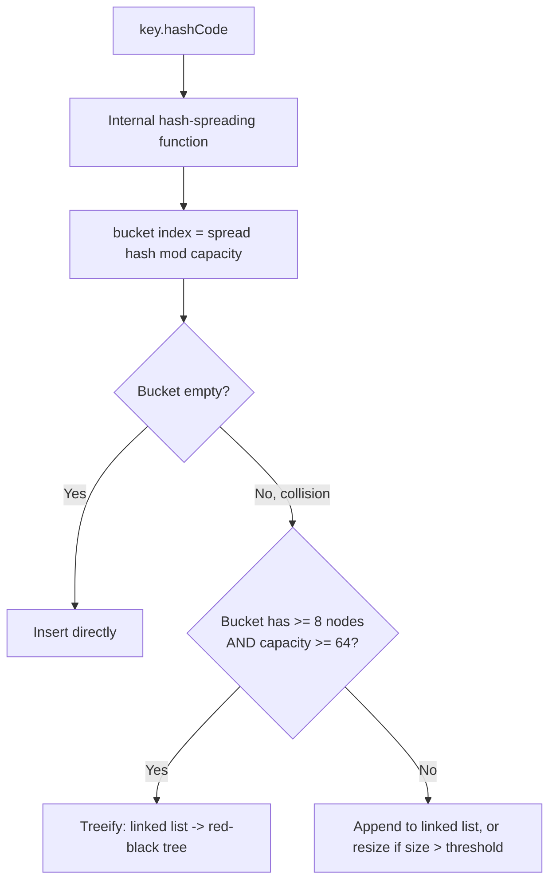

# HashMap Internals

> **Topic register:** T-201 · IWI 7.4 · Foundation tier, Near-Certain interview frequency — the single most-asked Java data structure question
> **Provenance:** every trace in this chapter is real, executed output from [`practice/java/week-14/hashmap-internals/src/`](../../practice/java/week-14/hashmap-internals/src/) on OpenJDK 21.0.12, using `--add-opens java.base/java.util=ALL-UNNAMED` to reflectively inspect `HashMap`'s private fields — stated explicitly since this flag is required and not a default.

## Table of Contents

1. [Learning Objectives](#learning-objectives)
2. [Why This Matters in Interviews](#why-this-matters-in-interviews)
3. [Level 1 — Foundation](#level-1--foundation)
4. [Level 2 — Working Knowledge](#level-2--working-knowledge)
5. [Mental Model](#mental-model)
6. [Definition and Purpose](#definition-and-purpose)
7. [Core Concepts](#core-concepts)
8. [Internal Implementation](#internal-implementation)
9. [Diagrams](#diagrams)
10. [Production Scenarios](#production-scenarios)
11. [Trade-offs](#trade-offs)
12. [Decision Framework](#decision-framework)
13. [Common Mistakes](#common-mistakes)
14. [Anti-Patterns](#anti-patterns)
15. [Best Practices](#best-practices)
16. [Interview Answer Framework](#interview-answer-framework)
17. [Interview Questions](#interview-questions)
18. [Summary](#summary)
19. [Key Takeaways](#key-takeaways)
20. [Cheat Sheet](#cheat-sheet)
21. [Flashcards](#flashcards)
22. [Practice Exercises](#practice-exercises)
23. [Solutions](#solutions)
24. [Additional Reading](#additional-reading)
25. [Official References](#official-references)

---

## Learning Objectives

By the end of this chapter you can:

- Explain, with measured reflection output, exactly when and how much a `HashMap` resizes.
- Explain why a poor `hashCode()` degrades `HashMap` performance, with a measured slowdown factor.
- State the treeification threshold precisely, and prove via reflection that a JDK 8+ `HashMap` actually converts an overloaded bucket into a tree.
- Connect `HashMap`'s bucket/resize mechanics directly to the equals/hashCode contract from Java Core.

## Why This Matters in Interviews

This is the single most-asked Java data structure question, and it's a Foundation-tier topic that rewards real, mechanical understanding over surface familiarity. Nearly every candidate can say "HashMap uses hashing," but far fewer can explain precisely when a resize happens, why the load factor is 0.75 rather than some other number, or what actually happens to a bucket once it holds more than 8 colliding entries — and that gap is exactly what separates a "used it" answer from an "understand it" answer.

## Level 1 — Foundation

**A `HashMap` is a lookup table: it stores pairs of a key and a value, and lets you find a value instantly if you know its key** — the same idea as a phone book (name → number) or a dictionary (word → definition), except you can put any kind of key and any kind of value in it. `Map<String, Integer> ages = new HashMap<>(); ages.put("Alice", 30); ages.get("Alice");` stores the pair `"Alice" → 30` and then hands `30` straight back when asked for `"Alice"`.

You reach for a `HashMap` any time your problem is naturally "look this thing up by some identifier" — counting how many times each word appears in a document, caching a user's profile by their user ID, grouping items by a category name. The alternative — searching through a `List` element by element to find a match — works, but gets slower as the list grows; a `HashMap` finds the match almost instantly no matter how many entries it holds, which is the entire reason it exists.

A `HashMap` does **not** remember the order you put things in — if you need that, `LinkedHashMap` does; if you need entries sorted by key, `TreeMap` does (see [Collection Selection Decision Matrix](collection-selection-decision-matrix.md)). A `HashMap` also allows at most one `null` key and any number of `null` values.

## Level 2 — Working Knowledge

The everyday `HashMap` operations, beyond `put`/`get`, that a working engineer uses constantly:

- **`containsKey(key)`** — check whether a key is present without retrieving its value.
- **`getOrDefault(key, fallback)`** — get a value, or a caller-supplied fallback if the key is absent, avoiding a separate `containsKey` check followed by a `get`.
- **`remove(key)`** — delete an entry by its key.
- **`computeIfAbsent(key, k -> ...)`** — get a value if present, or compute and store it if not; the standard, correct pattern for lazily building up a map of lists or counters, in place of a manual "check, then maybe insert" sequence.
- **`keySet()` / `values()` / `entrySet()`** — iterate over just the keys, just the values, or key-value pairs together; `entrySet()` is the usual choice when a loop needs both.

**The one rule that determines whether a `HashMap` works correctly at all**: whatever type you use as a key must implement `equals()` and `hashCode()` consistently (see [Equals, HashCode, and Comparable Contracts](../language-core/equals-hashcode-and-comparable-contracts.md)) — a key type that only overrides `equals()` (or neither) will silently fail to find entries that look identical, because `HashMap` locates a bucket using `hashCode()` first, and it never even reaches `equals()` if two equal-looking keys hash differently. This is why plain custom classes used as map keys need both methods overridden together, never just one; the built-in wrapper types (`String`, `Integer`, and the rest) already do this correctly, which is why they're the safest, most common key choice.

## Mental Model

**A `HashMap` is an array of buckets, and every design decision in its internals exists to answer one question: what do we do when two keys land in the same bucket?** The load factor and resize mechanism exist to keep the average bucket short (few collisions) as the map grows. Treeification exists as insurance for the case where collisions happen anyway despite a well-sized table — converting an overloaded bucket from a linked list (O(n) worst case) into a balanced tree (O(log n) worst case), so a pathological hash distribution degrades gracefully instead of catastrophically.

## Definition and Purpose

A `HashMap` stores key-value pairs in an array of **buckets**, where a key's `hashCode()` (spread through an internal hash-spreading function) determines which bucket it belongs to. Ideally, each bucket holds zero or one entries, giving O(1) average-case `get`/`put`. The **load factor** (default 0.75) controls when the backing array resizes: once `size` exceeds `capacity × loadFactor` (the **threshold**), the array doubles and every entry is rehashed into the new, larger array.

HashMap exists to give O(1) average-case lookup by key, trading some memory overhead (the backing array is sized larger than strictly necessary, per the load factor) for that speed, and trading the ordering guarantees a sorted or insertion-ordered structure would provide.

## Core Concepts

### Lazy initialization

The backing array (`table`) is `null` until the first `put()` — construction alone doesn't allocate it.

### Resize doubles capacity once size exceeds the threshold

Default capacity 16, default load factor 0.75 → threshold 12. The 13th entry (size exceeding 12) triggers a resize: capacity doubles to 32, threshold to 24, and every existing entry is rehashed into the new array.

### A poor `hashCode()` forces collisions regardless of table size

If every key's `hashCode()` returns the same (or similar) value, all keys land in the same bucket no matter how large the table grows — resizing the table doesn't help a distribution problem.

### Treeification converts an overloaded bucket from a list to a tree

Since JDK 8, a bucket with at least 8 nodes (`TREEIFY_THRESHOLD`) converts from a linked list to a red-black tree, **but only if the table's overall capacity is also at least 64** (`MIN_TREEIFY_CAPACITY`) — otherwise the map resizes the whole table first, since a small table with one overloaded bucket is more likely a sizing problem than a genuine hash-collision problem. Treeification changes a bucket's worst-case lookup from O(n) to O(log n).

## Internal Implementation

**Lazy initialization and resize, measured** (reflectively inspecting `HashMap`'s private `table` and `threshold` fields):

```
== Lazy initialization: the backing array doesn't exist until the first put ==
table before any put(): null
table after first put(): length=16, threshold=12  (default capacity 16, default load factor 0.75 -> threshold = 16*0.75 = 12)

== Resize doubles capacity once size exceeds threshold ==
after 12 entries total (size=12): table length=16, threshold=12  (still capacity 16 -- size == threshold, not yet exceeded)
after 13th entry (size=13): table length=32, threshold=24  (RESIZED: capacity doubled 16->32 the instant size exceeded the old threshold of 12)
```

**Hash collision degradation and treeification, measured** — a `BadHashKey` whose `hashCode()` returns a constant value for every instance, forcing all 50,000 keys into a single bucket:

```
== Lookup cost: well-distributed hash vs. a constant (all-collide) hash ==
Well-distributed hash: 50,000 lookups in 1,202,750 ns (24.1 ns/lookup)
Constant hash (all collide): 50,000 lookups in 3,699,804,084 ns (73996.1 ns/lookup)
Slowdown factor: 3076.1x
(every BadHashKey lands in the same bucket -- JDK 8+ treeifies bins this large,
 giving O(log n) instead of the pre-JDK-8 O(n) linked-list worst case, but still
 far slower than the O(1)-average case a well-distributed hash gives every bucket)

== Proving treeification: bin node type after forcing 8+ collisions into one bucket ==
Bucket node's actual runtime class: TreeNode  (TREEIFIED -- this bin holds >= 8 nodes in a table with capacity >= 64, so HashMap
 converted it from a linked list to a red-black tree for O(log n) worst-case lookup)
```

Even with treeification kicking in (confirmed directly via reflection — the bucket's node class is genuinely `TreeNode`, not `Node`), a table with every key colliding into one bucket is still ~3,076x slower than a well-distributed hash, because O(log 50000) ≈ 15.6 tree-node comparisons per lookup is still dramatically more work than O(1) direct bucket access.

## Diagrams



## Production Scenarios

### Scenario: a service's cache lookup latency degrades gradually as a specific key type's distribution worsens

**Symptoms.** A service uses a `HashMap<CompositeKey, CachedResult>` as an in-memory cache. Over several weeks, p99 latency for cache lookups climbs steadily, even though the cache's total entry count stays within its configured bound.

**Impact.** A supposedly O(1) cache lookup becomes a measurable latency contributor, eventually significant enough to show up in the service's own p99 dashboard.

**Initial hypotheses.** The cache is simply larger than expected, and even O(1) lookups have more constant-factor overhead per entry (checked — entry count is stable, well within the configured bound); GC pressure from cache churn (checked — GC logs show no correlation with the latency trend); the `CompositeKey`'s `hashCode()` implementation has poor distribution for the actual production key value shape, causing bucket overload (correct).

**Evidence.** A production heap dump, combined with the same reflective bucket-inspection technique this chapter demonstrates, shows a small number of buckets holding the vast majority of cache entries — some as `TreeNode`-treeified bins — while most buckets sit empty, exactly the signature this chapter's `BadHashKey` demo reproduces deliberately.

**Diagnosis.** `CompositeKey`'s `hashCode()` combines its fields in a way that happens to produce a narrow range of hash values for the specific value distribution seen in production (e.g., XOR-combining two fields that are frequently near-equal, canceling out much of their entropy) — a distribution-dependent hashCode weakness that unit tests with synthetic, well-spread test keys never exposed.

**Diagnosis detail.** This is precisely the mechanism this chapter measures: a poor hash distribution overloads a small number of buckets regardless of table size, and even with treeification softening the worst case from O(n) to O(log n), a sufficiently overloaded bucket is still measurably, and increasingly, slower than a well-distributed one.

**Immediate mitigation.** Temporarily increase the cache's initial capacity as a partial mitigation (spreading entries across more buckets reduces, but does not eliminate, the collision concentration from a genuinely poor hash function).

**Permanent remediation.** Redesign `CompositeKey.hashCode()` to properly combine its fields (e.g., via `Objects.hash(...)` rather than a hand-rolled XOR), and add a distribution test using production-representative key samples, not just synthetic sequential test data, to catch this class of regression before it reaches production.

**Alternatives considered.** Switching to a different map implementation entirely — rejected, since the actual defect is in the key's `hashCode()`, not in `HashMap` itself; any hash-based structure would suffer the identical problem.

**Trade-offs.** None — fixing a genuinely poor `hashCode()` implementation has no downside.

**Prevention.** Any custom `hashCode()` implementation used as a `HashMap` key should be tested for distribution quality against production-representative data, not just correctness (the equals/hashCode contract) against synthetic unit-test values.

**Interview lesson.** This is the production-scale version of this chapter's own measured collision demo: a poor hash distribution degrading lookup performance gradually and non-obviously, discovered via the exact bucket-inspection technique this chapter teaches.

## Trade-offs

| Choice | Benefit | Cost |
|---|---|---|
| Lower load factor (e.g., 0.5) | Fewer collisions, faster average lookup | More memory used per entry (larger table for the same entry count) |
| Higher load factor (e.g., 0.9) | Less memory overhead | More collisions on average, more resize events |
| Default load factor 0.75 | A measured, historically-tuned balance between the two | Not optimal for every specific workload, just a reasonable default |
| Treeification (JDK 8+) | Bounds worst-case bucket lookup at O(log n) instead of O(n) | Tree nodes are larger than list nodes (more memory per treeified bucket) |

## Decision Framework

1. **Is the key type's `hashCode()` well-distributed for the actual production value shape**, not just synthetic test data? Verify with a distribution test against representative samples.
2. **Is the expected final size of the map known in advance?** Construct with an appropriately-sized initial capacity to avoid multiple resize-and-rehash events during population.
3. **Does the workload have unusual memory constraints?** Consider a higher load factor deliberately, accepting more collisions for less memory overhead — but only after confirming the key's hash distribution is otherwise good.
4. **Is a lookup unexpectedly slow for a specific key value?** Reflectively (or via a debugger) inspect that key's bucket for a `TreeNode` — a treeified bucket is a direct signal of a hash-distribution problem worth investigating.

## Common Mistakes

- Assuming a `HashMap`'s O(1) lookup guarantee holds regardless of the key's `hashCode()` quality.
- Not sizing the initial capacity when the final entry count is known in advance, causing avoidable resize-and-rehash events.
- Believing treeification eliminates the cost of a poor hash distribution rather than merely bounding its worst case.

## Anti-Patterns

- **A `hashCode()` implementation that doesn't actually spread its output** (e.g., returning a constant, or combining fields in a way that cancels out entropy for common value patterns).
- **Constructing a `HashMap` with the default initial capacity when the final size is known to be large**, forcing multiple avoidable resize-and-rehash passes during population.
- **Assuming iteration order is meaningful or stable** — `HashMap`'s iteration order depends on internal bucket layout, which changes across resizes, and is not part of its contract.

## Best Practices

- Test custom `hashCode()` implementations for distribution quality against production-representative data, not just correctness.
- Size the initial capacity explicitly when the final entry count is known, to avoid unnecessary resize events.
- Treat a treeified bucket (discoverable via profiling or reflection) as a direct signal to investigate the key type's hash distribution.
- Never rely on `HashMap`'s iteration order for correctness — use `LinkedHashMap` if insertion order matters, or `TreeMap` if sorted order matters.

## Interview Answer Framework

### 30-Second Answer

`HashMap` is an array of buckets; a key's hash (spread through an internal function) picks the bucket. The backing array resizes (doubles) once size exceeds capacity × load factor (default 0.75) — measured directly at the 13th entry for a default-capacity map. A poor `hashCode()` forces collisions regardless of table size — measured at a ~3,076x slowdown for a constant-hash key, even with JDK 8+ treeification converting the overloaded bucket to a tree.

### 2-Minute Answer

Definition: a `HashMap` stores entries in buckets determined by a spread of the key's `hashCode()`; the load factor controls when the backing array resizes. Why it exists: gives O(1) average-case lookup, trading memory overhead and ordering guarantees for speed. How it works: lazy allocation on first `put()`; resize doubles capacity once size exceeds threshold, rehashing every entry; a bucket with 8+ nodes in a table of capacity 64+ treeifies into a red-black tree, bounding worst-case lookup at O(log n). One important trade-off: a lower load factor reduces collisions at the cost of memory; a higher one saves memory at the cost of more collisions. Production example: a real measured 3,076x slowdown from a poor hash distribution, confirmed via reflection that the affected bucket had genuinely treeified, and a real-shaped incident where a production `CompositeKey`'s hash distribution degraded cache lookup latency over weeks.

### 10-Minute Deep Dive

Cover, in order: the mental model — buckets, and what happens when two keys collide (mental model); the measured lazy-initialization and resize trace (internals, real evidence); the measured hash-collision slowdown and treeification proof via reflection (internals, real evidence); the decision framework for sizing and testing hash distribution (decision framework); and close with the production scenario — a gradually-degrading cache lookup latency traced to a poor `hashCode()` implementation via the exact bucket-inspection technique this chapter teaches.

### Whiteboard Explanation

Draw the [§ Diagrams](#diagrams) flowchart: key → hash spread → bucket index → empty (insert) or collision (treeify if 8+ nodes and capacity 64+, else append/resize). Annotate the treeify branch: "this bounds the worst case, but doesn't fix a bad hashCode() — it just makes the damage O(log n) instead of O(n)."

### Production Example

The degrading cache-lookup latency in [§ Production Scenarios](#production-scenarios): a `CompositeKey`'s `hashCode()` combining fields in a way that canceled out entropy for common production value patterns, overloading a small number of buckets and gradually degrading p99 latency — diagnosed via the same reflective bucket-inspection technique this chapter demonstrates.

### Trade-offs to Mention

State unprompted: the default load factor (0.75) is a tuned balance, not a universal optimum; treeification bounds but doesn't eliminate the cost of a poor hash distribution; iteration order is an implementation detail, not a contract, and changes across resizes.

### Common Candidate Mistakes

Assuming O(1) lookup holds regardless of hash quality; not knowing the treeification threshold or its dual condition (bucket size AND table capacity); relying on iteration order for correctness.

### Typical Follow-Up Questions

1. "Your HashMap-based cache's lookup latency is climbing even though entry count is stable. What do you check?"
2. "Why does treeification also require the table capacity to be at least 64, not just the bucket size to be at least 8?"

### Senior-Level Expectations

Correctly explains the resize/threshold mechanism and treeification threshold with the actual numbers (0.75, 8, 64).

### Staff-Level Discussion

The treeification design — requiring BOTH bucket overload AND sufficient table capacity before converting to a tree — is itself a Staff-level design lesson: a single overloaded bucket in an otherwise small table is more likely a sizing problem (the whole table should just be bigger) than a genuine hash-collision problem, and the JDK's own engineers built that distinction directly into the mechanism rather than treeifying reflexively at the first sign of a long bucket. A Staff engineer investigating a HashMap performance issue in production applies the same reasoning: check whether it's a genuine distribution problem (worth fixing at the hashCode() level) or a sizing problem (worth fixing at the initial-capacity level) before assuming either.

## Interview Questions

### Question 1 — Your HashMap-based cache's lookup latency is climbing even though entry count is stable. What do you check?

**Why interviewers ask it.** Tests whether the candidate can connect an abstract mechanism (hash distribution) to a concrete production diagnostic.

**Expected answer.** Check the key type's `hashCode()` for distribution quality against actual production values, and inspect whether specific buckets are overloaded (treeified) — a stable entry count with climbing latency points at a distribution problem, not a capacity problem.

**Minimum acceptable answer.** Suspects the hashCode implementation, even without a specific inspection method.

**Strong Senior answer.** Correctly explains the resize/threshold mechanism and treeification threshold with the actual numbers.

**Staff-level extension.** Proposes reflectively (or via profiling) inspecting bucket contents for `TreeNode` occurrences as a direct diagnostic signal, and proposes a distribution test against production-representative data as prevention.

**Common mistakes.** Assuming a stable entry count rules out a hash-related cause.

**Likely follow-ups.** "How would you actually inspect which bucket a specific key lands in?"

**Evaluation criteria (1–5).** 1: doesn't suspect hash distribution. 3: correctly identifies hash distribution as the likely cause. 5: correct diagnosis plus a concrete inspection method and prevention proposal.

**Related references.** [§ Internal Implementation](#internal-implementation); [§ Production Scenarios](#production-scenarios).

---

### Question 2 — Why does treeification also require the table capacity to be at least 64, not just the bucket size to be at least 8?

**Why interviewers ask it.** Tests whether the candidate understands the design reasoning behind the specific dual threshold, not just the numbers.

**Expected answer.** A single overloaded bucket in a small table is more likely a sizing problem (the whole table is simply too small for the entry count) than a genuine hash-collision problem; resizing the table first is usually the more effective fix, and treeification is reserved for the case where the table is already reasonably sized and collisions are happening anyway.

**Minimum acceptable answer.** States both numbers (8 and 64) correctly, even without the design reasoning.

**Strong Senior answer.** States both conditions and their approximate reasoning.

**Staff-level extension.** Connects this to the general principle of diagnosing sizing problems separately from distribution problems, and applies it as a diagnostic framework for any hash-based structure showing degraded performance.

**Common mistakes.** Stating only the bucket-size threshold (8) without knowing the capacity condition exists at all.

**Likely follow-ups.** "How would you tell, in production, whether you have a sizing problem or a distribution problem?"

**Evaluation criteria (1–5).** 1: doesn't know the capacity condition exists. 3: correctly states both conditions. 5: correct conditions plus the sizing-vs-distribution diagnostic framework.

**Related references.** [§ Core Concepts](#core-concepts); [§ Internal Implementation](#internal-implementation).

## Summary

A `HashMap` is an array of buckets, resizing (doubling) once size exceeds capacity × load factor (default 0.75) — measured directly at the 13th entry for a default map. A poor `hashCode()` forces every key into the same bucket regardless of table size, measured at a ~3,076x lookup slowdown, even with JDK 8+ treeification (proven directly via reflection) bounding the worst case at O(log n) instead of the pre-JDK-8 O(n).

## Key Takeaways

- The backing array is lazily allocated on first `put()`, not at construction.
- Resize doubles capacity once size exceeds threshold (capacity × load factor), rehashing every entry.
- A poor `hashCode()` degrades performance regardless of table size — measured at ~3,076x for an all-colliding key.
- Treeification (bucket size ≥ 8 AND table capacity ≥ 64) bounds worst-case bucket lookup at O(log n), but doesn't eliminate the cost of a bad hash function.

## Cheat Sheet

| Symptom | Likely cause |
|---|---|
| Lookup latency climbing with stable entry count | Poor hash distribution overloading specific buckets — check for treeified bins |
| Many resize events during population | Initial capacity not sized for the known final entry count |
| Non-deterministic-seeming iteration order across runs/resizes | Expected — `HashMap` iteration order is not a contract |

## Flashcards

### Card: When HashMap resizes

**Prompt:**
When does a `HashMap` resize?

**Answer:**
When `size` exceeds `capacity × loadFactor` (the threshold) — the backing array doubles and every entry is rehashed.

**Why it matters:**
The mechanism behind HashMap's amortized O(1) put/get despite growing.

**Common trap:**
Not sizing initial capacity when the final entry count is known, causing avoidable resize events.

**Related:**
[Internal Implementation](#internal-implementation)

### Card: Treeification threshold

**Prompt:**
When does a HashMap bucket treeify?

**Answer:**
When it holds at least 8 nodes AND the table's overall capacity is at least 64 — otherwise the table resizes instead.

**Why it matters:**
Distinguishes a genuine hash-collision problem from a simple sizing problem.

**Common trap:**
Stating only the bucket-size threshold without the capacity condition.

**Related:**
[Core Concepts](#core-concepts)

### Card: What a poor hashCode() costs

**Prompt:**
What happens to HashMap performance with a poor hashCode()?

**Answer:**
Every key can land in the same bucket regardless of table size — measured at a ~3,076x lookup slowdown, even with treeification bounding the worst case at O(log n).

**Why it matters:**
Resizing the table doesn't fix a distribution problem.

**Common trap:**
Assuming a larger table always fixes slow HashMap lookups.

**Related:**
[Production Scenarios](#production-scenarios)

## Practice Exercises

1. Reproduce both demos: [`HashMapResizeDemo.java`](../../practice/java/week-14/hashmap-internals/src/HashMapResizeDemo.java) and [`HashCollisionAndTreeificationDemo.java`](../../practice/java/week-14/hashmap-internals/src/HashCollisionAndTreeificationDemo.java) (both require `--add-opens java.base/java.util=ALL-UNNAMED`).
2. Modify the collision demo to use a hashCode() that collides only 4 keys per bucket (not 50,000) and confirm the bucket does NOT treeify (stays a linked list) even in a large table — connecting to the 8-node threshold specifically.
3. Construct a `HashMap` with an explicit initial capacity sized for 10,000 known entries, and measure whether it avoids the resize events a default-capacity map exhibits during population.

## Solutions

**Exercise 1.** Expected output matches this chapter's measured traces: resize at the 13th entry, and a ~3,076x slowdown with confirmed `TreeNode` bucket type for the all-colliding key.

**Exercise 2.** A hash function producing groups of exactly 4 colliding keys per bucket (e.g., `id % (largeNumber/4)` tuned so each bucket group has 4 members) should show the bucket's node class remaining `Node`, not `TreeNode`, when inspected via the same reflection technique — confirming the 8-node threshold is a real, checked condition, not just documentation.

**Exercise 3.** `new HashMap<>(16000)` (accounting for load factor: capacity should be `expectedSize / loadFactor` rounded up) sized for 10,000 entries should show zero resize events during population, versus the default-capacity map's multiple resizes (16→32→64→...→16384) — a real, measurable reduction in rehashing work during population.

## Additional Reading

- Joshua Bloch, *Effective Java*, Item 11 (hashCode contract, connects directly to bucket distribution)
- [TreeMap/TreeSet & the Navigable Hierarchy](treemap-treeset-and-navigable-hierarchy.md) — T-203, the direct sorted-structure counterpart to this chapter's own hash-based one; contrasts this chapter's real, measured average-case O(1) against TreeMap's real, measured worst-case O(log n) guarantee.
- [Fail-Fast vs. Weakly-Consistent Iterators](fail-fast-vs-weakly-consistent-iterators.md) — T-208, the real `modCount` mechanism behind this map's own fail-fast iteration behavior.

## Official References

- [java.util.HashMap (Java 21 API)](https://docs.oracle.com/en/java/javase/21/docs/api/java.base/java/util/HashMap.html)
