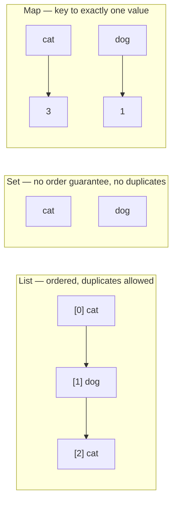

# Collections Usage Fundamentals: List, Map, and Set

## Table of Contents

1. [Why This Matters](#1-why-this-matters)
2. [Prerequisites](#2-prerequisites)
3. [Foundation (L1)](#3-foundation-l1)
4. [Core Concepts (L2)](#4-core-concepts-l2)
5. [How It Works Internally (L3)](#5-how-it-works-internally-l3)
6. [Practical Usage](#6-practical-usage)
7. [Examples](#7-examples)
8. [Common Mistakes](#8-common-mistakes)
9. [Edge Cases](#9-edge-cases)
10. [Performance Implications](#10-performance-implications)
11. [Trade-offs](#11-trade-offs)
12. [Senior-Level Considerations (L3)](#12-senior-level-considerations-l3)
13. [Staff/System-Level Considerations (L4)](#13-staffsystem-level-considerations-l4)
14. [Production Scenarios](#14-production-scenarios)
15. [Interview Questions](#15-interview-questions)
16. [Coding/Practice Exercises](#16-codingpractice-exercises)
17. [Debugging Exercises](#17-debugging-exercises)
18. [Design Exercises](#18-design-exercises)
19. [Further Reading](#19-further-reading)
20. [Mastery Checklist](#20-mastery-checklist)

## 1. Why This Matters

Every other chapter in `02-java/collections/` teaches how `HashMap`, `ArrayList`, and similar types work *internally* — bucket arrays, resizing, treeification — and assumes you already know *when to reach for which one* at a basic usage level. This chapter is that missing floor. "Which collection would you use here, and why" is one of the most frequently asked questions across every interview level, and a candidate who can't name the basic difference between a `List` and a `Set` will struggle long before an interviewer's follow-up ever reaches internals.

## 2. Prerequisites

[Java OOP Fundamentals: Classes, Objects, and Interfaces](../language-core/java-oop-fundamentals-classes-objects-and-interfaces.md) — `List`, `Map`, and `Set` are themselves interfaces, and understanding "a class implements an interface" (covered there) is assumed here.

## 3. Foundation (L1)

Java's Collections Framework centers on three interfaces answering three different questions:

- **`List`** — an *ordered* collection that *allows duplicates*. Elements are indexed by position (`list.get(0)`), and insertion order is preserved. Use it when order matters and repeated values are meaningful — a list of test scores, a queue of tasks in the order they arrived.
- **`Set`** — an *unordered* (or differently-ordered) collection that *never allows duplicates* — adding a value already present has no effect. Use it when you only care whether something is present, not how many times or in what order — the set of unique words in a sentence.
- **`Map`** — an *association* between a key and a value, where each key maps to exactly one value. Use it when you need to look something up by a name or identifier — a word mapped to how many times it appeared, a user ID mapped to a user object.

`ArrayList` is the most common `List` implementation; `HashMap` the most common `Map`; `HashSet` the most common `Set`. This chapter uses exactly these three.



The same three words ("cat", "dog", "cat") land differently in each: the `List` keeps both `cat` entries in their original positions; the `Set` collapses them to one `cat`; the `Map` keeps one `cat` key mapped to a count of how many times it appeared.

## 4. Core Concepts (L2)

The basic operations that matter at this level:

- **`List`**: `add(value)`, `get(index)`, `remove(value)` (removes the first matching value) or `remove(index)` (removes by position — a real, easy-to-confuse overload pair, see Section 9), `contains(value)`, `size()`.
- **`Set`**: `add(value)` (returns `false` if the value was already present, silently doing nothing), `contains(value)`, `remove(value)`, `size()`.
- **`Map`**: `put(key, value)`, `get(key)` (returns `null` if the key isn't present), `getOrDefault(key, fallback)` (avoids a null check for a missing key), `containsKey(key)`, `remove(key)`, `size()`.

Converting between them is common and cheap: `new HashSet<>(someList)` builds a `Set` from a `List`'s elements, automatically discarding duplicates in the process — Section 7's demo does exactly this to go from "every word as it appeared" (a `List`) to "every distinct word" (a `Set`) in one line.

## 5. How It Works Internally (L3)

This chapter deliberately stops at usage — [HashMap Internals](hashmap-internals.md), [ArrayList and LinkedList Internals](arraylist-and-linkedlist-internals.md), and [Collection Selection Decision Matrix](collection-selection-decision-matrix.md) cover the actual bucket arrays, resizing behavior, and complexity trade-offs behind these three interfaces' most common implementations. The one internal fact worth knowing at this level: `List`, `Set`, and `Map` are *interfaces* — `ArrayList` is one possible `List` implementation, not the only one (`LinkedList` is another), and code should generally be written against the interface type (`List<String> words = new ArrayList<>();`) rather than the concrete class, so the implementation can be swapped later without changing every line that uses it.

## 6. Practical Usage

Reach for `List` when you need to preserve the order things arrived in, or when the same value can legitimately appear more than once. Reach for `Set` the moment "does this already exist" or "give me only the unique ones" is the actual question — Section 7's `uniqueWords` conversion is the canonical example. Reach for `Map` whenever you're counting, grouping, or looking something up by a name rather than a position — a frequency count, a cache, a lookup table.

## 7. Examples

All output below is real, compiled and executed on OpenJDK 21.0.12 — [`practice/java/oop-fundamentals/collections-basics/`](../../../practice/java/oop-fundamentals/collections-basics/), 14/14 assertions passing.

[`WordFrequencyDemo.java`](../../../practice/java/oop-fundamentals/collections-basics/src/WordFrequencyDemo.java) counts word frequency in a 12-word sentence using all three types together: a `List<String>` holds every word exactly as it appeared, including three separate occurrences of `"the"` and two of `"fox"` (`words.size()` is `12`, order preserved). Converting it to a `Set<String>` via `new HashSet<>(words)` collapses those repeats down to `9` unique words in one line. A `HashMap<String, Integer>`, built with `getOrDefault(word, 0) + 1`, correctly counts `"the"` as `3` and `"fox"` as `2` — and has exactly as many entries as the `Set` has unique words, since a `Map`'s key set is itself a set of unique values. Removing `"dog"` from the `List` removes exactly that one occurrence without disturbing anything else; removing `"lazy"` from the `Map` removes the whole key-value entry.

## 8. Common Mistakes

- **Calling `List.remove(int)` when `remove(Object)` was intended, or vice versa** — `list.remove(2)` removes the element *at index 2*; `list.remove(Integer.valueOf(2))` removes the element *equal to the value 2* — a genuinely confusing overload pair for an `List<Integer>` specifically, covered further in Section 9.
- **Calling `map.get(key)` on a missing key and getting a `NullPointerException` later**, instead of checking `containsKey` first or using `getOrDefault` — Section 7's demo uses `getOrDefault` specifically to avoid this.
- **Assuming a `HashSet` or `HashMap` preserves insertion order** — it does not, by design; [TreeMap/TreeSet and the Navigable Hierarchy](treemap-treeset-and-navigable-hierarchy.md) and `LinkedHashMap`/`LinkedHashSet` cover the ordered alternatives, once that specific guarantee is actually needed.
- **Adding a duplicate to a `Set` and expecting an error or a visible change** — `set.add(existingValue)` silently does nothing and returns `false`; it is not a mistake to catch, just a fact to know.

## 9. Edge Cases

- **`List<Integer>.remove(2)`** is genuinely ambiguous at first glance because of autoboxing: the `int` overload `remove(int index)` is chosen over `remove(Object)` unless you explicitly box the argument (`remove(Integer.valueOf(2))` or `remove((Integer) 2)`) — a real, well-known Java gotcha specific to `List<Integer>`.
- **`map.get(key)` returning `null`** is ambiguous between "the key isn't present" and "the key is present, mapped to a value that's genuinely `null`" — `containsKey` is the only way to distinguish the two cases if a `Map` might legitimately store `null` values.
- **Iterating over a `Map`** requires deciding what you actually need: `.keySet()` (just the keys), `.values()` (just the values), or `.entrySet()` (both together, most efficient when you need both, since it avoids a second lookup per key).

## 10. Performance Implications

Choosing `Set`/`Map` for a "does this exist" or "look this up" operation instead of scanning a `List` with a loop is the single highest-leverage performance decision at this level: `HashSet.contains()` and `HashMap.get()` are both effectively O(1) on average, while checking membership in a `List` by scanning it is O(n) — for a large enough collection, this difference is the entire performance story, well before any deeper internals matter. [HashMap Internals](hashmap-internals.md) explains the mechanism behind that O(1) average case.

## 11. Trade-offs

| Concern | `List` | `Set` | `Map` |
|---|---|---|---|
| Duplicates | Allowed | Never | Keys never; values may repeat |
| Order | Preserved (insertion order) | Not guaranteed (`HashSet`) | Not guaranteed (`HashMap`) |
| Lookup by position | `get(index)`, fast | N/A | N/A |
| Lookup by "does this exist" | Scanning, O(n) | `contains()`, ~O(1) | `containsKey()`, ~O(1) |
| Best for | Ordered data, duplicates meaningful | Uniqueness / membership checks | Association / counting / lookup by key |

## 12. Senior-Level Considerations (L3)

A Senior engineer justifies a collection choice with the actual access pattern the code needs (Section 11's table), not habit — reaching for a `List` and scanning it with `contains()` where a `Set` was the right tool from the start is a real, common code-review finding, especially once that list grows large enough for the O(n) scan to actually matter in production.

## 13. Staff/System-Level Considerations (L4)

At Staff scope, this chapter's basic distinctions compound: a service holding millions of records in a `List` and linearly scanning it for lookups doesn't fail in development with a small dataset, and doesn't fail in code review either — it fails quietly in production as data grows, exactly the kind of latent, load-dependent defect that's expensive to diagnose after the fact and cheap to prevent by defaulting to the right collection type from the start. [Collection Selection Decision Matrix](collection-selection-decision-matrix.md) formalizes this decision at a deeper level once this chapter's basics are solid.

## 14. Production Scenarios

No existing `production-cookbook/` entry has a collections-usage-fundamentals-specific root cause — the closest adjacent entry, [HashMap Bucket Overload From a Poor hashCode Distribution](../../../production-cookbook/hashmap-bucket-overload-from-a-poor-hashcode-distribution.md), is an internals-level failure mode, not a usage-level one.

> Planned reference: a future `production-cookbook/` entry covering a real incident caused by using a `List` with a linear `contains()` scan where a `Set` was the correct choice from the start — fine at small scale, silently degrading as the collection grew — would be a natural, non-duplicative addition connecting this chapter's Section 13 warning to a genuine production incident.

## 15. Interview Questions

**Q1 (Junior): "What's the difference between a List and a Set?"**
Expected answer: a `List` is ordered and allows duplicates; a `Set` has no guaranteed order (for `HashSet`) and never allows duplicates.

**Q2 (Junior/Mid): "When would you use a Map instead of a List?"**
Expected answer: when you need to look something up by a key/name rather than a position, or when you're counting/grouping — Section 6's practical rule, ideally with a concrete example like a frequency count.

**Q3 (Mid): "Why is checking membership with a HashSet faster than checking a List?"**
Expected answer: `HashSet.contains()` is ~O(1) on average; scanning a `List` for a value is O(n) — Section 10, ideally naming the actual complexity classes, not just "it's faster."

**Q4 (Mid): "What does map.get(key) return if the key isn't present, and what's the danger?"**
Expected answer: `null` — the danger is a later `NullPointerException` if the caller assumes a non-null result; `getOrDefault` or a `containsKey` check avoids it.

**Q5 (Mid/Senior): "A service scans a List with a linear contains() check on every request. What's your diagnosis and fix?"**
Expected answer: Section 13's framing — this degrades quietly as the list grows, invisible at small scale; the fix is switching to a `HashSet`/`HashMap` for O(1) average lookup, and the broader lesson is defaulting to the correct collection type based on actual access pattern from the start, not after a production slowdown is noticed.

## 16. Coding/Practice Exercises

1. Extend `WordFrequencyDemo` to find the single most frequent word (and its count) by iterating the `Map`'s `entrySet()`, and add an assertion proving it correctly identifies `"the"` with count `3`.
2. Given two `List<String>`, write a method returning their common elements using a `Set` (hint: convert one list to a `HashSet`, then check `contains()` for each element of the other) — and explain why this is faster than checking `contains()` against the raw `List`.
3. Deliberately call `list.remove(2)` on a `List<Integer>` containing `{10, 20, 30, 40}` and predict the result before running it (Section 9's autoboxing edge case) — then explicitly box the argument and confirm the different, intended result.

## 17. Debugging Exercises

Given this code, predict the output before running it:

```java
Map<String, Integer> counts = new HashMap<>();
counts.put("a", 1);
Integer value = counts.get("b");
System.out.println(value + 1);
```

This throws a real `NullPointerException`, not `1` — `counts.get("b")` returns `null` (the key isn't present), and unboxing `null` into the `int` context that `value + 1` requires throws immediately. A candidate predicting a clean numeric result is missing that `map.get()` on a missing key returns `null`, not a default value — Section 8's own warning, seen live.

## 18. Design Exercises

Design the data structure(s) (which of `List`/`Set`/`Map`, and why) for tracking which users have "liked" which posts in a simple social app, supporting: checking if a specific user liked a specific post (fast), and counting total likes on a post (fast). State explicitly why a single `List` of like-records would not satisfy both requirements efficiently.

## 19. Further Reading

- [HashMap Internals](hashmap-internals.md) — the actual bucket-array mechanism behind `HashMap`'s O(1) average performance, referenced in this chapter's Section 10.
- [ArrayList and LinkedList Internals](arraylist-and-linkedlist-internals.md) — what's actually happening inside the most common `List` implementation.
- [Collection Selection Decision Matrix](collection-selection-decision-matrix.md) — the full, deeper decision framework this chapter's Section 11 table is a simplified entry point into.

## 20. Mastery Checklist

- [ ] Can state the core distinction between `List`, `Set`, and `Map` without hesitation.
- [ ] Can choose the right one for a described access pattern (lookup by position vs. uniqueness check vs. lookup by key).
- [ ] Can explain why `Set`/`Map` lookups are faster than scanning a `List`, in real complexity terms.
- [ ] Knows that `map.get()` on a missing key returns `null`, and how to avoid the resulting `NullPointerException`.
- [ ] Can correctly predict the Section 17 debugging exercise's real output before running it.
- [ ] Can explain, in Staff-level terms, why defaulting to the wrong collection type is a load-dependent defect that's cheap to prevent and expensive to diagnose later.
