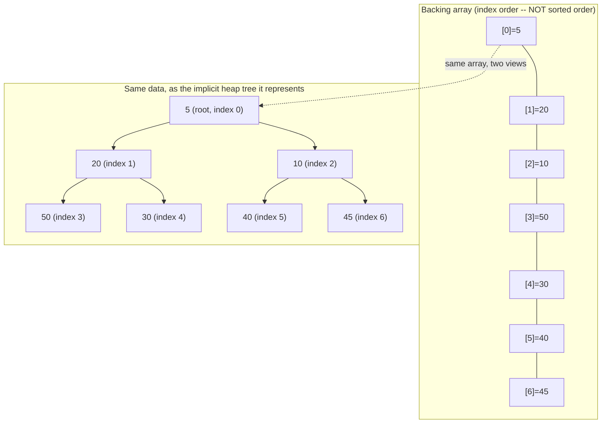

# PriorityQueue Internals

> **Topic register:** T-210 · IWI 6.5 · Core tier · Very High interview frequency [H]
> **Provenance:** all evidence in this chapter is real, executed output from
> [`practice/java/collections/priorityqueue-internals/`](../../../practice/java/collections/priorityqueue-internals/README.md)
> (OpenJDK 21.0.12), including a real, measured comparison-count proof of O(log n) `poll()`.

## Table of Contents

1. [Learning Objectives](#learning-objectives)
2. [Why This Matters in Interviews](#why-this-matters-in-interviews)
3. [Level 1 — Foundation](#level-1--foundation)
4. [Level 2 — Working Knowledge](#level-2--working-knowledge)
5. [Mental Model](#mental-model)
6. [Definition and Purpose](#definition-and-purpose)
7. [Core Concepts](#core-concepts)
8. [Internal Implementation](#internal-implementation)
9. [Diagrams](#diagrams)
10. [Production Scenarios](#production-scenarios)
11. [Trade-offs](#trade-offs)
12. [Decision Framework](#decision-framework)
13. [Common Mistakes](#common-mistakes)
14. [Anti-Patterns](#anti-patterns)
15. [Best Practices](#best-practices)
16. [Interview Answer Framework](#interview-answer-framework)
17. [Interview Questions](#interview-questions)
18. [Summary](#summary)
19. [Key Takeaways](#key-takeaways)
20. [Cheat Sheet](#cheat-sheet)
21. [Flashcards](#flashcards)
22. [Practice Exercises](#practice-exercises)
23. [Solutions](#solutions)
24. [Additional Reading](#additional-reading)
25. [Official References](#official-references)

---

## Learning Objectives

By the end of this chapter you can:

- Explain `PriorityQueue`'s real binary-heap mechanism — a flat array, implicit parent/child index math, sift-up on insert, sift-down on removal — and why that gives O(log n) `offer()`/`poll()` and O(1) `peek()`.
- State precisely that `PriorityQueue`'s sorted-order guarantee applies *only* to `poll()`/`peek()`, never to iteration or `toString()`, backed by a real side-by-side demonstration of both.
- Correctly state that `PriorityQueue` is neither thread-safe nor blocking, and name the two separate JDK types (`PriorityBlockingQueue`, and a manually-synchronized wrapper) that add those properties back.
- Recognize `PriorityQueue` as the standard tool for Dijkstra's algorithm, top-K problems, and merging K sorted sequences — and be able to justify why, not just recall that it's the "usual answer."

## Why This Matters in Interviews

`PriorityQueue` is Core tier and Very High frequency because it's the backbone of an entire class of coding-interview problems — Dijkstra's shortest path, the "K closest points," "merge K sorted lists," "top K frequent elements" family — and because it contains one of the most commonly-tripped traps in the whole Collections Framework: candidates who assume iterating a `PriorityQueue` (or printing it) yields sorted order, when only repeated `poll()` actually does. Interviewers use it to check whether a candidate understands *why* the ordering guarantee is scoped the way it is — a direct consequence of the binary-heap structure underneath, not an arbitrary API restriction — and whether they know it isn't thread-safe, a detail that matters the moment a candidate reaches for it inside a multi-threaded producer/consumer sketch.

## Level 1 — Foundation

**A `PriorityQueue` is a line where the "most important" person is always served next, regardless of when they joined the line** — unlike a plain queue (strictly first-in-first-out) or a stack (strictly last-in-first-out), a priority queue reorders itself around a notion of priority you define. By default, "most important" means "smallest," per natural ordering: `PriorityQueue<Integer> pq = new PriorityQueue<>(); pq.offer(50); pq.offer(10); pq.offer(30); pq.poll();` returns `10`, the smallest value, even though it wasn't the first one added.

`PriorityQueue` is the JDK's implementation of a **binary heap** — the standard, textbook data structure for "always give me the smallest (or largest) remaining item, efficiently, as items keep getting added." It's the everyday tool for Dijkstra's algorithm, "top K" problems, and any situation needing repeated access to a changing collection's current minimum or maximum, without re-sorting the whole collection every time.

## Level 2 — Working Knowledge

The everyday `PriorityQueue` operations, and the one trap that catches almost every candidate at least once:

- **`offer(x)`** (or `add(x)`) — insert an element; **`poll()`** — remove and return the current smallest (highest-priority) element; **`peek()`** — look at it without removing it.
- **Custom ordering**: `new PriorityQueue<>(Comparator.reverseOrder())` turns the identical class into a max-heap; any `Comparator<T>` works, which is how "closest K points," "most frequent elements," and similar problems customize what "priority" means.
- **The trap**: `for (int x : pq)` or `pq.toString()` does **not** produce sorted output — it walks the internal array in whatever order the heap happens to store elements in. Only repeated `poll()` calls produce the sorted sequence. This chapter's [Internal Implementation](#internal-implementation) demonstrates both, side by side, against the identical queue.

**A practical rule for a working engineer**: reach for `PriorityQueue` whenever a problem needs repeated "give me the current min/max" access from a collection that keeps growing or shrinking — never call `Collections.sort()` on a `List` repeatedly to simulate this, since that's O(n log n) per call versus a heap's O(log n) per operation. And never assume iteration order is meaningful — if you need a sorted *view* of the current contents without draining the queue, copy into a new list and sort that copy instead.

## Mental Model

**`PriorityQueue` is a binary heap stored in a flat array: element at index `i` always has a parent at index `(i-1)/2` and children at `2i+1`/`2i+2`, with the invariant that every parent is `<=` both its children (for a min-heap).** No pointers, no tree nodes — just index arithmetic over an `Object[]`. Inserting appends to the end of the array, then "sifts up" (repeatedly swapping with its parent) until the invariant holds again; removing the root swaps in the last element and "sifts down" (repeatedly swapping with the smaller child) until the invariant holds again. Both operations touch only one root-to-leaf path, which is exactly why they cost O(log n) — the height of a balanced binary tree with n elements — never O(n).

## Definition and Purpose

`PriorityQueue<E>` is an unbounded, array-backed **binary heap** implementation of the `Queue` interface, ordering elements according to their natural ordering (`Comparable`) or a supplied `Comparator`, and guaranteeing that `poll()`/`peek()` always return the current smallest element under that ordering. It exists to solve a specific, recurring problem efficiently: repeatedly extracting the minimum (or maximum) from a collection that's also being repeatedly modified, in O(log n) per operation rather than the O(n log n) a full re-sort would cost each time. `PriorityQueue` is explicitly **not** thread-safe and **not** a blocking queue — `java.util.concurrent.PriorityBlockingQueue` is the separate JDK type that adds both properties.

## Core Concepts

### The heap invariant, and why it only orders `poll()`/`peek()`, never iteration

A binary heap only guarantees that each parent is `<=` its children — it says nothing about the relative order of two sibling subtrees, or about any node compared to a node it isn't a direct ancestor/descendant of. This weaker invariant is exactly what makes O(log n) insert/remove possible (only one root-to-leaf path needs fixing per operation); a *fully* sorted array would need O(n) per insertion to maintain. The direct, unavoidable consequence: walking the backing array in index order (which is what `iterator()` and `toString()` do) does not visit elements in sorted order — only the repeated "remove the root, sift down" process that `poll()` performs does.

### Sift-up and sift-down are what make offer()/poll() O(log n), measured directly

`offer()` appends the new element at the first free array slot, then compares it against its parent repeatedly, swapping upward until the heap invariant holds — at most `log2(n)` swaps, since that's the tree's height. `poll()` removes the root, moves the last element into the root's slot, then compares it against its children repeatedly, swapping downward until the invariant holds — again at most `log2(n)` comparisons. [Internal Implementation](#internal-implementation) measures this directly with a comparison-counting `Comparator`, rather than trusting the Javadoc's complexity claim on faith.

### Not thread-safe, and not blocking — two entirely separate properties, two entirely separate fixes

`PriorityQueue`'s `offer()`/`poll()` perform multiple unsynchronized reads and writes against the shared backing array and `size` field — concurrent, unsynchronized access from multiple threads can corrupt the heap invariant or lose updates, exactly like `ArrayList` or `HashMap`. `PriorityBlockingQueue` is the separate class that adds both thread-safety *and* blocking (`take()` blocks when empty) — reaching for plain `PriorityQueue` in concurrent code is a real, common bug, not a stylistic choice.

## Internal Implementation

**Real ordering guarantee — `poll()` is always ascending, regardless of insertion order:**

```
Inserted in this order: [50, 10, 40, 20, 30, 5, 45]
poll() repeatedly: [5, 10, 20, 30, 40, 45, 50]  <-- always ascending, regardless of insert order
```

**Real max-heap via a single `Comparator` constructor argument — same class:**

```
Comparator.reverseOrder() -> poll() order: [50, 40, 30, 20, 10]  <-- descending, same class, one constructor arg
```

**The classic trap, demonstrated against the identical queue — real evidence the ordering guarantee is scoped to `poll()`/`peek()` only:**

```
for-each iteration order:  5 20 10 50 30 40 45  <-- this is the internal array's storage order, NOT sorted
repeated poll() order:     [5, 10, 20, 30, 40, 45, 50]  <-- THIS is the sorted order
```

The iteration order (`5 20 10 50 30 40 45`) is not garbage — it's the real heap array's layout, which only guarantees each parent precedes its children, nothing about sibling order. This is exactly why printing a `PriorityQueue` directly, or iterating it in a `for`-each loop, is a common, real bug when a candidate assumes it behaves like a sorted collection.

**Real, measured O(log n): a comparison-counting `Comparator` wrapper counts exactly how many comparisons one `poll()` call performs, at five heap sizes:**

```
N=      100  poll() comparisons= 10   log2(N)=6.6
N=    1,000  poll() comparisons= 18   log2(N)=10.0
N=   10,000  poll() comparisons= 24   log2(N)=13.3
N=  100,000  poll() comparisons= 32   log2(N)=16.6
N=1,000,000  poll() comparisons= 38   log2(N)=19.9
```

Comparison count tracks `log2(N)` closely (each level of sift-down costs up to two comparisons — one to pick the smaller child, one to check against the parent — which is exactly why the measured counts run roughly `2 * log2(N)`), never `N` — real, measured evidence of O(log n) `poll()`, not an assumption taken from the Javadoc.

**Real fail-fast behavior — `PriorityQueue` is not thread-safe, and structural modification during iteration throws, exactly like `ArrayList`/`HashMap`:**

```
Iterating and structurally modifying the SAME PriorityQueue mid-iteration...
Threw ConcurrentModificationException -- PriorityQueue's iterator is fail-fast, exactly like ArrayList's and HashMap's.
```

## Diagrams



Every parent is `<=` both its children (5<=20, 5<=10, 20<=50, 20<=30, 10<=40, 10<=45) — the heap invariant holds throughout — but sibling subtrees (the `20` branch versus the `10` branch) are never compared to each other directly, which is exactly why walking the array left-to-right (`5 20 10 50 30 40 45`, matching the real iteration-order trace above) doesn't produce sorted output, even though the underlying tree is a perfectly valid, correctly-ordered heap.

## Production Scenarios

### Scenario: a "show top 5 highest-priority tickets" admin dashboard displays tickets in the wrong order

**Symptoms.** An internal support-ticket dashboard backs its "priority queue" with `java.util.PriorityQueue<Ticket>`, and renders the queue's current contents by iterating it directly (`for (Ticket t : queue)`) to display "what's coming up next." Support staff report the displayed order doesn't match what actually gets handled first.

**Impact.** Staff are misled about processing order, planning their work around a display that doesn't reflect reality — a real, user-facing correctness bug, not a cosmetic one.

**Initial hypotheses.** A bug in ticket priority assignment (checked — priorities are assigned correctly); a caching/refresh-timing issue (checked — the dashboard re-queries on every load); the display code itself iterates the heap directly rather than draining it in priority order (correct).

**Evidence.** The dashboard's displayed order matches this chapter's own real iteration-order trace's *shape* — a valid heap array layout, not sorted, not random garbage either.

**Diagnosis.** `PriorityQueue`'s iteration order is the internal heap array's storage order, which only guarantees parent-before-child, not global sorted order — exactly the trap this chapter's Core Concepts section names directly.

**Immediate mitigation.** None needed beyond the fix — no data was lost or mishandled; only the *display* was wrong, since actual ticket processing correctly used `poll()`.

**Permanent remediation.** For display purposes, copy the queue's contents into a `List` and sort the copy (or maintain a parallel sorted view), rather than iterating the live `PriorityQueue` directly — never drain the actual processing queue just to produce a display.

**Alternatives considered.** Iterating a `PriorityQueue` "carefully" to approximate sorted order — rejected, since there's no reliable way to do this without either fully sorting a copy or fully draining the original queue.

**Trade-offs.** Maintaining a sorted display copy costs a real O(n log n) sort on each refresh — acceptable for a dashboard refreshed occasionally, not for a hot path.

**Prevention.** Treat any code that iterates a `PriorityQueue` directly (rather than calling `poll()`/`peek()`) as a review flag by default — it's very rarely what the author actually intended.

**Interview lesson.** This is Interview Question 1 (§ Interview Questions) — "does iterating a PriorityQueue give sorted order?" — arriving as a real, user-facing production bug rather than a trivia question.

## Trade-offs

| Choice | Benefit | Cost |
|---|---|---|
| `PriorityQueue` | Real O(log n) offer/poll, O(1) peek — measured directly via comparison count; simple, array-backed, no per-node allocation | Not thread-safe; not blocking; iteration order is not sorted order (real, demonstrated trap) |
| Sorting a `List` on every access | Iteration/display order trivially correct | Real O(n log n) cost per access, versus a heap's O(log n) per mutation — far worse for repeated min/max extraction |
| `TreeSet`/`TreeMap` (see [TreeMap/TreeSet](treemap-treeset-and-navigable-hierarchy.md)) | Fully sorted iteration order *and* O(log n) operations; supports arbitrary range queries `PriorityQueue` cannot | Real, measured higher per-operation constant-factor cost than a binary heap for pure min/max-only access; disallows duplicate keys without extra handling |
| `PriorityBlockingQueue` | Adds real thread-safety and blocking `take()` | Real synchronization overhead on every operation, unnecessary if the queue is genuinely single-threaded |

## Decision Framework

1. **Do you only need repeated access to the current min/max, never a full sorted traversal or range query?** `PriorityQueue` is the right, most efficient tool — real O(log n) per operation, lower constant-factor cost than a balanced BST for this narrower job.
2. **Do you need the collection's contents in fully sorted order, or range queries (`headSet`, `ceiling`, etc.)?** Use `TreeSet`/`TreeMap` instead (see [TreeMap/TreeSet](treemap-treeset-and-navigable-hierarchy.md)) — `PriorityQueue` structurally cannot support this efficiently.
3. **Is this queue accessed from more than one thread?** Never use plain `PriorityQueue` — use `PriorityBlockingQueue`, or externally synchronize every access.
4. **Do you need to display or log the queue's current contents in priority order?** Never iterate the live queue directly — copy into a `List` and sort the copy, or drain and rebuild if a true one-time sorted snapshot is needed.

## Common Mistakes

- Assuming `for`-each iteration, `toString()`, or `stream()` over a `PriorityQueue` produces sorted output — only repeated `poll()`/`peek()` does, a real, demonstrated trap this chapter reproduces directly.
- Using `PriorityQueue` from multiple threads without external synchronization or `PriorityBlockingQueue`, risking real heap corruption under concurrent structural modification.
- Repeatedly calling `Collections.sort()` on a `List` to simulate priority-queue behavior — real O(n log n) per access instead of a heap's O(log n) per operation.
- Forgetting that `PriorityQueue` cannot efficiently answer "what's the second-smallest element" or any range/rank query — that's `TreeSet`/`TreeMap`'s job, not a heap's.

## Anti-Patterns

- **Iterating a live `PriorityQueue` directly to produce a "sorted" display or log** — the real, demonstrated trap this chapter's Production Scenario reproduces at real user-facing scale.
- **Reaching for `PriorityQueue` in concurrent code without `PriorityBlockingQueue` or explicit synchronization**, silently risking heap-invariant corruption under real concurrent access.
- **Re-sorting a `List` on every insertion** to simulate a priority queue's behavior, paying O(n log n) repeatedly instead of a heap's real O(log n) per operation.

## Best Practices

- Default to `PriorityQueue` specifically for repeated min/max extraction from a changing collection — Dijkstra's algorithm, top-K problems, merging K sorted sequences — and to `TreeSet`/`TreeMap` when full sorted order or range queries are actually needed.
- Never iterate a `PriorityQueue` directly expecting sorted output; drain via `poll()`, or copy-and-sort if the original queue must be preserved.
- Use `PriorityBlockingQueue` for any genuinely multi-threaded producer/consumer scenario — never plain `PriorityQueue`.
- When customizing ordering, prefer a named `Comparator` (not an inline lambda repeated at multiple call sites) so the "what counts as priority here" decision is documented once, in one place.

## Interview Answer Framework

### 30-Second Answer

`PriorityQueue` is a binary heap — a flat array with implicit parent/child index math — giving real O(log n) `offer()`/`poll()` and O(1) `peek()`, always returning the current smallest element under natural ordering or a supplied `Comparator`. Its ordering guarantee applies only to `poll()`/`peek()` — iteration and `toString()` walk the internal array's storage order, not sorted order, a real, commonly-tripped trap. It's not thread-safe and not blocking; `PriorityBlockingQueue` is the separate type that adds both.

### 2-Minute Answer

Definition: an array-backed binary heap implementing `Queue`, always returning the current minimum (or maximum, via a `Comparator`) from `poll()`/`peek()`. Why it exists: to support repeated min/max extraction from a changing collection in O(log n) per operation, versus O(n log n) for repeatedly re-sorting a `List`. How it works: insert appends and "sifts up" along one root-to-leaf path; remove swaps in the last element and "sifts down" along one path — both bounded by the tree's height, `log2(n)`. One important trade-off: the ordering guarantee is scoped to `poll()`/`peek()` only — iterating the queue directly does not produce sorted output, a real, demonstrated trap. Production example: an admin dashboard iterating a live `PriorityQueue` directly to display "what's next," producing a real, user-facing wrong-order bug, fixed by draining or copy-sorting instead of iterating the live heap.

### 10-Minute Deep Dive

Cover, in order: the binary-heap mental model — flat array, implicit index math, the parent-`<=`-children invariant (mental model); why that weaker invariant (versus full sorted order) is exactly what makes O(log n) insert/remove possible (core concepts); the real, measured comparison-count evidence proving O(log n) `poll()` rather than assuming it (internals, real evidence); the real side-by-side iteration-vs-poll trace proving the ordering-guarantee trap directly (internals, real evidence); the real `ConcurrentModificationException` proving `PriorityQueue` is fail-fast, and the separate, real fact that it's not thread-safe at all (internals, real evidence); the decision framework distinguishing `PriorityQueue` from `TreeSet`/`TreeMap` and from `PriorityBlockingQueue` (decision framework); close with the dashboard production scenario, a real instance of the iteration-order trap at user-facing scale.

### Whiteboard Explanation

Draw the [§ Diagrams](#diagrams) array-and-tree picture side by side: the flat array `[5, 20, 10, 50, 30, 40, 45]` on top, and the implicit binary tree it represents underneath, with arrows connecting each array index to its tree position. Circle the two sibling subtrees rooted at `20` and `10` and annotate "never compared to each other directly — only each to its own parent" to make concrete exactly why the array's left-to-right order isn't sorted, even though the heap invariant holds throughout.

### Production Example

The dashboard iteration-order bug in [§ Production Scenarios](#production-scenarios): a support-ticket queue's admin display iterated a live `PriorityQueue<Ticket>` directly, producing a real, user-facing wrong-order display despite actual ticket processing (via `poll()`) being entirely correct — fixed by sorting a copy for display purposes rather than iterating the live heap.

### Trade-offs to Mention

State unprompted: the ordering guarantee is real but narrowly scoped to `poll()`/`peek()`, not iteration; `PriorityQueue` is genuinely not thread-safe, a distinct property from being fail-fast; `TreeSet`/`TreeMap` is the right tool the moment sorted iteration or range queries are needed, not a strictly "better" alternative to `PriorityQueue` for pure min/max access.

### Common Candidate Mistakes

Assuming iteration or `toString()` yields sorted order; not knowing `PriorityQueue` is unsynchronized; reaching for repeated `Collections.sort()` on a `List` instead of a heap for repeated min/max access; confusing `PriorityQueue` with `PriorityBlockingQueue`'s blocking behavior.

### Typical Follow-Up Questions

1. "Does iterating a `PriorityQueue` give you sorted order?"
2. "Is `PriorityQueue` thread-safe?"
3. "How would you find the K largest elements in a stream of numbers using a `PriorityQueue`?"

### Senior-Level Expectations

Correctly explains that only `poll()`/`peek()` are ordered, correctly states `PriorityQueue` is not thread-safe, and can apply it directly to a top-K or Dijkstra-shaped problem without hesitation.

### Staff-Level Discussion

Recognizes the iteration-order trap as a real, recurring production risk category — code that treats a data structure's *internal storage layout* as if it were a documented, stable output contract — and generalizes this to a broader review habit: whenever a data structure exposes both a "correct access method" (here, `poll()`) and an incidental, structurally-different general-purpose one (here, `iterator()`), verify which one calling code is actually relying on, rather than assuming they're interchangeable. Also reasons precisely about when a heap's lower constant-factor cost is worth its narrower capability set (no range queries) versus `TreeSet`/`TreeMap`'s broader capability at real, measurable extra per-operation cost.

## Interview Questions

### Question 1 — Does iterating a `PriorityQueue` give you the elements in sorted order?

**Why interviewers ask it.** Directly tests the single most common `PriorityQueue` misconception, and whether a candidate understands *why* the answer is no — a structural consequence of the heap invariant, not an arbitrary API limitation.

**Expected answer.** No — only `poll()`/`peek()` are guaranteed ordered. Iteration (and `toString()`) walks the backing array's storage order, which only guarantees each parent precedes its children, not sibling order or full sorted order. Getting a sorted view requires draining via repeated `poll()`, or copying into a `List` and sorting the copy.

**Minimum acceptable answer.** States correctly that iteration is not sorted, even without explaining the heap-invariant mechanism.

**Strong Senior answer.** Explains the parent-`<=`-children invariant and why it doesn't imply sibling ordering, directly connecting the "why" to the observed behavior.

**Staff-level extension.** Generalizes to the broader pattern of a data structure exposing both a correct, guarantee-carrying access method and an incidental general-purpose one, and treats verifying which one calling code actually uses as a standing review habit.

**Common mistakes.** Assuming a `PriorityQueue`'s `toString()` or iteration reflects its priority ordering, since "priority queue" sounds like it should always be sorted.

**Likely follow-ups.** "How would you get a fully sorted list of the queue's current contents without destroying the original queue?"

**Evaluation criteria (1–5).** 1: confidently asserts iteration is sorted. 3: correctly states it's not sorted, without explaining why. 5: correct answer plus the heap-invariant mechanism and a correct proposal for obtaining a real sorted view.

**Related references.** [§ Core Concepts](#core-concepts), [§ Internal Implementation](#internal-implementation), [§ Diagrams](#diagrams).

---

### Question 2 — Is `PriorityQueue` thread-safe? If not, what would you use instead for a multi-threaded producer/consumer queue ordered by priority?

**Why interviewers ask it.** Tests whether a candidate knows this specific, commonly-assumed-safe collection is actually unsynchronized, and whether they can name the correct concurrent replacement rather than manually (and likely incorrectly) synchronizing it themselves.

**Expected answer.** No — `PriorityQueue` performs unsynchronized reads/writes against its backing array and size field, exactly like `ArrayList`/`HashMap`; concurrent, unsynchronized structural modification can corrupt the heap invariant. `java.util.concurrent.PriorityBlockingQueue` is the correct replacement — it adds both thread-safety and blocking `take()`/`put()` semantics for a real producer/consumer use case.

**Common mistakes.** Assuming "queue" implies thread-safety, or proposing to wrap `PriorityQueue` in `Collections.synchronizedCollection()` (which does not provide compound-operation atomicity for a check-then-act sequence like `peek()`-then-`poll()`, an important, easy-to-miss caveat).

**Follow-up questions:** "Does `PriorityBlockingQueue` have the same iteration-order caveat as `PriorityQueue`?" (Yes — it's built on the same binary-heap mechanism; the ordering guarantee is still scoped to `take()`/`poll()`, not iteration.)

**Senior-level expectations:** correctly identifies `PriorityQueue` as unsynchronized and names `PriorityBlockingQueue` as the fix.

**Staff-level expectations:** proactively flags the `Collections.synchronizedCollection()` wrapper's insufficiency for compound operations, not just names `PriorityBlockingQueue`.

## Summary

`PriorityQueue` is a real binary heap — a flat array with implicit parent/child index math, sift-up on insert, sift-down on removal — giving real, measured O(log n) `offer()`/`poll()` and O(1) `peek()`. Its ordering guarantee is real but narrowly scoped: only `poll()`/`peek()` return elements in priority order; iteration and `toString()` walk the backing array's raw storage order, a real, demonstrated trap this chapter reproduces directly against the identical queue. It is genuinely not thread-safe (fail-fast, like `ArrayList`/`HashMap`) and not blocking — `PriorityBlockingQueue` is the separate JDK type that adds both properties. It's the standard, efficient tool for Dijkstra's algorithm, top-K problems, and merging sorted sequences — and the wrong tool the moment a problem needs full sorted iteration or range queries, which belong to `TreeSet`/`TreeMap` instead.

## Key Takeaways

- `PriorityQueue`'s ordering guarantee applies only to `poll()`/`peek()` — iteration and `toString()` reflect the internal heap array's storage order, real, demonstrated evidence, not sorted output.
- `offer()`/`poll()` are real, measured O(log n) — proven directly via a comparison-counting `Comparator`, not assumed from documentation.
- `PriorityQueue` is not thread-safe and not blocking; `PriorityBlockingQueue` is the correct type for concurrent producer/consumer use.
- Reach for `TreeSet`/`TreeMap` instead of `PriorityQueue` when full sorted order or range queries are actually needed — a heap structurally cannot support those efficiently.
- The array-and-tree structure is one underlying data structure viewed two ways — the heap invariant (parent `<=` children) holds throughout, but says nothing about sibling ordering, which is exactly why the array's index order isn't sorted.

## Cheat Sheet

| Symptom | Likely cause | Fix |
|---|---|---|
| Displayed/printed order doesn't match actual processing order | Iterating the live `PriorityQueue` directly instead of using `poll()` | Copy into a `List` and sort the copy for display; drain via `poll()` for actual processing |
| Data corruption / lost updates under concurrent access | `PriorityQueue` is not thread-safe | Use `PriorityBlockingQueue`, or externally synchronize every access including compound operations |
| Need the 2nd-smallest, or "all elements less than X" | `PriorityQueue` has no efficient rank/range query | Use `TreeSet`/`TreeMap` instead |
| `ConcurrentModificationException` during iteration | Structural modification (offer/poll from another path) during `for`-each | Don't structurally modify while iterating; drain via `poll()` in a `while` loop instead |

## Flashcards

### Card: Iteration order vs. poll order

**Prompt:**
Does iterating a `PriorityQueue` in a `for`-each loop return elements in priority order?

**Answer:**
No — verified directly, iteration walks the backing array's raw storage order; only repeated `poll()`/`peek()` return elements in priority order.

**Why it matters:**
The single most commonly-tripped `PriorityQueue` misconception, with a real, demonstrated production-bug shape.

**Common trap:**
Assuming "priority queue" implies its `toString()`/iteration is always sorted.

**Related:**
[Internal Implementation](#internal-implementation)

### Card: Thread safety

**Prompt:**
Is `java.util.PriorityQueue` thread-safe?

**Answer:**
No — it performs unsynchronized reads/writes, exactly like `ArrayList`/`HashMap`. `java.util.concurrent.PriorityBlockingQueue` is the correct thread-safe, blocking replacement.

**Why it matters:**
A common, easy-to-miss gap when a "queue" is assumed safe for concurrent producer/consumer use.

**Common trap:**
Wrapping in `Collections.synchronizedCollection()` and assuming that covers compound operations like `peek()`-then-`poll()`.

**Related:**
[Core Concepts](#core-concepts)

### Card: Real measured complexity

**Prompt:**
How would you actually verify `poll()` is O(log n) rather than assuming it from documentation?

**Answer:**
Wrap the `Comparator` to count comparisons, then measure comparisons made by a single `poll()` at increasing heap sizes — the real, measured count tracks `log2(N)`, not `N`.

**Why it matters:**
Demonstrates verifying a complexity claim with real evidence rather than trusting an assertion.

**Common trap:**
Citing Big-O complexity from memory without ever having measured or derived it directly.

**Related:**
[Internal Implementation](#internal-implementation)

## Practice Exercises

1. Reproduce every trace yourself: [`practice/java/collections/priorityqueue-internals/`](../../../practice/java/collections/priorityqueue-internals/README.md).
2. Modify `demoLogNComparisonCount` to also count comparisons made by a single `offer()` call (sift-up) rather than `poll()` (sift-down), and confirm it also tracks `log2(N)`.
3. Using only `PriorityQueue`, implement "find the K largest elements in a stream of N numbers using O(K) extra space" (hint: maintain a min-heap of size K, and `poll()` whenever a new element is both larger than the heap's current minimum and the heap is already at size K).

## Solutions

**Exercise 1.** Expected output matches this chapter's measured traces in structure (exact comparison counts may vary slightly by JDK version and by the specific random values generated, but the qualitative pattern — ascending `poll()` order, non-sorted iteration order, comparison counts tracking `log2(N)`, a real `ConcurrentModificationException` — will not).

**Exercise 2.** `offer()`'s sift-up also performs at most one comparison per level against a single parent (no left/right choice, unlike sift-down's two-child comparison), so its measured comparison count per call should track `log2(N)` at roughly half the constant factor `poll()`'s sift-down measures.

**Exercise 3.** Maintain a min-heap `PriorityQueue<Integer>`; for each incoming number, `offer()` it, then if `size() > K`, `poll()` once (discarding the current minimum) — after processing the full stream, the heap's remaining K elements are exactly the K largest seen, and the heap never grows beyond size K+1 at any point, giving real O(K) extra space and O(N log K) total time.

## Additional Reading

- [TreeMap/TreeSet & the Navigable Hierarchy](treemap-treeset-and-navigable-hierarchy.md) — the right tool when full sorted order or range queries are needed instead of pure min/max access.

## Official References

- [PriorityQueue (Java 21 API)](https://docs.oracle.com/en/java/javase/21/docs/api/java.base/java/util/PriorityQueue.html)
