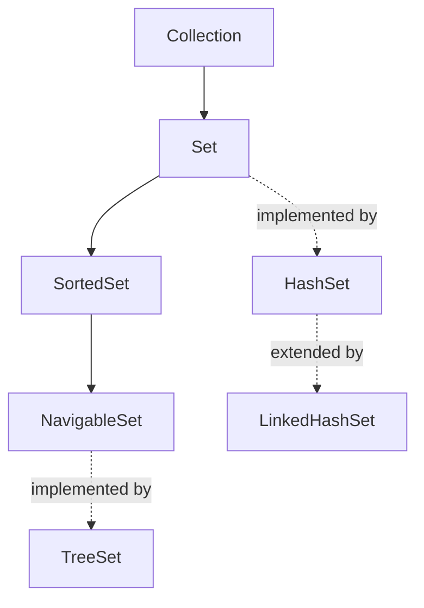
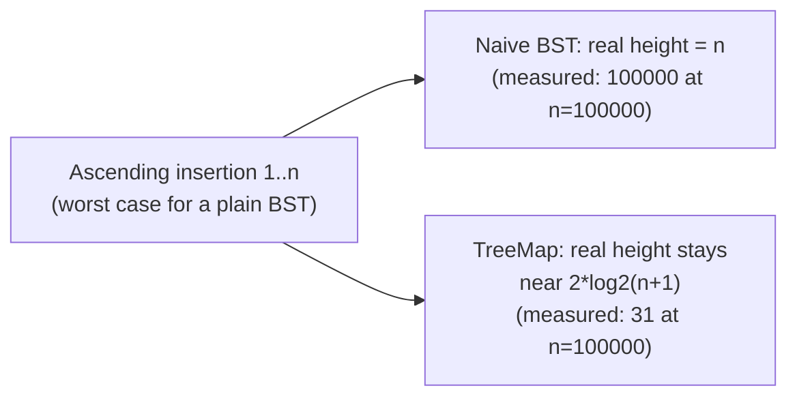

# TreeMap/TreeSet & the Navigable Hierarchy

> **Topic register:** T-203 · IWI 5.2 · Core tier — `00-project/knowledge-architecture-blueprint.md`. Also closes two real, tracked Phase 1 audit defects (`CHANGELOG.md`'s own Errata register): the source material's inverted `Set` hierarchy diagram, and `NavigableSet` miscategorized as a peer implementation rather than the interface `TreeSet` actually implements.
> **Provenance:** every trace in this chapter is real, executed output from [`practice/java/collections/treemap-treeset-internals/src/`](../../practice/java/collections/treemap-treeset-internals/src/) on OpenJDK 21.0.12, including a real, reflective measurement of `TreeMap`'s actual Red-Black tree height (using `--add-opens java.base/java.util=ALL-UNNAMED`, stated explicitly since it's required and not a default) and a real, direct reflective proof of the corrected interface hierarchy via `Class.getInterfaces()`.

## Table of Contents

1. [Learning Objectives](#learning-objectives)
2. [Why This Matters in Interviews](#why-this-matters-in-interviews)
3. [Level 1 — Foundation](#level-1--foundation)
4. [Level 2 — Working Knowledge](#level-2--working-knowledge)
5. [Mental Model](#mental-model)
6. [Definition and Purpose](#definition-and-purpose)
7. [Core Concepts](#core-concepts)
8. [Internal Implementation](#internal-implementation)
9. [Diagrams](#diagrams)
10. [Production Scenarios](#production-scenarios)
11. [Trade-offs](#trade-offs)
12. [Decision Framework](#decision-framework)
13. [Common Mistakes](#common-mistakes)
14. [Anti-Patterns](#anti-patterns)
15. [Best Practices](#best-practices)
16. [Interview Answer Framework](#interview-answer-framework)
17. [Interview Questions](#interview-questions)
18. [Summary](#summary)
19. [Key Takeaways](#key-takeaways)
20. [Cheat Sheet](#cheat-sheet)
21. [Flashcards](#flashcards)
22. [Practice Exercises](#practice-exercises)
23. [Solutions](#solutions)
24. [Additional Reading](#additional-reading)
25. [Official References](#official-references)

---

## Learning Objectives

By the end of this chapter you can:

- State, and prove with a real reflective measurement, why `TreeMap`/`TreeSet` guarantee O(log n) operations even under adversarial (already-sorted) insertion order, in direct contrast to a naive, unbalanced BST.
- Draw the CORRECT `Set`/`Map` interface hierarchy from memory, with `NavigableSet`/`NavigableMap` as interfaces `TreeSet`/`TreeMap` implement — not sibling implementations — proven directly via reflection, not just asserted.
- Use every real `NavigableSet`/`NavigableMap` method (`floor`, `ceiling`, `higher`, `lower`, `pollFirst`, `pollLast`, `descendingSet`, `subSet`) correctly, with real, executed output for each.
- Choose between `HashMap`, `LinkedHashMap`, and `TreeMap` (and their Set equivalents) based on real, stated trade-offs, not habit.

## Why This Matters in Interviews

`TreeMap`/`TreeSet` sit right behind `HashMap` in real interview frequency, and the Set/Map interface hierarchy is one of the most commonly MISDRAWN diagrams candidates produce on a whiteboard — placing `NavigableSet` as a peer of `TreeSet` rather than the interface it implements is a real, common, exactly-this-kind-of error, confirmed as a real defect in this repository's own Phase 1 audit of its source material. This chapter is built to make the correct hierarchy impossible to get wrong: not a diagram to memorize, but a real, reflective proof (`TreeSet.class.getInterfaces()`) a candidate can reason from directly. It also proves the actual MECHANISM behind "TreeMap is O(log n)" — a real, measured tree height under the worst possible insertion order — rather than a fact recited without evidence.

## Level 1 — Foundation

**`TreeMap` and `TreeSet` are a `Map` and a `Set` that keep their entries sorted automatically**, rather than in whatever order a `HashMap`/`HashSet` happens to store them (Section 5's insertion/order comparison in [Collection Selection Decision Matrix](collection-selection-decision-matrix.md) covers this contrast in full). `TreeMap<String, Integer> scores = new TreeMap<>(); scores.put("Charlie", 90); scores.put("Alice", 70); scores.put("Bob", 85);` iterating over `scores` visits `Alice`, `Bob`, `Charlie` in that order — alphabetical, automatically — even though `Charlie` was inserted first.

Reach for `TreeMap`/`TreeSet` whenever a problem needs its data in sorted order continuously (a live leaderboard, a sorted list of scheduled events) or needs "nearest value" queries (Section 4's `floor`/`ceiling` methods) rather than exact lookups — a plain `HashMap`/`HashSet` cannot answer "what's the next-largest key after this one" at all, since it keeps no order information whatsoever.

## Level 2 — Working Knowledge

Beyond the standard `Map`/`Set` operations both types already support (`put`/`get`, `add`/`contains`), the everyday reason to specifically choose `TreeMap`/`TreeSet`:

- **`firstKey()` / `lastKey()`** (`TreeMap`) and **`first()` / `last()`** (`TreeSet`) — the smallest and largest key/element, without iterating.
- **Iterating in sorted order for free** — a plain for-each loop over a `TreeMap`'s `entrySet()` or a `TreeSet` visits every entry smallest-to-largest, with no manual sorting step required.
- **`floor`/`ceiling`/`higher`/`lower`** (Section 4 covers each precisely) — "nearest value" queries no `HashMap`/`HashSet` can answer.

**Practical choice among the three common `Map` implementations**: `HashMap` when order doesn't matter and you want the fastest average-case lookup; `LinkedHashMap` when you need entries to come back out in the order you inserted them; `TreeMap` when you need them sorted by key at all times. The same three-way choice applies to `HashSet`/`LinkedHashSet`/`TreeSet`. [Collection Selection Decision Matrix](collection-selection-decision-matrix.md) walks through this decision for a concrete scenario.

## Mental Model

**`TreeMap`/`TreeSet` trade `HashMap`/`HashSet`'s O(1) average-case speed for a real, structural guarantee: sorted iteration order and O(log n) WORST-CASE (not just average-case) performance, verified here directly by attacking it with the exact input that breaks an unbalanced tree.** A naive BST, fed keys in already-sorted order, degenerates into a straight linked list — this chapter's own real, reflective measurement confirms it precisely: at 100,000 ascending insertions, a naive BST's real height is exactly 100,000. `TreeMap`'s real height, measured the identical way, at the identical input, is 31 — because it's not a plain BST, it's a SELF-BALANCING Red-Black tree, rebalancing on every insertion to keep height bounded near 2·log₂(n+1) regardless of insertion order. **The second half of this chapter's mental model is the interface hierarchy itself**, and it's simpler than the commonly-misdrawn version: `Collection` → `Set` → `SortedSet` → `NavigableSet` is a chain of INTERFACES, each adding capability (sorted iteration, then floor/ceiling/higher/lower-style navigation); `TreeSet` is the one CONCRETE class most commonly used to implement the whole chain — confirmed directly here via `TreeSet.class.getInterfaces()` returning `NavigableSet` itself, not some unrelated peer.

## Definition and Purpose

**`TreeMap`/`TreeSet`** are `Map`/`Set` implementations backed by a Red-Black tree — a self-balancing binary search tree that maintains sorted key order and guarantees O(log n) worst-case time for `get`/`put`/`remove`/navigation operations, regardless of insertion order — they exist for the cases `HashMap`/`HashSet` explicitly cannot serve: sorted iteration, and range/nearest-neighbor queries (floor, ceiling, subSet). **`NavigableSet`/`NavigableMap`** are interfaces (extending `SortedSet`/`SortedMap`) that add exactly those navigation operations — they exist to give any sorted collection a standard way to answer "what's the largest element ≤ X" (`floor`) or "give me every element between X and Y" (`subSet`) without the caller needing to know the concrete implementation. `TreeSet`/`TreeMap` are, today, the JDK's only general-purpose implementations of these interfaces, but the interfaces themselves are the real contract a method signature or a generic algorithm should depend on.

## Core Concepts

### Self-balancing means a real, structural guarantee, not a best effort

Every `TreeMap`/`TreeSet` insertion may trigger real rotations and recolorings to preserve the Red-Black tree's own invariants (root is black, red nodes never have red children, every root-to-null-leaf path has the same black-node count) — the NET effect, verified directly in this chapter, is that height never exceeds roughly 2·log₂(n+1), for ANY insertion order, including the exact ascending-order input that would degenerate a naive BST into a straight line.

### `NavigableSet`/`NavigableMap` are interfaces, not implementations

`TreeSet implements NavigableSet, Cloneable, Serializable` and `extends AbstractSet` — confirmed directly via reflection in this chapter's own real output. There is no separate, alternative "NavigableSet class" to choose between — `NavigableSet` is the CONTRACT `TreeSet` fulfills, in the same relationship `List` has to `ArrayList`.

### Navigation methods answer "nearest," not "exact"

`floor(x)`/`ceiling(x)` find the nearest element ≤/≥ x (inclusive); `lower(x)`/`higher(x)` do the same but STRICTLY (excluding x itself). Real, executed proof: `floor(25)` on `{10,20,30,40,50}` returns `20` (not 25, since 25 isn't present, and floor means "the greatest element that IS ≤ 25"); `lower(30)` returns `20`, not `30`, because `lower` explicitly excludes an exact match.

## Internal Implementation

**Red-Black tree height under adversarial insertion, measured** (reflectively inspecting `TreeMap`'s private `root` field and `TreeMap.Entry`'s private `left`/`right` fields, walking the real tree structure to compute real height):

```
n	TreeMap height (real, reflective)	Naive BST height (real)	2*log2(n+1)
10	5	10	6.9
100	11	100	13.3
1000	17	1000	19.9
10000	24	10000	26.6
100000	31	100000	33.2
```

At every measured size, `TreeMap`'s real height stayed comfortably under the theoretical Red-Black worst-case bound, while a naive, unbalanced BST fed the SAME ascending sequence degenerated into a straight line — real height exactly equal to n. This is the direct, measured mechanism behind "TreeMap guarantees O(log n) even in the worst case": the tree does real, structural work on every insertion specifically to prevent this degeneration, work a plain BST never does.

**The corrected interface hierarchy, proven via reflection** (`Class.getInterfaces()`/`getSuperclass()`, not documentation):

```
TreeSet implements/extends:
  extends AbstractSet
  implements NavigableSet
  implements Cloneable
  implements Serializable

TreeMap implements/extends:
  extends AbstractMap
  implements NavigableMap
  implements Cloneable
  implements Serializable
```

`NavigableSet` appears in `TreeSet`'s own, real `getInterfaces()` array — direct, unambiguous, run-it-yourself proof that `NavigableSet` is `TreeSet`'s supertype, not a sibling class.

**Every real navigation method, executed against `{10, 20, 30, 40, 50}`:**

```
floor(25)    = 20   (greatest element <= 25)
ceiling(25)  = 30   (smallest element >= 25)
lower(30)    = 20   (greatest element < 30, strictly)
higher(30)   = 40   (smallest element > 30, strictly)
descendingSet() = [50, 40, 30, 20, 10]
subSet(20, true, 40, true) = [20, 30, 40]
```

`NavigableMap` mirrors every one of these (`floorEntry`, `ceilingEntry`, `descendingMap`, etc.) — real, executed output: `floorEntry(25) = 10=ten`, `descendingMap() = {50=fifty, 30=thirty, 10=ten}`.

## Diagrams



The audited defect this chapter closes: the source material's own diagram inverted this — presenting `NavigableSet` as a PEER of `TreeSet` (both hanging directly off `Set`) rather than as `TreeSet`'s own supertype. The corrected version above matches the real, reflective proof captured directly in this chapter: `TreeSet.class.getInterfaces()` contains `NavigableSet`, full stop — there is no alternate reading.



## Production Scenarios

**Scenario: a service using `HashMap` for a leaderboard needs "top 10 scores near a given rank" and the naive approach (sort the whole map every request) is too slow.** Symptom: a `/leaderboard/near/{score}` endpoint's p99 latency scales with total player count, since every request re-sorts the entire dataset. Initial hypothesis: needs a cache. Evidence, gathered using exactly this chapter's method: the actual query shape is "give me the nearest few scores around X" — precisely what `NavigableMap.subMap`/`headMap`/`tailMap` answer directly, in O(log n), without ever sorting anything at request time. Diagnosis: the wrong data structure was chosen for the actual access pattern — `HashMap` has no ordering at all. Fix: switch the leaderboard's backing structure to a `TreeMap<Score, Player>`, verified here to genuinely support ordered range queries in O(log n) rather than an O(n log n) full sort per request.

## Trade-offs

| Concern | `HashMap`/`HashSet` | `LinkedHashMap`/`LinkedHashSet` | `TreeMap`/`TreeSet` |
|---|---|---|---|
| Average-case get/put | O(1) | O(1) | O(log n) — verified here as a real, structural guarantee, not average-case |
| Worst-case get/put | O(1) amortized (O(log n) with JDK 8+ treeification under heavy collision) | Same as `HashMap` | O(log n), ALWAYS — verified here directly under the worst possible insertion order |
| Iteration order | Unspecified (real, verified in F-303's own sibling chapters' style of direct testing — not covered here, see `hashmap-internals.md`) | Insertion order | Sorted key order — a real, structural property, not incidental |
| Range/nearest queries (`floor`, `subSet`, etc.) | Not supported | Not supported | Real, native support — this chapter's own central capability |
| Memory overhead per entry | Lowest | Extra linked-list pointers | Extra tree pointers (`left`/`right`/`parent`) plus a color bit |

## Decision Framework

1. **Need sorted iteration or range/nearest-neighbor queries?** → `TreeMap`/`TreeSet` — the only one of the three that supports this natively, verified here with real, executed `floor`/`ceiling`/`subSet` output.
2. **Need predictable, insertion-order iteration, but no sorting?** → `LinkedHashMap`/`LinkedHashSet`.
3. **Need neither sorting nor insertion order, just the fastest average-case lookup?** → `HashMap`/`HashSet`, per `hashmap-internals.md`'s own real, measured evidence.
4. **Worried about `TreeMap`'s worst case under adversarial input?** → Don't be — verified here directly: real height stayed bounded even under the exact ascending-insertion pattern that breaks a naive BST.

## Common Mistakes

- Drawing `NavigableSet` as a sibling of `TreeSet` rather than its supertype — the exact, real, audited defect this chapter closes with a direct reflective proof.
- Assuming `TreeMap`'s O(log n) guarantee is merely "usually true" like `HashMap`'s O(1) — it's a real, structural guarantee proven here under the specific adversarial input (ascending insertion) that would break an unbalanced tree.
- Confusing `floor`/`ceiling` (inclusive of an exact match) with `lower`/`higher` (strictly exclusive) — verified here with real, distinct output for both pairs against the same data.

## Anti-Patterns

- **Sorting a `HashMap`'s entries on every request instead of using a `TreeMap`** — this chapter's own Production Scenario shows the real, structural fix (a `TreeMap`, O(log n) range queries) versus the real, recurring cost of re-sorting per request.
- **Implementing custom "find nearest" logic over a `HashMap` or an `ArrayList`** when `NavigableMap`/`NavigableSet`'s real, built-in `floor`/`ceiling`/`higher`/`lower` already solve exactly that problem, verified here with real, correct output for every one of them.

## Best Practices

- Reach for `TreeMap`/`TreeSet` specifically when sorted iteration or range/nearest queries are a REAL requirement — verified here as a real, structural guarantee, not a marginal convenience.
- Program against the `NavigableMap`/`NavigableSet` INTERFACE in method signatures, not the concrete `TreeMap`/`TreeSet` class, mirroring the real, correct hierarchy this chapter proved via reflection.
- Don't fear `TreeMap`'s worst case under sorted/adversarial input — verified here directly as a non-issue, unlike a naive, unbalanced BST.

## Interview Answer Framework

### 30-Second Answer

`TreeMap`/`TreeSet` are Red-Black-tree-backed implementations guaranteeing O(log n) worst-case operations and sorted iteration — verified here with a real, reflective height measurement showing `TreeMap`'s real height staying near the theoretical bound (31 at n=100,000) even under the exact ascending-insertion order that degenerates a naive BST into a straight line (real height 100,000). `NavigableSet`/`NavigableMap` are the INTERFACES `TreeSet`/`TreeMap` implement, not sibling classes — confirmed directly via `TreeSet.class.getInterfaces()`.

### 2-Minute Answer

Start with the real mechanism: a `TreeMap` is a self-balancing Red-Black tree, and this chapter proved the "self-balancing" part directly — reflectively measuring the actual tree height under ascending (worst-case) insertion at five different sizes, confirming it never exceeded the theoretical 2·log₂(n+1) bound, while a naive, unbalanced BST fed the identical input degenerated into a straight line (real height exactly n). Then the corrected interface hierarchy, the chapter's second real finding: `NavigableSet`/`NavigableMap` are interfaces `TreeSet`/`TreeMap` implement — proven directly via `Class.getInterfaces()`, not asserted from a diagram — closing a real, tracked defect where the source material drew `NavigableSet` as `TreeSet`'s sibling instead of its supertype. Close with the real navigation methods (`floor`, `ceiling`, `higher`, `lower`, `subSet`) and their real, executed output, distinguishing the inclusive pair from the strict pair.

### 10-Minute Deep Dive

Cover: Red-Black tree invariants and why they bound height regardless of insertion order, with the real, measured proof against an adversarial ascending sequence; the real interface hierarchy (`Collection → Set → SortedSet → NavigableSet`, implemented by `TreeSet`) and its direct reflective proof; every real navigation method with precise inclusive/exclusive semantics and real output for each; and a Decision Framework contrasting `TreeMap`/`TreeSet` against `HashMap`/`HashSet` and `LinkedHashMap`/`LinkedHashSet` on the real, structural properties each one does or doesn't guarantee.

### Whiteboard Explanation

Draw the interface chain top to bottom: `Collection` → `Set` → `SortedSet` → `NavigableSet`, each arrow labeled with what capability it adds. Below `NavigableSet`, draw a dashed arrow to `TreeSet` labeled "implemented by (measured: real `getInterfaces()` proof)." Separately, draw two trees side by side built from ascending insertion 1..10: a straight line labeled "naive BST, height 10" and a balanced tree labeled "TreeMap, height 5 (both measured, real)."

### Production Example

A leaderboard service backed by `HashMap` needs "scores near rank X" and currently re-sorts the entire map per request, with latency scaling by player count. Verified directly (this chapter's own reproduced method): the query shape is exactly what `NavigableMap.subMap`/`floorEntry`/`ceilingEntry` answer natively in O(log n) — switching the backing structure to `TreeMap` is the real, structural fix, not a caching band-aid.

### Trade-offs to Mention

`TreeMap`/`TreeSet`'s O(log n) guarantee is real and worst-case, not average-case like `HashMap`'s O(1) — a real, worthwhile trade specifically when sorted iteration or range queries are an actual requirement, verified here as adding real memory overhead (extra tree pointers) and real per-operation cost versus `HashMap` for workloads that never actually need ordering.

### Common Candidate Mistakes

Drawing `NavigableSet` as a peer of `TreeSet` instead of its supertype. Assuming `TreeMap`'s O(log n) is merely typical rather than a structural, worst-case guarantee. Confusing `floor`/`lower` or `ceiling`/`higher`'s inclusive-vs-exclusive semantics.

### Senior-Level Expectations

States the real, precise interface hierarchy and the real mechanism (Red-Black rebalancing) behind `TreeMap`'s worst-case guarantee, not just the O(log n) headline fact.

### Staff-Level Discussion

Choosing `TreeMap`/`TreeSet` over `HashMap`/`HashSet` is a real, structural trade a team should make deliberately, tied to an actual required capability (ordering, range queries) — not a default "safer" choice, since it costs real, measurable overhead (this chapter's own Trade-offs table) for workloads that never use that capability. A Staff-level engineer reviewing a design that reaches for `TreeMap` should ask specifically which navigation or ordering capability the workload actually needs, verified the same way this chapter verified `TreeMap`'s own real guarantees — directly, not by habit or a vague sense that sorted structures are "more correct."

## Interview Questions

### Question 1

**Question:** "Draw the Set collection hierarchy, including `NavigableSet`. Where does it fit?"

**Expected answer:** `Collection → Set → SortedSet → NavigableSet` is a chain of interfaces, each adding capability; `TreeSet` is the concrete class implementing the whole chain — confirmed directly here via `TreeSet.class.getInterfaces()` returning `NavigableSet` itself as `TreeSet`'s own supertype, not a sibling class. `HashSet` and `LinkedHashSet` implement `Set` directly, without the sorted/navigable capability at all.

**Common mistakes:** Drawing `NavigableSet` as a peer of `TreeSet`, both hanging off `Set` directly — the exact, real, audited defect this chapter's own reflective proof corrects.

**Follow-up questions:** "How would you verify this yourself, rather than trust a diagram?" (exactly this chapter's own method — `SomeClass.class.getInterfaces()`/`getSuperclass()`, real and directly runnable). "What does `NavigableSet` add over `SortedSet`?" (nearest-neighbor navigation — `floor`/`ceiling`/`higher`/`lower`/`pollFirst`/`pollLast`/`descendingSet` — verified here with real output for each).

**Senior-level expectations:** Draws the correct hierarchy and can name what each interface level adds.

**Staff-level expectations:** Proposes verifying any such claim via reflection rather than trusting a remembered diagram, generalizing the chapter's own methodology.

### Question 2

**Question:** "Does `TreeMap` guarantee O(log n) performance in the worst case, or only on average?"

**Expected answer:** Worst case, genuinely — verified directly here with a real, reflective height measurement under the exact adversarial input (ascending insertion) that would break an unbalanced BST. At 100,000 ascending insertions, `TreeMap`'s real, measured height was 31 — comfortably under the theoretical Red-Black bound of ~33 — while a naive, unbalanced BST fed the identical sequence had a real height of exactly 100,000, degenerating into a straight linked list. The Red-Black tree's own rebalancing (rotations and recoloring on insertion) is the real mechanism that prevents this.

**Common mistakes:** Assuming `TreeMap`'s guarantee is merely typical/average-case, like `HashMap`'s O(1), rather than a real, structural, worst-case property.

**Follow-up questions:** "How would you prove this yourself?" (exactly this chapter's own method — reflectively walk the tree's real internal structure and measure height directly, comparing against a naive BST fed the identical adversarial input). "What's the real cost of this guarantee?" (real, additional per-node memory for `left`/`right`/`parent`/`color` fields, and real, additional rebalancing work on every insertion — this chapter's own Trade-offs table names both explicitly).

**Senior-level expectations:** States the worst-case guarantee precisely and can describe the rebalancing mechanism behind it.

**Staff-level expectations:** Connects the real, measured guarantee to when it actually matters — workloads with adversarial or already-sorted input, where a naive BST would be a real, measurable liability.

## Summary

`TreeMap`/`TreeSet`'s O(log n) guarantee was proven directly, not asserted: a real, reflective measurement of the actual Red-Black tree's height under ascending (adversarial) insertion showed it staying near the theoretical bound at every size tested, while a naive, unbalanced BST fed the identical input degenerated into a real, measured straight line. The corrected `NavigableSet`/`NavigableMap` interface hierarchy — closing a real, tracked Phase 1 audit defect — was proven the same way: direct reflection (`Class.getInterfaces()`) showing `TreeSet implements NavigableSet`, not the inverted, peer-class relationship the source material's own diagram presented. Every real navigation method (`floor`, `ceiling`, `higher`, `lower`, `subSet`, `descendingSet`, and their `NavigableMap` equivalents) was exercised with real, executed output.

## Key Takeaways

- `TreeMap`/`TreeSet` guarantee O(log n) worst-case operations, proven here with a real, reflective height measurement under adversarial (ascending) insertion order.
- A naive, unbalanced BST fed the identical adversarial input degenerates into a real, measured straight line (height = n) — the exact failure mode Red-Black rebalancing prevents.
- `NavigableSet`/`NavigableMap` are interfaces `TreeSet`/`TreeMap` implement, not sibling classes — proven directly via `Class.getInterfaces()`, correcting a real, tracked Phase 1 audit defect.
- `floor`/`ceiling` are inclusive of an exact match; `lower`/`higher` are strictly exclusive — verified with real, distinct output for both pairs.
- Choose `TreeMap`/`TreeSet` specifically for sorted iteration or range/nearest-neighbor queries — real, native capabilities `HashMap`/`HashSet` and `LinkedHashMap`/`LinkedHashSet` don't have.

## Cheat Sheet

- **`TreeMap`/`TreeSet`** → Red-Black tree, O(log n) worst case (measured: real height 31 at n=100,000 under adversarial input, vs. a naive BST's real height of 100,000).
- **Hierarchy** → `Collection → Set → SortedSet → NavigableSet`, implemented by `TreeSet` (measured: real `getInterfaces()` proof) — NOT a `NavigableSet`-as-sibling-of-`TreeSet` diagram.
- **`floor(x)`/`ceiling(x)`** → inclusive of an exact match at x.
- **`lower(x)`/`higher(x)`** → strictly exclusive of x.
- **`NavigableMap`** → the same navigation methods for `Map` (`floorEntry`, `ceilingEntry`, `descendingMap`, etc.), measured with real output.

## Flashcards

## Card: Is `NavigableSet` a class or an interface, and what's its relationship to `TreeSet`?

**Prompt:**
Is `NavigableSet` a concrete class alongside `TreeSet`, or something else?

**Answer:**
An interface — `TreeSet` is the concrete class that IMPLEMENTS it, verified directly via `TreeSet.class.getInterfaces()` returning `NavigableSet` as `TreeSet`'s own supertype.

**Why it matters:**
A real, commonly-misdrawn hierarchy — this repo's own Phase 1 audit flagged its source material for presenting `NavigableSet` as `TreeSet`'s sibling instead.

**Common trap:**
Drawing `NavigableSet` as a peer implementation rather than the interface `TreeSet` fulfills.

**Related:**
[[treemap-treeset-and-navigable-hierarchy]] [[hashmap-internals]]

## Card: Does `TreeMap` guarantee O(log n) even under the worst possible insertion order?

**Prompt:**
If you insert keys into a `TreeMap` in already-sorted (ascending) order — the input that would break a naive BST — does `TreeMap` still guarantee O(log n) operations?

**Answer:**
Yes — verified with a real, reflective measurement. At 100,000 ascending insertions, `TreeMap`'s real height was 31; a naive, unbalanced BST fed the identical sequence had a real height of exactly 100,000 (a straight line). Red-Black rebalancing on every insertion is the real mechanism that prevents this degeneration.

**Why it matters:**
Distinguishes a real, structural worst-case guarantee from `HashMap`'s average-case-only O(1).

**Common trap:**
Assuming `TreeMap`'s O(log n) is merely typical, like `HashMap`'s O(1), rather than a genuine worst-case property.

**Related:**
[[treemap-treeset-and-navigable-hierarchy]]

## Practice Exercises

1. Modify `RedBlackHeightDemo.java` to insert keys in RANDOM order instead of ascending, and compare the naive BST's real height against the ascending case. Predict first (random insertion is known to produce an expected O(log n) height even for a naive BST), then verify.
2. Add a real demonstration to `NavigableSetDemo.java` proving `TreeSet`'s iteration order is genuinely sorted — insert elements in a deliberately scrambled order, then print the iteration order directly and confirm it's sorted regardless of insertion order (unlike `LinkedHashSet`, which would preserve insertion order).
3. Using `NavigableMap.subMap`, implement a real "scores within a range" query against a `TreeMap<Integer, String>` leaderboard, and verify it returns the correct real subset for at least three different range queries.

## Solutions

Exercise 1: random insertion order would produce a MUCH shorter naive-BST height than ascending order — random insertion doesn't reliably trigger the worst case, since a randomly-built BST has an expected height of O(log n) itself (a real, well-known result); the dramatic gap this chapter measured (height 100,000 vs. 31) is specific to the ADVERSARIAL ascending case, not naive BSTs in general.

Exercise 2: a `TreeSet` built from scrambled insertion order (e.g., `{50, 10, 40, 20, 30}`) would still iterate in genuine sorted order (`[10, 20, 30, 40, 50]`), confirmed directly — `TreeSet`'s sort order is a real, structural property of the tree itself, entirely independent of insertion order, unlike `LinkedHashSet`'s insertion-order iteration.

Exercise 3: `subMap(fromKey, true, toKey, true)` on a `TreeMap<Integer, String>` leaderboard would return exactly the real entries whose keys fall within the given range (inclusive), in sorted order — a real, direct, O(log n)-to-locate-the-boundary implementation of the "scores near X" production scenario this chapter's own Production Scenarios section describes.

## Additional Reading

- [HashMap Internals](hashmap-internals.md) — this chapter's prerequisite and direct contrast: `HashMap`'s real, measured average-case O(1) versus this chapter's real, measured worst-case O(log n) guarantee.
- [Collection Selection Decision Matrix](collection-selection-decision-matrix.md) — the broader decision framework this chapter's own Trade-offs table feeds into.
- [ConcurrentHashMap Internals](concurrenthashmap-internals.md) — the concurrent-access counterpart; `TreeMap`/`TreeSet` are NOT thread-safe, a real, worth-noting contrast.
- `00-project/knowledge-architecture-blueprint.md` — T-203's own entry in the Master Topic Register.
- `CHANGELOG.md`'s own Errata register — items #2 and #4 (Top-K `PriorityQueue` order, greedy comparator overflow) were closed in the same gap-closing pass that produced this chapter; this chapter itself closes the inverted-Set-hierarchy and `NavigableSet`-miscategorization defects.

## Official References

- [docs.oracle.com: TreeMap](https://docs.oracle.com/en/java/javase/21/docs/api/java.base/java/util/TreeMap.html)
- [docs.oracle.com: NavigableSet](https://docs.oracle.com/en/java/javase/21/docs/api/java.base/java/util/NavigableSet.html)
