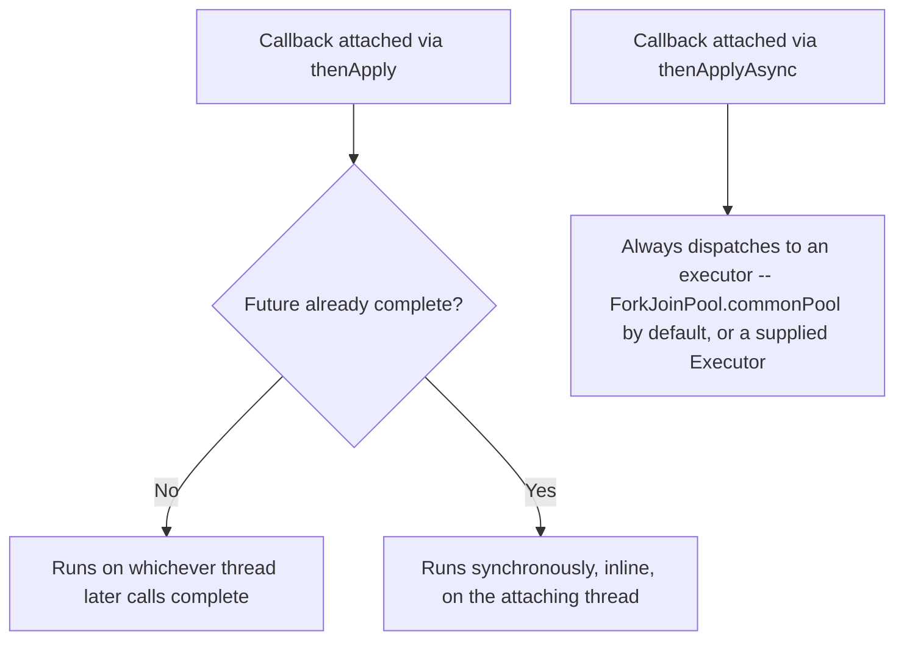
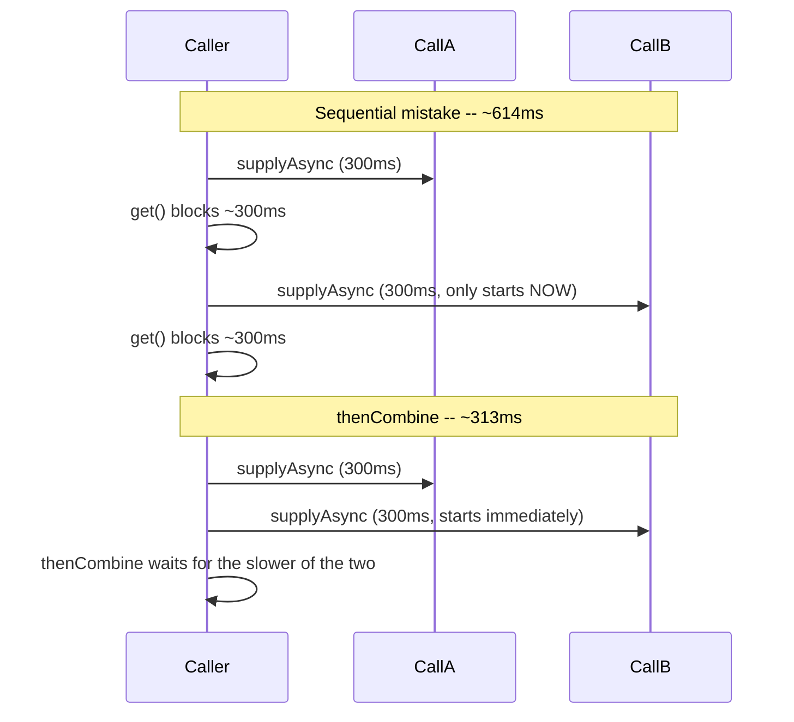

# CompletableFuture and Async Composition

> **Topic register:** T-407 · IWI 6.4 · Core tier · High interview frequency [H]
> **Provenance:** all three traces in this chapter are real, executed output from
> [`practice/java/concurrency/completablefuture-internals/`](../../../practice/java/concurrency/completablefuture-internals/README.md)
> (OpenJDK 21.0.12).

## Table of Contents

1. [Learning Objectives](#learning-objectives)
2. [Why This Matters in Interviews](#why-this-matters-in-interviews)
3. [Level 1 — Foundation](#level-1--foundation)
4. [Level 2 — Working Knowledge](#level-2--working-knowledge)
5. [Mental Model](#mental-model)
6. [Definition and Purpose](#definition-and-purpose)
7. [Core Concepts](#core-concepts)
8. [Internal Implementation](#internal-implementation)
9. [Diagrams](#diagrams)
10. [Production Scenarios](#production-scenarios)
11. [Trade-offs](#trade-offs)
12. [Decision Framework](#decision-framework)
13. [Common Mistakes](#common-mistakes)
14. [Anti-Patterns](#anti-patterns)
15. [Best Practices](#best-practices)
16. [Interview Answer Framework](#interview-answer-framework)
17. [Interview Questions](#interview-questions)
18. [Summary](#summary)
19. [Key Takeaways](#key-takeaways)
20. [Cheat Sheet](#cheat-sheet)
21. [Flashcards](#flashcards)
22. [Practice Exercises](#practice-exercises)
23. [Solutions](#solutions)
24. [Additional Reading](#additional-reading)
25. [Official References](#official-references)

---

## Learning Objectives

By the end of this chapter you can:

- Predict, correctly and from the JDK's own completion rules, which thread a `thenApply`/`thenAccept`/`thenCompose` callback runs on — and explain why the `*Async` variants exist to remove that ambiguity.
- Explain, with a measured real failure, why an unobserved `CompletableFuture` pipeline exception is silently lost, and which methods (`join`, `get`, `exceptionally`, `handle`) actually surface it.
- Identify and fix the specific, common mistake of accidentally serializing two independent async calls by calling `get()` on the first before submitting the second.
- Choose correctly between `thenApply`/`thenCompose`/`thenCombine`/`allOf`/`anyOf` for a given composition shape.

## Why This Matters in Interviews

`CompletableFuture` is the topic where "I've used it to make an API call async" gets tested against whether the candidate actually understands the completion and threading model underneath — not just the fluent method-chaining surface. It's Core tier and High frequency because three real, JDK-documented behaviors are consistently misunderstood even by engineers who use it daily: which thread a callback runs on, that failures are silently swallowed without `join()`/`get()`/`handle()`, and that two independent async calls are trivially and accidentally serialized by careless `get()` placement. This chapter measures all three directly.

## Level 1 — Foundation

**`CompletableFuture` lets you run something in the background and specify what should happen once it finishes, without blocking and waiting for it.** `CompletableFuture.supplyAsync(() -> callSlowApi()).thenApply(result -> transform(result));` kicks off `callSlowApi()` on a background thread and automatically runs `transform(result)` once it completes — the calling code doesn't sit there waiting.

An everyday analogy: dropping off a photo to be developed and being told you'll get a text when it's ready, versus standing at the counter the whole time waiting for it — `CompletableFuture` is the "I'll be notified when it's done" pattern applied to code.

## Level 2 — Working Knowledge

**Everyday methods**: `supplyAsync(supplier)` starts an async computation that returns a value; `thenApply(function)` transforms the result once it's ready; `thenAccept(consumer)` consumes the result without returning a new value; `thenCompose(function)` is for chaining a *dependent* async call — use this, not `thenApply`, when the next step itself returns a `CompletableFuture`, to avoid ending up with a confusing "future of a future."

**The one practical rule that prevents the most common gotcha**: always end a `CompletableFuture` chain with something that actually observes the result or the failure — `join()`, `get()`, or `.exceptionally(...)`/`.handle(...)` somewhere in the chain. Without one of these, an exception thrown partway through the chain is silently swallowed, and you'll never find out the pipeline failed at all.

## Mental Model

**A `CompletableFuture` is a box that starts empty and is filled exactly once — either with a value or an exception — and every dependent stage you attach is really asking "what code runs, and on what thread, at the moment this box gets filled?"** The non-`Async` methods answer that question implicitly and contextually (whichever thread fills the box, or the calling thread if the box is already full) — which is exactly the ambiguity the `*Async` methods exist to remove, by always answering "an executor, chosen explicitly, no matter what."

## Definition and Purpose

A `CompletableFuture<T>` is a `Future<T>` that can also be explicitly completed (`complete()`, `completeExceptionally()`) and that supports composing dependent computations (`thenApply`, `thenCompose`, `thenCombine`, `handle`, ...) that run automatically when it completes, instead of forcing the caller to block on `get()` to find out the result. It exists because `Future.get()` alone offers no way to react to completion without blocking a thread, and no way to compose multiple asynchronous steps without either blocking between every step or hand-rolling callback plumbing — `CompletableFuture` (Java 8, [JEP-adjacent design in `java.util.concurrent`](https://docs.oracle.com/en/java/javase/21/docs/api/java.base/java/util/concurrent/CompletableFuture.html)) gives async pipelines a composable, functional-style API while still implementing `Future` for interop with blocking code.

## Core Concepts

### Every dependent stage answers "what thread runs this?"

Every `thenX`/`handle`/`exceptionally` method attaches a callback that runs when the future completes. The **non-`Async` methods** (`thenApply`, `thenAccept`, `thenRun`, `thenCompose`, `handle`, `exceptionally`) do not pick a thread — they run the callback wherever completion naturally happens:

- If the future is **not yet complete** when the callback is attached, the callback runs on **whatever thread calls `complete()`** (or, for `supplyAsync`, the executor thread that finishes the supplier).
- If the future is **already complete** when the callback is attached, the callback runs **synchronously, inline, on the attaching thread** — there is no dispatch at all.

The **`*Async` methods** (`thenApplyAsync`, `thenAcceptAsync`, ...) remove this ambiguity entirely: they always submit the callback to an executor — `ForkJoinPool.commonPool()` by default, or an explicitly supplied `Executor` — regardless of whether the future was already complete when attached.

### An exception in the pipeline is invisible until something asks

`CompletableFuture` stores an exception the same way it stores a value: inside the box, waiting to be observed. If nothing ever calls `join()`, `get()`, `exceptionally()`, or `handle()` on the terminal stage of a pipeline, a thrown exception produces **zero observable signal** — no stack trace, no log line, the enclosing method returns normally. This is a real, silent failure mode, not a theoretical one — see [Internal Implementation](#internal-implementation).

### `get()`/`join()` block — and calling one before submitting the next call accidentally serializes independent work

`get()` and `join()` block the calling thread until the future completes. Calling `futureA.get()` before even *submitting* `futureB`'s async task turns two independent, ~300ms operations into a ~600ms sequential chain — not because `CompletableFuture` forced it, but because the calling code introduced an ordering dependency the data never required. `thenCombine` (or submitting both before blocking on either) preserves the real concurrency.

## Internal Implementation

**Case 1 vs. Case 2 — attach timing determines the callback's thread, measured directly:**

```
Case 1 (attach BEFORE completion): thenApply ran on thread [completer-thread]
Case 2 (attach AFTER completion):  thenApply ran on thread [main] -- same as caller thread [main], ran synchronously inline
```

In Case 1, `thenApply` is attached to a future that is not yet done; the background thread that later calls `cf.complete("done")` is the exact thread that then runs the `thenApply` callback — completion and callback execution happen on the same thread, at the moment `complete()` is called. In Case 2, `thenApply` is attached to a future built with `CompletableFuture.completedFuture(...)`, which is already done at construction — there is nothing to wait for, so the callback runs immediately and synchronously on the thread that called `thenApply`, i.e., `main`.

**Case 3 — `*Async` always dispatches, regardless of completion timing:**

```
Case 3a (thenApplyAsync, default executor): ran on thread [ForkJoinPool.commonPool-worker-1] -- NOT the caller thread, even though future was already complete
Case 3b (thenApplyAsync, custom executor):  ran on thread [custom-async-worker]
```

Even attached to the *same* already-complete future as Case 2, `thenApplyAsync` never runs inline — it always submits to `ForkJoinPool.commonPool()` (Case 3a) or a supplied `Executor` (Case 3b, a single-thread pool named `custom-async-worker`).

**The exception-swallowing failure, measured directly:**

```
== Fire-and-forget: exception is thrown but NEVER observed ==
Main thread reached this line normally -- no exception, no stack trace, no log line. The failure happened on a background thread and vanished.

== Same pipeline, but join() is called -- exception surfaces for real ==
join() threw CompletionException, real cause: java.lang.IllegalStateException: simulated downstream failure
```

Identical pipeline (`supplyAsync` that throws, then `thenApply`). The first run never calls `join()`/`get()` on the resulting future — the exception is thrown on a background thread, stored in the `CompletableFuture`, and discarded with it once it goes out of scope: nothing is ever printed. The second run calls `join()` and the real exception surfaces immediately, wrapped in `CompletionException` — including when `handle()` is attached directly to the throwing stage itself (not just across chained stages), confirmed by the real captured output `handle() saw the real exception: IllegalStateException`.

**Accidental serialization, measured in real wall-clock time:**

```
Sequential result: A-result + B-result (elapsed=614ms)
thenCombine result: A-result + B-result (elapsed=313ms)
```

Both calls sleep ~300ms. The "sequential" version doesn't submit call B until call A's `get()` returns — real elapsed time ~614ms, essentially the sum. `thenCombine` submits both before blocking on either — real elapsed time ~313ms, essentially the cost of the slower call alone. The ~2x measured difference is the exact, real cost of the accidental ordering dependency.

## Diagrams





## Production Scenarios

### Scenario: a fire-and-forget async write silently drops errors, and nobody notices for weeks

**Symptoms.** A service asynchronously writes an audit-log entry after handling each request, using `CompletableFuture.supplyAsync(() -> auditClient.write(entry))` with no further chaining. Weeks later, a compliance review finds gaps in the audit log corresponding to a period when the audit service was intermittently returning errors — but the main service's logs show no errors at all during that window.

**Impact.** A real, silent data-integrity gap (missing audit records) with zero operational signal at the time it happened, discovered only by an unrelated downstream audit.

**Initial hypotheses.** The audit client itself silently discards failed writes (checked — the client throws on failure, as designed); a logging configuration issue suppressed the error logs (checked — other, synchronous errors from the same period are present in the logs); the async write's exception was never observed by anything (correct).

**Evidence.** Reading the call site shows exactly the pattern measured in [§ Internal Implementation](#internal-implementation): `CompletableFuture.supplyAsync(...)` with no `.join()`, `.get()`, `.exceptionally()`, or `.handle()` ever called on the resulting future. The exception thrown inside `auditClient.write()` had nowhere to go.

**Diagnosis.** The exact fire-and-forget mechanism this chapter measures directly: a `CompletableFuture` pipeline exception is invisible unless something forces the result, and nothing did.

**Immediate mitigation.** Reconstruct the missing audit entries from request-level access logs where possible, and flag the compliance gap for the period in question.

**Permanent remediation.** Attach `.exceptionally(ex -> { log.error("audit write failed", ex); return null; })` (or `.handle(...)`) to every fire-and-forget `CompletableFuture`, converting the silent failure into a logged, alertable one.

**Alternatives considered.** Making the audit write synchronous — rejected, since the whole point of the async write was to avoid adding audit-service latency to the request path; the fix is observing the failure, not removing the async behavior.

**Trade-offs.** None significant — attaching `.exceptionally()` costs nothing at runtime on the success path and turns a silent failure into a logged one on the failure path.

**Prevention.** Any code review of a `CompletableFuture` pipeline that has no terminal `join()`/`get()`/`exceptionally()`/`handle()` should be flagged — a pipeline that is never observed is a pipeline whose failures are, by construction, invisible.

**Interview lesson.** This is Interview Question 2 (§ Interview Questions) — "you fire off a `CompletableFuture` and never call `get()` on it — what happens if it throws?" — arriving as a real, weeks-long-undetected compliance gap, not an abstract warning.

## Trade-offs

| Choice | Benefit | Cost |
|---|---|---|
| Non-`Async` methods (`thenApply`, ...) | No extra thread hop when the completing thread is fine to continue the work on | Callback's thread is not explicitly controlled — could run on a caller thread you didn't expect, or an executor thread you don't want doing extra work |
| `*Async` methods, default executor | Guaranteed dispatch, decoupled from completion timing | Uses `ForkJoinPool.commonPool()` — shared with parallel streams and other default-pool consumers; can starve under heavy use |
| `*Async` methods, custom executor | Full control over which thread pool runs the callback | One more executor to size, monitor, and shut down explicitly |
| `thenCombine`/submitting both before blocking | Real concurrency for independent calls | Requires deliberately not blocking on the first result before submitting the second |
| Fire-and-forget (no terminal `join`/`get`/`handle`) | Simplest code, no blocking | Exceptions are silently lost — see [Production Scenarios](#production-scenarios) |

## Decision Framework

1. **Does this callback need to run on a specific thread (or off a specific thread, like an event-loop thread)?** If yes, use the `*Async` variant with an explicit executor — never rely on non-`Async` methods' contextual behavior.
2. **Are two or more async calls actually independent?** If yes, submit all of them before calling `get()`/`join()` on any of them, and combine with `thenCombine`/`allOf` — never call `get()` on one before submitting the next.
3. **Will anything ever call `join()`, `get()`, `exceptionally()`, or `handle()` on the terminal stage of this pipeline?** If the answer is "no, it's fire-and-forget," attach `.exceptionally()` (or `.handle()`) explicitly — a truly unobserved pipeline is a pipeline whose failures are invisible by construction.
4. **Is this a CPU-bound or IO-bound callback dispatched via the default `*Async` executor?** `ForkJoinPool.commonPool()` is shared process-wide; for IO-bound work (blocking calls) or high-volume work, supply a dedicated `Executor` sized per [Executors and Thread Pool Sizing](executors-and-thread-pool-sizing.md) rather than starving the common pool.

## Common Mistakes

- Assuming a non-`Async` `thenApply` callback always runs on "the same thread as before," without accounting for the already-complete-at-attach-time case running inline on the attaching thread instead.
- Writing a fire-and-forget `CompletableFuture` pipeline with no terminal `join()`/`get()`/`exceptionally()`/`handle()`, silently losing any exception it throws.
- Calling `get()` on one future before submitting the next independent one, accidentally serializing work that had no real ordering dependency.
- Using `ForkJoinPool.commonPool()` (the default `*Async` executor) for blocking IO work, starving it for every other consumer of the common pool (including parallel streams).

## Anti-Patterns

- **Fire-and-forget with no exception handling** — attaching no terminal stage at all to a pipeline that can throw, treating "the code compiles and runs" as evidence it's correct.
- **Chained sequential `get()` calls on independent futures** — writing async code that is, in real wall-clock terms, no faster than synchronous code, while looking asynchronous.
- **Blocking IO inside the default common pool via `*Async` with no executor argument** — silently degrading every other feature in the process that also relies on `ForkJoinPool.commonPool()`.
- **Mixing non-`Async` and `*Async` calls inconsistently within one pipeline** without a deliberate reason, making the pipeline's actual threading behavior unpredictable to the next reader.

## Best Practices

- Default to the `*Async` variant with an explicit, appropriately-sized executor whenever the callback's thread matters (blocking work, CPU-heavy work, or work that must not run on a caller/event-loop thread).
- Always attach a terminal `exceptionally()`/`handle()` to any pipeline that isn't already guaranteed to be joined/gotten elsewhere.
- Submit all independent async calls before blocking on any of their results; use `thenCombine` for two, `CompletableFuture.allOf(...)` for a variable-length collection.
- Treat `ForkJoinPool.commonPool()` as a shared, finite resource — don't route blocking IO through it via unqualified `*Async` calls.

## Interview Answer Framework

### 30-Second Answer

A non-`Async` callback (`thenApply`, ...) runs on whichever thread completes the future, or synchronously inline on the attaching thread if it's already complete — the `*Async` variants remove that ambiguity by always dispatching to an executor. An unobserved pipeline exception is silently lost unless something calls `join()`, `get()`, `exceptionally()`, or `handle()`. Two independent async calls are accidentally serialized if you `get()` the first before submitting the second — `thenCombine` (or submit-before-block) preserves real concurrency.

### 2-Minute Answer

Definition: `CompletableFuture` is a `Future` that can be explicitly completed and composed with dependent stages that run automatically on completion. Why it exists: to avoid blocking a thread just to react to an async result, and to compose multi-step async pipelines without hand-rolled callbacks. How it works: non-`Async` methods run wherever completion happens (the completing thread, or inline if already complete); `*Async` methods always dispatch to an executor. One important trade-off: the default `*Async` executor is the shared `ForkJoinPool.commonPool()`, which blocking IO work can starve for every other consumer. Production example: a real measured fire-and-forget pipeline that threw an exception and produced zero observable signal — no stack trace, nothing — until `join()` was added, at which point the real `IllegalStateException` surfaced via `CompletionException`.

### 10-Minute Deep Dive

Cover, in order: the mental model — every dependent stage is really "what thread runs this, at completion time?" (mental model); the measured attach-before vs. attach-after-completion threading rule, and how `*Async` sidesteps it (internals, real evidence); the measured exception-swallowing failure and the three ways to surface it — `join`, `get`, `handle` (internals, real evidence); the measured ~2x real cost of accidentally serializing two independent calls via misplaced `get()` (internals, real evidence); the decision framework for choosing non-`Async` vs. `*Async` with a custom executor (decision framework); and close with the production scenario — a real, weeks-undetected audit-log gap caused by exactly the fire-and-forget mechanism measured here.

### Whiteboard Explanation

Draw the first [§ Diagrams](#diagrams) flowchart: callback attached → is the future already complete? → branch into "runs on completing thread" vs. "runs inline on attaching thread," then a separate box for `*Async` always dispatching regardless. Circle the "runs inline" branch and annotate "this surprises people" — it's the least-expected of the three behaviors.

### Production Example

The audit-log gap in [§ Production Scenarios](#production-scenarios): a fire-and-forget `CompletableFuture.supplyAsync()` write with no terminal stage silently dropped exceptions for weeks, discovered only by an unrelated compliance review — fixed by attaching `.exceptionally()` to log and surface the failure.

### Trade-offs to Mention

State unprompted: non-`Async` methods' thread is contextual and not something you should rely on when it matters; the default `*Async` executor is a shared, process-wide resource, not a private pool; an unobserved pipeline's exceptions are invisible by construction, not merely "unlikely to be a problem."

### Common Candidate Mistakes

Assuming `thenApply` always runs on a predictable thread without checking completion timing; not realizing a fire-and-forget pipeline swallows exceptions; writing `futureA.get(); futureB = supplyAsync(...); futureB.get();` and believing it's already concurrent because both calls "use `CompletableFuture`."

### Typical Follow-Up Questions

1. "What thread does the callback run on if the future is already complete when you attach it?"
2. "You fire off a `CompletableFuture` and never call `get()` on it — what happens if it throws?"
3. "How would you run two independent async calls concurrently and combine their results?"

### Senior-Level Expectations

Correctly states the attach-timing threading rule and the fire-and-forget exception-swallowing failure; proposes `thenCombine` or submit-before-block for independent calls when asked.

### Staff-Level Discussion

The exception-swallowing failure is a specific instance of a broader principle: any asynchronous, decoupled operation needs an explicit, deliberate answer to "what happens to a failure that nobody is synchronously waiting on?" — the same question applies to fire-and-forget message publishes, async cache writes, and background job submissions, not just `CompletableFuture`. A Staff-level engineer treats "this is fire-and-forget" as a design decision requiring its own explicit failure-observability plan (logging, metrics, dead-letter handling), not as a reason to skip error handling. Similarly, the shared-executor trade-off (`ForkJoinPool.commonPool()`) generalizes: any shared, implicit resource pool used by unrelated features is a source of cross-feature contention that's invisible until one feature's load spikes and silently degrades another's.

## Interview Questions

### Question 1 — What thread does this callback run on?

**Why interviewers ask it.** Tests whether the candidate understands the real completion-and-dispatch model rather than treating `CompletableFuture` as "magic async."

**Expected answer.** States that a non-`Async` callback runs on the completing thread if attached before completion, or inline on the attaching thread if attached after completion; `*Async` always dispatches to an executor regardless.

**Minimum acceptable answer.** Knows `*Async` variants exist and dispatch to an executor, even without the precise attach-timing rule for non-`Async` methods.

**Strong Senior answer.** States the full attach-timing rule correctly and explains why `*Async` exists to remove that ambiguity.

**Staff-level extension.** Connects the choice of executor (default common pool vs. custom) to broader resource-isolation concerns across the application.

**Common mistakes.** Assuming non-`Async` callbacks always run on a fixed, predictable thread.

**Likely follow-ups.** "Why would you ever choose the non-`Async` variant, then?"

**Evaluation criteria (1–5).** 1: "it's async, so it runs on a background thread" with no further detail. 3: correctly distinguishes `*Async` from non-`Async` behavior generally. 5: states the precise attach-timing rule and its production implications.

**Related references.** [§ Core Concepts](#core-concepts), [§ Internal Implementation](#internal-implementation).

---

### Question 2 — You fire off a `CompletableFuture` and never call `get()` on it. What happens if it throws?

**Why interviewers ask it.** A near-certain real-world failure mode, and a strong signal of whether the candidate has actually debugged a `CompletableFuture` pipeline in production rather than only read about the happy path.

**Expected answer.** The exception is stored inside the future and never surfaced — no stack trace, no log line — unless something calls `join()`, `get()`, `exceptionally()`, or `handle()` on that pipeline.

**Minimum acceptable answer.** States that the exception is "lost" or "swallowed," even without the precise mechanism.

**Strong Senior answer.** Proposes attaching `.exceptionally()` or `.handle()` to make the failure observable, and identifies this as a fire-and-forget anti-pattern.

**Staff-level extension.** Generalizes to the broader principle that any decoupled, fire-and-forget operation needs an explicit failure-observability plan, not just `CompletableFuture` specifically.

**Common mistakes.** Assuming an uncaught exception on any thread eventually surfaces somewhere (a default uncaught-exception handler, a log, etc.) — it doesn't, here.

**Likely follow-ups.** "How would you have caught this in code review?"

**Evaluation criteria (1–5).** 1: assumes the exception surfaces somewhere automatically. 3: correctly states it's silently lost and proposes a fix. 5: correct diagnosis plus the broader fire-and-forget observability framing.

**Related references.** [§ Internal Implementation](#internal-implementation); [§ Production Scenarios](#production-scenarios).

## Summary

A non-`Async` `CompletableFuture` callback runs on the completing thread, or inline on the attaching thread if already complete — measured directly; `*Async` methods always dispatch to an executor instead. An unobserved pipeline's exception is silently lost — measured directly as zero output on a real thrown exception, until `join()`/`handle()` surfaces it via `CompletionException`. Calling `get()` on one independent future before submitting the next accidentally serializes them — measured directly as a real ~2x wall-clock cost (614ms vs. 313ms) versus `thenCombine`.

## Key Takeaways

- Non-`Async` callbacks run on the completing thread, or inline on the attaching thread if the future is already done — `*Async` always dispatches to an executor instead.
- An unobserved `CompletableFuture` pipeline silently swallows exceptions — attach `exceptionally()`/`handle()` on anything fire-and-forget.
- Submitting independent async calls before blocking on any of their results (or using `thenCombine`/`allOf`) preserves real concurrency; blocking on one before submitting the next accidentally serializes them.
- `ForkJoinPool.commonPool()` is the shared default `*Async` executor — don't route blocking IO through it unqualified.

## Cheat Sheet

| Symptom | Likely cause | Fix |
|---|---|---|
| Callback runs on an unexpected thread | Non-`Async` method's contextual attach-timing behavior | Use the `*Async` variant with an explicit executor |
| An error happened but nothing logged it | Fire-and-forget pipeline, nothing calls `join`/`get`/`handle` | Attach `.exceptionally()`/`.handle()` explicitly |
| Two independent async calls take as long as one after another | `get()` called on the first before the second is even submitted | Submit both first, then `thenCombine`/`allOf`, or hold both futures before blocking |
| Common pool feels starved / parallel streams slow down unexpectedly | Blocking IO routed through the default `*Async` executor | Supply a dedicated, sized `Executor` for blocking work |

## Flashcards

### Card: Attach-timing threading rule

**Prompt:**
If you attach `thenApply` to a `CompletableFuture` that's already complete, what thread runs the callback?

**Answer:**
The thread that attached it — synchronously, inline, no dispatch at all.

**Why it matters:**
The least-expected of the three real threading behaviors, and the one most candidates get wrong.

**Common trap:**
Assuming `thenApply` always behaves like `thenApplyAsync` in terms of thread dispatch.

**Related:**
[Internal Implementation](#internal-implementation)

### Card: Fire-and-forget exceptions

**Prompt:**
What happens to an exception thrown inside a `CompletableFuture` pipeline that nothing ever calls `get()`/`join()` on?

**Answer:**
It's stored in the future and silently discarded — no stack trace, no log line, no signal at all.

**Why it matters:**
A real, undetectable-by-default failure mode in production code.

**Common trap:**
Believing an uncaught exception "surfaces somewhere" automatically.

**Related:**
[Production Scenarios](#production-scenarios)

### Card: Accidental serialization

**Prompt:**
How do you accidentally turn two independent async calls into a sequential ~2x-slower pipeline?

**Answer:**
Call `get()`/`join()` on the first future before submitting the second.

**Why it matters:**
Measured directly at 614ms sequential vs. 313ms concurrent for two 300ms calls.

**Common trap:**
Believing code "uses `CompletableFuture`" is sufficient for it to be concurrent.

**Related:**
[Internal Implementation](#internal-implementation)

## Practice Exercises

1. Reproduce all three traces yourself: [`practice/java/concurrency/completablefuture-internals/`](../../../practice/java/concurrency/completablefuture-internals/README.md).
2. Modify `AsyncBoundaryDemo`'s Case 1 so the callback is attached *after* `completer.join()` instead of before `completer.start()`, and predict (then verify) which thread it now runs on.
3. Given `ConcurrentCombineDemo`'s sequential case, rewrite it to submit both futures before calling `get()` on either — without using `thenCombine` — and confirm the elapsed time drops to match the concurrent case.

## Solutions

**Exercise 1.** Expected output matches this chapter's measured traces exactly (thread names and elapsed times may vary slightly run to run, but the qualitative pattern — inline vs. dispatched, silent vs. surfaced, sequential vs. concurrent — will not).

**Exercise 2.** Attaching `thenApply` after the completer thread has already finished means the future is already complete at attach time — the callback now runs inline on `main` (the same behavior as Case 2), not on `completer-thread`.

**Exercise 3.** `CompletableFuture<String> callA = supplyAsync(...); CompletableFuture<String> callB = supplyAsync(...); String a = callA.get(); String b = callB.get();` — submitting both before blocking on either restores real concurrency even without `thenCombine`, because both tasks are already running by the time the first `get()` blocks.

## Additional Reading

- [Executors and Thread Pool Sizing](executors-and-thread-pool-sizing.md) — sizing the executor you'd supply to `*Async` methods for blocking or CPU-heavy work.
- [ForkJoinPool and Work-Stealing](forkjoinpool-and-work-stealing.md) — the real mechanism behind `ForkJoinPool.commonPool()`, the default `*Async` executor referenced throughout this chapter.
- [Reflection and Dynamic Proxies](../language-core/reflection-and-dynamic-proxies.md) — a related runtime-code-generation mechanism (`Proxy`/`InvocationHandler`), contrasted against the `invokedynamic`/`LambdaMetafactory` approach behind every lambda in this chapter.

## Official References

- [CompletableFuture (Java 21 API)](https://docs.oracle.com/en/java/javase/21/docs/api/java.base/java/util/concurrent/CompletableFuture.html)
- [Future (Java 21 API)](https://docs.oracle.com/en/java/javase/21/docs/api/java.base/java/util/concurrent/Future.html)
