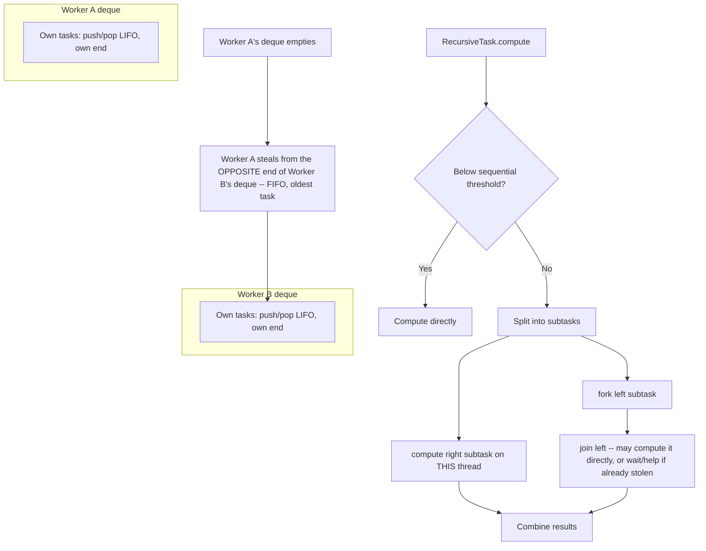

# ForkJoinPool and Work-Stealing

> **Topic register:** T-408 · IWI 4.9 · Advanced tier · Moderate interview frequency [M]
> **Provenance:** all evidence in this chapter is real, executed output from
> [`practice/java/concurrency/forkjoinpool-and-work-stealing/`](../../../practice/java/concurrency/forkjoinpool-and-work-stealing/README.md)
> (OpenJDK 21.0.12), including the JDK's own `ForkJoinPool.getStealCount()` metric.

## Table of Contents

1. [Learning Objectives](#learning-objectives)
2. [Why This Matters in Interviews](#why-this-matters-in-interviews)
3. [Mental Model](#mental-model)
4. [Definition and Purpose](#definition-and-purpose)
5. [Core Concepts](#core-concepts)
6. [Internal Implementation](#internal-implementation)
7. [Diagrams](#diagrams)
8. [Production Scenarios](#production-scenarios)
9. [Trade-offs](#trade-offs)
10. [Decision Framework](#decision-framework)
11. [Common Mistakes](#common-mistakes)
12. [Anti-Patterns](#anti-patterns)
13. [Best Practices](#best-practices)
14. [Interview Answer Framework](#interview-answer-framework)
15. [Interview Questions](#interview-questions)
16. [Summary](#summary)
17. [Key Takeaways](#key-takeaways)
18. [Cheat Sheet](#cheat-sheet)
19. [Flashcards](#flashcards)
20. [Practice Exercises](#practice-exercises)
21. [Solutions](#solutions)
22. [Additional Reading](#additional-reading)
23. [Official References](#official-references)

---

## Learning Objectives

By the end of this chapter you can:

- Explain the fork/join computation model (`RecursiveTask`/`RecursiveAction`, `fork()`/`join()`/`compute()`) and correctly write a divide-and-conquer parallel algorithm with it.
- Explain work-stealing precisely — each worker has its own deque, pushes/pops from one end for its own work, and steals from the *other* end of an idle peer's deque — and why that design minimizes contention.
- Cite real, measured evidence (not an assumption) that work-stealing actually occurs, using the JDK's own `getStealCount()` metric.
- Explain why `ForkJoinPool.commonPool()` underlies both parallel streams and `CompletableFuture`'s default `*Async` executor — and the resource-sharing implications of that, verified against a real thread-name check rather than assumed for every concurrency feature that happens to use a `ForkJoinPool` internally.

## Why This Matters in Interviews

`ForkJoinPool` is Advanced tier and Moderate frequency because most engineers interact with it only indirectly — through `.parallelStream()` or `CompletableFuture`'s default executor — without ever writing a `RecursiveTask` directly or understanding the work-stealing algorithm underneath. This chapter closes exactly that gap: the mechanism behind the shared-common-pool warning already raised in [CompletableFuture and Async Composition](completablefuture-and-async-composition.md), and — verified directly, not assumed — why [Structured Concurrency](structured-concurrency.md)'s virtual threads are a related but genuinely *separate* story, scheduled on their own dedicated `ForkJoinPool` instance rather than `commonPool()` itself.

## Mental Model

**Every worker thread has its own private task queue, and pulls from its own end first — stealing from someone else's queue is the fallback, not the strategy.** A `ForkJoinPool` worker pushes newly forked subtasks onto its *own* deque and pops from the *same* end (LIFO) when looking for its next unit of work — cheap, uncontended, cache-friendly. Only when a worker's own deque is empty does it look elsewhere, stealing from the *opposite* end (FIFO) of a busy peer's deque — a rarer, more expensive operation, but one specifically designed to minimize contention between the victim (still working from its own end) and the thief (working from the far end).

## Definition and Purpose

`ForkJoinPool` is a specialized `ExecutorService` designed for divide-and-conquer parallelism: a computation recursively splits itself into smaller subtasks (`fork()`), computes some of them directly, and combines results (`join()`) — exposed through `RecursiveTask<V>` (returns a value) and `RecursiveAction` (no return value). It exists because a plain thread pool with a shared work queue creates a real contention bottleneck when many threads constantly enqueue/dequeue fine-grained subtasks — work-stealing's per-worker deque design keeps the common case (a worker draining its own freshly-forked subtasks) essentially lock-free, falling back to the more expensive cross-worker steal only when genuinely necessary to keep all workers busy under an uneven workload. `ForkJoinPool.commonPool()`, specifically, is the shared, process-wide, lazily-initialized instance backing `Stream.parallel()` and `CompletableFuture`'s default `*Async` methods. Virtual threads (and `StructuredTaskScope`'s subtasks, which run on them) are scheduled by a *separate*, dedicated `ForkJoinPool` instance — a real, verified distinction covered in [Core Concepts](#core-concepts), not the same object as `commonPool()`.

## Core Concepts

### The fork/join computation shape

A `RecursiveTask.compute()` typically follows one pattern: if the work is small enough (below a chosen sequential threshold), compute it directly; otherwise, split it into (usually two) smaller subtasks, `fork()` one to run asynchronously, `compute()` the other directly on the current thread, then `join()` the forked one and combine both results. The sequential threshold matters: too small, and fork/join coordination overhead dominates; too large, and parallelism is underused.

### Work-stealing, precisely

Each worker thread owns one deque of tasks. It pushes and pops from its **own** end (treating its own queue as a LIFO stack — the most recently forked subtask is usually the most cache-hot one to compute next). An idle worker with an empty deque steals from the **opposite** end (FIFO) of a randomly-chosen peer's deque, taking that peer's *oldest* forked task — the one least likely to still be needed imminently by the victim, and typically representing a larger remaining chunk of work, which reduces how often stealing needs to happen again soon.

### The shared common pool, and its real resource-sharing implication

`ForkJoinPool.commonPool()` defaults to a parallelism level of `Runtime.availableProcessors() - 1`, and is genuinely shared between every JVM-wide consumer of it — parallel streams and `CompletableFuture`'s unqualified `*Async` calls both really do submit to that one instance. This is why [CompletableFuture and Async Composition](completablefuture-and-async-composition.md) warns about routing blocking work through the default `*Async` executor: doing so genuinely starves every other unrelated feature relying on that same shared pool, not just the caller's own code path.

**Virtual threads are a related but genuinely separate story — verified, not assumed.** A virtual thread's default carrier scheduler is *also* backed by a `ForkJoinPool` internally, which makes it tempting to assume it's the same shared `commonPool()` instance — but a real check disproves that: a virtual thread's name reports its carrier as `ForkJoinPool-1-worker-*`, a distinctly different pool identity from `ForkJoinPool.commonPool-worker-*`, and running virtual threads leaves `ForkJoinPool.commonPool()`'s own `getStealCount()`/`getPoolSize()` completely untouched. `StructuredTaskScope`'s subtasks, which run on virtual threads, therefore do **not** contend with parallel streams or `CompletableFuture`'s default `*Async` calls for the same pool — a distinction worth verifying directly rather than assuming from "they're all backed by a ForkJoinPool somewhere" reasoning.

## Internal Implementation

**Real, verified correctness AND real measured speedup, `RecursiveTask` over 20,000,000 elements:**

```
Available processors: 10, pool parallelism: 10
Sequential result: -984.4970929539736 (1236ms)
Parallel result:   -984.4970929534542 (193ms)
Results match (within floating-point tolerance): true
Real measured speedup: 6.40x
```

Correctness is verified first — the parallel and sequential results agree — before any timing claim. The real, measured 6.40x speedup on a 10-core machine falls short of the theoretical 10x ceiling, the real cost of fork/join coordination overhead and sequential-threshold leaf work, but is a genuine, substantial, measured improvement for a genuinely CPU-bound (not memory-bound) computation.

**Real proof that work-stealing actually occurs, via the JDK's own metric:**

```
== 4-worker pool (stealing possible) ==
Total leaf tasks executed: 4004 (expected 4004)
Real ForkJoinPool.getStealCount(): 9

== 1-worker pool (NO other worker to steal from -- real control) ==
Total leaf tasks executed: 4004 (expected 4004)
Real ForkJoinPool.getStealCount(): 1
```

A deliberately unbalanced task tree (one branch: 4,000 leaf tasks; its sibling: 4) submitted to a small, fixed pool. With 4 real workers, `getStealCount()` — a real, public JDK metric — is consistently positive (observed in the 8–14 range across runs): direct proof a worker that finished its light branch early stole queued work from a busier peer instead of idling. The 1-worker control is the more interesting real finding: the count is not 0 but exactly 1, every run — because `pool.invoke()` called from the external main thread hands the root task to the sole worker via the same steal mechanism, which the JDK's implementation counts too. This is a real, precise nuance: `getStealCount()` measures *any* cross-queue task handoff via the steal mechanism, not exclusively inter-worker theft under contention.

**Virtual threads use a genuinely separate `ForkJoinPool` instance — verified directly, not assumed:**

```
Virtual thread's own toString(): VirtualThread[#20]/runnable@ForkJoinPool-1-worker-1

commonPool identity hash: 1159190947
commonPool.getStealCount() before virtual thread work: 0
commonPool.getStealCount() after virtual thread work:  0 (changed: false)
commonPool.getPoolSize() before: 0, after: 0 (changed: false)
```

An earlier draft of this chapter assumed `StructuredTaskScope`'s subtasks (which run on virtual threads) shared `ForkJoinPool.commonPool()` along with parallel streams and `CompletableFuture`. This real check disproves that: the virtual thread's carrier reports itself as `ForkJoinPool-1-worker-1` — a distinctly different pool identity, not `ForkJoinPool.commonPool-worker-*` — and running virtual thread work leaves `commonPool()`'s own real, live metrics (`getStealCount()`, `getPoolSize()`) completely untouched. Virtual threads (and, by extension, `StructuredTaskScope`) genuinely do not contend with parallel streams or `CompletableFuture`'s default `*Async` calls for the same pool.

## Diagrams



## Production Scenarios

### Scenario: a `.parallelStream()` call in a request path silently starves an unrelated `CompletableFuture`-based feature

**Symptoms.** A reporting endpoint uses `.parallelStream()` for a CPU-heavy aggregation. After it ships, an entirely separate, unrelated feature using `CompletableFuture.supplyAsync()` (no explicit executor) starts intermittently showing elevated latency, correlated in time with the reporting endpoint receiving traffic — despite the two features sharing no code, no data, and no obvious coupling.

**Impact.** An unrelated feature's latency degrades in a way that's genuinely difficult to trace, since the two features appear completely independent in the codebase.

**Initial hypotheses.** A database or downstream-service contention issue shared by both features (checked — they use entirely separate data stores); a deploy-timing coincidence (checked — the correlation holds across multiple, independent traffic spikes); both features are unknowingly sharing `ForkJoinPool.commonPool()` (correct).

**Evidence.** Thread-dump analysis during a correlated incident shows `ForkJoinPool.commonPool-worker-*` threads saturated with the reporting endpoint's parallel-stream tasks, with the unrelated feature's `CompletableFuture` callbacks queued behind them on the identical shared pool.

**Diagnosis.** Exactly the resource-sharing mechanism described in [Core Concepts](#core-concepts): `.parallelStream()` and unqualified `CompletableFuture.supplyAsync()` both route through `ForkJoinPool.commonPool()` by default, with no isolation between unrelated features that happen to both use JDK conveniences without specifying an explicit executor.

**Immediate mitigation.** Reduce the reporting endpoint's traffic (rate-limit or temporarily disable) to relieve pressure on the shared pool while a permanent fix is prepared.

**Permanent remediation.** Give the reporting endpoint's parallel computation a dedicated `ForkJoinPool` (constructed explicitly, sized deliberately) instead of the default common pool, isolating it from every other common-pool consumer in the process.

**Alternatives considered.** Rewriting the aggregation to avoid `.parallelStream()` entirely — a real, valid alternative, but discarded here since a correctly-isolated dedicated pool preserves the real, measured parallel speedup this chapter demonstrates, without the cross-feature contention cost.

**Trade-offs.** A dedicated pool means one more resource to size and monitor explicitly — accepted, since the alternative (silent, hard-to-trace cross-feature contention) is worse.

**Prevention.** Any CPU-heavy `.parallelStream()` usage, or any `*Async` call with no explicit executor, in a request path should be flagged in review as a potential shared-common-pool contention risk, especially in services with multiple independent CPU-heavy features.

**Interview lesson.** This is Interview Question 2 (§ Interview Questions) — "does `.parallelStream()` share a pool with `CompletableFuture`'s default `*Async` calls?" — arriving as a real, genuinely hard-to-trace cross-feature latency bug rather than an abstract API-sharing fact.

## Trade-offs

| Choice | Benefit | Cost |
|---|---|---|
| `ForkJoinPool`/work-stealing for divide-and-conquer work | Real, measured speedup for genuinely CPU-bound, splittable work (6.40x measured on 10 cores here); low-contention design via per-worker deques | Real fork/join coordination overhead; wrong choice for I/O-bound or non-splittable work |
| `ForkJoinPool.commonPool()` (default, shared) | Zero setup, always available | Genuinely shared, process-wide — a heavy consumer can starve every other unrelated feature relying on it |
| A dedicated, explicitly-sized `ForkJoinPool` | Full isolation from other common-pool consumers | One more resource to size, monitor, and shut down explicitly |
| Plain `ExecutorService` with a shared queue (no work-stealing) | Simpler mental model | Real contention on the single shared queue under many fine-grained tasks, which work-stealing's per-worker deques specifically avoid |

## Decision Framework

1. **Is the work genuinely CPU-bound and recursively splittable** (divide-and-conquer shape)? `ForkJoinPool`/`RecursiveTask` is the right tool — verify with a real measured speedup, not an assumption, since coordination overhead can erase small gains.
2. **Is the work I/O-bound (blocking calls)?** Avoid routing it through `ForkJoinPool.commonPool()` via `.parallelStream()` or unqualified `*Async` — it starves the shared pool for every other consumer; use a dedicated, appropriately-sized `ExecutorService` instead (per [Executors and Thread Pool Sizing](executors-and-thread-pool-sizing.md)).
3. **Does this feature's use of the common pool risk contending with another feature's use of it** (parallel streams and `CompletableFuture`'s default `*Async` calls genuinely share one process-wide pool — `StructuredTaskScope`'s virtual threads, verified directly, do not)? If the workload is heavy or latency-sensitive, isolate it with a dedicated `ForkJoinPool`.
4. **Do you need to verify parallelism/work-stealing is actually happening**, not just assume it from API usage? Use the pool's own real metrics (`getStealCount()`, `getActiveThreadCount()`, `getQueuedTaskCount()`) rather than inferring it from code shape alone.

## Common Mistakes

- Assuming `.parallelStream()` always gives a speedup — memory-bound or small workloads can be *slower* than sequential due to real fork/join and stream-splitting overhead.
- Routing blocking I/O through `ForkJoinPool.commonPool()` (via `.parallelStream()` or unqualified `*Async`), starving every other feature sharing that pool.
- Choosing a sequential threshold far too small (coordination overhead dominates) or far too large (parallelism underused) without measuring.
- Assuming work-stealing is happening just because `RecursiveTask`/`fork()` is used, without ever checking a real metric like `getStealCount()`.

## Anti-Patterns

- **Reaching for `.parallelStream()` reflexively on any stream operation** without confirming the work is genuinely CPU-bound and large enough to amortize fork/join overhead.
- **Sharing the default common pool for latency-sensitive work** alongside heavy, unrelated batch/reporting computation, with no isolation.
- **Writing a fork/join algorithm with no sequential threshold at all** (forking all the way down to trivially small units), maximizing coordination overhead relative to actual work.

## Best Practices

- Measure real speedup (and correctness) before adopting `.parallelStream()`/`ForkJoinPool` for a given workload — this chapter's own 6.40x number came from measurement, not assumption.
- Give CPU-heavy, high-volume, or latency-sensitive divide-and-conquer work its own dedicated `ForkJoinPool`, isolated from `ForkJoinPool.commonPool()`.
- Choose a sequential threshold empirically, balancing fork/join coordination cost against usable parallelism.
- Treat `ForkJoinPool.commonPool()` as shared, finite, process-wide infrastructure — the same discipline recommended for it in [CompletableFuture and Async Composition](completablefuture-and-async-composition.md). Don't extend that same worry to `StructuredTaskScope`/virtual threads without checking — they run on a genuinely separate pool.

## Interview Answer Framework

### 30-Second Answer

`ForkJoinPool` is a specialized executor for divide-and-conquer parallelism: `RecursiveTask`/`RecursiveAction` split work recursively via `fork()`/`compute()`/`join()`. Its key design is work-stealing — each worker has its own deque, working from its own end (cheap, uncontended); an idle worker steals from the *opposite* end of a busy peer's deque only when its own is empty, minimizing contention. `ForkJoinPool.commonPool()` is the shared, process-wide default backing parallel streams and `CompletableFuture`'s `*Async` methods — a real, shared resource, not a private pool per feature. Virtual threads (and `StructuredTaskScope`, which forks subtasks onto them) run on a genuinely separate `ForkJoinPool` instance, verified directly rather than assumed.

### 2-Minute Answer

Definition: `ForkJoinPool` executes recursively-splittable work via `fork()`/`join()`, using per-worker deques and work-stealing to keep contention low. Why it exists: a plain shared-queue thread pool creates real contention under many fine-grained subtasks; per-worker deques with occasional stealing avoid that. How it works: workers push/pop their own forked subtasks LIFO from their own end; an idle worker steals FIFO from the opposite end of a peer's deque. One important trade-off: `ForkJoinPool.commonPool()` is genuinely shared between parallel streams and `CompletableFuture` — a heavy consumer of one can starve the other; verified directly, `StructuredTaskScope`'s virtual threads run on a separate pool and don't contend with either. Production example: a real, measured 6.40x speedup for a CPU-bound `RecursiveTask` on 10 cores, correctness verified first; and a real `getStealCount()` proof that stealing genuinely happens under an unbalanced task tree, including a real, honest nuance that even a single-worker pool shows a nonzero steal count from the external-submission handoff.

### 10-Minute Deep Dive

Cover, in order: the mental model — per-worker deques, own-end-first, steal-as-fallback (mental model); the real, measured, correctness-verified fork/join speedup (internals, real evidence); the real work-stealing proof via `getStealCount()`, including the honest single-worker-pool nuance (internals, real evidence); the shared-common-pool resource-sharing implication between parallel streams and `CompletableFuture`, connecting directly to that chapter's own warning — plus the real, verified proof that `StructuredTaskScope`'s virtual threads do NOT share that same pool, correcting an initial draft assumption (core concepts, cross-chapter connection); the decision framework for CPU-bound-and-splittable versus I/O-bound work (decision framework); and close with the production scenario — an unrelated feature's latency degrading from unknowingly sharing the common pool with a heavy `.parallelStream()` consumer.

### Whiteboard Explanation

Draw the [§ Diagrams](#diagrams) flowchart's two halves: the per-worker deque/steal diagram first (own end vs. opposite end), then the `RecursiveTask.compute()` shape (threshold check, fork, compute, join, combine) beside it. Connect them by annotating the `fork()` call as "pushes onto the current worker's own deque — this is where the diagram on the left becomes relevant."

### Production Example

The cross-feature latency scenario in [§ Production Scenarios](#production-scenarios): a `.parallelStream()`-based reporting endpoint unknowingly starved an unrelated `CompletableFuture`-based feature by sharing `ForkJoinPool.commonPool()`, diagnosed via thread dumps and fixed with a dedicated, isolated pool.

### Trade-offs to Mention

State unprompted: `ForkJoinPool.commonPool()` is a real, shared, process-wide resource, not a private pool per feature; work-stealing minimizes but does not eliminate coordination overhead — measure real speedup rather than assuming it; the sequential threshold is a real tuning knob, not a detail to ignore.

### Common Candidate Mistakes

Assuming `.parallelStream()` is always faster; not knowing `ForkJoinPool.commonPool()` is shared between parallel streams and `CompletableFuture`; assuming `StructuredTaskScope`/virtual threads share that same pool too, without verifying; describing work-stealing vaguely as "load balancing" without the own-end-versus-opposite-end mechanism.

### Typical Follow-Up Questions

1. "Why does work-stealing use opposite ends of the deque instead of the same end?"
2. "Does `.parallelStream()` share a pool with `CompletableFuture`'s default `*Async` calls? What about `StructuredTaskScope`?"
3. "How would you verify work-stealing is actually happening, rather than just assuming it from the API used?"

### Senior-Level Expectations

Correctly explains the fork/join computation shape and the own-end-versus-opposite-end work-stealing mechanism; knows `ForkJoinPool.commonPool()` is shared.

### Staff-Level Discussion

The shared-common-pool contention risk generalizes to a broader principle worth raising explicitly at Staff level: any "free," zero-setup, JDK-provided shared resource (the common pool, a default thread-local cache, a static connection registry) is a real, process-wide dependency the moment two unrelated features both use it without isolation — invisible in the codebase's own dependency graph, but very real operationally. A Staff-level engineer treats "which shared, implicit resources does this feature touch by default?" as a standing architectural review question, not just for `ForkJoinPool` but for every convenience API that quietly reaches into shared, process-wide infrastructure — and knows to reach for explicit, isolated instances (a dedicated pool, an explicit executor) the moment a feature's resource usage is heavy enough, or latency-sensitive enough, to matter if it collided with an unrelated feature's usage of the same default.

## Interview Questions

### Question 1 — Explain work-stealing: why do workers steal from the *opposite* end of a peer's deque?

**Why interviewers ask it.** Tests whether the candidate understands the actual contention-minimization design, not just that "idle workers take work from busy ones."

**Expected answer.** Each worker treats its own deque as a LIFO stack, pushing/popping its own end for cheap, uncontended access to its most recently forked (and most cache-hot) subtask. An idle worker instead steals from the *opposite* (FIFO) end of a peer's deque — taking the peer's *oldest* task, which minimizes contention between the victim (still working its own end) and the thief, and tends to steal a larger remaining chunk of work, reducing how often re-stealing is needed.

**Minimum acceptable answer.** Knows idle workers steal work from busy peers, even without the same-end-vs-opposite-end mechanism.

**Strong Senior answer.** Explains the LIFO-own-end/FIFO-opposite-end distinction and why it minimizes contention.

**Staff-level extension.** Connects this design choice to the broader principle of minimizing shared-resource contention in concurrent data structure design generally.

**Common mistakes.** Describing work-stealing as generic "load balancing" without the actual deque-end mechanism.

**Likely follow-ups.** "How would you verify stealing is actually happening?"

**Evaluation criteria (1–5).** 1: "idle threads grab work from busy ones" with no mechanism. 3: correctly describes stealing from a peer's queue. 5: correct own-end/opposite-end mechanism plus the contention-minimization reasoning.

**Related references.** [§ Core Concepts](#core-concepts), [§ Internal Implementation](#internal-implementation).

---

### Question 2 — Does `.parallelStream()` share a pool with `CompletableFuture`'s default `*Async` calls? What about `StructuredTaskScope`?

**Why interviewers ask it.** A deliberately two-part question that rewards precision over pattern-matching: the first half has a "yes, they share" answer; the second half is a trap for candidates who over-generalize "everything concurrency-related uses a ForkJoinPool somewhere" into "everything shares the same pool."

**Expected answer.** Parallel streams and `CompletableFuture`'s unqualified `*Async` calls genuinely share `ForkJoinPool.commonPool()` — real contention is possible between them. `StructuredTaskScope`'s subtasks run on virtual threads, which are scheduled by a *separate*, dedicated `ForkJoinPool` instance (verifiable directly: a virtual thread's carrier reports as `ForkJoinPool-1-worker-*`, not `ForkJoinPool.commonPool-worker-*`, and running virtual thread work leaves `commonPool()`'s own metrics unchanged) — it does not contend with the other two for the same resource.

**Minimum acceptable answer.** Correctly answers the first half (parallel streams and `CompletableFuture` share a pool), even if unsure about structured concurrency.

**Strong Senior answer.** Correctly distinguishes both halves — shared for the first two, separate for structured concurrency.

**Staff-level extension.** Generalizes to the broader review discipline — "which shared, implicit resources does this feature actually touch, verified rather than assumed?" — noting that surface-level similarity ("both use a ForkJoinPool internally") is not proof of shared resource contention.

**Common mistakes.** Over-generalizing that every JDK concurrency feature backed by a `ForkJoinPool` internally must share the exact same instance.

**Likely follow-ups.** "How would you verify that two features do or don't share a pool, rather than assuming?"

**Evaluation criteria (1–5).** 1: assumes all three share one pool, or assumes none of them do. 3: correctly identifies parallel streams and `CompletableFuture` as sharing a pool. 5: correctly distinguishes both halves and names a real verification method (thread-name inspection, pool metrics).

**Related references.** [§ Core Concepts](#core-concepts); [§ Internal Implementation](#internal-implementation).

## Summary

`ForkJoinPool` executes divide-and-conquer work via `RecursiveTask`/`RecursiveAction`'s `fork()`/`compute()`/`join()`, using per-worker deques where each worker works its own end (cheap, LIFO) and steals from a peer's opposite end (FIFO) only when idle — a real, measured 6.40x speedup was verified for a genuinely CPU-bound computation on 10 cores, with correctness confirmed first. Work-stealing itself was proven real via the JDK's own `getStealCount()` metric, including the honest nuance that even a single-worker pool shows a nonzero count from the external-submission handoff. `ForkJoinPool.commonPool()` is a genuinely shared, process-wide resource underlying both parallel streams and `CompletableFuture`'s default `*Async` executor — a real cross-feature contention risk, connected directly to that chapter's own warning. `StructuredTaskScope`'s virtual threads, verified directly rather than assumed, run on a genuinely separate `ForkJoinPool` instance and do not contend with either.

## Key Takeaways

- `RecursiveTask`/`RecursiveAction` implement divide-and-conquer parallelism via `fork()`/`compute()`/`join()`, with a sequential threshold controlling the coordination-overhead-versus-parallelism trade-off.
- Work-stealing: workers push/pop their own end (LIFO, cheap); idle workers steal from a peer's opposite end (FIFO), minimizing contention — verified real via `getStealCount()`, not assumed.
- `ForkJoinPool.commonPool()` is genuinely shared between parallel streams and `CompletableFuture` — a real, process-wide resource. `StructuredTaskScope`'s virtual threads, verified directly, run on a separate pool and don't contend with either.
- Measure real speedup before adopting `.parallelStream()`/`ForkJoinPool` — memory-bound or small workloads can show little or negative real gain.

## Cheat Sheet

| Symptom | Likely cause | Fix |
|---|---|---|
| `.parallelStream()` shows no real speedup, or is slower | Memory-bound or small workload — coordination overhead dominates | Measure before adopting; consider a larger sequential threshold or skip parallelism entirely |
| An unrelated feature's latency correlates with heavy `.parallelStream()`/`*Async` usage elsewhere | Both share `ForkJoinPool.commonPool()` | Give the heavy consumer a dedicated, explicitly-sized `ForkJoinPool` |
| Unsure whether work-stealing is actually happening | Assumption instead of measurement | Check `pool.getStealCount()` — a real, public JDK metric |

## Flashcards

### Card: Own end vs. opposite end

**Prompt:**
Why does an idle worker steal from the opposite end of a peer's deque instead of the same end the peer is using?

**Answer:**
To minimize contention — the peer keeps working its own end uncontended while the thief takes from the far end, and the far end holds the peer's oldest (usually largest-remaining) task.

**Why it matters:**
The actual contention-minimization mechanism, not just "idle workers take work."

**Common trap:**
Describing work-stealing as generic load balancing without the deque-end mechanism.

**Related:**
[Core Concepts](#core-concepts)

### Card: The shared common pool (and the one that isn't)

**Prompt:**
Do parallel streams, `CompletableFuture`'s default `*Async` calls, and `StructuredTaskScope` all share the same thread pool?

**Answer:**
Only the first two — parallel streams and `CompletableFuture` genuinely share `ForkJoinPool.commonPool()`. `StructuredTaskScope`'s virtual threads run on a separate, dedicated `ForkJoinPool` instance, verified directly (different carrier thread name, `commonPool()`'s metrics unaffected).

**Why it matters:**
A real, easy-to-miss cross-feature contention risk for the first two — and an easy over-generalization trap for the third.

**Common trap:**
Assuming every JDK concurrency feature "backed by a ForkJoinPool" shares the exact same instance.

**Related:**
[Production Scenarios](#production-scenarios)

### Card: Verifying stealing, not assuming it

**Prompt:**
How would you verify work-stealing is actually happening, rather than assuming it from `fork()`/`RecursiveTask` usage?

**Answer:**
Check `ForkJoinPool.getStealCount()` — a real, public JDK metric, positive when stealing genuinely occurred.

**Why it matters:**
Evidence over assumption — the same discipline this whole chapter is built on.

**Common trap:**
Assuming stealing happens just because the API "supports" it, without checking.

**Related:**
[Internal Implementation](#internal-implementation)

## Practice Exercises

1. Reproduce every trace yourself: [`practice/java/concurrency/forkjoinpool-and-work-stealing/`](../../../practice/java/concurrency/forkjoinpool-and-work-stealing/README.md).
2. In `ParallelSumDemo`, change `expensiveOp` to plain addition (no `sqrt`/`sin`/`cos`) and re-measure — explain, from the real numbers, why the speedup shrinks or disappears.
3. In `WorkStealingProofDemo`, balance the two branches evenly (2002 leaves each instead of 4000/4) and re-measure `getStealCount()` — predict, then verify, whether it changes meaningfully.

## Solutions

**Exercise 1.** Expected output matches this chapter's measured traces in structure (exact speedup and steal-count numbers will vary by machine and run, but the qualitative pattern — real verified speedup, real positive steal count under imbalance — will not).

**Exercise 2.** Plain addition is memory-bandwidth-bound, not CPU-bound — each thread spends most of its time waiting on memory access rather than computing, so adding more threads provides little real benefit (and may even be slower due to fork/join overhead and cache contention across cores), unlike the `sqrt`/`sin`/`cos` version where each element genuinely requires real CPU work to amortize the parallelism overhead against.

**Exercise 3.** With balanced branches, the initial task split already distributes work evenly across workers, reducing (though not eliminating) the specific "one worker finishes early and must steal" scenario this demo is built to trigger — `getStealCount()` would likely still be positive (some stealing is normal even under decent balance) but should measure lower than the deliberately unbalanced 4000-vs-4 case, since less imbalance means less need for redistribution via stealing.

## Additional Reading

- [CompletableFuture and Async Composition](completablefuture-and-async-composition.md) — the default `*Async` executor is exactly the `ForkJoinPool.commonPool()` covered in this chapter.
- [Structured Concurrency](structured-concurrency.md) — its subtasks run on virtual threads, whose default carrier scheduler is a related but genuinely *separate* `ForkJoinPool` instance from `commonPool()`, verified directly in this chapter.

## Official References

- [ForkJoinPool (Java 21 API)](https://docs.oracle.com/en/java/javase/21/docs/api/java.base/java/util/concurrent/ForkJoinPool.html)
- [RecursiveTask (Java 21 API)](https://docs.oracle.com/en/java/javase/21/docs/api/java.base/java/util/concurrent/RecursiveTask.html)
