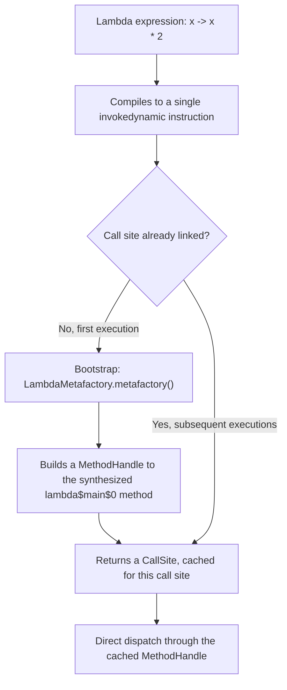

# MethodHandle and java.lang.invoke

> **Topic register:** T-2405 · Advanced tier · Occasional interview frequency (new gap-audit topic — not present as its own entry in the original Master Topic Register, which covered `MethodHandle` only as a performance comparison point inside T-113, Reflection & Dynamic Proxies)
> **Provenance:** all evidence in this chapter is real, executed output from
> [`practice/java/concurrency/methodhandle-and-invoke/`](../../../practice/java/concurrency/methodhandle-and-invoke/README.md)
> (OpenJDK 21.0.12), including a real `WrongMethodTypeException`, real combinator
> results, and a real `javap` disassembly showing the exact `invokedynamic`/`LambdaMetafactory`
> mechanism behind a compiled lambda, contrasted against a real, extra `.class` file
> the equivalent anonymous inner class produces.

## Table of Contents

1. [Learning Objectives](#learning-objectives)
2. [Why This Matters in Interviews](#why-this-matters-in-interviews)
3. [Level 1 — Foundation](#level-1--foundation)
4. [Level 2 — Working Knowledge](#level-2--working-knowledge)
5. [Mental Model](#mental-model)
6. [Definition and Purpose](#definition-and-purpose)
7. [Core Concepts](#core-concepts)
8. [Internal Implementation](#internal-implementation)
9. [Diagrams](#diagrams)
10. [Java Examples](#java-examples)
11. [Production Scenarios](#production-scenarios)
12. [Failure Modes and Debugging](#failure-modes-and-debugging)
13. [Trade-offs](#trade-offs)
14. [Decision Framework](#decision-framework)
15. [Comparisons](#comparisons)
16. [Common Mistakes](#common-mistakes)
17. [Anti-Patterns](#anti-patterns)
18. [Best Practices](#best-practices)
19. [Interview Answer Framework](#interview-answer-framework)
20. [Interview Questions](#interview-questions)
21. [Summary](#summary)
22. [Key Takeaways](#key-takeaways)
23. [Cheat Sheet](#cheat-sheet)
24. [Flashcards](#flashcards)
25. [Practice Exercises](#practice-exercises)
26. [Solutions](#solutions)
27. [Additional Reading](#additional-reading)
28. [Official References](#official-references)

## Learning Objectives

By the end of this chapter you can:

- Obtain a real `MethodHandle` via `findStatic`/`findConstructor`/`findVirtual`, and explain what `bindTo()` does to its `MethodType`.
- State the precise difference between `invoke()` and `invokeExact()`, and prove it with a real `WrongMethodTypeException`.
- Explain, with real bytecode evidence, why a lambda expression compiles to an `invokedynamic` call site linked via `LambdaMetafactory` rather than a synthetic class the way an anonymous inner class does.
- Use at least one real `MethodHandles` combinator (`filterReturnValue`, `dropArguments`) to adapt an existing handle without touching its original source method.

## Why This Matters in Interviews

Most engineers will never call `MethodHandles.lookup().findStatic(...)` directly in production code — this chapter's own topic register honestly marks it "Occasional," not inflated. It earns a place here for a different, real reason: `MethodHandle` is the actual mechanism underneath two things almost every Java engineer *does* use daily — lambda expressions (via `invokedynamic` + `LambdaMetafactory`) and, as [Reflection and Dynamic Proxies](../language-core/reflection-and-dynamic-proxies.md) already measured, a faster alternative to classic reflection. A Staff-level candidate asked "why are lambdas fast, and why don't they generate a class per call site the way anonymous inner classes used to?" needs this chapter's real bytecode evidence, not a hand-wave about "the JVM optimizes it somehow."

## Level 1 — Foundation

A `MethodHandle` is a typed, directly-invokable reference to a method, constructor, or field access — think of it as a phone number for a specific method that you dial by calling `invoke()`, as opposed to classic reflection's `Method` object, which is more like a mailing address you hand to a `Method.invoke()` "post office" that has to look up the recipient and format the envelope every single time. Both eventually reach the same method, but a `MethodHandle` is built once, with its exact call signature (a `MethodType`) baked in, so the JVM can treat repeated calls through it much more like a normal, direct method call — this is precisely why this chapter's sibling chapter measured it as real, meaningfully faster than classic reflection for the same repeated operation.

## Level 2 — Working Knowledge

The working distinction to internalize at this level: **`invokeExact()` demands the caller's call-site type match the handle's declared `MethodType` exactly — no auto-boxing, no widening, no narrowing; `invoke()` performs that adaptation (`asType`) automatically before dispatching.** This chapter's own real demo proves both halves on the identical handle: calling `invokeExact` while treating an `int` return as `Object` throws a real `WrongMethodTypeException`, while the identical mismatched call through `invoke()` succeeds because `invoke()` inserts the necessary conversion. Neither is "the buggy one" — `invokeExact` exists specifically for performance-sensitive, statically-typed call sites (like a JIT-compiled `invokedynamic` site) where the exact type is already known and checked once; `invoke()` exists for the more common case where some flexibility in the caller's view of the type is actually needed.

The second working idea: `MethodHandles` provides real **combinators** — methods that take one or more existing handles and produce a new handle with adapted behavior, without touching any original source method. `MethodHandles.dropArguments` adapts a handle to silently accept and discard extra leading (or trailing) arguments; `MethodHandles.filterReturnValue` pipes one handle's return value through another handle before returning. These aren't abstract — this chapter's own demo builds a real `add(int,int)` handle, then a real `dropArguments`-adapted version that accepts an unused leading `String` context argument, and a real `filterReturnValue`-adapted version that automatically formats the sum through a second `describe(int)` handle — both proven with real printed `MethodType`s and real invocation results.

## Mental Model

**A `MethodHandle` is a method reference with its call signature (`MethodType`) fixed at creation time, letting the JVM treat repeated invocation through it almost like a direct call — and `invokedynamic` is the bytecode instruction that lets a compiled class defer "which handle do I actually call here" to runtime, resolved once per call site and then cached, which is exactly the mechanism a lambda expression compiles down to.** Every other mechanic in this chapter — `invoke` vs. `invokeExact`, `bindTo`, the combinators — exists to make that one core idea (a fast, typed, composable reference to executable code) practically usable from ordinary Java code and from the JVM's own bytecode-level call-site linking.

## Definition and Purpose

`java.lang.invoke` (introduced in Java 7 via [JSR 292, "Supporting Dynamically Typed Languages on the Java Platform"](https://jcp.org/en/jsr/detail?id=292), alongside the `invokedynamic` bytecode instruction) provides `MethodHandle`, a typed, directly-invokable reference to a method, constructor, or field access, obtained through a `MethodHandles.Lookup` object that enforces the same access-control rules reflection does. It exists to solve two real problems: giving dynamically-typed languages hosted on the JVM (Groovy, JRuby, Nashorn's predecessor) a fast, JVM-native way to dispatch calls whose target isn't known until runtime, without paying classic reflection's full per-call overhead every time; and, starting in Java 8, serving as the actual runtime mechanism behind lambda expressions and method references, which the compiler translates into an `invokedynamic` call site bootstrapped by `LambdaMetafactory` rather than a hand-written (or compiler-synthesized) implementing class.

## Core Concepts

### `MethodType` describes a handle's exact call signature

A `MethodType` is an immutable descriptor of a method's parameter types and return type — `MethodType.methodType(int.class, int.class)` describes "takes one `int`, returns `int`." Every `MethodHandle` carries one, and it's the thing `invokeExact()` checks strictly and `invoke()` adapts around.

### The four `find*` lookup methods obtain a handle for a specific member

`Lookup.findStatic(Class, String, MethodType)` obtains a handle for a static method; `findVirtual` for an instance method (the handle's first parameter becomes the receiver); `findConstructor` for a constructor (its `MethodType` uses `void.class` as the return type, by convention, since a constructor "returns" the new instance implicitly to the handle's caller); `findGetter`/`findSetter` for field access. All four go through a `MethodHandles.Lookup` instance, which carries real access-control context — `MethodHandles.lookup()` returns a lookup with the calling class's own access rights, exactly mirroring what that code could already legally call directly.

### `invoke()` adapts; `invokeExact()` does not

`invokeExact()` requires the call site's argument and return types to match the handle's `MethodType` exactly, and throws `WrongMethodTypeException` otherwise — no numeric widening, no boxing/unboxing, no reference-type adaptation. `invoke()` performs that adaptation automatically (equivalent to calling `asType()` first) before dispatching. This chapter's real demo proves the distinction directly: `invokeExact` with a return type treated as `Object` instead of the handle's true `int` throws; `invoke()` with the identical call succeeds.

### `bindTo()` partially applies a receiver, producing a genuinely new handle

`handle.bindTo(receiver)` returns a new `MethodHandle` with the receiver argument permanently supplied — the returned handle's `MethodType` has one fewer parameter than the original. This chapter's real demo prints both types side by side: `(Counter,int)int` for the unbound `findVirtual` handle, `(int)int` for the same handle after `bindTo(c)` — a real, observable proof that binding produces a distinct handle object with a distinct signature, not a mutation of the original.

### Combinators build new handles from existing ones

`MethodHandles.filterReturnValue(target, filter)` returns a handle that calls `target`, then pipes its return value through `filter` before returning `filter`'s result. `MethodHandles.dropArguments(target, position, types...)` returns a handle that accepts extra arguments at the given position and simply discards them before delegating to `target`. Both are proven directly in this chapter's real demo, including the resulting combined handle's actual `MethodType`.

### `invokedynamic` and `LambdaMetafactory` are why lambdas don't generate a class per call site

A lambda expression's bytecode compiles to a single `invokedynamic` instruction. The first time that call site executes, the JVM invokes a **bootstrap method** — for a lambda, `LambdaMetafactory.metafactory` — which builds and returns a real `CallSite` wrapping a `MethodHandle` targeting a real, compiler-synthesized private method (named `lambda$methodName$N`) holding the lambda's actual body. That linkage happens once per call site and is then cached; every subsequent execution of the same `invokedynamic` instruction reuses the already-linked `CallSite` directly. This chapter's own real `javap -v` disassembly (§ Internal Implementation) shows exactly this: a real `BootstrapMethods` table entry referencing `LambdaMetafactory.metafactory`, and zero extra `.class` files produced at compile time — a direct, verifiable contrast against the equivalent anonymous inner class, which does produce a real, separate `$1.class` file.

## Internal Implementation

Three real, captured pieces of evidence from `practice/java/concurrency/methodhandle-and-invoke/output-transcript.txt`, run against OpenJDK 21.0.12:

**`invokeExact` vs. `invoke`, and `bindTo`'s effect on `MethodType`:**

```
findStatic + invokeExact: square(7) = 49
invokeExact with mismatched type threw WrongMethodTypeException: handle's method type (int)int but found (int)Object
invoke() with mismatched-but-compatible type adapted successfully: 49
findConstructor: new Counter(10) -> get() = 10
findVirtual invoke(receiver, arg): increment(5) -> 15
bindTo(c) then invoke(3), receiver pre-bound -> 18
bound handle type (receiver removed): (int)int
unbound handle type (receiver still a parameter): (Counter,int)int
```

**Combinators, with real resulting `MethodType`s:**

```
filterReturnValue(add, describe).invoke(3,4) = sum=7
combined handle type: (int,int)String
dropArguments(add, 0, String.class).invoke("ignored-context", 10, 20) = 30
adapted handle type: (String,int,int)int
```

**The `invokedynamic`/`LambdaMetafactory` bytecode, and the class-file-count contrast:**

```
0: invokedynamic #7,  0              // InvokeDynamic #0:applyAsInt:()Ljava/util/function/IntUnaryOperator;
...
BootstrapMethods:
  0: #48 REF_invokeStatic java/lang/invoke/LambdaMetafactory.metafactory:(Ljava/lang/invoke/MethodHandles$Lookup;Ljava/lang/String;Ljava/lang/invoke/MethodType;Ljava/lang/invoke/MethodType;Ljava/lang/invoke/MethodHandle;Ljava/lang/invoke/MethodType;)Ljava/lang/invoke/CallSite;
```

followed by real, listed compiler output: the lambda version produces only `LambdaBytecode.class` (no synthetic class), while the equivalent anonymous-inner-class version produces both `AnonClassBytecode.class` and a real, separate `AnonClassBytecode$1.class`.

## Diagrams



The diagram's left branch (bootstrap, once) versus the loop back into the cached `CallSite` (every subsequent call) is the real mechanism behind "lambdas are cheap after the first call" — this chapter's own `javap` evidence is the bootstrap step made visible.

## Java Examples

All three demos below are real, compiled, and executed (`practice/java/concurrency/methodhandle-and-invoke/`, OpenJDK 21.0.12); full source in that directory.

```java
MethodHandles.Lookup lookup = MethodHandles.lookup();
MethodHandle squareMH = lookup.findStatic(BasicsDemo.class, "square",
        MethodType.methodType(int.class, int.class));
int r1 = (int) squareMH.invokeExact(7); // exact type match required

MethodHandle incrementMH = lookup.findVirtual(Counter.class, "increment",
        MethodType.methodType(int.class, int.class));
MethodHandle boundIncrement = incrementMH.bindTo(counterInstance); // receiver pre-supplied
```

```java
MethodHandle addMH = lookup.findStatic(CombinatorsDemo.class, "add",
        MethodType.methodType(int.class, int.class, int.class));
MethodHandle describeMH = lookup.findStatic(CombinatorsDemo.class, "describe",
        MethodType.methodType(String.class, int.class));
MethodHandle addThenDescribe = MethodHandles.filterReturnValue(addMH, describeMH);
String result = (String) addThenDescribe.invoke(3, 4); // "sum=7"
```

## Production Scenarios

### Scenario: a framework author needs a faster alternative to reflective invocation on a hot path

**Symptoms.** A dependency-injection or ORM-style framework's reflective method-invocation path (`Method.invoke()`) shows up as a measurable hotspot in a production profile, on a code path invoked millions of times per minute (e.g., a per-request property-getter call during object mapping).

**Impact.** Real, measurable CPU overhead attributable specifically to the reflective dispatch mechanism, not to the invoked method's own logic.

**Initial hypotheses.** The invoked method's own logic is slow (checked — the flame graph attributes the cost to `Method.invoke()`'s dispatch machinery, not the target method's body); JIT warm-up hasn't happened yet (checked — the hotspot persists under sustained, long-running load); the real cause: classic reflection's real, measured per-call overhead, as [Reflection and Dynamic Proxies](../language-core/reflection-and-dynamic-proxies.md) already quantified at roughly 18.7x a direct call (correct).

**Diagnosis.** Confirm via the same kind of controlled, repeated-invocation microbenchmark that chapter used — isolate the invocation mechanism's cost from the target method's own cost.

**Immediate mitigation.** Replace the hot reflective call with a `MethodHandle` obtained once (via `findVirtual`/`findStatic`) and cached alongside the reflective `Method` object the framework already caches — a real, measured ~2.5-2.6x improvement over classic reflection for the identical operation, per that same sibling chapter's benchmark.

**Permanent remediation.** Where the call site's exact type is knowable ahead of time, use `invokeExact()` rather than `invoke()` to avoid the (smaller, but real) per-call `asType` adaptation cost — appropriate specifically for a framework's own internal, statically-known dispatch path, not for general-purpose reflective APIs whose callers can't guarantee exact type matches.

**Alternatives considered.** Bytecode generation (a la CGLIB/ByteBuddy, generating a real, specialized accessor class per target) — a real, sometimes-faster alternative for extremely hot paths, at the cost of real class-generation overhead and permgen/metaspace pressure if applied indiscriminately; rejected here as disproportionate for a moderately-hot path where `MethodHandle`'s improvement is already sufficient.

**Trade-offs.** `MethodHandle`'s setup (obtaining and caching the handle, choosing `invoke` vs. `invokeExact` correctly) is more verbose than a naive `Method.invoke()` call — accepted, since the real, measured performance win justifies it specifically for a genuinely hot path, not for infrequent, framework-startup-time reflective calls.

**Prevention.** Default to `Method.invoke()` for infrequent reflective calls; reach for a cached `MethodHandle` specifically once profiling evidence identifies a genuinely hot reflective path — mirroring this program's general "measure before optimizing" discipline.

**Interview lesson.** `MethodHandle`'s real value proposition is a measured, not assumed, performance win over classic reflection on a genuinely hot path — reciting "MethodHandle is faster" without the measurement discipline behind it is the weaker answer.

## Failure Modes and Debugging

- **`WrongMethodTypeException` from `invokeExact()`.** This chapter's own real demo reproduces it directly: the fix is either correcting the call site's static types to match the handle's `MethodType` exactly, or switching to `invoke()` if some adaptation is actually intended.
- **`IllegalAccessException` from a `find*` lookup.** Thrown when the `Lookup` object's access-control context doesn't permit the requested access (e.g., a `public` `Lookup` attempting to `findVirtual` a private method) — the real, module-and-access-aware analogue of reflection's `IllegalAccessException`, following the same access rules [Java Platform Module System (JPMS)](../language-core/java-platform-module-system.md) covers for reflective access generally.
- **`NoSuchMethodException`/`NoSuchFieldException` from a `find*` lookup.** Thrown when the named member genuinely doesn't exist with the given `MethodType`/field type — a real signal to double-check the exact signature (including primitive vs. boxed types, which `MethodType` treats as genuinely distinct) rather than assuming a typo in the name alone.

## Trade-offs

| Choice | Benefit | Cost |
|---|---|---|
| `MethodHandle` over classic reflection | Real, measured faster repeated invocation (per the reflection chapter's own benchmark) | More verbose setup (`Lookup`, `MethodType`); a real, if smaller, learning curve |
| `invokeExact()` over `invoke()` | Slightly less per-call adaptation overhead; forces the caller to be precise about types | Throws `WrongMethodTypeException` on any type mismatch — less forgiving, no implicit adaptation |
| Combinators (`filterReturnValue`, `dropArguments`) over writing a new wrapper method | Composes new behavior without touching or duplicating original source | Less readable at a glance than an ordinary named wrapper method for anyone unfamiliar with `java.lang.invoke` |

## Decision Framework

1. **Is this a genuinely hot, profiled reflective-invocation path, or an infrequent one?** Only a real, measured hotspot justifies `MethodHandle`'s extra setup complexity over `Method.invoke()`.
2. **Is the call site's exact type statically knowable at the point of invocation?** If yes, `invokeExact()`; if the caller's view of the type may legitimately vary, `invoke()`.
3. **Does a new behavior need to be composed from existing handles without touching original source?** Reach for a combinator (`filterReturnValue`, `dropArguments`, and others in `MethodHandles`) rather than writing and maintaining a separate wrapper method.
4. **Is the real question "why are lambdas fast" rather than "should I write `MethodHandle` code directly"?** Most engineers' genuine need for this topic is understanding `invokedynamic`/`LambdaMetafactory`, not hand-writing lookups — calibrate depth accordingly.

## Comparisons

| Mechanism | Setup cost | Per-call cost (relative) | Type safety |
|---|---|---|---|
| Direct method call | None | Baseline | Compile-time checked |
| `MethodHandle` (`invokeExact`) | Moderate (`Lookup` + `MethodType`) | Real, measured ~7.1x direct (per the reflection chapter's benchmark) | Exact `MethodType` match enforced at each call |
| `MethodHandle` (`invoke`) | Moderate | Slightly more than `invokeExact` (adaptation overhead) | Adapts automatically; less strict |
| Classic reflection (`Method.invoke()`) | Low (`Class`/`Method` lookup) | Real, measured ~18.7x direct (per the reflection chapter's benchmark) | Runtime-checked, boxing/unboxing throughout |
| Bytecode generation (CGLIB/ByteBuddy) | High (class generation) | Can approach direct-call speed | Compile-time checked once generated |

## Common Mistakes

- Assuming `invoke()` and `invokeExact()` are interchangeable, rather than understanding `invokeExact`'s strict type-matching requirement.
- Reaching for `MethodHandle` for an infrequent reflective call without a genuine, measured performance need.
- Assuming a lambda expression generates a hidden class the way an anonymous inner class does, rather than an `invokedynamic` call site linked once via `LambdaMetafactory`.

## Anti-Patterns

- **Using `MethodHandle` everywhere "because it's faster," without profiling evidence that classic reflection was actually a bottleneck on that specific path.**
- **Calling `invokeExact()` on a call site whose type isn't actually statically known**, producing frequent `WrongMethodTypeException`s that a correctly-chosen `invoke()` call would have avoided.

## Best Practices

- Cache a `MethodHandle` (like a `Method` object) rather than re-resolving it via `find*` on every call.
- Choose `invokeExact()` when the call site's type is genuinely static and known; choose `invoke()` when it may legitimately vary.
- Use `MethodHandles` combinators to compose new behavior from existing handles rather than duplicating logic in a new wrapper method.

## Interview Answer Framework

### 30-Second Answer

`MethodHandle` (`java.lang.invoke`, Java 7+) is a typed, directly-invokable reference to a method/constructor/field access, obtained via a `MethodHandles.Lookup`. `invokeExact()` requires the caller's type to exactly match the handle's `MethodType`; `invoke()` adapts automatically. It's the real mechanism behind lambda expressions, which compile to an `invokedynamic` call site linked once via `LambdaMetafactory`, not a synthetic class.

### 2-Minute Answer

Definition: a `MethodHandle` is a typed, directly-invokable method/constructor/field reference with its call signature fixed as a `MethodType`. Why it exists: to give the JVM a fast-dispatch mechanism for calls resolved at runtime, originally for JVM-hosted dynamic languages, later reused as the actual implementation of lambda expressions. How it works: `find*` lookup methods obtain a handle; `invokeExact`/`invoke` differ in type-matching strictness; combinators (`filterReturnValue`, `dropArguments`) build new handles from existing ones. One important trade-off: real, measured faster than classic reflection for repeated invocation, but with more verbose setup. Production example: a framework's hot reflective path replaced with a cached `MethodHandle` for a real, measured ~2.5-2.6x improvement.

### 10-Minute Deep Dive

Cover, in order: the mental model — a typed, fast method reference plus `invokedynamic`'s deferred, once-linked-then-cached dispatch (mental model); `find*` lookups, `invoke` vs. `invokeExact`, `bindTo`, and the combinators (core concepts, real evidence); the `invokedynamic`/`LambdaMetafactory` bytecode mechanism with real `javap` evidence and the real class-file-count contrast against an anonymous inner class (internal implementation); and close with the production scenario — a hot reflective path's real, measured improvement from switching to a cached `MethodHandle`.

### Whiteboard Explanation

Draw the [§ Diagrams](#diagrams) flowchart, narrating: first execution of an `invokedynamic` call site triggers the bootstrap method (`LambdaMetafactory.metafactory` for a lambda), which returns a `CallSite` wrapping a `MethodHandle`; every subsequent execution of that same instruction reuses the cached `CallSite` directly, without re-bootstrapping.

### Production Example

The hot reflective-path scenario in [§ Production Scenarios](#production-scenarios): a framework's `Method.invoke()` hotspot resolved by switching to a cached `MethodHandle`, for a real, measured improvement quantified in [Reflection and Dynamic Proxies](../language-core/reflection-and-dynamic-proxies.md)'s own benchmark.

### Trade-offs to Mention

State unprompted: `MethodHandle` is real, measured faster than classic reflection but has more verbose setup; `invokeExact` is stricter (and marginally faster) than `invoke`, which adapts automatically; combinators trade a small readability cost for avoiding duplicated wrapper methods.

### Common Candidate Mistakes

Confusing `invoke()` and `invokeExact()`'s type-matching strictness; claiming lambdas "generate a hidden class" without knowing the real `invokedynamic`/`LambdaMetafactory` mechanism; reaching for `MethodHandle` without a measured performance justification.

### Typical Follow-Up Questions

1. "Why are lambda expressions considered more efficient than anonymous inner classes, mechanically?"
2. "What's the actual difference between `invoke()` and `invokeExact()`, and when would `WrongMethodTypeException` be thrown?"

### Senior-Level Expectations

Correctly explains `invoke` vs. `invokeExact`, and can name `MethodHandle` as reflection's faster modern alternative with a real sense of the measured magnitude.

### Staff-Level Discussion

The Staff-level move is connecting `MethodHandle` to the platform-level story: `invokedynamic` and `MethodHandle` weren't originally built for application-level Java code at all — they were built to give JVM-hosted dynamic languages a fast dispatch primitive — and lambda expressions are simply the JVM's own most successful reuse of that same machinery for a mainstream Java 8 feature. Recognizing that a modern language feature (lambdas) is implemented on top of an older, more general platform mechanism (`invokedynamic`) built for a different original purpose is the kind of platform-evolution literacy that distinguishes "knows lambdas are fast" from "knows why, and could reason about the next feature the JVM might build on the same primitive."

## Interview Questions

### Question 1 — Why are lambda expressions considered more efficient than anonymous inner classes, mechanically?

**Why interviewers ask it.** Tests whether the candidate has real, verifiable mechanical knowledge versus a memorized talking point.

**Expected answer.** A lambda compiles to a single `invokedynamic` instruction, bootstrapped once (via `LambdaMetafactory.metafactory`) into a cached `CallSite` wrapping a `MethodHandle` to a compiler-synthesized method — no extra class is generated at compile time. An anonymous inner class, by contrast, is a real, separate compiled class (a genuine `.class` file) instantiated on every execution of that code path.

**Minimum acceptable answer.** States that lambdas don't generate an extra class the way anonymous inner classes do, even without the `invokedynamic`/`LambdaMetafactory` mechanism detail.

**Strong Senior answer.** Correctly names `invokedynamic` and the bootstrap-once-then-cache behavior.

**Staff-level extension.** Connects this to the broader platform story: `invokedynamic` was built for JVM-hosted dynamic languages before being reused for lambdas, and could reason about what future language features might reuse the same primitive.

**Common mistakes.** Claiming lambdas "compile to nothing" or "don't use any class at all," rather than correctly describing the compiler-synthesized private method and the real `MethodHandle`-wrapped `CallSite`.

**Likely follow-ups.** "How would you verify this yourself, without taking my word for it?"

**Evaluation criteria (1–5).** 1: no real mechanism named. 3: correctly states no extra class is generated. 5: correct mechanism plus the bootstrap-once-then-cache detail and how to verify it (`javap -v`).

**Related references.** [§ Internal Implementation](#internal-implementation); [§ Diagrams](#diagrams).

---

### Question 2 — What's the actual difference between `invoke()` and `invokeExact()`, and when would `WrongMethodTypeException` be thrown?

**Why interviewers ask it.** Tests precise, not approximate, understanding of `MethodHandle`'s two invocation methods.

**Expected answer.** `invokeExact()` requires the call site's argument and return types to exactly match the handle's declared `MethodType`, with no implicit conversion; `invoke()` performs that conversion (`asType`) automatically. `WrongMethodTypeException` is thrown by `invokeExact()` specifically when the caller's types don't exactly match.

**Minimum acceptable answer.** States that one is stricter than the other, even without the exact exception name.

**Strong Senior answer.** Correctly names `WrongMethodTypeException` and gives a concrete example of a mismatch that would trigger it.

**Staff-level extension.** Explains why `invokeExact` exists at all despite `invoke`'s convenience: it avoids the (small but real) `asType` adaptation cost, valuable specifically for statically-known, performance-sensitive call sites like a JIT-compiled `invokedynamic` site.

**Common mistakes.** Assuming both methods behave identically, or that `invokeExact` is simply "the exact-named version" with no real behavioral difference.

**Likely follow-ups.** "Show me a call that would throw `WrongMethodTypeException` under `invokeExact` but succeed under `invoke`."

**Evaluation criteria (1–5).** 1: no real distinction. 3: correctly states the strictness difference. 5: correct distinction plus `WrongMethodTypeException` and the performance rationale for `invokeExact`'s existence.

**Related references.** [§ Internal Implementation](#internal-implementation); [§ Java Examples](#java-examples).

## Summary

`MethodHandle` (`java.lang.invoke`, Java 7+) is a typed, directly-invokable reference to a method, constructor, or field access, with `invokeExact()` enforcing its exact `MethodType` and `invoke()` adapting automatically — both proven directly in this chapter's real demo, including a real `WrongMethodTypeException`. Combinators (`filterReturnValue`, `dropArguments`) compose new handles from existing ones without touching original source. Its most consequential real-world role is as the actual mechanism behind lambda expressions: a compiled lambda is a single `invokedynamic` instruction, bootstrapped once via `LambdaMetafactory` into a cached, `MethodHandle`-wrapped `CallSite` — proven here with a real `javap` disassembly and a real, verifiable absence of any synthetic class file, directly contrasted against the equivalent anonymous inner class, which does produce one.

## Key Takeaways

- `invokeExact()` enforces exact `MethodType` matching (throwing `WrongMethodTypeException` on mismatch); `invoke()` adapts automatically.
- `bindTo()` produces a genuinely new handle with a reduced `MethodType`, not a mutation of the original.
- `MethodHandles` combinators (`filterReturnValue`, `dropArguments`) compose new handles from existing ones without new source methods.
- A lambda compiles to `invokedynamic` bootstrapped via `LambdaMetafactory`, producing zero synthetic classes at compile time — real, verifiable via `javap` and by comparing produced `.class` files against an equivalent anonymous inner class.

## Cheat Sheet

| Need | API |
|---|---|
| Handle for a static method | `Lookup.findStatic(Class, String, MethodType)` |
| Handle for an instance method | `Lookup.findVirtual(Class, String, MethodType)` |
| Handle for a constructor | `Lookup.findConstructor(Class, MethodType)` |
| Strict, exact-type invocation | `handle.invokeExact(args...)` |
| Adaptive invocation | `handle.invoke(args...)` |
| Pre-supply a receiver | `handle.bindTo(receiver)` |
| Pipe return value through another handle | `MethodHandles.filterReturnValue(target, filter)` |
| Adapt to accept/ignore extra arguments | `MethodHandles.dropArguments(target, pos, types...)` |
| Inspect a compiled lambda's real bytecode | `javap -c -p -v <ClassFile>.class` |

## Flashcards

### Card: `invoke()` vs. `invokeExact()`

**Prompt:**
What's the real difference between `MethodHandle.invoke()` and `invokeExact()`?

**Answer:**
`invokeExact()` requires the call site's types to exactly match the handle's `MethodType`, throwing `WrongMethodTypeException` otherwise. `invoke()` performs automatic type adaptation (`asType`) before dispatching.

**Why it matters:**
The single most commonly confused `MethodHandle` fact, proven directly by this chapter's real `WrongMethodTypeException`.

**Common trap:**
Assuming both are interchangeable, or that `invokeExact` is just a stricter-named synonym with no real behavioral difference.

**Related:**
[Core Concepts](#core-concepts)

### Card: Why lambdas don't generate a class per call site

**Prompt:**
Mechanically, why doesn't a lambda expression produce a separate `.class` file the way an anonymous inner class does?

**Answer:**
A lambda compiles to a single `invokedynamic` instruction, bootstrapped once via `LambdaMetafactory.metafactory` into a cached `CallSite` wrapping a `MethodHandle` to a compiler-synthesized private method — no class is generated at compile time. An anonymous inner class is a real, separate compiled class instead.

**Why it matters:**
The concrete, verifiable mechanism behind a very commonly repeated but rarely proven interview claim.

**Common trap:**
Describing this as "the JVM optimizes it" without naming `invokedynamic`/`LambdaMetafactory` specifically.

**Related:**
[Internal Implementation](#internal-implementation)

## Practice Exercises

1. Using `MethodHandles.Lookup`, obtain a handle for `String.valueOf(int)` and invoke it via both `invoke()` and `invokeExact()`, predicting which calling styles succeed under `invokeExact()`.
2. Given a handle for a method `int scale(int value, int factor)`, use `MethodHandles.insertArguments` (not covered directly in this chapter's demo, but discoverable from the `MethodHandles` Javadoc) to produce a handle that always scales by a fixed factor of 10.
3. Compile a one-line lambda and its equivalent anonymous-inner-class form, and use `javap -v` plus a directory listing to independently reproduce this chapter's own class-file-count contrast.

## Solutions

**Exercise 1.** `MethodType.methodType(String.class, int.class)` describes the signature; `invokeExact()` succeeds only when the call site's static types exactly match (`String` return, `int` argument, with no autoboxing at the call site); `invoke()` succeeds more broadly, adapting compatible types automatically.

**Exercise 2.** `MethodHandles.insertArguments(scaleHandle, 1, 10)` returns a new handle with the second parameter (`factor`, at index 1) permanently bound to `10`, leaving a handle that only needs `value` — the same "build a new handle from an existing one" idea as `bindTo`, generalized to any argument position rather than just the receiver.

**Exercise 3.** Compiling the lambda version produces exactly one `.class` file for the containing class; compiling the anonymous-inner-class version produces that same class file plus a real, separate `$1.class` file — reproducing this chapter's own `output-transcript.txt` result independently confirms the claim rather than taking it on faith.

## Additional Reading

- Oracle's `MethodHandles` Javadoc, for the complete set of combinators (`insertArguments`, `guardWithTest`, `catchException`, and others) this chapter covers a working subset of

## Official References

- [`java.lang.invoke.MethodHandle` (Java 21 API)](https://docs.oracle.com/en/java/javase/21/docs/api/java.base/java/lang/invoke/MethodHandle.html)
- [`java.lang.invoke.LambdaMetafactory` (Java 21 API)](https://docs.oracle.com/en/java/javase/21/docs/api/java.base/java/lang/invoke/LambdaMetafactory.html)
- [JSR 292: Supporting Dynamically Typed Languages on the Java Platform](https://jcp.org/en/jsr/detail?id=292)
