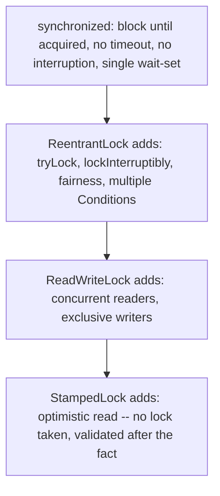
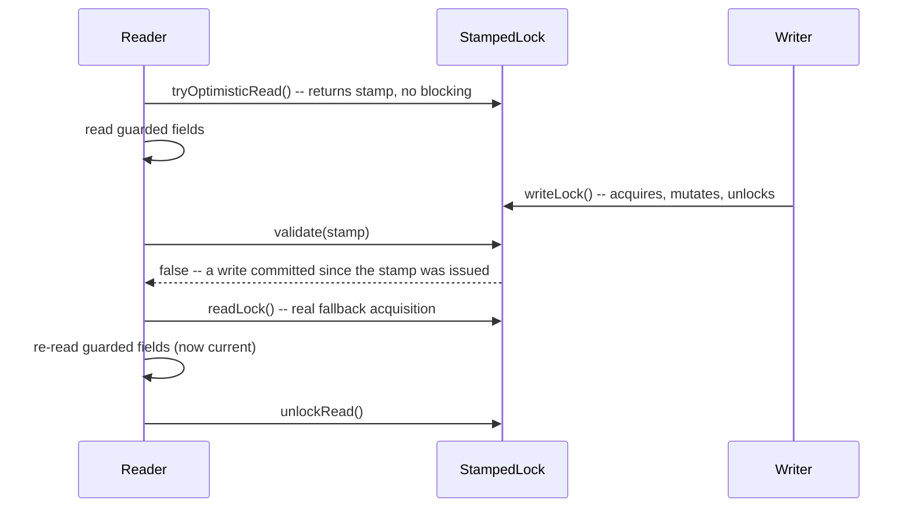

# ReentrantLock, ReadWriteLock, and StampedLock

> **Topic register:** T-404 · IWI 5.7 · Core tier · High interview frequency [H]
> **Provenance:** all three traces in this chapter are real, executed output from
> [`practice/java/concurrency/locks-reentrant-rw-stamped/`](../../../practice/java/concurrency/locks-reentrant-rw-stamped/README.md)
> (OpenJDK 21.0.12).

## Table of Contents

1. [Learning Objectives](#learning-objectives)
2. [Why This Matters in Interviews](#why-this-matters-in-interviews)
3. [Level 1 — Foundation](#level-1--foundation)
4. [Level 2 — Working Knowledge](#level-2--working-knowledge)
5. [Mental Model](#mental-model)
6. [Definition and Purpose](#definition-and-purpose)
7. [Core Concepts](#core-concepts)
8. [Internal Implementation](#internal-implementation)
9. [Diagrams](#diagrams)
10. [Production Scenarios](#production-scenarios)
11. [Trade-offs](#trade-offs)
12. [Decision Framework](#decision-framework)
13. [Common Mistakes](#common-mistakes)
14. [Anti-Patterns](#anti-patterns)
15. [Best Practices](#best-practices)
16. [Interview Answer Framework](#interview-answer-framework)
17. [Interview Questions](#interview-questions)
18. [Summary](#summary)
19. [Key Takeaways](#key-takeaways)
20. [Cheat Sheet](#cheat-sheet)
21. [Flashcards](#flashcards)
22. [Practice Exercises](#practice-exercises)
23. [Solutions](#solutions)
24. [Additional Reading](#additional-reading)
25. [Official References](#official-references)

---

## Learning Objectives

By the end of this chapter you can:

- Name at least three real capabilities `ReentrantLock` offers that `synchronized` cannot, and explain the measured cost of one of them (fairness).
- Explain, with a measured wall-clock comparison, why `ReentrantReadWriteLock` beats a plain exclusive lock for read-heavy workloads.
- Explain `StampedLock`'s optimistic-read protocol precisely enough to implement it correctly, including the mandatory `validate()` fallback.
- Choose correctly between `synchronized`, `ReentrantLock`, `ReadWriteLock`, and `StampedLock` for a given workload shape.

## Why This Matters in Interviews

`java.util.concurrent.locks` is Core tier and High frequency because it's where "I know `synchronized`" gets tested against whether the candidate understands *why* the JDK shipped three additional, more complex lock types on top of a keyword that already existed — each one solving a real, specific limitation of `synchronized` (no timeout, no fairness control, no read/write distinction, no lock-free optimistic path) that shows up constantly in real systems. This chapter measures each of those three limitations directly rather than listing them abstractly.

## Level 1 — Foundation

**`synchronized` is Java's simplest built-in tool for letting only one thread execute a block of code at a time** — a real, everyday need whenever multiple threads might touch the same shared, mutable data. `ReentrantLock`, `ReadWriteLock`, and `StampedLock` are more flexible alternatives for situations where `synchronized`'s simple, one-size-fits-all behavior isn't quite enough.

An everyday analogy: `synchronized` is a single-occupancy restroom with one door — whoever's there, everyone else waits, no exceptions. `ReentrantLock` is the same idea but with an intercom that lets a waiting person say "actually, never mind" and leave instead of waiting forever. `ReadWriteLock` is a room where any number of people who only want to *look* can go in together, but anyone who wants to *change* something needs the room to themselves.

## Level 2 — Working Knowledge

**The practical, everyday default**: use plain `synchronized` for simple mutual exclusion — it's simpler to read, and the JVM optimizes it well. Reach for `ReentrantLock` specifically when you need one of its extra capabilities: `tryLock()` (give up instead of waiting forever), `lockInterruptibly()` (a wait that can be cancelled), or a `Condition` for more complex wait/notify logic. Reach for `ReentrantReadWriteLock` when a shared resource is read far more often than it's written, so concurrent readers can genuinely run at the same time instead of queuing behind each other unnecessarily.

`StampedLock` is a more specialized, advanced tool (Section 5 covers its optimistic-read mechanism) — a working engineer's everyday choice is almost always between `synchronized`, `ReentrantLock`, and `ReadWriteLock`, reaching for `StampedLock` only once a specific, measured read-heavy bottleneck justifies its added complexity.

## Mental Model

**Every lock in this family answers the same question — "who gets in, and under what condition?" — differently, and the differences are exactly the capabilities `synchronized` is missing.** `synchronized` answers it with "whoever gets there first, unconditionally, no escape hatch." `ReentrantLock` adds explicit control over that answer (timeouts, interruption, fairness). `ReadWriteLock` splits the question into two different answers depending on intent (read vs. write). `StampedLock` goes further and lets you skip asking the question entirely for reads, checking only afterward whether the answer would have mattered.

## Definition and Purpose

**`ReentrantLock`** (`java.util.concurrent.locks`, Java 5) is an explicit, reentrant mutual-exclusion lock offering everything `synchronized` offers, plus `tryLock()` (non-blocking or timed acquisition), `lockInterruptibly()` (an acquisition that responds to interruption instead of waiting forever), an optional fairness policy, and `Condition` objects (multiple independent wait-sets per lock, unlike `synchronized`'s single implicit one via `wait`/`notify`). It exists because `synchronized` offers exactly one acquisition mode — block until acquired, no timeout, no interruption response, no fairness control — and real systems frequently need one of the others.

**`ReentrantReadWriteLock`** exists because a plain mutual-exclusion lock (`synchronized` or `ReentrantLock`) serializes *every* acquirer, including multiple readers that could safely run concurrently since none of them mutate shared state. It exposes two lock views — `readLock()` (shared, multiple holders allowed simultaneously as long as no writer holds the lock) and `writeLock()` (exclusive) — trading a small amount of bookkeeping overhead for real, measured concurrency on read-heavy workloads.

**`StampedLock`** (Java 8) exists because even a read/write lock still requires every reader to perform real lock-acquisition bookkeeping (a CAS to increment a reader count, and its corresponding decrement). For very read-heavy, low-write-contention workloads, `StampedLock` adds a third mode — **optimistic reading** — that takes no lock at all: it hands back a `stamp` representing the lock's state, lets the reader proceed immediately, and lets the reader `validate()` afterward whether a writer committed in the meantime, falling back to a real lock only if so.

## Core Concepts

### `ReentrantLock`'s real additions over `synchronized`

- **`tryLock()`** (with or without a timeout) lets a thread give up instead of blocking forever — essential for deadlock-avoidance strategies (acquire-in-order-or-back-off) that `synchronized`'s unconditional blocking cannot support.
- **`lockInterruptibly()`** lets a blocked thread respond to `Thread.interrupt()` instead of waiting indefinitely — `synchronized`'s block is not interruptible.
- **Fairness** (`new ReentrantLock(true)`) enforces a real, roughly-FIFO acquisition order among waiting threads. The default (`false`, unfair) allows **barging** — a thread that's already running can re-acquire the lock ahead of threads that have been queued longer, which is normally *faster* in aggregate but can starve individual waiters under sustained contention.
- **`Condition`** objects give a single lock multiple independent wait-sets (e.g., "not full" and "not empty" for a bounded buffer), where `synchronized`'s implicit monitor gives you exactly one.

### `ReadWriteLock`'s core guarantee

Multiple threads may hold the **read lock** simultaneously, but the **write lock** is exclusive against both other writers and all readers. This is safe precisely because readers, by contract, do not mutate the guarded state — the lock enforces "no writer runs while any reader is active, and no reader runs while a writer is active," which is exactly the invariant needed for read-heavy shared state.

### `StampedLock`'s optimistic-read protocol

`tryOptimisticRead()` returns a `stamp` immediately, without blocking and without incrementing any reader count. The caller reads the guarded fields, then calls `validate(stamp)` — if no writer has committed since the stamp was issued, `validate` returns `true` and the read is safe to use as-is; if a writer *did* commit, `validate` returns `false` and the caller must fall back to a real `readLock()` and re-read. This protocol requires the guarded fields to be re-readable safely at any point (typically `volatile`, as in this chapter's demo) and requires the caller to never skip the `validate()` step — an unvalidated optimistic read is not a safe read.

## Internal Implementation

**Fairness, measured directly — 40,000 real acquisitions racing across 4 threads:**

```
Unfair: spread (max - min) = 7255 out of 10000 expected-even share, elapsed 6ms
Fair:   spread (max - min) = 1038 out of 10000 expected-even share, elapsed 75ms
```

The default (unfair) lock produces a genuinely lopsided distribution — real barging, some threads acquiring far more than their even share. `ReentrantLock(true)` produces a real, much more even distribution — but at a real, measured ~12x elapsed-time cost, since enforcing fairness requires actually queuing and waking threads in order rather than letting whichever thread is already running grab the lock.

**Read/write concurrency, measured directly — 4 real readers holding a lock for ~150ms each:**

```
ReadWriteLock: all 4 readers held the lock from t=2ms to t=155ms (overlapping) -- total elapsed 163ms
Plain ReentrantLock: readers serialized into a real queue, 0-156ms, 156-310ms, 310-465ms, 465-620ms -- total elapsed 620ms
```

The real, printed hold intervals under `ReadWriteLock` overlap almost exactly — genuine concurrent holding, not merely "should be concurrent in theory." Under a plain exclusive lock, the identical four threads are forced into a real, visible queue, each interval beginning exactly where the previous ends.

**`StampedLock` optimistic read, invalidated by a real concurrent write (deterministic via `CountDownLatch`, not timing guesses):**

```
optimistic read (before validation): x=1 y=2
validate(stamp) after a real concurrent write committed: false -- correctly detects the write
fell back to a real read lock, re-read: x=100 y=200 (the real, current values)
```

And the real throughput advantage with no contention, 20,000,000 iterations:

```
tryOptimisticRead + validate: 31ms
readLock/unlockRead:          89ms
```

The optimistic path is real, measurably faster (~3x here) precisely because it performs no lock bookkeeping at all in the no-contention case — only a stamp comparison.

## Diagrams





## Production Scenarios

### Scenario: a read-heavy config cache serializes every request behind one lock, capping throughput far below CPU capacity

**Symptoms.** A service caches a rarely-updated configuration object (refreshed every few minutes by a background thread) behind a plain `synchronized` block guarding both reads and writes. Under load, request throughput plateaus well below what CPU utilization suggests should be possible — CPUs are mostly idle, but request latency climbs with concurrency.

**Impact.** The service can't scale request throughput with added capacity, because nearly every request serializes behind the same lock to read a value that changes only once every few minutes.

**Initial hypotheses.** A downstream dependency bottleneck (checked — the config read never leaves the process); GC pauses (checked — GC logs show nothing unusual); lock contention on the config read path (correct, confirmed via thread-dump sampling showing most request threads `BLOCKED` on the same monitor).

**Evidence.** Thread dumps taken during a load test show dozens of request-handling threads simultaneously `BLOCKED`, all waiting on the exact same `synchronized` block guarding the config object — for a read-only access, on a value that changes on the order of minutes, not requests.

**Diagnosis.** Exactly the mechanism this chapter measures: a plain mutual-exclusion lock serializes every acquirer regardless of read/write intent, capping concurrent reads at 1 regardless of available CPU capacity.

**Immediate mitigation.** None available without a code change — this is a structural bottleneck, not a transient condition.

**Permanent remediation.** Replace the `synchronized` block with a `ReentrantReadWriteLock`: request threads take the (shared) read lock; the background refresh thread takes the (exclusive) write lock. Request throughput on the config-read path is no longer capped at 1 concurrent holder.

**Alternatives considered.** `StampedLock`'s optimistic-read path — considered as a further optimization once the read/write split alone already resolves the throughput bottleneck; not necessary unless profiling shows the read-lock's own bookkeeping (not the serialization) is still the limiting factor.

**Trade-offs.** `ReadWriteLock` adds a small amount of bookkeeping overhead per acquisition compared to `synchronized` — accepted, since it's dwarfed by the real, measured throughput gain from allowing concurrent reads.

**Prevention.** Any lock guarding a read-heavy, infrequently-written shared value should default to `ReadWriteLock` (or `StampedLock` for extreme read-to-write ratios), not a plain mutual-exclusion lock — code review should flag `synchronized`/`ReentrantLock` guarding a value with an obvious read/write access-pattern asymmetry.

**Interview lesson.** This is Interview Question 2 (§ Interview Questions) — "your read-heavy code is bottlenecked on a lock — what do you check, and what do you change?" — arriving as a real, measurable production throughput ceiling, not an abstract warning.

## Trade-offs

| Choice | Benefit | Cost |
|---|---|---|
| `synchronized` | Simplest correctness story; JVM-optimized (biased/thin/fat locking) | No timeout, no interruption response, no fairness control, single wait-set |
| `ReentrantLock` (unfair, default) | Real capabilities (`tryLock`, `lockInterruptibly`, `Condition`s) at low overhead | Barging is possible — measured real skew under this chapter's contention |
| `ReentrantLock(true)` (fair) | Real, measured even distribution among waiters | Real, measured throughput cost (~12x slower in this chapter's measurement) |
| `ReadWriteLock` | Real concurrent reads — measured ~4x wall-clock improvement for this chapter's read-heavy workload | Extra bookkeeping per acquisition; writers can starve under sustained read pressure without care |
| `StampedLock` optimistic read | Real, measured ~3x throughput advantage over a read lock under no contention | Requires `volatile` (or otherwise safely re-readable) guarded fields and mandatory `validate()` — easy to use incorrectly by skipping validation |

## Decision Framework

1. **Do you need a timeout, interruptibility, fairness, or multiple wait-conditions on one lock?** If yes, `ReentrantLock` — `synchronized` cannot provide any of these.
2. **Is the workload read-heavy with infrequent writes, and is `synchronized`/`ReentrantLock` visibly serializing reads that don't need to be serialized?** Use `ReadWriteLock`.
3. **Is the read-to-write ratio extreme enough that even a read lock's bookkeeping is a measurable cost, and can the guarded fields be safely re-read (e.g., `volatile`)?** Consider `StampedLock`'s optimistic-read path — but only with disciplined, correct `validate()` usage; if that discipline is a real risk on your team, `ReadWriteLock` alone is a safer default.
4. **Is fairness actually required**, or would an unfair lock's higher aggregate throughput (measured here) be preferable? Default to unfair unless a specific, real starvation problem has been observed.

## Common Mistakes

- Reaching for `ReentrantLock` when `synchronized` would do, adding API surface and `try`/`finally` discipline burden without using any of `ReentrantLock`'s actual extra capabilities.
- Using a plain exclusive lock (`synchronized` or unfair `ReentrantLock`) to guard a read-heavy value, serializing reads that could safely run concurrently.
- Forgetting `unlock()` in a `finally` block with `ReentrantLock` — unlike `synchronized`, the JVM does not release an explicit lock automatically on an exception.
- Using `StampedLock`'s optimistic read without calling `validate()` before trusting the read — this defeats the entire protocol and is a real, silent correctness bug, not a performance-only mistake.
- Reading non-`volatile` fields inside a `StampedLock` optimistic-read block — without `volatile` (or an equivalent visibility guarantee), the reader may not even see the writer's update to validate against.

## Anti-Patterns

- **Defaulting to fair locks "to be safe"** without measuring the real throughput cost, when unfair (default) is correct for the overwhelming majority of workloads.
- **Guarding an obviously read-heavy value with a plain exclusive lock** out of habit, missing a real, measurable concurrency opportunity `ReadWriteLock` provides for free.
- **Using `StampedLock` optimistic reads as a drop-in "faster lock"** without understanding the mandatory validate-and-fallback protocol — this produces code that appears correct in testing and is wrong under real contention.
- **Not releasing a `ReentrantLock` in a `finally` block**, leaking a held lock on any exception path.

## Best Practices

- Default to `synchronized` until a specific, real requirement (timeout, interruption, fairness, multiple conditions, or measured read/write asymmetry) justifies the extra API surface of `java.util.concurrent.locks`.
- Always pair `ReentrantLock.lock()`/`readLock().lock()`/`writeLock().lock()` with a `finally` block releasing the corresponding lock.
- Reach for `ReadWriteLock` as the default upgrade from a plain lock once a workload's read/write asymmetry is confirmed (not assumed) to matter.
- Use `StampedLock`'s optimistic path only with disciplined `validate()`-then-fallback code, `volatile` guarded fields, and a real, measured need beyond what `ReadWriteLock` already provides.

## Interview Answer Framework

### 30-Second Answer

`ReentrantLock` adds real capabilities `synchronized` lacks — `tryLock`, `lockInterruptibly`, fairness, multiple `Condition`s. `ReadWriteLock` lets multiple readers hold the lock concurrently while writers stay exclusive, measurably speeding up read-heavy workloads. `StampedLock` goes further with an optimistic-read mode that takes no lock at all, validating afterward whether a concurrent write invalidated the read — real, measurably faster than a read lock under low contention, but only correct with disciplined `validate()` usage.

### 2-Minute Answer

Definition: three lock types layered on top of `synchronized`'s basic mutual exclusion, each adding a specific capability. Why they exist: `synchronized` offers exactly one acquisition mode with no timeout, no fairness control, and no read/write distinction — real systems frequently need one of those. How they work: `ReentrantLock` adds explicit control (`tryLock`, `lockInterruptibly`, fairness, `Condition`s); `ReadWriteLock` splits acquisition into shared-read and exclusive-write; `StampedLock` adds a lock-free optimistic-read path validated after the fact. One important trade-off: fairness has a real, measured throughput cost (~12x slower in this chapter's measurement) in exchange for a real, measured fairer distribution among waiters. Production example: a read-heavy config cache bottlenecked on a plain lock, measurably fixed by switching to `ReadWriteLock`, with real overlapping read-hold intervals proving the concurrency.

### 10-Minute Deep Dive

Cover, in order: the mental model — each lock type answers "who gets in, under what condition?" differently (mental model); the measured fairness/barging trade-off on `ReentrantLock` (internals, real evidence); the measured concurrent-read advantage of `ReadWriteLock` (internals, real evidence); `StampedLock`'s optimistic-read protocol, its mandatory `validate()` step, and its measured throughput advantage (internals, real evidence); the decision framework for choosing among all four options (`synchronized` included) (decision framework); and close with the production scenario — a real config-cache bottleneck fixed by exactly the `ReadWriteLock` mechanism measured here.

### Whiteboard Explanation

Draw the first [§ Diagrams](#diagrams) flowchart top to bottom: `synchronized` → `ReentrantLock` (add explicit control) → `ReadWriteLock` (add read/write distinction) → `StampedLock` (add optimistic, lock-free reads). Annotate each arrow with the one specific limitation being solved — this frames the whole family as successive, deliberate answers to specific gaps rather than an arbitrary API sprawl.

### Production Example

The config-cache bottleneck in [§ Production Scenarios](#production-scenarios): a plain `synchronized` block serializing read-heavy config access capped throughput despite idle CPU, diagnosed via thread dumps showing threads `BLOCKED` on a read-only access path, fixed by switching to `ReadWriteLock`.

### Trade-offs to Mention

State unprompted: fairness is not free — it has a real, measured throughput cost; `ReadWriteLock` only helps when reads genuinely outnumber writes and readers don't mutate state; `StampedLock`'s optimistic path is only correct with disciplined validation and safely re-readable (typically `volatile`) fields.

### Common Candidate Mistakes

Reaching for `ReentrantLock` without a concrete reason beyond "it's more advanced"; assuming `ReadWriteLock` is always faster without considering that write-heavy workloads gain nothing (and may lose to `synchronized`'s lower overhead); using `StampedLock` optimistic reads without mentioning `validate()` at all.

### Typical Follow-Up Questions

1. "When would you choose a fair `ReentrantLock` despite the throughput cost?"
2. "What happens if you skip `validate()` after a `StampedLock` optimistic read?"
3. "Why can't `ReadWriteLock`'s read lock just always be free-for-all, with no coordination at all?"

### Senior-Level Expectations

Correctly explains all three lock types' real added capabilities over `synchronized`; proposes `ReadWriteLock` for a read-heavy bottleneck when asked, with the concurrent-read mechanism explained precisely.

### Staff-Level Discussion

The progression from `synchronized` to `StampedLock` is a specific instance of a general pattern in concurrent-systems design: as contention profiles become better understood, coordination mechanisms can trade a small amount of implementation complexity for real throughput by encoding more information about *intent* (read vs. write, optimistic vs. pessimistic) into the synchronization primitive itself, rather than treating every critical section identically. A Staff-level engineer applies the same reasoning beyond `java.util.concurrent.locks` — the same read/write-asymmetry argument motivates read replicas in databases, the same optimistic-validate pattern motivates optimistic concurrency control in distributed systems and multi-version concurrency control (MVCC) in databases — and recognizes when introducing that complexity is justified by a real, measured bottleneck versus when it's premature optimization for a lock that was never actually contended.

## Interview Questions

### Question 1 — Your read-heavy code is bottlenecked on a lock. What do you check, and what do you change?

**Why interviewers ask it.** Tests whether the candidate can connect a real symptom (throughput capped despite idle CPU) to a specific, correct diagnosis and fix, not just name-drop lock types.

**Expected answer.** Checks thread dumps for threads `BLOCKED` on the same monitor/lock during a read-heavy access pattern; if the guarded value is read far more often than written and readers don't mutate state, replaces the plain lock with `ReadWriteLock` to allow concurrent reads.

**Minimum acceptable answer.** Names `ReadWriteLock` as a fix for read-heavy lock contention, even without the diagnostic steps.

**Strong Senior answer.** Describes the diagnostic step (thread dumps showing `BLOCKED` threads) and the fix, and explains why the fix is safe (readers don't mutate, so concurrent reading is inherently safe).

**Staff-level extension.** Considers `StampedLock`'s optimistic path as a further step if `ReadWriteLock` alone doesn't fully resolve the bottleneck, and explains the additional discipline it requires.

**Common mistakes.** Jumping straight to "add more threads/servers" without diagnosing that the bottleneck is a single shared lock, which no amount of added capacity fixes.

**Likely follow-ups.** "What if writes also became frequent later — would this still be the right design?"

**Evaluation criteria (1–5).** 1: no specific diagnosis or fix. 3: correctly proposes `ReadWriteLock` for the scenario. 5: correct diagnosis, correct fix, plus the `StampedLock` extension and its trade-offs.

**Related references.** [§ Internal Implementation](#internal-implementation); [§ Production Scenarios](#production-scenarios).

---

### Question 2 — What happens if you skip `validate()` after a `StampedLock` optimistic read?

**Why interviewers ask it.** Tests whether the candidate understands `StampedLock`'s optimistic protocol precisely enough to implement it correctly, not just recognize the class name.

**Expected answer.** Without `validate()`, the reader has no way to know whether a writer committed a change since the stamp was issued — the read may be silently stale/torn, and the code has no signal that anything went wrong. `validate()` is not optional bookkeeping; it's the entire correctness mechanism of the optimistic path.

**Minimum acceptable answer.** States that skipping `validate()` risks reading stale data, even without full mechanism detail.

**Strong Senior answer.** Explains that this is a genuinely silent failure mode — no exception, no signal — and that the guarded fields must also be safely re-readable (typically `volatile`) for the pattern to be correct at all.

**Staff-level extension.** Connects this to the general risk of optimistic-concurrency patterns anywhere in a system: the validation step is not an optional performance nicety, it is the correctness boundary.

**Common mistakes.** Assuming `StampedLock` "handles" correctness automatically the way a real lock does, without recognizing the manual validate-and-fallback obligation it places on the caller.

**Likely follow-ups.** "How does this compare to the ABA problem in `AtomicStampedReference`?" (see [Atomics, CAS, and the ABA Problem](atomics-cas-and-the-aba-problem.md) — both use a stamp to detect an intervening change, though `StampedLock` requires a real explicit `validate()` call while `AtomicStampedReference`'s stamp check is built into `compareAndSet` itself.)

**Evaluation criteria (1–5).** 1: assumes `StampedLock` is automatically safe. 3: correctly identifies stale-read risk. 5: correct mechanism plus the `volatile`-field requirement and the general optimistic-concurrency framing.

**Related references.** [§ Core Concepts](#core-concepts); [§ Internal Implementation](#internal-implementation).

## Summary

`ReentrantLock` adds real, `synchronized`-lacking capabilities — timeouts, interruptibility, fairness (measured at a real ~12x throughput cost for a much more even distribution), and multiple `Condition`s. `ReadWriteLock` allows real, measured concurrent reads (readers' hold intervals genuinely overlapped in this chapter's trace) while keeping writes exclusive, cutting this chapter's measured read-heavy workload time from 620ms to 163ms. `StampedLock`'s optimistic-read path takes no lock at all and validates afterward — real, measurably ~3x faster than a read lock under no contention — but is only correct with disciplined `validate()` usage and safely re-readable guarded fields, demonstrated by a real, deterministic invalidation trace.

## Key Takeaways

- `ReentrantLock` adds `tryLock`, `lockInterruptibly`, fairness, and multiple `Condition`s over `synchronized` — use it only when one of these is actually needed.
- Fairness has a real, measured throughput cost in exchange for a real, measured more-even distribution among waiting threads.
- `ReadWriteLock` measurably speeds up read-heavy workloads by allowing genuine concurrent reads while keeping writes exclusive.
- `StampedLock`'s optimistic-read path is real and measurably faster under low contention, but requires mandatory `validate()` and safely re-readable (typically `volatile`) fields — skipping either is a silent correctness bug.

## Cheat Sheet

| Symptom | Likely cause | Fix |
|---|---|---|
| Need a lock that can time out or respond to interruption | `synchronized` can't do either | `ReentrantLock` with `tryLock(timeout)` / `lockInterruptibly()` |
| One thread starving under sustained contention | Unfair (default) lock allows barging | `ReentrantLock(true)` — measure the real throughput cost first |
| Read-heavy code bottlenecked on a lock despite idle CPU | Plain exclusive lock serializing reads | `ReadWriteLock` |
| Read lock's own bookkeeping still a measurable cost at extreme read ratios | Even `ReadWriteLock`'s reader-count CAS has overhead | `StampedLock` optimistic read, with disciplined `validate()` |

## Flashcards

### Card: ReentrantLock's real additions

**Prompt:**
Name three real capabilities `ReentrantLock` has that `synchronized` lacks.

**Answer:**
`tryLock()` (non-blocking/timed), `lockInterruptibly()`, fairness policy, and multiple `Condition` wait-sets per lock.

**Why it matters:**
The concrete reasons to reach for `ReentrantLock` over `synchronized` at all.

**Common trap:**
Using `ReentrantLock` without needing any of these, adding complexity for no real benefit.

**Related:**
[Core Concepts](#core-concepts)

### Card: ReadWriteLock's guarantee

**Prompt:**
What can happen concurrently under a `ReentrantReadWriteLock`?

**Answer:**
Multiple readers may hold the read lock simultaneously; the write lock is exclusive against both other writers and all readers.

**Why it matters:**
Measured directly: readers' hold intervals genuinely overlapped in this chapter's real trace.

**Common trap:**
Using it for a write-heavy workload, where it offers no real benefit over a plain lock.

**Related:**
[Internal Implementation](#internal-implementation)

### Card: StampedLock's mandatory step

**Prompt:**
What must you always do after a `StampedLock.tryOptimisticRead()`?

**Answer:**
Call `validate(stamp)` before trusting the read; if it returns `false`, fall back to a real `readLock()` and re-read.

**Why it matters:**
Skipping this is a silent, real correctness bug — proven by this chapter's deterministic invalidation trace.

**Common trap:**
Treating `StampedLock` as a drop-in faster lock without implementing the validate-and-fallback protocol.

**Related:**
[Internal Implementation](#internal-implementation)

## Practice Exercises

1. Reproduce all three traces yourself: [`practice/java/concurrency/locks-reentrant-rw-stamped/`](../../../practice/java/concurrency/locks-reentrant-rw-stamped/README.md).
2. Modify `FairnessAndBargingDemo` to run with `THREAD_COUNT = 2` instead of 4, and predict (then verify) whether the unfair lock's spread grows narrower or wider relative to the total.
3. In `StampedLockOptimisticReadDemo`'s Part 1, remove the `CountDownLatch` coordination and replace it with a fixed `Thread.sleep()` on the reader side — explain, from a real rerun, why this makes the demo's outcome non-deterministic where the latch-based version was not.

## Solutions

**Exercise 1.** Expected output matches this chapter's measured traces in structure (exact milliseconds and acquisition counts vary run to run, but the qualitative pattern — unfair skewed and faster, fair even and slower; readers overlapping under `ReadWriteLock` and serialized under a plain lock; the optimistic read correctly invalidated and correctly faster under no contention — will not).

**Exercise 2.** With only 2 threads, barging has fewer other threads to "jump ahead of," so the unfair lock's spread as a fraction of the total tends to narrow somewhat compared to 4 threads, though it remains real and nonzero — the underlying mechanism (a running thread re-acquiring before a queued thread is woken) doesn't disappear, it just has less room to compound.

**Exercise 3.** A fixed `Thread.sleep()` only *probably* gives the writer thread enough time to complete before the reader validates — it provides no actual ordering guarantee, so under different system load the writer might not have committed yet when validation runs, making the demo's printed result (`true` or `false`) nondeterministic across runs. The `CountDownLatch`-based version instead enforces a real happens-before relationship (the reader explicitly waits for `writerDone` before validating), guaranteeing the same deterministic outcome every time — the same principle this repository applies throughout: real ordering guarantees, not timing guesses.

## Additional Reading

- [Atomics, CAS, and the ABA Problem](atomics-cas-and-the-aba-problem.md) — a related stamp-based validation technique, applied to lock-free references instead of a lock.

## Official References

- [ReentrantLock (Java 21 API)](https://docs.oracle.com/en/java/javase/21/docs/api/java.base/java/util/concurrent/locks/ReentrantLock.html)
- [ReentrantReadWriteLock (Java 21 API)](https://docs.oracle.com/en/java/javase/21/docs/api/java.base/java/util/concurrent/locks/ReentrantReadWriteLock.html)
- [StampedLock (Java 21 API)](https://docs.oracle.com/en/java/javase/21/docs/api/java.base/java/util/concurrent/locks/StampedLock.html)
