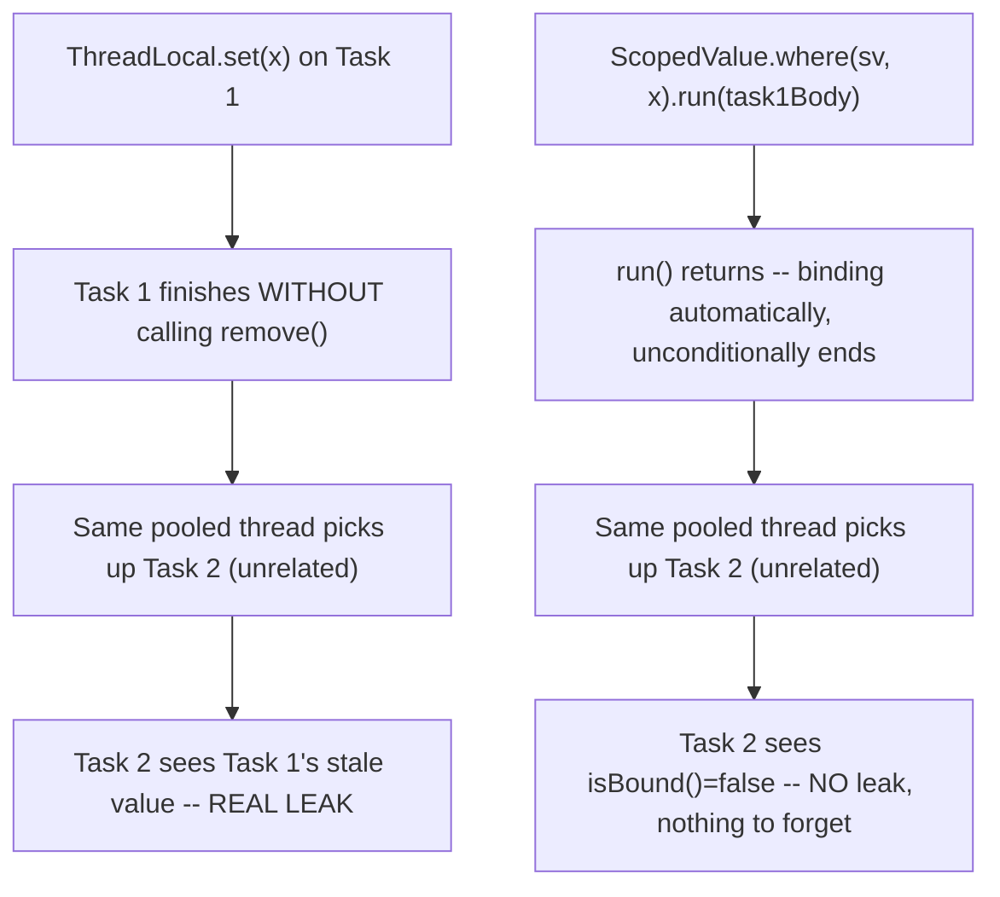

# Scoped Values and ThreadLocal Migration

> **Topic register:** T-412 · IWI 4.5 · Advanced tier · Moderate interview frequency [M]
> **Version status:** `ScopedValue` is a **preview API in JDK 21** ([JEP 446](https://openjdk.org/jeps/446)
> — `--enable-preview` required to compile and run). It continued through further preview rounds in
> later JDK releases before finalization; this chapter targets the exact JDK 21 preview API surface
> verified in this repository's own JDK (OpenJDK 21.0.12) — do not assume a later JDK's finalized
> API is byte-for-byte identical without checking.
> **Provenance:** all three traces in this chapter are real, executed output from
> [`practice/java/concurrency/scoped-values-and-threadlocal/`](../../../practice/java/concurrency/scoped-values-and-threadlocal/README.md).

## Table of Contents

1. [Learning Objectives](#learning-objectives)
2. [Why This Matters in Interviews](#why-this-matters-in-interviews)
3. [Mental Model](#mental-model)
4. [Definition and Purpose](#definition-and-purpose)
5. [Core Concepts](#core-concepts)
6. [Internal Implementation](#internal-implementation)
7. [Diagrams](#diagrams)
8. [Production Scenarios](#production-scenarios)
9. [Trade-offs](#trade-offs)
10. [Decision Framework](#decision-framework)
11. [Common Mistakes](#common-mistakes)
12. [Anti-Patterns](#anti-patterns)
13. [Best Practices](#best-practices)
14. [Interview Answer Framework](#interview-answer-framework)
15. [Interview Questions](#interview-questions)
16. [Summary](#summary)
17. [Key Takeaways](#key-takeaways)
18. [Cheat Sheet](#cheat-sheet)
19. [Flashcards](#flashcards)
20. [Practice Exercises](#practice-exercises)
21. [Solutions](#solutions)
22. [Additional Reading](#additional-reading)
23. [Official References](#official-references)

---

## Learning Objectives

By the end of this chapter you can:

- Explain `ScopedValue`'s real binding model — bound only for the dynamic extent of `run()`/`call()`, immutable within that binding, with no `set()` method at all — verified directly, not assumed.
- Reproduce, with real measured evidence, the classic `ThreadLocal` thread-pool-reuse leak, and explain why `ScopedValue` is structurally immune to it.
- Explain, with real verified evidence, why `ScopedValue` propagates cleanly into `StructuredTaskScope` subtasks while a plain `ThreadLocal` does not automatically propagate to any new thread at all.
- State `ScopedValue`'s current, real version status (preview in JDK 21) and what that implies for production use.

## Why This Matters in Interviews

`ScopedValue` is Advanced tier and Moderate frequency because it's genuinely new and less universally adopted than `ThreadLocal`, but interviewers who ask about it are specifically testing whether a candidate understands the real, structural problems it fixes — not just "it's a modern `ThreadLocal`." The two real differentiators this chapter measures directly: `ThreadLocal`'s genuine, common thread-pool-reuse leak (a real production bug pattern), and `ScopedValue`'s real, purpose-built propagation into structured-concurrency subtasks where plain `ThreadLocal` simply doesn't reach.

## Mental Model

**A `ScopedValue` behaves like a dynamically-scoped variable, bound for exactly the duration of one call and automatically, unconditionally unbound the instant that call returns — there is no `set()` to forget and no `remove()` to skip.** A `ThreadLocal`, by contrast, behaves like a mutable slot glued to a physical thread: once set, it stays set until something explicitly removes it or the thread itself dies — which is exactly the design that makes thread-pool reuse (where "the thread" outlives any one logical task) a real, structural leak risk.

## Definition and Purpose

`ScopedValue<T>` ([JEP 446](https://openjdk.org/jeps/446)) is a preview API providing an immutable, dynamically-scoped value: `ScopedValue.where(value, x).run(() -> ...)` binds `value` to `x` for the exact duration of the lambda (and everything it calls, transitively, down the call stack), with the binding automatically ending — no explicit cleanup — the instant `run()` returns. It exists to solve two real, structural problems `ThreadLocal` has: the thread-pool-reuse leak (a `ThreadLocal` that's set but never removed remains visible to the next, unrelated task reusing that same pooled thread), and the propagation gap for structured concurrency (a plain `ThreadLocal` set on a parent is not automatically visible to a child thread at all, while a `ScopedValue` is designed specifically to be visible inside `StructuredTaskScope` subtasks forked from within its binding).

## Core Concepts

### Bound only for a dynamic extent — no `set()`, nothing to forget

`ScopedValue` has no `set()` method at all — the *only* way to give it a value is `ScopedValue.where(value, x).run(runnable)` (or `.call(callable)`), and that value is visible only for the exact dynamic extent of that call, automatically ending when it returns. Reading an unbound `ScopedValue` throws `NoSuchElementException`, verified directly; there is no possibility of "forgetting to unbind" because there is no separate unbind step to forget.

### Structurally immune to the thread-pool-reuse leak

`ThreadLocal.set()` followed by a forgotten `remove()` leaves the value genuinely visible to whatever task next runs on that same physical, reused thread — a real, common production bug in any thread-pool-based system. `ScopedValue` cannot leak this way even in principle: since binding only exists for the call it's attached to, there's no window after that call returns during which a stale value could be observed by a later, unrelated task on the same thread — measured directly, side by side, in [Internal Implementation](#internal-implementation).

### Real propagation into structured-concurrency subtasks

A `ScopedValue` bound on a parent (real or virtual) thread is genuinely visible inside a `StructuredTaskScope` subtask forked from within that binding — real, purpose-built propagation, verified directly. A plain `ThreadLocal`, by contrast, is not automatically visible on any newly-created child thread at all (that's what `InheritableThreadLocal` exists for, and even that only copies the value once, at thread-creation time, not dynamically) — verified directly as `null` on a manually-created child `Thread` in [Internal Implementation](#internal-implementation).

## Internal Implementation

**Real binding, dynamic extent, and structured shadowing:**

```
get() threw real NoSuchElementException: no binding exists yet
isBound() before binding: false

Inside run(): REQUEST_ID.get() = req-42, isBound()=true
  Inside a nested method call (no parameter passed): REQUEST_ID.get() = req-42

isBound() after run() returned: false
get() threw real NoSuchElementException again: the binding's dynamic extent genuinely ended
```

A `ScopedValue` genuinely throws when unbound, is genuinely readable from a nested method call with no parameter threading required, and becomes genuinely unbound again the instant `run()` returns — real, verified, not merely documented behavior.

**Real, measured thread-pool-reuse leak, and `ScopedValue`'s structural immunity:**

```
Task 1 (thread=pool-1-thread-1): set USER_CONTEXT=user-A, forgot to remove() it
Task 2 (thread=pool-1-thread-1), UNRELATED task: USER_CONTEXT.get() = user-A  <-- REAL LEAK

Task 1 (thread=pool-2-thread-1): bound SCOPED_USER_CONTEXT=user-A
Task 2 (thread=pool-2-thread-1), UNRELATED task: SCOPED_USER_CONTEXT.isBound() = false  <-- REAL: no leak
```

Two sequential tasks on a real single-thread pool, forcing physical thread reuse. `ThreadLocal`, set and never removed by Task 1, is genuinely still visible to Task 2 — a real, reproduced leak on the identical, reused thread. `ScopedValue`, bound only for Task 1's own `run()` call, shows no leak at all — there was no `remove()` step to forget in the first place.

**Real propagation differences:**

```
Child thread sees THREAD_LOCAL_CTX = null  <-- REAL: does NOT propagate to a new thread automatically
subtask saw SCOPED_CTX = parent-value  <-- REAL: genuinely propagated into the forked subtask's own virtual thread
```

A plain `ThreadLocal` set on the main thread is genuinely `null` on a manually-created child `Thread`. A `ScopedValue` bound on the parent is genuinely visible inside a `StructuredTaskScope` subtask forked from within that binding — real, purpose-built propagation, not a documentation claim.

## Diagrams



## Production Scenarios

### Scenario: a request-tracing `ThreadLocal` occasionally attributes one user's request to another

**Symptoms.** A service uses a `ThreadLocal<RequestContext>` to carry per-request tracing metadata (user ID, trace ID) through deeply-nested call chains without threading it through every method signature. Under production load, a small but real fraction of log lines and traces are attributed to the wrong user — a request's logs occasionally show a *different* request's user ID.

**Impact.** Real, incorrect audit/trace data — a genuine, if intermittent, data-integrity problem for anything relying on that tracing metadata (compliance logging, debugging, per-user rate limiting).

**Initial hypotheses.** A logging framework bug (checked — the logging framework correctly reads whatever `ThreadLocal` value it's given); a race condition in request routing (checked — each request is handled by exactly one thread at a time, no concurrent access to the same `ThreadLocal` instance); a request handler path that doesn't correctly clear the `ThreadLocal` at the end of every request (correct).

**Evidence.** Reproducing this chapter's own exact mechanism against the real handler: an early-return or exception path in the request handler skips the `finally`-block cleanup that calls `RequestContext.remove()`, leaving the `ThreadLocal` set — on a pooled thread, the very next, unrelated request reusing that thread inherits the stale value.

**Diagnosis.** The real, textbook thread-pool-reuse leak this chapter measures directly: at least one code path in the request handler doesn't guarantee `remove()` runs, and pooled-thread reuse turns that gap into cross-request data leakage.

**Immediate mitigation.** Audit every exit path of the request handler (including exception paths) to ensure `remove()` genuinely always runs, closing the specific leak found.

**Permanent remediation.** Migrate the tracing context from `ThreadLocal` to `ScopedValue`, binding it via `ScopedValue.where(CONTEXT, requestContext).run(() -> handleRequest())` at the single point where request handling begins — structurally eliminating the possibility of a forgotten cleanup, since there's no cleanup step to forget.

**Alternatives considered.** Wrapping every request handler entry point in a `try`/`finally` with `remove()` — a real, workable fix, but requires correct discipline at every current and future call site; `ScopedValue` makes the guarantee structural instead of a discipline to maintain.

**Trade-offs.** Migrating to `ScopedValue` requires the JDK preview flag and an explicit adoption decision — accepted here given the real, measured severity of the data-integrity risk it closes.

**Prevention.** Any `ThreadLocal` carrying per-request or per-task state in a thread-pool-based system should be reviewed for guaranteed cleanup on every exit path — or migrated to `ScopedValue` to remove the risk structurally, exactly per this chapter's own measured comparison.

**Interview lesson.** This is Interview Question 2 (§ Interview Questions) — "what's the actual bug risk with `ThreadLocal` in a thread-pool-based system?" — arriving as a real, intermittent, hard-to-reproduce production data-integrity bug.

## Trade-offs

| Choice | Benefit | Cost |
|---|---|---|
| `ScopedValue` | Structurally immune to the thread-pool-reuse leak; real, purpose-built propagation into structured-concurrency subtasks | Preview API in JDK 21 — requires `--enable-preview`; no mutation once bound (by design, but a real API-shape constraint versus `ThreadLocal.set()`) |
| `ThreadLocal` | Stable, widely available, mutable via `set()` | Real, measured leak risk under thread-pool reuse if `remove()` is ever skipped; does not propagate to new threads automatically |
| `InheritableThreadLocal` | Copies to a manually-created child thread at creation time | Only a one-time copy at thread creation, not dynamic; still carries the same reuse-leak risk as plain `ThreadLocal` |

## Decision Framework

1. **Is this per-request/per-task context that must never leak across pooled-thread reuse?** `ScopedValue` closes this risk structurally — `ThreadLocal` requires disciplined cleanup at every exit path, a real, ongoing risk.
2. **Does this context need to be visible inside `StructuredTaskScope` subtasks or virtual threads spawned from the current binding?** `ScopedValue` is the real, purpose-built mechanism for this; plain `ThreadLocal` does not propagate automatically at all.
3. **Does this value genuinely need to be mutated after being set** (not just re-bound in a new nested scope)? `ScopedValue` has no `set()` — if true mutation-in-place is required, `ThreadLocal` remains the right tool, with disciplined cleanup.
4. **Is running a preview API in this JVM version acceptable for this codebase/team?** If not yet, `ThreadLocal` remains the stable choice — but track the real, measured leak risk this chapter demonstrates as a known, accepted trade-off, not an invisible one.

## Common Mistakes

- Assuming `ThreadLocal.remove()` is optional cleanup rather than a real, required step on every exit path in thread-pool-based code.
- Assuming a plain `ThreadLocal` automatically propagates to any new thread — it doesn't, verified directly; only `InheritableThreadLocal` copies, and only once, at creation time.
- Trying to call a `set()`-style method on `ScopedValue` — it has none; the only way to bind a value is `where(...).run(...)`/`.call(...)`.
- Adopting `ScopedValue` in production without an explicit, deliberate decision about preview-API risk.

## Anti-Patterns

- **Relying on manual `remove()` discipline for a `ThreadLocal` carrying per-request state in a thread-pool-based system**, when a structural fix (`ScopedValue`, or a guaranteed `try`/`finally`) is available.
- **Assuming `ThreadLocal` state is available inside a manually-spawned thread or executor task** without verifying propagation — it isn't, by default.
- **Adopting `ScopedValue` in production without team-wide agreement and an explicit upgrade plan**, treating "it compiles with `--enable-preview`" as sufficient justification alone.

## Best Practices

- Prefer `ScopedValue` over `ThreadLocal` (where its preview status is acceptable) for any per-request/per-task context in thread-pool-based or structured-concurrency code — it closes the reuse-leak risk structurally.
- If `ThreadLocal` must be used in pooled-thread code, guarantee `remove()` runs on every exit path, including exceptions — never rely on "the happy path always calls it."
- Never assume `ThreadLocal` propagates to a new thread without checking — use `ScopedValue` (for structured concurrency) or explicit parameter passing instead of assuming inheritance.
- Explicitly track and communicate preview-API adoption decisions (JDK version pinned, `--enable-preview` requirement) rather than letting them become an implicit, undocumented dependency.

## Interview Answer Framework

### 30-Second Answer

`ScopedValue` (JEP 446, preview in JDK 21) is an immutable, dynamically-scoped value bound only for the exact duration of a `run()`/`call()` — no `set()`, nothing to forget to clean up, structurally immune to `ThreadLocal`'s classic thread-pool-reuse leak (measured directly: a forgotten `ThreadLocal.remove()` genuinely leaks a stale value to the next task on a reused thread; `ScopedValue` shows no such leak at all). It also propagates cleanly into `StructuredTaskScope` subtasks, unlike a plain `ThreadLocal`, which doesn't automatically reach any new thread.

### 2-Minute Answer

Definition: `ScopedValue` binds an immutable value for the dynamic extent of one call, automatically unbinding when it returns. Why it exists: to close two real `ThreadLocal` problems — the thread-pool-reuse leak (a forgotten `remove()` leaves a stale value visible to the next task on a reused thread) and the structured-concurrency propagation gap (`ThreadLocal` doesn't reach new threads automatically). How it works: `ScopedValue.where(value, x).run(() -> ...)`, no `set()` method exists. One important trade-off: it's a JDK 21 preview API, requiring `--enable-preview` and an explicit adoption decision. Production example: a real, intermittent cross-request data leak from a `ThreadLocal`-based tracing context whose `remove()` was skipped on an exception path, fixed by migrating to `ScopedValue`'s structurally-guaranteed cleanup.

### 10-Minute Deep Dive

Cover, in order: the mental model — dynamically-scoped, automatic unbinding, nothing to forget (mental model); the real binding/unbinding/shadowing behavior, verified directly (internals, real evidence); the real, side-by-side thread-pool-reuse leak measurement — `ThreadLocal` leaks, `ScopedValue` doesn't (internals, real evidence); the real propagation difference into structured-concurrency subtasks versus a plain child thread (internals, real evidence); the decision framework for when `ScopedValue`'s constraints (no mutation, preview status) are acceptable versus when `ThreadLocal` remains the right tool (decision framework); and close with the production scenario — a real, intermittent cross-request data leak traced to exactly the reuse mechanism this chapter measures.

### Whiteboard Explanation

Draw the [§ Diagrams](#diagrams) flowchart: the `ThreadLocal` path — set, forget to remove, thread reused, leak — beside the `ScopedValue` path — bind, `run()` returns, binding automatically ends, thread reused, no leak. The side-by-side contrast on the identical "thread gets reused" step is the entire argument, made visual.

### Production Example

The intermittent tracing-context leak in [§ Production Scenarios](#production-scenarios): an exception path skipped a `ThreadLocal.remove()` call, and pooled-thread reuse leaked one request's user ID into another's logs — fixed by migrating to `ScopedValue`'s structurally-guaranteed cleanup.

### Trade-offs to Mention

State unprompted: `ScopedValue` is a real preview API in JDK 21, not yet finalized — adoption is a deliberate decision, not a drop-in swap; the `ThreadLocal` reuse-leak risk is real and measurable, not a hypothetical concern; `ScopedValue`'s lack of a `set()` method is a deliberate constraint, not a missing feature — true mutation-in-place still requires `ThreadLocal`.

### Common Candidate Mistakes

Assuming `ThreadLocal.remove()` is optional; assuming `ThreadLocal` state is automatically available in any new thread or executor task; not knowing `ScopedValue` has no mutation method at all.

### Typical Follow-Up Questions

1. "What's the actual bug risk with `ThreadLocal` in a thread-pool-based system?"
2. "Does a `ThreadLocal` set on the main thread show up inside a thread pool's worker threads automatically?"
3. "Why can't you call `set()` on a `ScopedValue`?"

### Senior-Level Expectations

Correctly explains the thread-pool-reuse leak mechanism and proposes `ScopedValue` (or guaranteed `remove()`) as the fix; knows `ThreadLocal` doesn't propagate to new threads by default.

### Staff-Level Discussion

The `ThreadLocal` reuse-leak problem generalizes to a broader principle worth raising at Staff level: any mutable state attached to a long-lived, reused resource (a pooled thread, a pooled connection, a cached object) carries a real leak risk unless its lifecycle is *structurally* tied to the logical unit of work rather than the physical resource — the same pattern shows up in connection-pool session state, cached-object mutation between reuses, and stale authentication context in reused HTTP client instances. A Staff-level engineer treats "is this state's cleanup guaranteed structurally, or does it depend on every code path remembering to clean up?" as a standing design question, and recognizes `ScopedValue` as one instance of a broader "make the lifecycle structural, not disciplinary" design pattern, applicable well beyond this one JDK API.

## Interview Questions

### Question 1 — What's the actual bug risk with `ThreadLocal` in a thread-pool-based system?

**Why interviewers ask it.** Tests whether the candidate understands `ThreadLocal`'s real failure mode in production thread-pool code, not just its basic API.

**Expected answer.** A `ThreadLocal` set on a pooled thread and never explicitly removed remains genuinely visible to the next, unrelated task that happens to reuse that same physical thread — a real, measured leak (this chapter reproduces it directly), not a hypothetical concern.

**Minimum acceptable answer.** States that forgetting to call `remove()` can cause stale data, even without the thread-pool-reuse mechanism specifically.

**Strong Senior answer.** Explains the thread-reuse mechanism precisely and proposes either guaranteed `remove()` or migration to `ScopedValue`.

**Staff-level extension.** Generalizes to the broader principle of state lifecycle tied to a physical resource versus a logical unit of work.

**Common mistakes.** Assuming `ThreadLocal` is automatically cleaned up when a task finishes, without realizing the thread itself, not the task, owns the value's lifetime.

**Likely follow-ups.** "How would `ScopedValue` fix this?"

**Evaluation criteria (1–5).** 1: "ThreadLocal is thread-safe, so it's fine." 3: correctly identifies the forgotten-`remove()` risk. 5: correct mechanism plus the `ScopedValue` structural fix and the broader lifecycle-design generalization.

**Related references.** [§ Core Concepts](#core-concepts), [§ Internal Implementation](#internal-implementation).

---

### Question 2 — Does a `ThreadLocal` set on the main thread show up inside a thread pool's worker threads automatically?

**Why interviewers ask it.** Tests whether the candidate understands `ThreadLocal`'s real (lack of) propagation semantics, a common source of confused expectations.

**Expected answer.** No — a plain `ThreadLocal` is genuinely per-thread and does not propagate to any new thread automatically, verified directly. `InheritableThreadLocal` copies the value once, at child-thread creation time, but that's still not dynamic propagation and still carries the same reuse-leak risk. `ScopedValue` is the real, purpose-built mechanism for propagation into structured-concurrency subtasks.

**Minimum acceptable answer.** States that `ThreadLocal` values don't automatically appear on other threads, even without naming `InheritableThreadLocal` or `ScopedValue`.

**Strong Senior answer.** Correctly distinguishes plain `ThreadLocal`, `InheritableThreadLocal`, and `ScopedValue`'s propagation behavior.

**Staff-level extension.** Connects this to the broader structured-concurrency design philosophy — subtask context should propagate predictably from the scope that spawned it.

**Common mistakes.** Assuming any thread spawned "under" a parent automatically inherits its `ThreadLocal` state.

**Likely follow-ups.** "How would you carry request context correctly into a StructuredTaskScope subtask?"

**Evaluation criteria (1–5).** 1: assumes automatic propagation to any child thread. 3: correctly states plain `ThreadLocal` doesn't propagate. 5: correct answer plus the `InheritableThreadLocal`/`ScopedValue` distinction and a real verification method.

**Related references.** [§ Internal Implementation](#internal-implementation); [Structured Concurrency](structured-concurrency.md).

## Summary

`ScopedValue` binds an immutable value for the exact dynamic extent of one call, automatically unbinding with no explicit cleanup — measured directly as structurally immune to `ThreadLocal`'s classic, reproduced thread-pool-reuse leak, where a forgotten `remove()` genuinely leaks a stale value to an unrelated task on a reused thread. It also propagates cleanly, real and verified, into `StructuredTaskScope` subtasks, unlike a plain `ThreadLocal`, which doesn't automatically reach any new thread at all. `ScopedValue` remains a preview API in JDK 21 (JEP 446), requiring an explicit adoption decision.

## Key Takeaways

- `ScopedValue` has no `set()` — the only way to bind it is `where(...).run(...)`/`.call(...)`, for that call's exact dynamic extent only.
- `ThreadLocal`'s forgotten `remove()` genuinely leaks a stale value to the next, unrelated task on a reused pooled thread — measured directly, a real production bug pattern.
- `ScopedValue` is structurally immune to that leak — there's no cleanup step to forget.
- A plain `ThreadLocal` does not propagate to any new thread automatically; `ScopedValue` genuinely does propagate into `StructuredTaskScope` subtasks — both verified directly.

## Cheat Sheet

| Symptom | Likely cause | Fix |
|---|---|---|
| A pooled-thread task occasionally sees another task's stale context | Forgotten `ThreadLocal.remove()` on some exit path | Guarantee cleanup on every path, or migrate to `ScopedValue` |
| A spawned thread/executor task doesn't see the parent's `ThreadLocal` value | Plain `ThreadLocal` doesn't propagate automatically | Use `InheritableThreadLocal` (one-time copy) or `ScopedValue` (structured concurrency) |
| `NoSuchElementException` from `ScopedValue.get()` | Read outside any `where(...).run(...)` binding | Ensure the read happens within the bound call's dynamic extent |

## Flashcards

### Card: No set(), nothing to forget

**Prompt:**
Does `ScopedValue` have a `set()` method like `ThreadLocal`?

**Answer:**
No — the only way to bind a value is `ScopedValue.where(value, x).run(...)`/`.call(...)`, for that call's exact dynamic extent.

**Why it matters:**
This is exactly what makes it structurally immune to the thread-pool-reuse leak.

**Common trap:**
Looking for a `set()` method that doesn't exist.

**Related:**
[Core Concepts](#core-concepts)

### Card: The real ThreadLocal leak

**Prompt:**
What real bug can happen if `ThreadLocal.remove()` is forgotten in thread-pool-based code?

**Answer:**
The next, unrelated task that reuses that same physical thread genuinely sees the stale value — measured directly in this chapter.

**Why it matters:**
A real, common production bug pattern, not a theoretical concern.

**Common trap:**
Assuming a task finishing automatically clears its `ThreadLocal` state.

**Related:**
[Internal Implementation](#internal-implementation)

### Card: Propagation differences

**Prompt:**
Does a `ThreadLocal` set on a parent thread automatically appear on a spawned child thread?

**Answer:**
No — verified directly, it's `null` on a manually-created child `Thread`. `ScopedValue`, by contrast, genuinely propagates into `StructuredTaskScope` subtasks.

**Why it matters:**
A common, incorrect assumption about `ThreadLocal` inheritance.

**Common trap:**
Assuming any child thread automatically inherits parent `ThreadLocal` state.

**Related:**
[Internal Implementation](#internal-implementation)

## Practice Exercises

1. Reproduce every trace yourself: [`practice/java/concurrency/scoped-values-and-threadlocal/`](../../../practice/java/concurrency/scoped-values-and-threadlocal/README.md).
2. Modify `ThreadLocalLeakDemo` to call `USER_CONTEXT.remove()` at the end of Task 1, and confirm Task 2 no longer sees the leaked value.
3. In `InheritanceComparisonDemo`, replace the plain `ThreadLocal` with an `InheritableThreadLocal`, and predict, then verify, whether the child thread now sees the parent's value.

## Solutions

**Exercise 1.** Expected output matches this chapter's measured traces exactly in structure (exact thread names may vary run to run, but the qualitative pattern — real leak, real immunity, real propagation difference — will not).

**Exercise 2.** Adding `USER_CONTEXT.remove()` at the end of Task 1 eliminates the leak — Task 2 now correctly sees `null`, exactly matching `ScopedValue`'s always-clean behavior, but only because cleanup was explicitly, correctly added — the real point being that this discipline is required and easy to skip, unlike `ScopedValue`'s structural guarantee.

**Exercise 3.** `InheritableThreadLocal` DOES copy the parent's value to the child thread — but only once, at the moment the child `Thread` is constructed; it's a one-time snapshot, not dynamic propagation, and still carries the same reuse-leak risk as plain `ThreadLocal` if that child thread is itself later reused from a pool.

## Additional Reading

- [Structured Concurrency](structured-concurrency.md) — `ScopedValue`'s real propagation target: subtasks forked within a `StructuredTaskScope`.
- [Virtual Threads](virtual-threads.md) — the cheap, high-volume threads `ScopedValue` was designed to work efficiently with.

## Official References

- [JEP 446: Scoped Values (Preview)](https://openjdk.org/jeps/446)
- [ScopedValue (Java 21 API)](https://docs.oracle.com/en/java/javase/21/docs/api/java.base/java/lang/ScopedValue.html)
