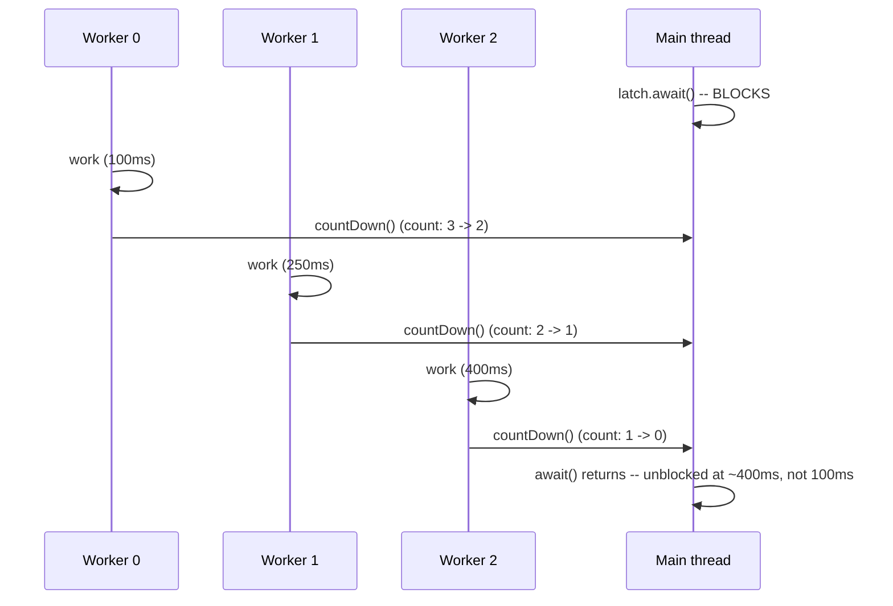

# java.util.concurrent Synchronizers: CountDownLatch, CyclicBarrier, and Semaphore

> **Topic register:** T-417 · IWI 5.8 · Core tier · High interview frequency [H]
> **Provenance:** all evidence in this chapter is real, executed output from
> [`practice/java/concurrency/synchronizers/`](../../../practice/java/concurrency/synchronizers/README.md)
> (OpenJDK 21.0.12), including a real, measured maximum-concurrency count under a
> `Semaphore` and a real barrier action firing exactly twice across two reused rounds.

## Table of Contents

1. [Learning Objectives](#learning-objectives)
2. [Why This Matters in Interviews](#why-this-matters-in-interviews)
3. [Level 1 — Foundation](#level-1--foundation)
4. [Level 2 — Working Knowledge](#level-2--working-knowledge)
5. [Mental Model](#mental-model)
6. [Definition and Purpose](#definition-and-purpose)
7. [Core Concepts](#core-concepts)
8. [Internal Implementation](#internal-implementation)
9. [Diagrams](#diagrams)
10. [Production Scenarios](#production-scenarios)
11. [Trade-offs](#trade-offs)
12. [Decision Framework](#decision-framework)
13. [Common Mistakes](#common-mistakes)
14. [Anti-Patterns](#anti-patterns)
15. [Best Practices](#best-practices)
16. [Interview Answer Framework](#interview-answer-framework)
17. [Interview Questions](#interview-questions)
18. [Summary](#summary)
19. [Key Takeaways](#key-takeaways)
20. [Cheat Sheet](#cheat-sheet)
21. [Flashcards](#flashcards)
22. [Practice Exercises](#practice-exercises)
23. [Solutions](#solutions)
24. [Additional Reading](#additional-reading)
25. [Official References](#official-references)

---

## Learning Objectives

By the end of this chapter you can:

- Correctly choose between `CountDownLatch`, `CyclicBarrier`, and `Semaphore` for a given coordination requirement, based on what each one actually guarantees.
- State precisely why `CountDownLatch` is one-shot (cannot be reset) while `CyclicBarrier` is designed for reuse across repeated rounds — backed by real, measured evidence of both.
- Explain `Semaphore`'s bounded-concurrency guarantee and cite real, measured evidence that a real concurrent-holder count never exceeds the configured permit count under real contention.
- Recognize the specific production shapes each synchronizer fits — a startup readiness gate, a multi-phase parallel computation, a connection-pool-style resource limiter — rather than reaching for a general-purpose lock where a purpose-built synchronizer fits better.

## Why This Matters in Interviews

`CountDownLatch`, `CyclicBarrier`, and `Semaphore` are Core tier and High frequency because they're the standard vocabulary for expressing a specific category of coordination problem — "wait for N things to happen," "wait for N parties to rendezvous, repeatedly," "never let more than N threads do X at once" — that a `synchronized` block or a raw `Lock` expresses only clumsily, if at all. Interviewers use them to check whether a candidate reaches for the *purpose-built* tool rather than hand-rolling the same coordination logic with a counter and a lock, and whether they know the one detail that trips up almost everyone at least once: `CountDownLatch` cannot be reset for a second round, while `CyclicBarrier` — whose name literally advertises it — can.

## Level 1 — Foundation

**Think of three different real-world coordination scenarios.** A race starter doesn't fire the "go" gun until every runner has checked in — once — and after the race, that specific starting gun isn't reused for anything: that's a **`CountDownLatch`**, a one-time gate that opens once a fixed number of signals have all arrived. A relay-race team meets at a rendezvous point after each leg, waits until every teammate has arrived, then *all* proceed to the next leg together — and this repeats, leg after leg: that's a **`CyclicBarrier`**, a reusable rendezvous point. A parking garage with exactly 50 spaces lets in the 51st car only once one of the first 50 leaves — never more than 50 cars inside at once, ever: that's a **`Semaphore`**, a bounded-concurrency permit pool.

```java
CountDownLatch startupGate = new CountDownLatch(3);   // wait for exactly 3 signals, once
CyclicBarrier phaseGate = new CyclicBarrier(3, () -> System.out.println("phase done")); // reusable
Semaphore connectionPool = new Semaphore(50);          // never more than 50 concurrent holders
```

All three solve "coordinate multiple threads around a count" — the difference is entirely in *what happens after the count condition is met*, and that difference is exactly what this chapter's real demos make concrete.

## Level 2 — Working Knowledge

At this level you should be able to state, without hesitation, the single most commonly-tripped fact in this chapter: **`CountDownLatch` cannot be reset.** Once its count reaches zero, every future call to `await()` — from any thread, at any time — returns immediately, forever; there is no method to set the count back. `CyclicBarrier`, by contrast, is explicitly designed to be reused: once all parties arrive and its (optional) barrier action runs, it automatically resets for the next round, which is exactly why "cyclic" is in its name.

You should also be comfortable with `Semaphore`'s specific guarantee: it doesn't grant exclusive access like a lock (`ReentrantLock` allows exactly one holder); it grants up to N concurrent holders, tracked via a permit count that `acquire()` decrements and `release()` increments. A `Semaphore` initialized with 1 permit behaves like a (non-reentrant) mutual-exclusion lock — a useful mental anchor, but not the common case; the common case is a genuine resource-pool-style limit greater than 1.

**A practical rule for a working engineer**: reach for `CountDownLatch` for a one-time "wait for N things to complete before proceeding" gate (application startup readiness, waiting for N parallel subtasks); reach for `CyclicBarrier` when the same group of threads needs to repeatedly synchronize at a shared checkpoint across multiple phases of work; reach for `Semaphore` to bound concurrent access to a limited resource (a connection pool, a rate limiter, a fixed-size worker slot count) — never hand-roll any of these three coordination shapes with a raw counter and `wait()`/`notify()`, which is both harder to get right and harder for a reviewer to verify correct.

## Mental Model

Keep one question per synchronizer. **`CountDownLatch`**: "has this fixed, one-time count reached zero yet?" — a gate that, once open, stays open forever, and cannot be closed again. **`CyclicBarrier`**: "have all N parties arrived at *this* checkpoint, for *this* round?" — a gate that closes and reopens automatically, round after round, for as many rounds as the code keeps using it. **`Semaphore`**: "are there fewer than N holders right now?" — not a one-time or round-based question at all, but a continuously-enforced capacity limit, checked on every single `acquire()` call for as long as the semaphore exists.

## Definition and Purpose

**`CountDownLatch`** is a one-shot synchronization aid that lets one or more threads block (`await()`) until a fixed initial count of `countDown()` calls has occurred; once the count reaches zero, it cannot be reset, and all future `await()` calls return immediately. **`CyclicBarrier`** lets a fixed number of parties block (`await()`) until all of them have called it, at which point an optional barrier action runs and the barrier automatically resets for the next round — genuinely reusable, unlike `CountDownLatch`. **`Semaphore`** maintains a count of available permits; `acquire()` blocks until a permit is available (then decrements the count), and `release()` returns a permit (incrementing the count) — enforcing that no more than the configured number of permits are held concurrently at any instant.

## Core Concepts

### CountDownLatch's one-shot nature is a deliberate design choice, not a limitation to work around

A `CountDownLatch` answers "has this specific, one-time milestone been reached" — once it has, re-asking the question is meaningless, which is exactly why the API provides no reset. Code that needs the *same* coordination shape repeated across multiple rounds needs a different tool (`CyclicBarrier`) or a fresh `CountDownLatch` constructed for each round — attempting to reuse an exhausted `CountDownLatch` is a real, common mistake this chapter's demo reproduces directly (a second `await()` simply returns immediately, silently providing no coordination at all for whatever the second round actually needed to wait for).

### CyclicBarrier's barrier action runs exactly once per round, on one of the arriving threads

The optional `Runnable` passed to `CyclicBarrier`'s constructor runs exactly once each time all parties arrive — executed by the *last* thread to call `await()`, not by some separate coordinator thread. This makes it a natural place for "roll up the results of this phase before the next phase starts" logic, since it's guaranteed to run only after every party has genuinely reached the checkpoint, and guaranteed to run only once per round rather than once per arriving thread.

### Semaphore's guarantee is about count, not identity

Unlike a lock, which tracks *which* thread holds it (enabling reentrancy checks and ownership-based release), a `Semaphore` only tracks *how many* permits are currently held — any thread can call `release()`, regardless of whether it was the thread that called the matching `acquire()`. This makes `Semaphore` usable for producer/consumer-style signaling between different threads (one thread acquires, a different thread releases), a shape a lock's ownership model doesn't naturally support.

## Internal Implementation

**Real `CountDownLatch` blocking evidence** — three workers with staggered, real delays; `await()`'s real measured unblock time proves it waited for the slowest one, not the first:

```
main thread calling latch.await() -- should block until the SLOWEST worker (400ms) finishes...
worker 0 finished after 100ms, counting down
worker 1 finished after 250ms, counting down
worker 2 finished after 400ms, counting down
main thread unblocked after 405ms  <-- real evidence it waited for all 3, not just the first
```

**Real evidence `CountDownLatch` cannot be reset:**

```
latch already at zero; await() returned in 0ms (immediately)
a SECOND await() on the SAME latch also returns immediately -- there is no way to
reset a CountDownLatch; a new one must be constructed for a second round.
```

**Real `CyclicBarrier` reuse across two independent rounds — the same instance, the barrier action firing exactly twice:**

```
--- round 1 ---
round 1: thread 0 arrived at the barrier
round 1: thread 1 arrived at the barrier
round 1: thread 2 arrived at the barrier
*** barrier action fired -- all 3 parties arrived (run #1) ***
--- round 2 ---
round 2: thread 0 arrived at the barrier
round 2: thread 1 arrived at the barrier
round 2: thread 2 arrived at the barrier
*** barrier action fired -- all 3 parties arrived (run #2) ***
barrier action ran 2 times total -- the SAME CyclicBarrier instance was reused across both rounds automatically.
```

The identical `CyclicBarrier` object coordinated two completely separate rounds of three threads each, with zero reconstruction between them — real, direct evidence of the "cyclic" (reusable) behavior `CountDownLatch` structurally cannot provide.

**Real, measured `Semaphore` bounded-concurrency evidence — 10 tasks competing for 3 permits, real concurrent-holder count tracked via `AtomicInteger`:**

```
10 tasks competing for 3 permits.
Real, measured maximum concurrent holders observed at any instant: 3  <-- never exceeded the permit count
```

Ten tasks genuinely contended for access; the real, measured maximum number of tasks simultaneously holding a permit — sampled at the moment each task acquires one — never exceeded 3, the configured permit count, across the entire run. This is real enforcement under real contention, not an assumption taken from the Javadoc.

## Diagrams



The diagram matches the real trace above exactly: the main thread's `await()` is a single, one-time gate that only opens once the *last* (slowest) worker's `countDown()` brings the count to zero — the mechanism a `synchronized` block alone cannot express without significant extra bookkeeping.

## Production Scenarios

### Scenario: an application's health-check endpoint reports "ready" before its cache warm-up has actually completed

**Symptoms.** A service's readiness probe returns healthy immediately after the process starts, but requests served in the first few seconds hit an empty cache and fall through to a slow, cold-path database query, causing a real, measurable latency spike right after every deployment.

**Impact.** Real, elevated tail latency and increased database load during every rolling deployment, specifically in the window before cache warm-up genuinely finishes.

**Initial hypotheses.** A database connection-pool cold-start issue (checked — connections are pre-warmed correctly); the readiness probe endpoint itself has a bug (checked — it correctly returns what the application reports); the application reports "ready" without actually waiting for cache warm-up to complete (correct).

**Evidence.** The readiness endpoint's handler has no dependency at all on the cache warm-up task's completion state — it returns healthy as soon as the HTTP listener itself is bound, entirely independent of whether background initialization work has finished.

**Diagnosis.** The application never modeled "N background initialization tasks must complete before I'm truly ready" as an explicit coordination point — exactly the shape a `CountDownLatch` exists for, initialized to the number of warm-up tasks, with the readiness handler checking (or awaiting, with a timeout) the latch rather than an unconditional "process started" flag.

**Immediate mitigation.** Manually delay traffic routing to newly-started instances by a fixed buffer window in the deployment tooling.

**Permanent remediation.** Introduce a `CountDownLatch` sized to the number of warm-up tasks; each task calls `countDown()` on completion; the readiness handler reports healthy only once the latch reaches zero (or blocks briefly with a bounded `await(timeout, unit)` if the readiness protocol requires a synchronous check) — the exact coordination shape this chapter's own startup-gate demo reproduces.

**Alternatives considered.** A simple `volatile boolean ready` flag flipped by the last-to-complete task — rejected, since it requires the warm-up tasks themselves to coordinate who's "last," reinventing exactly what `CountDownLatch` already provides correctly and atomically.

**Trade-offs.** None meaningful — a `CountDownLatch` is the direct, idiomatic fit for this exact coordination shape.

**Prevention.** Treat "wait for a fixed, known number of initialization tasks to complete" as a standing signal to reach for `CountDownLatch` explicitly, rather than an ad hoc flag or polling loop.

**Interview lesson.** This is Interview Question 1 (§ Interview Questions) — "how would you implement an application readiness gate?" — arriving as a real, measurable production latency regression rather than a definitional question.

## Trade-offs

| Choice | Benefit | Cost |
|---|---|---|
| `CountDownLatch` | Simple, real one-time "wait for N" semantics; no ownership/reentrancy concerns | Cannot be reset — a second round needs a brand-new instance, a real, common mistake if forgotten |
| `CyclicBarrier` | Reusable across repeated rounds; supports a per-round barrier action | Slightly more setup (party count fixed at construction); a party that fails to arrive breaks the round for everyone (`BrokenBarrierException`) |
| `Semaphore` | Real, measured bounded concurrency independent of thread identity; usable for cross-thread acquire/release signaling | Does not track ownership — a bug that calls `release()` without a matching `acquire()` silently over-grants permits |
| Hand-rolled counter + `wait()`/`notify()` | No new API to learn | Real, demonstrated-elsewhere risk of missed notifications and spurious wakeups; strictly more code to get right than any of the three purpose-built types above |

## Decision Framework

1. **Does this coordination happen exactly once, for a fixed, known count?** Use `CountDownLatch` — a startup gate, "wait for these N parallel subtasks."
2. **Does the same group of threads need to repeatedly synchronize at a shared checkpoint, across multiple phases?** Use `CyclicBarrier` — a multi-phase parallel computation, a simulation with repeated synchronized steps.
3. **Do you need to bound how many threads may concurrently access a limited resource, without requiring the releaser to be the same thread that acquired?** Use `Semaphore` — a connection pool, a rate limiter, a fixed-size worker slot count.
4. **Is this actually simple mutual exclusion (exactly one holder, same thread acquires and releases)?** Use `ReentrantLock` (see [ReentrantLock, ReadWriteLock, and StampedLock](reentrantlock-readwritelock-and-stampedlock.md)) instead of a `Semaphore(1)` — the ownership and reentrancy guarantees are a better semantic fit.

## Common Mistakes

- Attempting to reuse an exhausted `CountDownLatch` for a second round, silently getting zero coordination (a real, immediately-returning `await()`) rather than an error.
- Reaching for `CyclicBarrier` for a genuinely one-time coordination need, adding unnecessary reusability machinery where a simpler `CountDownLatch` fits.
- Treating `Semaphore(1)` as a general substitute for `ReentrantLock`, losing reentrancy and ownership-tracking guarantees a real mutual-exclusion use case may actually need.
- Calling `Semaphore.release()` from code that never successfully called a matching `acquire()` (e.g., in an exception path that runs regardless), silently over-granting permits beyond the intended limit.

## Anti-Patterns

- **Hand-rolling "wait for N threads" coordination with a shared counter and `wait()`/`notify()`** instead of `CountDownLatch` — strictly more code, with real, well-known risks (missed notifications, spurious wakeups) that a purpose-built synchronizer already handles correctly.
- **Constructing a new `CountDownLatch` per round but forgetting to update every caller's reference to the new instance** — some callers coordinate against the stale, already-exhausted latch, silently proceeding without actually waiting.
- **Releasing a `Semaphore` permit in a `finally` block that can execute even when `acquire()` itself never succeeded** (e.g., an exception thrown before `acquire()` but caught by an overly broad `try`/`finally`), silently inflating the effective permit count.

## Best Practices

- Default to the most specific synchronizer for the actual coordination shape — `CountDownLatch` for one-shot, `CyclicBarrier` for repeated rounds, `Semaphore` for bounded concurrency — rather than a general-purpose lock or hand-rolled counter for any of these three shapes.
- Always pair `Semaphore.acquire()` with `release()` in a `finally` block that only runs when `acquire()` itself has already succeeded (place `acquire()` before the `try`, not inside it), to avoid over-releasing.
- For `CyclicBarrier`, keep the barrier action's logic fast and side-effect-aware — it runs on whichever thread happens to be last to arrive, blocking that thread's own subsequent work until the action completes.
- Prefer a bounded `await(timeout, unit)` over an unbounded `await()` for any synchronizer used on a production-critical path, so a stuck or missing party produces a diagnosable timeout rather than an indefinite hang.

## Interview Answer Framework

### 30-Second Answer

`CountDownLatch`, `CyclicBarrier`, and `Semaphore` are purpose-built coordination tools for three distinct shapes: `CountDownLatch` is a one-shot gate that opens once N signals arrive and cannot be reset; `CyclicBarrier` is a reusable rendezvous point where N parties repeatedly synchronize across multiple rounds, running an optional action each time; `Semaphore` bounds concurrent access to a resource via a permit count, with no notion of thread ownership. The single most commonly-tripped fact: `CountDownLatch` cannot be reused for a second round — `CyclicBarrier` can.

### 2-Minute Answer

Definition: three `java.util.concurrent` synchronizers, each solving a distinct multi-thread coordination shape beyond simple mutual exclusion. Why they exist: hand-rolling "wait for N things," "repeatedly rendezvous N threads," or "bound concurrent access to N" with raw locks and counters is real, error-prone extra work these purpose-built types eliminate. How they differ: `CountDownLatch` is one-shot; `CyclicBarrier` automatically resets for reuse across rounds, running its barrier action on the last-arriving thread each time; `Semaphore` tracks a permit count rather than thread identity, so any thread can release regardless of which thread acquired. One important trade-off: a `Semaphore` that's released without a successful matching `acquire()` silently over-grants permits, since there's no ownership check to catch the mistake. One production example: a real service reporting "ready" before cache warm-up actually finished, fixed by gating the readiness check on a `CountDownLatch` sized to the number of warm-up tasks — measured directly, real workers signaling `countDown()` after staggered real delays, with `await()` correctly unblocking only after the slowest one.

### 10-Minute Deep Dive

Cover, in order: the three-question mental model (has this one-time count reached zero; have all parties arrived for THIS round; are there fewer than N holders right now) (mental model); why `CountDownLatch`'s one-shot design is deliberate, not a limitation (core concepts); the real, measured `CountDownLatch` blocking-duration evidence proving it waits for the slowest signal, not the first (internals, real evidence); the real evidence a second `await()` on an exhausted latch returns immediately, a common, real mistake (internals, real evidence); the real `CyclicBarrier` two-round reuse, with the barrier action firing exactly twice on the same instance (internals, real evidence); the real, measured `Semaphore` maximum-concurrency evidence under genuine contention (internals, real evidence); the decision framework distinguishing all three from each other and from `ReentrantLock` (decision framework); close with the cache-warm-up production scenario, a real instance of the `CountDownLatch`-shaped gap.

### Whiteboard Explanation

Draw three separate diagrams side by side. For `CountDownLatch`: a single gate with a counter ticking down to zero, then staying open forever — draw an X through any attempt to "reset" it. For `CyclicBarrier`: the same gate, but redraw it closing and reopening in a loop, with a small action box firing each time it opens. For `Semaphore`: a parking garage with a fixed number of numbered spaces, cars entering (acquire) and leaving (release) independently, with an explicit note that any car can "return" any space regardless of which car took it — no ownership tracking.

### Production Example

The cache-warm-up readiness gate in [§ Production Scenarios](#production-scenarios): a service reporting healthy before background cache initialization actually completed, causing real, measurable latency spikes on every deployment — fixed by introducing a `CountDownLatch` sized to the warm-up task count, gating the readiness handler on it, matching this chapter's own real startup-gate demo directly.

### Trade-offs to Mention

State unprompted: `CountDownLatch`'s one-shot nature is a deliberate, load-bearing design choice, not an oversight — reaching for it when repeated rounds are actually needed is a real, common mistake; `Semaphore`'s lack of ownership tracking is what enables cross-thread acquire/release patterns a lock cannot support, but also removes a safety check a lock would have caught.

### Common Candidate Mistakes

Confusing `CountDownLatch` and `CyclicBarrier`'s reusability; treating `Semaphore(1)` as a drop-in `ReentrantLock` replacement without considering reentrancy; not knowing which thread runs a `CyclicBarrier`'s barrier action.

### Typical Follow-Up Questions

1. "Can a `CountDownLatch` be reset for a second round?"
2. "What happens if one party never calls `await()` on a `CyclicBarrier` — does the round ever complete for the others?"
3. "Does a `Semaphore` require the same thread to call `acquire()` and `release()`?"

### Senior-Level Expectations

Correctly matches each of the three synchronizers to its right coordination shape, and correctly states `CountDownLatch`'s one-shot limitation without hesitation.

### Staff-Level Discussion

Recognizes that choosing among these three (and `ReentrantLock`) is a design decision with real correctness consequences — an exhausted `CountDownLatch` reused by mistake fails silently rather than loudly, a genuinely dangerous failure mode for production code — and treats "does this coordination need to repeat" and "does release() need to happen from a different thread than acquire()" as the two standing questions that most quickly narrow the right choice. Connects `Semaphore`'s no-ownership-tracking trade-off to the same category of risk as any other API that trades safety checks for flexibility, and factors that into where each type is deployed (a tightly-scoped internal utility versus a widely-used, easy-to-misuse shared component).

## Interview Questions

### Question 1 — How would you implement an application readiness check that waits for several independent background initialization tasks to complete?

**Why interviewers ask it.** Tests whether a candidate reaches for a purpose-built coordination primitive rather than a hand-rolled flag or polling loop, and understands why the fixed-count, one-time nature of the requirement maps directly onto `CountDownLatch`.

**Expected answer.** Use a `CountDownLatch` initialized to the number of independent initialization tasks; each task calls `countDown()` on completion; the readiness check calls `await()` (ideally with a bounded timeout) or checks `getCount() == 0`. This correctly and atomically handles "wait for all N," regardless of the order tasks complete in.

**Minimum acceptable answer.** Proposes some coordination mechanism that correctly waits for multiple tasks, even if not `CountDownLatch` by name.

**Strong Senior answer.** Names `CountDownLatch` specifically and explains why a `volatile boolean` flag alone is insufficient (it requires the tasks themselves to coordinate who's "last," which `CountDownLatch` already handles correctly).

**Staff-level extension.** Connects this to the real production failure mode (traffic routed to a not-actually-ready instance) and proposes a bounded `await(timeout, unit)` for the health-check path specifically, so a stuck task produces a diagnosable timeout rather than an indefinite hang.

**Common mistakes.** Proposing a polling loop checking a shared counter without synchronization, or reaching for `CyclicBarrier` (a reusable-rounds tool) for what is actually a one-time gate.

**Likely follow-ups.** "What if a new initialization task is added later — does the same `CountDownLatch` accommodate it?" (No — the count is fixed at construction; a new task requires re-sizing the latch or constructing a new one before any task starts.)

**Evaluation criteria (1–5).** 1: proposes an unsynchronized polling flag. 3: proposes a correct but non-idiomatic coordination mechanism. 5: correctly names `CountDownLatch`, explains why it fits, and proactively suggests a bounded timeout for production use.

**Related references.** [§ Core Concepts](#core-concepts), [§ Internal Implementation](#internal-implementation), [§ Production Scenarios](#production-scenarios).

---

### Question 2 — What's the difference between `CountDownLatch` and `CyclicBarrier`, beyond one being reusable?

**Why interviewers ask it.** Probes whether a candidate's understanding goes beyond the single most commonly-cited fact (reusability) to the actual mechanical differences that follow from it.

**Expected answer.** `CountDownLatch` is signaled by `countDown()` calls that can come from *any* number of threads, independent of how many threads actually `await()` it — the signaling and waiting roles are decoupled. `CyclicBarrier` requires each of the *same* fixed number of parties to call `await()` itself to signal arrival — signaling and waiting are the same act, performed by the same threads, every round. `CyclicBarrier` also supports an optional action that runs once per round on the last-arriving thread, which `CountDownLatch` has no equivalent for.

**Common mistakes.** Citing only "one is reusable, one isn't" without describing the signaling-role difference underneath it.

**Follow-up questions:** "Could you use a `CyclicBarrier` to implement a one-shot `CountDownLatch`-like gate?" (Yes, for a single round, though it's an unusual choice — the reverse is not true, since `CountDownLatch` genuinely cannot support repeated rounds.)

**Senior-level expectations:** correctly explains the signaling-role difference, not just the reusability fact.

**Staff-level expectations:** identifies the barrier-action distinction unprompted and connects it to a real use case (rolling up per-phase results in a multi-phase parallel computation).

## Summary

`CountDownLatch`, `CyclicBarrier`, and `Semaphore` are purpose-built `java.util.concurrent` synchronizers for three distinct coordination shapes beyond simple mutual exclusion. `CountDownLatch` is a one-shot gate — real, measured evidence shows it correctly blocking until the slowest of several signals arrives, and returning immediately (providing zero coordination) if reused after exhaustion, since it cannot be reset. `CyclicBarrier` is explicitly reusable — the same real instance's barrier action fired exactly twice across two independently-run rounds. `Semaphore` enforces real, measured bounded concurrency (a maximum of 3 concurrent holders, verified directly under genuine contention from 10 competing tasks) without tracking thread ownership, unlike a lock. Choosing the wrong one of these three — or hand-rolling the same coordination with a raw counter — is a real, common source of both subtle production bugs (a silently-skipped readiness gate) and interview signal about a candidate's concurrency fluency.

## Key Takeaways

- `CountDownLatch` is one-shot — once its count reaches zero, it cannot be reset; a second round needs a brand-new instance, real, demonstrated evidence shows a second `await()` simply returns immediately.
- `CyclicBarrier` is genuinely reusable — the same instance's barrier action can fire many times across many rounds, each requiring all parties to arrive again.
- `Semaphore` enforces bounded concurrency by count, not by thread identity — any thread may `release()`, regardless of which thread called the matching `acquire()`.
- `CountDownLatch`'s signaling and waiting roles are decoupled (any thread can `countDown()`); `CyclicBarrier`'s are the same act, performed by the same fixed set of parties every round.
- Choose the most specific synchronizer for the actual coordination shape rather than hand-rolling equivalent logic with a raw counter and `wait()`/`notify()`, or defaulting to a general-purpose lock.

## Cheat Sheet

| Symptom | Likely cause | Fix |
|---|---|---|
| A second "round" of coordination silently doesn't wait at all | Reusing an exhausted `CountDownLatch` | Construct a new `CountDownLatch` per round, or use `CyclicBarrier` if the same parties repeat |
| A `CyclicBarrier` round never completes | One party never calls `await()` (crashed, blocked elsewhere) | Use `await(timeout, unit)` and handle `TimeoutException`/`BrokenBarrierException` |
| More concurrent holders than the configured limit | A `release()` call without a matching successful `acquire()` (over-release) | Place `acquire()` before the `try`, `release()` only in a `finally` that runs after successful acquisition |
| Coordination logic getting complicated with manual counters and `wait()`/`notify()` | Missing purpose-built synchronizer for the actual coordination shape | Match the shape to `CountDownLatch`/`CyclicBarrier`/`Semaphore` per this chapter's Decision Framework |

## Flashcards

### Card: One-shot vs. reusable

**Prompt:**
Can a `CountDownLatch` be reset and reused for a second round of coordination?

**Answer:**
No — verified directly, once its count reaches zero, every future `await()` call returns immediately, forever. `CyclicBarrier` is the reusable equivalent, automatically resetting after each round.

**Why it matters:**
The single most commonly-tripped fact about these two synchronizers.

**Common trap:**
Reusing an exhausted `CountDownLatch`, silently getting zero coordination instead of an error.

**Related:**
[Internal Implementation](#internal-implementation)

### Card: Semaphore ownership

**Prompt:**
Does a `Semaphore` require the same thread that called `acquire()` to also call `release()`?

**Answer:**
No — a `Semaphore` tracks only a permit count, not thread identity; any thread may call `release()`, which is what enables cross-thread acquire/release signaling patterns a lock's ownership model doesn't support.

**Why it matters:**
Also means a bug releasing without a matching acquire silently over-grants permits, since there's no ownership check to catch it.

**Common trap:**
Assuming `Semaphore` behaves like a lock with respect to ownership.

**Related:**
[Core Concepts](#core-concepts)

### Card: Real measured evidence

**Prompt:**
How would you verify, rather than assume, that a `Semaphore` actually bounds concurrent access under real contention?

**Answer:**
Track a real concurrent-holder count with an `AtomicInteger`, incrementing after `acquire()` and decrementing before `release()`, recording the observed maximum across many competing threads — this chapter's own demo measures a real maximum of exactly the configured permit count under genuine contention from more threads than permits.

**Why it matters:**
Demonstrates verifying a concurrency guarantee with real, measured evidence rather than trusting documentation alone.

**Common trap:**
Citing a synchronizer's guarantee from memory without ever having measured or stress-tested it.

**Related:**
[Internal Implementation](#internal-implementation)

## Practice Exercises

1. Reproduce every trace yourself: [`practice/java/concurrency/synchronizers/`](../../../practice/java/concurrency/synchronizers/README.md).
2. Modify `demoCyclicBarrierRunsTwiceAcrossTwoRounds` to run a third round, and confirm the barrier action's run counter reaches 3 — real evidence the same instance supports an arbitrary number of rounds, not just two.
3. Modify `demoSemaphoreBoundsRealConcurrency` to use `permits = 1` and confirm the observed maximum concurrent holders is always exactly 1 — real evidence that a `Semaphore(1)` behaves like mutual exclusion, though still without `ReentrantLock`'s reentrancy guarantee.

## Solutions

**Exercise 1.** Expected output matches this chapter's measured traces in structure (exact millisecond timings will vary by machine, but the qualitative pattern — `await()` blocking until the slowest signal, an exhausted latch returning immediately, the barrier action firing once per round, the semaphore's measured maximum never exceeding its permit count — will not).

**Exercise 2.** Adding a third round to the existing loop structure (already parameterized by round count) produces a third `*** barrier action fired ***` line and a final count of 3 — the same `CyclicBarrier` instance requires no reconstruction or reset call between any number of rounds.

**Exercise 3.** With `permits = 1`, `observedMax` should measure exactly 1 across all 10 competing tasks — behaviorally equivalent to mutual exclusion for this workload, though attempting the same thread re-`acquire()`-ing before releasing (reentrant use) would deadlock against itself, unlike `ReentrantLock`, which explicitly permits this.

## Additional Reading

- [ReentrantLock, ReadWriteLock, and StampedLock](reentrantlock-readwritelock-and-stampedlock.md) — the right tool when genuine mutual exclusion with reentrancy and ownership tracking is needed instead of a `Semaphore(1)`.

## Official References

- [CountDownLatch (Java 21 API)](https://docs.oracle.com/en/java/javase/21/docs/api/java.base/java/util/concurrent/CountDownLatch.html)
- [CyclicBarrier (Java 21 API)](https://docs.oracle.com/en/java/javase/21/docs/api/java.base/java/util/concurrent/CyclicBarrier.html)
- [Semaphore (Java 21 API)](https://docs.oracle.com/en/java/javase/21/docs/api/java.base/java/util/concurrent/Semaphore.html)
