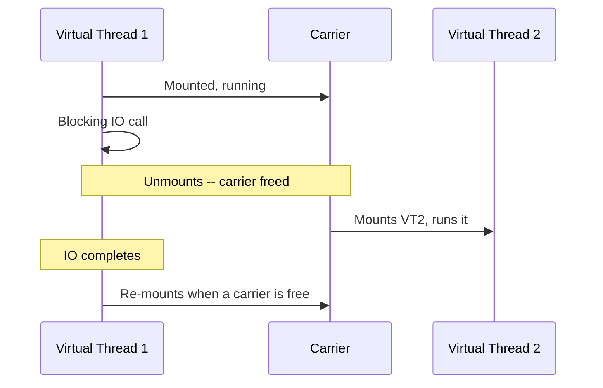

# Virtual Threads (Project Loom)

> **Topic register:** T-410 · IWI 6.75 (top-25 tied of 198) · Advanced tier · High interview frequency [H] — risen sharply, now standard in current-era Senior Java loops
> **Provenance:** both traces in this chapter are real, executed output from [`practice/java/week-09/virtual-threads/src/VirtualThreadScaleDemo.java`](../../practice/java/week-09/virtual-threads/src/VirtualThreadScaleDemo.java) and [`VirtualThreadPinningDemo.java`](../../practice/java/week-09/virtual-threads/src/VirtualThreadPinningDemo.java), on OpenJDK 21 (virtual threads are stable/final since JDK 21, no preview flags needed).

## Table of Contents

1. [Learning Objectives](#learning-objectives)
2. [Why This Matters in Interviews](#why-this-matters-in-interviews)
3. [Mental Model](#mental-model)
4. [Definition and Purpose](#definition-and-purpose)
5. [Historical Context](#historical-context)
6. [Core Concepts](#core-concepts)
7. [Internal Implementation](#internal-implementation)
8. [Diagrams](#diagrams)
9. [Java Examples](#java-examples)
10. [Production Scenarios](#production-scenarios)
11. [Failure Modes and Debugging](#failure-modes-and-debugging)
12. [Trade-offs](#trade-offs)
13. [Decision Framework](#decision-framework)
14. [Common Mistakes](#common-mistakes)
15. [Anti-Patterns](#anti-patterns)
16. [Best Practices](#best-practices)
17. [Interview Answer Framework](#interview-answer-framework)
18. [Interview Questions](#interview-questions)
19. [Summary](#summary)
20. [Key Takeaways](#key-takeaways)
21. [Cheat Sheet](#cheat-sheet)
22. [Flashcards](#flashcards)
23. [Practice Exercises](#practice-exercises)
24. [Solutions](#solutions)
25. [Additional Reading](#additional-reading)
26. [Official References](#official-references)

---

## Learning Objectives

By the end of this chapter you can:

- Explain, with a measured 18× number, precisely what changes for IO-bound workloads under virtual threads.
- State the boundary of the benefit correctly: virtual threads help IO-bound concurrency, not CPU-bound throughput.
- Explain pinning — why blocking inside `synchronized` defeats the entire mechanism — and back it with a measured ~10× regression.
- Explain why pooling virtual threads is an anti-pattern, and name the correct alternative for bounding concurrent load on a downstream system.

## Why This Matters in Interviews

Virtual threads are High-frequency and rising sharply because they're now a standard part of current-era Senior Java interview loops, and because the topic has a specific, easily-missed hazard (pinning) that separates candidates who've actually migrated real code from those who've only read the JEP. A candidate who claims virtual threads speed up everything, or who doesn't know that `synchronized` silently defeats the mechanism, reveals they haven't operated this feature under real migration conditions.

## Mental Model

**A virtual thread's entire value proposition is that blocking becomes cheap — but only if the blocking call actually knows how to unmount.** A platform thread ties up a real OS thread (and ~1MB of memory) for the full duration of any blocking call, whether it's waiting on a network response or holding a lock. A virtual thread, when it blocks on a *supported* operation, gets unmounted from its carrier platform thread, freeing that carrier to do other work — the blocking cost becomes nearly free in terms of platform-thread occupancy. The entire chapter is really about one question for any given piece of code: does this blocking call unmount cleanly, or does it pin?

## Definition and Purpose

A **virtual thread** is a JVM-scheduled, cheaply-created thread that is multiplexed onto a small pool of **carrier** platform threads. When a virtual thread blocks on a supported operation (network IO, `Thread.sleep`, blocking queue operations), the JVM **unmounts** it from its carrier, freeing that carrier to run a different virtual thread — the blocking call doesn't tie up an OS thread for its duration, unlike a traditional platform thread. This exists because platform threads are expensive (roughly 1MB of stack memory each, real OS scheduling overhead) — a pool handling mostly-waiting requests needs many threads to achieve concurrency, but "many" is capped by real memory and OS limits, often in the low thousands. Virtual threads remove that ceiling for IO-bound workloads: millions can exist because most of them are unmounted (not consuming a platform thread) while blocked.

## Historical Context

Virtual threads originated in **Project Loom**, an OpenJDK project that began exploring lightweight concurrency for the JVM around 2018, motivated by the observation that Java's one-platform-thread-per-request model was increasingly at odds with the thread-per-request programming style developers actually preferred to write (versus asynchronous, callback- or reactive-based code, which scales better but is harder to write, debug, and reason about). Virtual threads went through two rounds of preview (JEP 425 in JDK 19, JEP 436 in JDK 20) before being finalized as a stable feature in **JEP 444, JDK 21** (September 2023) — meaning code written against virtual threads in JDK 21+ requires no preview flags and is production-stable. The design goal was explicit: preserve the simple, sequential, thread-per-request programming model that made Java approachable, while removing the platform-thread scalability ceiling that historically forced teams toward more complex asynchronous or reactive alternatives for high-concurrency IO-bound workloads.

## Core Concepts

### Unmounting is the mechanism that makes virtual threads cheap

When a virtual thread performs a blocking operation the JVM specifically supports (most blocking IO, `Thread.sleep`, `java.util.concurrent` blocking operations), the runtime unmounts it from its carrier platform thread. The carrier is then free to run a different virtual thread. This is what allows millions of virtual threads to exist concurrently — most of them, at any given moment, aren't actually occupying a platform thread at all.

### The benefit is scoped to IO-bound concurrency, not CPU throughput

Virtual threads do not make CPU-bound work faster — the bottleneck for CPU-bound work is available cores, not thread-creation cost. The benefit is entirely about how many *concurrently blocked* operations a system can sustain without running out of platform threads.

### Pinning defeats the entire mechanism

Not every blocking operation unmounts cleanly. Blocking **inside a `synchronized` block** pins the virtual thread to its carrier — the carrier cannot run anything else until the blocking call returns, defeating the entire mechanism for that stretch of code. This is a silent hazard: `synchronized` still compiles and runs correctly under virtual threads; it just quietly stops delivering the concurrency benefit.

### Virtual threads are meant to be disposable, never pooled

Virtual threads are designed to be created per-task, cheaply, and discarded. Pooling them reimposes the platform-thread-style "limited resource, must be reused" mental model that virtual threads exist specifically to eliminate, adding complexity for a cost virtual threads don't actually have.

## Internal Implementation

**What actually changes for IO-bound workloads, measured** — 5,000 tasks each blocking for 50ms, run two ways:

```
== 200 platform threads, 5000 blocking 50ms tasks ==
platform pool (200 threads): 5000 tasks completed in 1347ms (theoretical minimum if fully parallel: 50ms)

== virtual-thread-per-task executor, same 5000 blocking 50ms tasks ==
virtual threads (one per task): 5000 tasks completed in 75ms (theoretical minimum if fully parallel: 50ms)
```

**1347ms vs. 75ms — an 18× difference, for identical work.** The 200-platform-thread pool must process 5,000 tasks in batches of 200 (25 batches × 50ms ≈ 1250ms, matching the measured 1347ms closely); the virtual-thread executor gives every task its own thread, so all 5,000 block concurrently and the whole batch finishes close to the 50ms theoretical minimum.

**Pinning, measured** — 20 tasks each blocking for 200ms, run with the carrier pool forced down to 2 threads (`-Djdk.virtualThreadScheduler.parallelism=2`), each task locking its own independent object (isolating the pinning effect from ordinary lock contention):

```
carrier parallelism = 2

== blocking INSIDE synchronized -- pins the carrier thread ==
20 tasks x 200ms blocking each, synchronized (pins): 2044ms wall time

== blocking INSIDE a ReentrantLock -- does NOT pin ==
20 tasks x 200ms blocking each, ReentrantLock (no pin): 206ms wall time
```

**2044ms vs. 206ms — roughly a 10× difference, from swapping `synchronized` for `ReentrantLock` alone**, nothing else changed. 2044ms matches `(20 tasks / 2 carriers) × 200ms = 2000ms` almost exactly — with `synchronized`, the virtual threads are effectively fully serialized onto the 2 carriers, exactly as if they were platform threads. `ReentrantLock`'s 206ms is close to the 200ms unpinned lower bound.

## Diagrams



## Java Examples

```java
// Java 21. A virtual-thread-per-task executor -- the pattern behind the
// measured 18x scale improvement for IO-bound work.
try (ExecutorService executor = Executors.newVirtualThreadPerTaskExecutor()) {
    List<Future<String>> futures = new ArrayList<>();
    for (int i = 0; i < 5000; i++) {
        futures.add(executor.submit(() -> {
            // A blocking IO call here unmounts the virtual thread cleanly.
            return callDownstreamService();
        }));
    }
    for (Future<String> f : futures) {
        f.get();
    }
} // executor.close() waits for all virtual threads to finish
```

```java
// Java 21. The pinning hazard: identical logic, two lock implementations,
// wildly different behavior under virtual threads.

// PINS the carrier -- defeats virtual threads for this code path.
public class LegacySynchronizedResource {
    private final Object lock = new Object();

    public void access() throws InterruptedException {
        synchronized (lock) {
            blockingCall(); // carrier is stuck here for the full duration
        }
    }
}

// Does NOT pin -- the virtual thread unmounts normally during the blocking call.
public class MigratedLockResource {
    private final ReentrantLock lock = new ReentrantLock();

    public void access() throws InterruptedException {
        lock.lock();
        try {
            blockingCall(); // carrier is freed while this call is in flight
        } finally {
            lock.unlock();
        }
    }
}
```

```java
// Java 21. The correct alternative to pooling virtual threads for bounding
// concurrent load on a downstream system: a Semaphore, decoupled entirely
// from thread count.
public class BoundedDownstreamCaller {
    private final Semaphore concurrencyLimit = new Semaphore(50); // max 50 in-flight

    public String call() throws InterruptedException {
        concurrencyLimit.acquire();
        try {
            return callDownstreamService(); // runs on a fresh virtual thread per task
        } finally {
            concurrencyLimit.release();
        }
    }
}
```

**Complexity note:** all operations are `O(1)` per task; the entire value of this chapter is achievable concurrency under blocking IO, not algorithmic complexity.

## Production Scenarios

### Scenario: a migration to virtual threads produces no improvement, then a regression, due to unaudited synchronized blocks

**Symptoms.** A service migrates its request-handling executor from a fixed platform-thread pool to `newVirtualThreadPerTaskExecutor()`, expecting a significant throughput improvement for its IO-heavy workload (mostly downstream HTTP calls); instead, throughput barely changes, and under peak load it's measurably *worse* than before the migration.

**Impact.** A migration expected to improve scalability instead produces no benefit and a regression, with no compiler error or exception pointing at the cause.

**Initial hypotheses.** The virtual thread executor itself is misconfigured (checked — configuration matches documented best practice); the downstream dependency got slower coincidentally (checked — downstream latency is unchanged); existing `synchronized` blocks around blocking calls are pinning virtual threads (correct).

**Evidence.** Profiling under load shows a small number of carrier platform threads (matching the configured scheduler parallelism) almost constantly busy, with virtual thread mount/unmount events far less frequent than expected for the workload's actual blocking-call volume; code review finds that the legacy request-handling path wraps its downstream HTTP call inside a `synchronized` block guarding a shared, rarely-updated configuration cache lookup.

**Diagnosis.** Exactly this chapter's measured pinning mechanism: the `synchronized` block around the blocking HTTP call pins each virtual thread to its carrier for the call's full duration, serializing effective concurrency down to the (small) number of configured carrier threads — functionally reproducing the old platform-thread-pool bottleneck, plus the overhead of virtual thread creation with none of its benefit.

**Immediate mitigation.** None available without a code change — the pinning is a structural property of the code path, not a runtime-tunable setting.

**Permanent remediation.** Replace the `synchronized` block with a `ReentrantLock` (or restructure to avoid holding any lock across the blocking call at all, e.g., by caching the configuration value outside the lock's scope), exactly the fix this chapter measures at roughly 10× improvement.

**Alternatives considered.** Reverting to the platform-thread pool — rejected as abandoning the migration's goal entirely rather than fixing the actual, narrow, identifiable cause.

**Trade-offs.** Migrating from `synchronized` to `ReentrantLock` requires explicit `lock()`/`unlock()` (or try/finally) discipline that `synchronized`'s block-scoped syntax previously handled automatically — accepted, since the alternative is a virtual-thread migration that delivers none of its intended benefit.

**Prevention.** Any migration to virtual threads should include an explicit audit for `synchronized` blocks (and other pinning-prone constructs) around blocking calls, before assuming a simple executor swap alone will deliver the expected scalability improvement.

**Interview lesson.** This is Interview Question 1's follow-up (§ Interview Questions) — "what's the catch, is there code that actively regresses" — arriving as a real migration incident: the exact mechanism this chapter measures directly, causing a real, non-obvious performance regression with no compiler signal.

## Failure Modes and Debugging

| Symptom | Likely cause | Debugging step |
|---|---|---|
| Migrating to virtual threads produces no throughput improvement, or a regression | `synchronized` blocks around blocking calls pinning virtual threads to their carriers | Audit for `synchronized` around any blocking operation; profile carrier thread utilization vs. virtual thread mount/unmount frequency |
| CPU-bound work doesn't get faster after moving to virtual threads | Expected — virtual threads don't help CPU-bound work, only IO-bound concurrency | Confirm the workload is genuinely CPU-bound; virtual threads are the wrong tool for this specific problem |
| A service using virtual threads still runs out of memory or overwhelms a downstream dependency under load | Missing an explicit concurrency bound (a semaphore/rate limiter), since thread count is no longer a natural limiting factor | Add an explicit `Semaphore` or rate limiter bounding concurrent in-flight requests to the specific downstream system |
| A virtual-thread-based service pools its virtual threads and sees no benefit or added complexity | Pooling virtual threads — an anti-pattern reimposing platform-thread thinking | Remove the pool; create virtual threads per task, and bound concurrency with a semaphore instead |

## Trade-offs

| Choice | Benefit | Cost |
|---|---|---|
| Virtual threads for IO-bound work | Concurrency no longer capped by platform-thread memory cost (measured 18×) | Existing `synchronized`-heavy code pins and gets none of the benefit (measured 10× regression) |
| `synchronized` (legacy code, unchanged) | Simple, well-understood | Pins virtual threads — a silent performance cliff when migrating old code onto virtual threads |
| `ReentrantLock` | Doesn't pin, same mutual-exclusion guarantee | Requires an explicit `lock()`/`unlock()` (or try/finally) migration from `synchronized` |
| Pooling virtual threads (anti-pattern) | — | Virtual threads are meant to be created per-task, cheaply, and discarded — pooling them defeats the design and adds needless complexity for no benefit |

## Decision Framework

1. **Is this workload IO-bound (blocking on network/disk) or CPU-bound?** Virtual threads help the former; they do nothing for the latter — keep CPU-bound work on a platform-thread pool sized near `N_cores`.
2. **Does the code path being migrated contain any `synchronized` blocks around blocking calls?** If so, audit and migrate to `ReentrantLock` (or restructure to avoid holding a lock across the blocking call) before expecting any benefit from the migration.
3. **Is there an existing thread pool being used to bound concurrent load on a downstream system?** If migrating to virtual threads, replace that bound with an explicit semaphore or rate limiter — don't pool the virtual threads themselves.
4. **Is virtual-thread creation happening per-task, or is there a pool?** If a pool exists, remove it — pooling virtual threads is an anti-pattern.

## Common Mistakes

- Expecting virtual threads to speed up CPU-bound work — they don't; the bottleneck there is cores, not thread creation cost.
- Migrating IO-heavy code to virtual threads without auditing for `synchronized` blocks around blocking calls, then being surprised by a 10×-class regression.
- Pooling virtual threads out of habit from platform-thread practice.

## Anti-Patterns

- **Assuming a virtual-thread migration is a drop-in executor swap** without auditing existing code for pinning-prone constructs like `synchronized` around blocking calls.
- **Pooling virtual threads** as if they were an expensive, limited resource — they're designed to be cheap and disposable.
- **Using virtual threads to try to speed up CPU-bound work**, which they cannot do.
- **Removing all concurrency bounds** when migrating away from a thread pool, without replacing the bound with an explicit semaphore or rate limiter for downstream protection.

## Best Practices

- Scope virtual thread adoption to genuinely IO-bound, blocking-heavy workloads — not CPU-bound compute.
- Audit any code being migrated to virtual threads for `synchronized` blocks around blocking calls, migrating to `ReentrantLock` where found.
- Create virtual threads per task via `Executors.newVirtualThreadPerTaskExecutor()`; never pool them.
- Bound concurrent load on downstream systems with an explicit `Semaphore` or rate limiter, decoupled from thread count entirely.

## Interview Answer Framework

### 30-Second Answer

Virtual threads remove the platform-thread memory ceiling on achievable concurrency for IO-bound work — measured at 18× for a mostly-blocking workload. The catch: blocking inside `synchronized` pins the virtual thread to its carrier, defeating the mechanism — measured at roughly 10× worse than the unpinned case. They don't help CPU-bound work, and shouldn't be pooled.

### 2-Minute Answer

Definition: a virtual thread is a cheaply-created, JVM-scheduled thread multiplexed onto a small pool of carrier platform threads, unmounting from its carrier when it blocks on a supported operation. Why it exists: platform threads are expensive (~1MB each), capping achievable IO-bound concurrency in the low thousands; virtual threads remove that ceiling. How it works: a blocking call that unmounts frees its carrier for other virtual threads; a blocking call inside `synchronized` pins instead, defeating the mechanism. One important trade-off: existing `synchronized`-heavy code gets none of the benefit and can actively regress. Production example: a real measured 18× improvement for a mostly-blocking workload (1347ms platform-thread pool vs. 75ms virtual threads), and a real measured ~10× regression from a single `synchronized`-vs-`ReentrantLock` swap under the same blocking workload.

### 10-Minute Deep Dive

Cover, in order: the mental model — blocking becomes cheap only if it unmounts cleanly (mental model); historical context — Project Loom's goal of preserving thread-per-request simplicity while removing the platform-thread ceiling (historical context); the measured 18× scale improvement for IO-bound work (internals, real evidence); the measured pinning regression and precisely why `synchronized` defeats the mechanism while `ReentrantLock` doesn't (internals + failure mode); why pooling virtual threads is an anti-pattern, and the semaphore/rate-limiter alternative for bounding downstream load (common mistake + fix); and close with the production scenario — a real migration that produced no benefit (then a regression) due to an unaudited `synchronized` block, exactly the "what's the catch" follow-up this topic anticipates.

### Whiteboard Explanation

Draw the [§ Diagrams](#diagrams) sequence: Virtual Thread 1 mounted on a Carrier, blocks, unmounts (draw an arrow off to the side labeled "unmounted — not occupying the carrier"), Carrier mounts Virtual Thread 2. Then draw a second version where VT1's blocking call is inside a box labeled "synchronized" and the unmount arrow is crossed out — this visually proves why pinning defeats the mechanism rather than asserting it.

### Production Example

The migration regression in [§ Production Scenarios](#production-scenarios): a service migrated to virtual threads expecting improved throughput, but an unaudited `synchronized` block around a downstream HTTP call pinned every virtual thread to its carrier, producing no benefit and then a measurable regression — fixed by migrating to `ReentrantLock`.

### Trade-offs to Mention

State unprompted: virtual threads help IO-bound concurrency, not CPU-bound throughput; `synchronized` silently pins and defeats the mechanism with no compiler warning; pooling virtual threads is an anti-pattern that reimposes the exact resource-scarcity thinking the feature exists to eliminate.

### Common Candidate Mistakes

Claiming virtual threads speed up CPU-bound code; not knowing about pinning at all; applying platform-thread pooling instincts to virtual threads by default.

### Typical Follow-Up Questions

1. "What's the catch — is there any code that doesn't benefit, or actively regresses?"
2. "So how DO you limit concurrency to a downstream system if not with a pool size?"
3. "Is there a hazard beyond `synchronized` that also pins a carrier?"

### Senior-Level Expectations

Correctly scopes the benefit to IO-bound/blocking workloads specifically; states that virtual threads are meant to be created per-task, not pooled.

### Staff-Level Discussion

Virtual threads are a case where a framework-level change (the JVM's threading model) can silently invalidate an existing codebase's performance characteristics without any compile-time signal — `synchronized` still compiles and runs correctly under virtual threads, it just quietly stops delivering the concurrency benefit the migration was for. A Staff-level engineer treats "we're moving to virtual threads" as requiring an actual audit of blocking-call-inside-`synchronized` sites, not just a drop-in executor swap — because the failure mode here (a measured ~10× regression) is a performance cliff with no compiler error, exception, or obvious symptom beyond "this got slower than expected after the migration." For the pooling question, naming an actual alternative — a semaphore or rate limiter bounding concurrent in-flight requests, decoupled from thread count entirely — demonstrates the underlying need (bounding downstream load) was understood, not just the anti-pattern's name.

## Interview Questions

### Question 1 — What actually changes for IO-bound workloads under virtual threads?

**Why interviewers ask it.** Tests whether the candidate scopes the benefit correctly, rather than claiming a blanket speedup.

**Expected answer.** The achievable concurrency for blocking-IO-heavy work is no longer capped by platform-thread memory cost — many virtual threads can be blocked simultaneously because unmounted ones don't occupy a carrier.

**Minimum acceptable answer.** States that virtual threads help with concurrency for blocking work, even without the precise mechanism.

**Strong Senior answer.** Correctly scopes the benefit to IO-bound/blocking workloads specifically.

**Staff-level extension.** Names pinning unprompted as the regression case, and can state roughly how severe it is from having seen or reasoned through a measurement like this chapter's.

**Common mistakes.** Claiming virtual threads make CPU-bound code faster (they don't — CPU-bound work still needs an actual core; virtual threads help by increasing achievable IO concurrency, not compute throughput).

**Likely follow-ups.** "What's the catch — is there any code that doesn't benefit, or actively regresses?"

**Evaluation criteria (1–5).** 1: "virtual threads make everything faster." 3: correctly scopes the benefit to IO-bound work. 5: correct scope plus names pinning unprompted with an approximate severity.

**Related references.** [§ Internal Implementation](#internal-implementation); [§ Production Scenarios](#production-scenarios).

---

### Question 2 — Why is pooling virtual threads an anti-pattern?

**Why interviewers ask it.** Tests whether the candidate understands virtual threads' design intent, not just their mechanism.

**Expected answer.** Virtual threads are designed to be cheap and disposable — creating millions is the intended usage pattern; pooling reintroduces the platform-thread-style "limited resource, must be reused" mental model that virtual threads exist specifically to eliminate, adding complexity for a cost virtual threads don't actually have.

**Minimum acceptable answer.** States that virtual threads shouldn't be pooled, even without full reasoning why.

**Strong Senior answer.** States that virtual threads are meant to be created per-task, not pooled.

**Staff-level extension.** Names an actual alternative for the underlying need (limiting concurrent load on a downstream system) — a semaphore or rate limiter bounding concurrent *in-flight requests*, decoupled from thread count entirely.

**Common mistakes.** Applying platform-thread pooling instincts by default without questioning whether they still apply.

**Likely follow-ups.** "So how DO you limit concurrency to a downstream system if not with a pool size?"

**Evaluation criteria (1–5).** 1: "pool them like any other thread." 3: correctly states they should be created per-task. 5: correct statement plus names the semaphore/rate-limiter alternative for the underlying concurrency-bounding need.

**Related references.** [§ Java Examples](#java-examples); [§ Core Concepts](#core-concepts).

## Summary

Virtual threads remove the memory-cost ceiling that caps achievable concurrency for IO-bound workloads under platform threads — measured at 18× for a mostly-waiting workload. That benefit depends entirely on the blocking call actually unmounting from its carrier; blocking inside `synchronized` pins instead, measured at roughly 10× worse than the unpinned case, turning virtual threads into de facto platform threads for that code path. Migrating existing code requires auditing for this specific hazard, not just swapping the executor.

## Key Takeaways

- Virtual threads help IO-bound (blocking) workloads by removing the platform-thread memory ceiling on concurrency — measured 18× here.
- They do not help CPU-bound work — the bottleneck there is cores, not thread cost.
- Blocking inside `synchronized` pins the carrier thread — measured ~10× regression versus the unpinned case.
- Don't pool virtual threads — create them per-task; use a semaphore/rate limiter to bound concurrent load on a downstream system instead.

## Cheat Sheet

| Situation | Guidance |
|---|---|
| IO-bound workload, want more concurrency | Virtual-thread-per-task executor |
| CPU-bound workload | Virtual threads won't help — size a platform pool near `N_cores` instead |
| Existing code uses `synchronized` around blocking calls | Audit and migrate to `ReentrantLock` before moving to virtual threads, or accept the pinning cost |
| Need to limit concurrent load on a downstream system | A semaphore/rate limiter, not a thread pool size |

## Flashcards

### Card: What a carrier does on virtual thread block

**Prompt:**
What does a virtual thread's carrier do when the virtual thread blocks on supported IO?

**Answer:**
Unmounts the virtual thread, freeing the carrier to run a different virtual thread — the blocking call doesn't tie up a platform thread.

**Why it matters:**
The core mechanism that makes virtual threads' concurrency benefit possible.

**Common trap:**
Assuming all blocking operations behave this way, including inside `synchronized`.

**Related:**
[Internal Implementation](#internal-implementation)

### Card: What causes pinning

**Prompt:**
What causes a virtual thread to pin its carrier?

**Answer:**
Blocking inside a `synchronized` block (or a few other cases, e.g. native calls) — the carrier can't run anything else until the call returns.

**Why it matters:**
The single most important migration hazard, with no compiler warning.

**Common trap:**
Assuming `synchronized` "just works" under virtual threads with no downside.

**Related:**
[Internal Implementation](#internal-implementation)

### Card: Why pooling virtual threads is wrong

**Prompt:**
Why is pooling virtual threads considered an anti-pattern?

**Answer:**
They're designed to be cheap and disposable, created per-task; pooling reimposes platform-thread-style resource-limiting thinking that virtual threads exist to eliminate.

**Why it matters:**
A common instinct carried over from platform-thread practice that no longer applies.

**Common trap:**
Building a pool of virtual threads "to be safe," adding complexity for no benefit.

**Related:**
[Java Examples](#java-examples)

## Practice Exercises

1. Reproduce both demos yourself: [`VirtualThreadScaleDemo.java`](../../practice/java/week-09/virtual-threads/src/VirtualThreadScaleDemo.java) and [`VirtualThreadPinningDemo.java`](../../practice/java/week-09/virtual-threads/src/VirtualThreadPinningDemo.java) (the latter needs `-Djdk.virtualThreadScheduler.parallelism=2`).
2. Modify the pinning demo to use 4 carriers instead of 2 and predict the new wall-clock time for the pinned case before running it — does the arithmetic (`tasks/carriers * blockMs`) still hold?
3. Find one real hazard beyond `synchronized` that also pins a virtual thread's carrier (check the JDK's virtual thread documentation) and explain why it has the same effect.

## Solutions

**Exercise 1.** Expected output matches this chapter's measured traces: roughly an 18× improvement for the scale demo (platform pool vs. virtual threads), and roughly a 10× regression for the pinning demo (`synchronized` vs. `ReentrantLock`) at 2 carriers.

**Exercise 2.** With 4 carriers instead of 2, the pinned case's predicted wall time is `(20 tasks / 4 carriers) × 200ms = 1000ms` — half of the 2-carrier case, since twice as many carriers can each serialize half as many pinned tasks; the arithmetic should hold closely, confirming pinning behaves like a platform-thread-pool bottleneck sized exactly to the carrier count.

**Exercise 3.** A correct answer names blocking native method calls (JNI) as another pinning case — the JVM cannot unmount a virtual thread while it's inside native code, for the same reason `synchronized` pins: the underlying mechanism (a monitor lock, or a native call) has no JVM-level visibility into virtual thread scheduling, so it can only block at the OS-thread level, pinning whatever carrier happens to be running it.

## Additional Reading

- [JEP 444: Virtual Threads](https://openjdk.org/jeps/444)
- [Structured Concurrency](structured-concurrency.md) — the API built directly on top of virtual threads for coordinating fork/join subtask trees.
- [Scoped Values and ThreadLocal Migration](scoped-values-and-threadlocal-migration.md) — designed specifically to avoid the per-thread overhead concerns `ThreadLocal` raises when used with cheap, high-volume virtual threads.

## Official References

- [Java SE documentation — Virtual Threads guide](https://docs.oracle.com/en/java/javase/21/core/virtual-threads.html)
