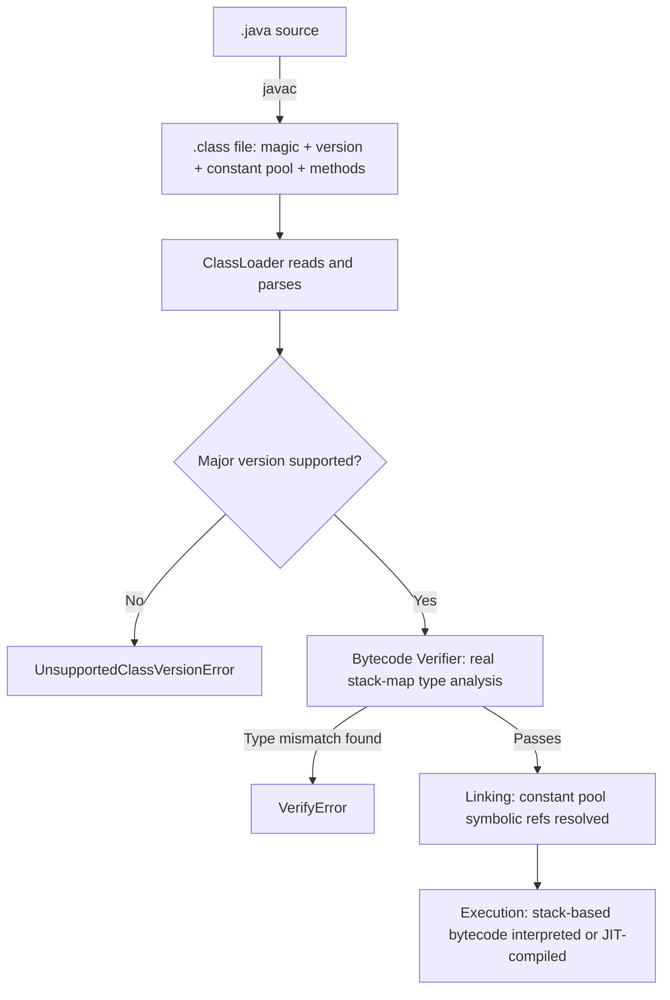

# Bytecode and Class File Fundamentals

> **Topic register:** T-2406 · Advanced tier · Occasional interview frequency (new gap-audit topic — explicitly named in `CLAUDE.md`'s own Java Core gap list, closing the third and last of that list's three `02-java` items)
> **Provenance:** all evidence in this chapter is real, executed output from
> [`practice/java/jvm/bytecode-and-class-file-fundamentals/`](../../../practice/java/jvm/bytecode-and-class-file-fundamentals/README.md)
> (OpenJDK 21.0.12), including a real hex dump of a `.class` file's magic number,
> a full real `javap -v` disassembly, a real `UnsupportedClassVersionError`, and
> a real `VerifyError` reproduced by patching a single bytecode byte.

## Table of Contents

1. [Learning Objectives](#learning-objectives)
2. [Why This Matters in Interviews](#why-this-matters-in-interviews)
3. [Level 1 — Foundation](#level-1--foundation)
4. [Level 2 — Working Knowledge](#level-2--working-knowledge)
5. [Mental Model](#mental-model)
6. [Definition and Purpose](#definition-and-purpose)
7. [Core Concepts](#core-concepts)
8. [Internal Implementation](#internal-implementation)
9. [Diagrams](#diagrams)
10. [Production Scenarios](#production-scenarios)
11. [Failure Modes and Debugging](#failure-modes-and-debugging)
12. [Trade-offs](#trade-offs)
13. [Decision Framework](#decision-framework)
14. [Common Mistakes](#common-mistakes)
15. [Anti-Patterns](#anti-patterns)
16. [Best Practices](#best-practices)
17. [Interview Answer Framework](#interview-answer-framework)
18. [Interview Questions](#interview-questions)
19. [Summary](#summary)
20. [Key Takeaways](#key-takeaways)
21. [Cheat Sheet](#cheat-sheet)
22. [Flashcards](#flashcards)
23. [Practice Exercises](#practice-exercises)
24. [Solutions](#solutions)
25. [Additional Reading](#additional-reading)
26. [Official References](#official-references)

## Learning Objectives

By the end of this chapter you can:

- Name the structure of a `.class` file (magic number, version, constant pool, fields, methods, attributes) and locate each part in a real hex dump and a real `javap -v` disassembly.
- Read basic JVM bytecode instructions (`iconst`, `iload`/`istore`, `if_icmpgt`, `invokevirtual`/`invokestatic`/`invokespecial`, `getfield`/`putfield`) well enough to trace a simple method's real compiled instruction sequence.
- Explain what the bytecode verifier actually checks, and why, with a real `VerifyError` produced from a single corrupted opcode byte.
- Explain `UnsupportedClassVersionError` as a real, exact major-version comparison, not a vague "incompatible version" message.

## Why This Matters in Interviews

Most engineers never hand-inspect a `.class` file in production — this chapter's own topic register honestly marks the topic "Occasional," not inflated. It matters here for a real, practical reason: `UnsupportedClassVersionError` is one of the single most common real deployment failures (a JAR built for a newer JDK deployed onto an older runtime), and understanding it as an exact version-number check, not a mysterious incompatibility, turns a confusing failure into a two-second diagnosis. It's also the concrete substrate underneath two chapters already in this program — [MethodHandle and java.lang.invoke](../concurrency/methodhandle-and-invoke.md)'s `invokedynamic` instruction and [ClassLoaders and Class Initialization](../language-core/classloaders-and-class-initialization.md)'s parsing step — and a Staff-level candidate who can read a real `javap` disassembly signals genuine platform depth beyond "I write Java, the JVM does the rest."

## Level 1 — Foundation

When `javac` compiles a `.java` file, it doesn't produce machine code your processor runs directly — it produces a `.class` file, a precisely specified binary format the JVM reads and executes. Think of it like a musical score versus a live performance: your source code is sheet music written for a specific instrument (a specific processor architecture), but a `.class` file is more like a universal notation any orchestra (any JVM, on any operating system or CPU architecture) can read and play consistently, because the notation itself — every instruction, every reference to another piece, every declared method — follows one fixed, documented format. That format always starts with the same four bytes, `0xCAFEBABE`, a literal "yes, this is really a class file" signature the JVM checks before reading anything else — a real, verifiable fact, not a rumor: this chapter's own hex dump shows it directly.

## Level 2 — Working Knowledge

The working structure worth internalizing: a class file is magic number, then minor/major version, then a **constant pool** (a numbered table of every symbolic reference the class uses — other classes' names, method signatures, string literals, field names — referenced by index everywhere else in the file rather than repeated inline), then the class's own access flags and name, then its fields, then its methods (each method's actual instructions live in a `Code` attribute), then a table of additional attributes. The constant pool is the single most important structural idea here: when compiled code calls `System.out.println(...)`, the actual bytecode doesn't embed the string `"java/io/PrintStream"` and `"println"` inline at every call site — it references constant pool entry numbers, and those entries are resolved into real, checked memory addresses only when the class is linked (loaded), which is exactly the mechanism [ClassLoaders and Class Initialization](../language-core/classloaders-and-class-initialization.md) describes from the loading side.

The second working idea: the JVM's instruction set is **stack-based**, not register-based — every instruction pushes onto or pops from an operand stack local to the current method call, rather than reading and writing named registers the way x86/ARM machine code does. `iconst_0` pushes the constant `0`; `iload_1` pushes local variable slot 1's value; `iadd` pops the top two values, adds them, and pushes the result. This chapter's own real `javap` disassembly of a simple loop shows this sequence directly, instruction by instruction, matching the source's actual control flow exactly.

## Mental Model

**A `.class` file is a portable, precisely specified binary format — magic number, version, a constant pool of symbolic references, and stack-based bytecode instructions — that lets any conforming JVM parse, verify, and execute code compiled once, anywhere, both because the format itself is fixed and because a real verification pass checks type-safety before a single instruction runs.** Every other fact in this chapter — the constant pool's indirection, the specific instruction set, the version-check mechanism, the verifier's stack-frame analysis — exists in service of that one guarantee: "write once, run anywhere" is a real, checkable claim about this file format, not a marketing slogan.

## Definition and Purpose

The class file format is defined in Chapter 4 of the [Java Virtual Machine Specification](https://docs.oracle.com/javase/specs/jvms/se21/html/jvms-4.html): a binary format beginning with the magic number `0xCAFEBABE`, followed by minor and major version numbers, a constant pool, access flags, the class's own name and superclass, implemented interfaces, fields, methods (each carrying its bytecode in a `Code` attribute), and a general attributes table. It exists to give the JVM one fixed, versioned, platform-independent format to load, verify, and execute — the actual mechanism behind "compile once, run anywhere": any conforming JVM, regardless of host OS or CPU architecture, parses the identical binary format and executes the identical bytecode instruction set.

## Core Concepts

### The constant pool is the class file's central table of symbolic references

Every class name, method signature, field reference, and string or numeric literal a class uses is stored once in its constant pool, indexed from 1. Every other part of the file — the class's own name, its superclass, every method's bytecode — refers to these by index (`#7`, `#12`, and so on) rather than embedding the actual name or value inline. This indirection is what lets a class reference another class it hasn't been linked against yet: the reference is symbolic (a name, resolved at link time) until the classloader actually resolves it into a real, checked reference — the direct connection to [ClassLoaders and Class Initialization](../language-core/classloaders-and-class-initialization.md)'s own loading/linking distinction.

### Version numbers gate exactly which JVM can run a class file

The major version number (65 for Java 21, one higher per subsequent LTS/feature release, per the JVMS's own version table) is checked exactly, not approximately, at class-loading time: a JVM refuses to load any class file whose major version exceeds the highest version it supports. This chapter's own real demo proves it directly — patching only the major-version bytes upward on an otherwise-valid class file produces a real `UnsupportedClassVersionError` naming both the file's version and the runtime's actual maximum supported version.

### The JVM's bytecode instruction set is stack-based, and directly traceable to source

Common instruction families: `iconst_<n>`/`bipush`/`sipush` push constants; `iload_<n>`/`istore_<n>` (and the `a`-, `l`-, `f`-, `d`-prefixed variants for reference/long/float/double locals) move values between the operand stack and local variable slots; `iadd`/`isub`/`imul` and friends perform arithmetic on the stack's top values; `if_icmpgt`/`if_icmple`/`goto` implement control flow via conditional and unconditional jumps to a bytecode offset; `invokevirtual`/`invokestatic`/`invokespecial`/`invokeinterface`/`invokedynamic` are the five real, distinct method-call instructions (matching the same "invoke family" [MethodHandle and java.lang.invoke](../concurrency/methodhandle-and-invoke.md) covers from `invokedynamic`'s bootstrap-and-cache side); `getfield`/`putfield`/`getstatic`/`putstatic` read and write instance and static fields. This chapter's own real disassembly of a one-method loop shows the exact, traceable mapping from `for` loop source to `iconst_0`/`if_icmpgt`/`iadd`/`iinc`/`goto` bytecode.

### The bytecode verifier performs real, type-aware analysis before any method executes

Since Java 6, class files carry a `StackMapTable` attribute recording, at key bytecode offsets, exactly what types are expected on the operand stack and in local variable slots — the "split verifier" design that lets the JVM verify a method's type-safety in one linear pass instead of the earlier, much more expensive full type-inference pass. This chapter's own real demo proves the verifier is a genuine type-checker, not a superficial structural check: corrupting a single bytecode byte (changing `iadd`, which expects two `int`s, into `iaload`, which expects an array reference and an index) produces a real `VerifyError: Bad type on operand stack`, naming the exact bytecode offset and the exact type mismatch found.

## Internal Implementation

Four real, captured pieces of evidence from `practice/java/jvm/bytecode-and-class-file-fundamentals/output-transcript.txt`, run against OpenJDK 21.0.12:

**The magic number and version, in a real hex dump:**

```text
00000000: cafe babe 0000 0041 0014 0a00 0200 0307  .......A........
```

`cafe babe` is the real magic number; `0000` is minor version 0; `0041` is major version 65 (Java 21), matching `javap`'s own reported `major version: 65`.

**A real `javap -v` disassembly of a one-method loop**, showing the constant pool (`#1 = Methodref ... java/lang/Object."<init>":()V`, `#7 = Fieldref ... SumLoop.total:I`) and the loop's real bytecode:

```text
public int sumTo(int);
    Code:
       0: iconst_0
       1: istore_2
       2: iconst_1
       3: istore_3
       4: iload_3
       5: iload_1
       6: if_icmpgt     19
       9: iload_2
      10: iload_3
      11: iadd
      12: istore_2
      13: iinc          3, 1
      16: goto          4
      19: aload_0
      20: iload_2
      21: putfield      #7
      24: iload_2
      25: ireturn
    StackMapTable: number_of_entries = 2
      frame_type = 253 /* append */
        offset_delta = 4
        locals = [ int, int ]
```

Every source-level construct maps directly: the `for` loop's initialization (`iconst_0`/`istore_2` for `result = 0`; `iconst_1`/`istore_3` for `i = 1`), condition (`if_icmpgt 19`, jumping past the loop body once `i > n`), body (`iadd`, adding `i` into `result`), and increment (`iinc 3, 1`) are all real, individually readable instructions — not an abstraction.

**A real `UnsupportedClassVersionError`**, from patching only the major-version bytes upward on an otherwise-valid, correctly-verifying class file:

```text
Exception in thread "main" java.lang.UnsupportedClassVersionError: SumLoop has been compiled by a more recent version of the Java Runtime (class file version 99.0), this version of the Java Runtime only recognizes class file versions up to 65.0
```

**A real `VerifyError`**, from patching a single opcode byte (`iadd`, `0x60`, changed to `iaload`, `0x2e`) in an otherwise-unmodified, correctly-structured class file:

```text
Exception in thread "main" java.lang.VerifyError: Bad type on operand stack
Exception Details:
  Location:
    SumLoop.sumTo(I)I @11: iaload
  Reason:
    Type integer (current frame, stack[0]) is not assignable to reference type
```

Both errors are triggered by changing exactly one thing on an otherwise valid, correctly-compiled class file — direct, minimal proof that the JVM checks each of these independently (version, then bytecode type-safety) rather than one blanket "is this file okay" pass.

## Diagrams



The two failure branches (`E`, `G`) are this chapter's own two real, reproduced errors — each one gates a specific, distinct check the JVM performs before a class's code can ever run.

## Production Scenarios

### Scenario: a deployment fails immediately after a JDK upgrade with `UnsupportedClassVersionError`

**Symptoms.** A service fails to start immediately after a deployment, with `java.lang.UnsupportedClassVersionError` naming a specific class and two version numbers.

**Impact.** The service doesn't start at all — a hard, immediate failure, not a subtle runtime bug.

**Initial hypotheses.** A corrupted build artifact (checked — the JAR is otherwise structurally intact and was clearly produced by a normal build); a classpath/dependency conflict (checked — the error is specifically a version-format mismatch, not a missing-class or duplicate-class error); the real cause: a dependency (or the application itself) was compiled targeting a newer Java release than the runtime actually deployed (correct, and directly diagnosable from the exception's own two reported version numbers).

**Diagnosis.** Read the exception's own message literally: it names the class file's actual major version and the runtime's actual maximum supported version — the JVMS's version table (Java 21 = 65, Java 17 = 61, Java 11 = 55, and so on) turns those two numbers directly into "this was compiled for Java X, but this runtime is Java Y."

**Immediate mitigation.** Deploy onto a runtime whose major version is at least the class file's major version — either upgrade the deployment target's JDK, or, if the newer version was unintentional, rebuild with an explicit `--release <older-version>` flag targeting the actually-deployed runtime.

**Permanent remediation.** Pin the build's target release explicitly (`--release` in `javac`, or the build tool's equivalent) rather than letting it silently default to whatever JDK happens to be installed on a given build machine, so a build-machine JDK upgrade can't silently produce artifacts newer than production expects.

**Alternatives considered.** Downgrading the build's JDK entirely — a real, valid fix, but a coarser one than pinning `--release`, since it forces the same version ceiling onto every build on that machine, not just this one artifact's target.

**Trade-offs.** Pinning an explicit `--release` version means genuinely newer language features become unavailable until the pin is deliberately raised — accepted, since an unintentional version mismatch reaching production is a worse failure mode than a deliberately-scoped feature ceiling.

**Prevention.** Make the build's target release an explicit, reviewed configuration value, and verify it matches the actual deployment runtime as part of CI, rather than discovering a mismatch only at deployment time.

**Interview lesson.** `UnsupportedClassVersionError` is a real, exact version-number comparison a candidate can read directly from the exception message — treating it as a mysterious "some incompatibility" rather than doing that literal read is the weaker answer.

## Failure Modes and Debugging

- **`UnsupportedClassVersionError`.** Read the exception's own two version numbers directly (per § Production Scenarios); no deeper investigation is usually needed beyond confirming which build produced the too-new artifact.
- **`VerifyError`.** In real production code, this almost always indicates a real bytecode-manipulation bug — a hand-written or generated agent, a bytecode-weaving library (AspectJ-style compile-time weaving, an older bytecode-generation tool), or a binary-incompatible mix of separately-compiled class files. `javap -v` on the specific method the error names (per this chapter's own demo) shows the exact instruction and stack-frame state the verifier rejected.
- **`ClassFormatError`/`NoClassDefFoundError` at a class-file-structure level** (distinct from the `ClassNotFoundException` a missing file produces) indicate the file's bytes themselves don't parse as a well-formed class file at all — a genuinely different failure than a version mismatch or a verification failure, and usually indicates real file corruption or a build tool producing invalid output.

## Trade-offs

| Design choice | Benefit | Cost |
|---|---|---|
| Stack-based (not register-based) instruction set | Simpler, more compact instruction encoding; portable across CPU architectures with different real register counts | More instructions needed per operation than a register-based ISA; historically more interpretation overhead before JIT compilation matures |
| Constant pool indirection | Classes can reference each other symbolically before linking; enables real separate compilation | An extra resolution step at link time, and a real source of `NoSuchMethodError`/`NoSuchFieldError` when a dependency changes shape between compile and run time |
| Exact major-version gating | A JVM can safely refuse a class file it cannot correctly execute, rather than attempting and failing unpredictably | A real, sometimes-surprising hard failure when a build target and deployment runtime drift apart |

## Decision Framework

1. **Seeing `UnsupportedClassVersionError`?** Read its own two version numbers directly — no further investigation needed beyond identifying which build produced the mismatched artifact.
2. **Seeing `VerifyError` in your own code (not a third-party agent/library)?** Suspect a build-tool bug or a stale, binary-incompatible mix of separately compiled classes before suspecting `javac` itself, which is exceptionally unlikely to emit genuinely invalid bytecode for ordinary source.
3. **Need to understand why a specific piece of generated or hand-written bytecode behaves unexpectedly?** `javap -c -p -v` on the actual `.class` file is the real, authoritative source — not a guess from the original source code alone, especially for compiler-synthesized constructs (lambdas, records, switch-pattern matching) whose real bytecode may not look like what the source "obviously" implies.

## Common Mistakes

- Treating `UnsupportedClassVersionError` as a vague "incompatible version" rather than reading its own exact, reported version numbers.
- Assuming the bytecode verifier is a superficial structural check, rather than a real, detailed type-safety analysis over the operand stack and local variables.
- Assuming Java's "write once, run anywhere" claim is purely a marketing slogan, rather than a real, checkable consequence of the class file format's portability and the verifier's real safety guarantee.

## Anti-Patterns

- **Letting a build's target Java release silently default to whatever JDK happens to be installed on a given build machine**, rather than pinning it explicitly — the direct cause of most real `UnsupportedClassVersionError` incidents.
- **Debugging a `VerifyError` by guessing from source code alone**, rather than reading the actual `javap -v` disassembly the error itself names a specific bytecode offset in.

## Best Practices

- Pin an explicit build target release (`--release` in `javac`, or the build tool's equivalent) rather than relying on the build machine's installed JDK version implicitly.
- Reach for `javap -c -p -v` directly whenever a compiler-synthesized construct's real behavior (a lambda, a record, a pattern-matching switch) needs to be understood precisely, rather than inferring it from source alone.

## Interview Answer Framework

### 30-Second Answer

A `.class` file is a fixed, versioned binary format (`javap`/JVMS Chapter 4): magic number `0xCAFEBABE`, minor/major version, a constant pool of symbolic references, then fields/methods/attributes. The JVM's bytecode is stack-based, not register-based. A real verifier checks type-safety over the operand stack before any method executes (`VerifyError` on failure), and a real, exact major-version check gates which JVM can load a class at all (`UnsupportedClassVersionError` on mismatch).

### 2-Minute Answer

Definition: the class file format is `javac`'s compiled output — a fixed binary structure the JVM parses, verifies, and executes. Why it exists: to give any conforming JVM, on any platform, one portable format to run, the real mechanism behind "write once, run anywhere." How it works: magic number and version gate loading; the constant pool holds every symbolic reference a class uses, resolved at link time; the bytecode itself is a stack-based instruction set the verifier checks for type-safety before execution. One important trade-off: the constant pool's indirection enables real separate compilation, at the cost of real link-time resolution failures (`NoSuchMethodError`) when a dependency's shape changes between compile and run time. Production example: `UnsupportedClassVersionError` from a build targeting a newer JDK than the deployment runtime actually provides — a real, exact version-number mismatch, directly readable from the exception itself.

### 10-Minute Deep Dive

Cover, in order: the mental model — a fixed, portable format plus real verification as the actual mechanism behind "write once, run anywhere" (mental model); the constant pool's symbolic-reference indirection and the stack-based instruction set, with real `javap` evidence (core concepts, internal implementation); the two real, reproduced failures — `UnsupportedClassVersionError` from a patched version number, `VerifyError` from a patched opcode — each isolating exactly one of the JVM's independent checks (internal implementation); and close with the production scenario — a real deployment failure diagnosed directly from the exception's own reported version numbers.

### Whiteboard Explanation

Draw the [§ Diagrams](#diagrams) flowchart, narrating each gate in order: parse, version check (branch to `UnsupportedClassVersionError`), verification (branch to `VerifyError`), linking (constant pool resolution), then execution — emphasizing that this chapter's own two real demos each isolate exactly one of these branches by changing exactly one byte.

### Production Example

The `UnsupportedClassVersionError` deployment scenario in [§ Production Scenarios](#production-scenarios): a build unintentionally targeting a newer JDK than the deployment runtime, diagnosed directly from the exception's own two reported version numbers, permanently fixed by pinning an explicit `--release` target.

### Trade-offs to Mention

State unprompted: the constant pool's indirection enables real separate compilation but is a real source of link-time failures when a dependency's shape changes; a stack-based instruction set is simpler and more portable than a register-based one, at some historical interpretation-speed cost before JIT compilation.

### Common Candidate Mistakes

Describing `UnsupportedClassVersionError` vaguely rather than reading its own exact version numbers; assuming the verifier is superficial rather than a real type-checker; never having actually run `javap` on their own compiled code.

### Typical Follow-Up Questions

1. "A deployment fails with `UnsupportedClassVersionError` right after a JDK upgrade. Walk me through exactly what that error is telling you."
2. "What does the bytecode verifier actually check, and what happens if it finds a problem?"

### Senior-Level Expectations

Correctly reads `UnsupportedClassVersionError`'s own version numbers as an exact comparison, and can name at least a few real bytecode instruction categories (load/store, arithmetic, invoke, field access) without needing to have memorized every opcode.

### Staff-Level Discussion

The Staff-level move is connecting the class file format's fixed, versioned nature to real organizational build-and-deploy discipline: an explicit, reviewed `--release` target pinned in build configuration (not left to whatever JDK a given build machine happens to have installed) is a small, concrete practice that prevents an entire class of otherwise-confusing, hard, immediate production failures — the kind of unglamorous build-hygiene decision that distinguishes an engineer who has actually been paged for this failure from one reciting the class file format's structure abstractly.

## Interview Questions

### Question 1 — A deployment fails with `UnsupportedClassVersionError` right after a JDK upgrade. Walk me through exactly what that error is telling you.

**Why interviewers ask it.** Tests whether the candidate can read a real, common production error literally and precisely, rather than treating it as a vague compatibility issue.

**Expected answer.** The error names two exact numbers: the class file's own major version, and the maximum major version the current runtime supports. The class was compiled targeting a newer Java release than the runtime deployed can execute — the fix is either running on a runtime at least that new, or rebuilding with an explicit, older `--release` target matching the actual deployment runtime.

**Minimum acceptable answer.** Recognizes this as a JDK-version mismatch between build and runtime, even without naming the exact major-version-number mechanism.

**Strong Senior answer.** Correctly reads and explains both version numbers from the exception message directly.

**Staff-level extension.** Proposes pinning an explicit `--release` build target as the permanent, organizational fix, preventing recurrence rather than just resolving this one incident.

**Common mistakes.** Treating the error as a generic "incompatible JAR" problem without reading its own specific, exact version numbers.

**Likely follow-ups.** "What's the difference between this error and a `NoSuchMethodError`?"

**Evaluation criteria (1–5).** 1: no real understanding of the mechanism. 3: correctly identifies the version mismatch and the immediate fix. 5: correct diagnosis plus the `--release`-pinning prevention practice.

**Related references.** [§ Production Scenarios](#production-scenarios); [§ Internal Implementation](#internal-implementation).

---

### Question 2 — What does the bytecode verifier actually check, and what happens if it finds a problem?

**Why interviewers ask it.** Tests whether the candidate understands verification as a real, substantive type-safety analysis, not an abstract detail.

**Expected answer.** The verifier walks each method's bytecode, checking — using the `StackMapTable` attribute's real, encoded type information at key offsets — that every instruction's actual operand-stack and local-variable types match what that instruction requires, before the method is allowed to execute at all. A mismatch throws a real `VerifyError`, naming the specific bytecode offset and the type conflict found, and the class fails to load rather than executing potentially unsafe bytecode.

**Minimum acceptable answer.** States that the verifier checks type-safety before execution, even without naming `StackMapTable` specifically.

**Strong Senior answer.** Correctly names the `StackMapTable`-based "split verifier" mechanism and `VerifyError` as the failure mode.

**Staff-level extension.** Connects this to why it matters beyond correctness: verification is what lets a JVM safely execute bytecode from any source (including a class file that wasn't produced by `javac` at all, or was modified by a bytecode-generation/weaving tool) without trusting that source to have generated valid code.

**Common mistakes.** Describing verification as a shallow structural or "does the file parse" check rather than real, per-instruction type analysis.

**Likely follow-ups.** "How would you debug a real `VerifyError` you'd never seen before?"

**Evaluation criteria (1–5).** 1: no real understanding of what verification checks. 3: correctly describes it as type-safety checking. 5: correct description plus `StackMapTable` and the broader "why trust untrusted bytecode safely" rationale.

**Related references.** [§ Core Concepts](#core-concepts); [§ Internal Implementation](#internal-implementation).

## Summary

A `.class` file is a fixed, versioned binary format — magic number `0xCAFEBABE`, minor/major version, a constant pool of symbolic references, then fields, methods (each carrying stack-based bytecode), and attributes — that any conforming JVM parses, verifies, and executes identically, the real mechanism behind "write once, run anywhere." This chapter's own real evidence proves both of the JVM's independent safety gates directly: patching only the major-version bytes produces a real `UnsupportedClassVersionError`, and patching a single opcode byte produces a real `VerifyError`, each isolating exactly one check the JVM performs before a class's code can run.

## Key Takeaways

- Every `.class` file begins with the real magic number `0xCAFEBABE`, followed by a version pair the JVM checks exactly (Java 21 = major version 65).
- The constant pool holds every symbolic reference a class uses, resolved into real, checked references only at link time.
- The JVM's bytecode instruction set is stack-based; common families are load/store, arithmetic, control flow, the five real `invoke*` instructions, and field access.
- The bytecode verifier performs real, `StackMapTable`-based type-safety analysis before any method executes, proven here with a real `VerifyError` from a single corrupted opcode.

## Cheat Sheet

| Need | Fact/Tool |
|---|---|
| Confirm a file is a real class file | First 4 bytes: `CA FE BA BE` |
| Identify the Java version a class was compiled for | Major version bytes (Java 21 = 65, Java 17 = 61, Java 11 = 55) |
| See a class's real constant pool and bytecode | `javap -c -p -v <ClassFile>.class` |
| Push a constant / load a local | `iconst_<n>` / `iload_<n>` (and `a`/`l`/`f`/`d` variants) |
| Real method-call instructions | `invokevirtual`, `invokestatic`, `invokespecial`, `invokeinterface`, `invokedynamic` |
| Diagnose a version mismatch at deployment | Read `UnsupportedClassVersionError`'s own two version numbers directly |
| Diagnose an unexpected `VerifyError` | `javap -v` on the exact class/method the error names |

## Flashcards

### Card: The magic number

**Prompt:**
What are the first four bytes of every real `.class` file, and what do they mean?

**Answer:**
`CA FE BA BE` — a literal, fixed signature every conforming JVM checks before reading anything else, confirming the file really is a class file before parsing further.

**Why it matters:**
The most concrete, memorable fact anchoring the rest of the class file format.

**Common trap:**
Assuming this is a checksum or hash rather than a fixed, literal signature.

**Related:**
[Core Concepts](#core-concepts)

### Card: What the verifier actually checks

**Prompt:**
Is the JVM's bytecode verifier a structural/parsing check, or something deeper?

**Answer:**
Something deeper — a real, type-aware analysis of the operand stack and local variables at every bytecode instruction, using the `StackMapTable` attribute's encoded type information. This chapter's own demo proves it: corrupting one opcode (`iadd` → `iaload`) produces a real `VerifyError` naming the exact type mismatch found, not a generic parse failure.

**Why it matters:**
Distinguishes real platform depth from a surface-level "the JVM checks bytecode somehow" answer.

**Common trap:**
Assuming any malformed bytecode would only be caught by a crash at execution time, rather than being rejected before execution by the verifier.

**Related:**
[Internal Implementation](#internal-implementation)

## Practice Exercises

1. Compile a class with a `switch` expression using pattern matching (a modern Java feature), and use `javap -c -p -v` to find the real bytecode instructions the compiler generates for it — is it a simple `tableswitch`/`lookupswitch`, or something involving `invokedynamic`?
2. Given `UnsupportedClassVersionError: ... class file version 61.0 ... only recognizes class file versions up to 55.0`, state exactly which Java versions are implicated on each side.
3. Explain why changing a single bytecode instruction can produce a real `VerifyError` even when the surrounding class file structure (constant pool, method table, attributes) remains perfectly well-formed.

## Solutions

**Exercise 1.** Modern pattern-matching `switch` on sealed types or with `instanceof` patterns often does compile to real `invokedynamic` call sites (bootstrapped via `SwitchBootstraps`), not a plain `tableswitch` — a genuinely deeper compiled form than a classic `switch` on an `int` or `enum`, directly discoverable by running `javap` rather than assuming from the source syntax alone.

**Exercise 2.** Major version 61 is Java 17; major version 55 is the runtime's maximum, which is Java 11 — the class was compiled for (at least) Java 17 and is being run on a Java 11 (or earlier, up to major version 55) runtime.

**Exercise 3.** The verifier's check is at the instruction level, not the file-structure level — the constant pool, method table, and attributes can all be perfectly well-formed while one specific instruction, in isolation, requests an operation the current operand-stack types don't support (as this chapter's own demo shows: `iaload` expects an array reference and index, but the actual stack at that point holds two `int`s). Structural well-formedness and instruction-level type-safety are two genuinely independent properties the JVM checks separately.

## Additional Reading

- The Java Virtual Machine Specification, Chapter 6 ("The Java Virtual Machine Instruction Set"), for the complete real bytecode instruction reference this chapter covers a working subset of

## Official References

- [Java Virtual Machine Specification, Chapter 4: The class File Format (Java SE 21)](https://docs.oracle.com/javase/specs/jvms/se21/html/jvms-4.html)
- [Java Virtual Machine Specification, Chapter 6: The Java Virtual Machine Instruction Set (Java SE 21)](https://docs.oracle.com/javase/specs/jvms/se21/html/jvms-6.html)
