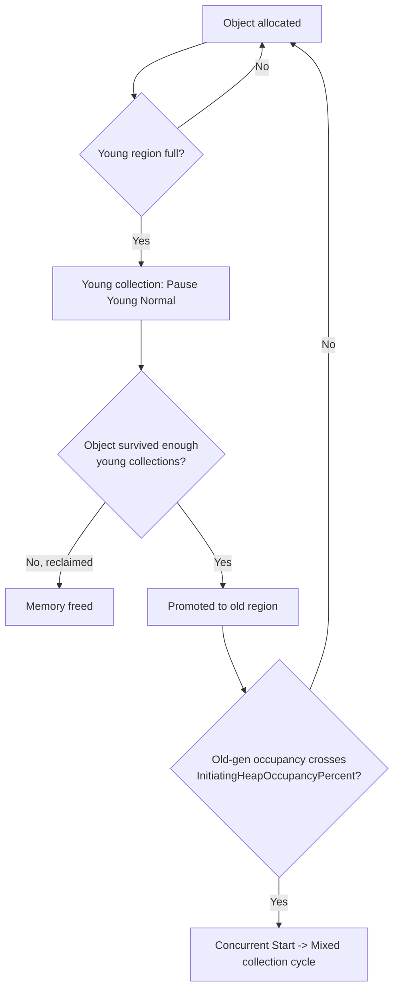

# GC Fundamentals and Log Analysis

> **Topic register:** T-303 / T-306 · IWI 7.35 (T-306) / 6.90 (T-303) · Advanced / Core tier · centre of gravity of the JVM chapter, per the blueprint: "the valuable framing is not 'name the GC algorithms' but 'here is a latency graph and a GC log — what happened?'"
> **Provenance:** the GC log excerpts in this chapter are real, captured output from [`practice/java/week-09/gc/src/AllocationStormDemo.java`](../../practice/java/week-09/gc/src/AllocationStormDemo.java), run with `-Xlog:gc*` against a real, constrained heap — not synthesized or described from documentation.

## Table of Contents

1. [Learning Objectives](#learning-objectives)
2. [Why This Matters in Interviews](#why-this-matters-in-interviews)
3. [Mental Model](#mental-model)
4. [Definition and Purpose](#definition-and-purpose)
5. [Core Concepts](#core-concepts)
6. [Internal Implementation](#internal-implementation)
7. [Diagrams](#diagrams)
8. [Production Scenarios](#production-scenarios)
9. [Failure Modes and Debugging](#failure-modes-and-debugging)
10. [Trade-offs](#trade-offs)
11. [Decision Framework](#decision-framework)
12. [Common Mistakes](#common-mistakes)
13. [Anti-Patterns](#anti-patterns)
14. [Best Practices](#best-practices)
15. [Interview Answer Framework](#interview-answer-framework)
16. [Interview Questions](#interview-questions)
17. [Summary](#summary)
18. [Key Takeaways](#key-takeaways)
19. [Cheat Sheet](#cheat-sheet)
20. [Flashcards](#flashcards)
21. [Practice Exercises](#practice-exercises)
22. [Solutions](#solutions)
23. [Additional Reading](#additional-reading)
24. [Official References](#official-references)

---

## Learning Objectives

By the end of this chapter you can:

- Read a real G1 GC log line field-by-field and extract pause type, before/after occupancy, and heap capacity.
- Distinguish a young-only pause from a mixed/full collection, and state why they have different causes.
- Recognize a rising post-GC occupancy trend as a signal of longer-lived objects, not necessarily a leak.
- Identify humongous allocations as a specific, diagnosable cause of bad GC behavior that "increase the heap" doesn't fix.
- Explain why "tuning means increasing heap size" is the most common — and most often wrong — GC tuning instinct.

## Why This Matters in Interviews

GC tuning questions test diagnosis-from-artifact, not recitation. An interviewer handing over a real log or latency graph is checking whether a candidate can extract a diagnosis under time pressure — the same skill as reading a slow-query `EXPLAIN` plan or a flame graph. Candidates who can only name collector algorithms ("G1 uses regions," "CMS is deprecated") without being able to read an actual log line reveal they've never operated a JVM under real memory pressure.

## Mental Model

**A GC log is a time series of "how full is the heap, and how long did it take to clean up" — reading it is arithmetic on a handful of numbers, not algorithm trivia.** Every pause line reports occupancy before, occupancy after, heap capacity, and pause duration. Trends across successive lines — not any single line — are what separate normal steady-state churn from a genuine problem: a rising post-collection floor means objects are surviving longer than expected; a rising pause frequency at stable duration means the allocation rate is climbing; occasional huge pauses mean something structurally different is happening (a mixed collection, a humongous allocation, or a starved container).

## Definition and Purpose

Garbage collection reclaims memory occupied by objects no longer reachable from any live root (thread stacks, static fields). **G1** (the JVM's default collector since JDK 9, per [JEP 248](https://openjdk.org/jeps/248)) divides the heap into fixed-size **regions** rather than fixed contiguous generations, and collects the regions with the most garbage first ("Garbage First") — mostly young-generation regions holding short-lived objects, occasionally including old-generation regions in a mixed collection.

G1 replaced **CMS** (Concurrent Mark Sweep) as the default specifically because CMS had no compaction phase of its own, leading to real, unavoidable heap fragmentation over time. CMS's own real history matters precisely, not just "it's old": deprecated in JDK 9 ([JEP 291](https://openjdk.org/jeps/291)), then genuinely REMOVED — not merely discouraged — in JDK 14 ([JEP 363](https://openjdk.org/jeps/363)). `-XX:+UseConcMarkSweepGC` is not a flag that silently falls back to something else on a modern JDK; real, captured proof on OpenJDK 21.0.12:

```
$ java -XX:+UseConcMarkSweepGC -version
Unrecognized VM option 'UseConcMarkSweepGC'
Error: Could not create the Java Virtual Machine.
Error: A fatal exception has occurred. Program will exit.
```

A hard startup failure, not a silent fallback to G1 or any other collector.

Manual memory management is a major source of production defects (use-after-free, double-free, leaks); GC removes that entire class of bugs at the cost of pause time and CPU spent collecting. The skill this topic rewards is **diagnosis from an artifact** — a real GC log or latency graph — not reciting collector names.

## Core Concepts

### Regions, not generations

G1 divides the heap into many fixed-size regions (typically 1–32MB each, sized automatically) rather than two or three large contiguous generations. Any region can serve as young, old, or humongous at different points in the heap's lifetime. Collecting "the regions with the most garbage first" is what gives G1 its name and lets it hit a configurable pause-time goal by choosing how many regions to collect per pause.

### Young, mixed, and full collections have different causes

A **young** collection reclaims only young-generation regions (short-lived objects) and is normally sub-millisecond to a few milliseconds. A **mixed** collection additionally reclaims some old-generation regions, triggered once old-gen occupancy crosses `InitiatingHeapOccupancyPercent` — it takes longer because it scans more live data. A **full** collection (G1's fallback, ideally rare) stops the world and compacts the entire heap — it signals G1 couldn't keep up with the allocation rate using its normal incremental approach.

### Humongous allocations bypass normal handling

Objects at least 50% of a region's size are **humongous allocations** — they bypass the normal young-gen allocation path entirely and go straight into dedicated regions, collected less efficiently. A stream of humongous allocations (e.g., repeatedly allocating large byte arrays for buffering) is a common, specific, diagnosable cause of unexpectedly bad GC behavior that "increase the heap" doesn't fix, because the problem is allocation *pattern*, not total volume.

### Occupancy trend is the real diagnostic signal

A single pause line tells you almost nothing. What matters is the trend across successive collections: post-GC occupancy climbing across successive young collections means objects are surviving longer than expected, heading toward promotion — worth checking whether that's an intentional growing cache or a leak.

## Internal Implementation

**A real GC log, read** — `AllocationStormDemo.java` run with `-Xmx64m -Xlog:gc*:file=gc.log:time,level,tags`, allocating ~4.9GB of short-lived 1KB objects plus a smaller stream of retained 8KB objects into a deliberately small, fixed 64MB heap:

```
[2026-07-29T21:59:05.263-0600][info][gc,start    ] GC(0) Pause Young (Normal) (G1 Evacuation Pause)
[2026-07-29T21:59:05.264-0600][info][gc          ] GC(0) Pause Young (Normal) (G1 Evacuation Pause) 24M->1M(64M) 0.329ms
[2026-07-29T21:59:05.267-0600][info][gc,start    ] GC(1) Pause Young (Normal) (G1 Evacuation Pause)
[2026-07-29T21:59:05.267-0600][info][gc          ] GC(1) Pause Young (Normal) (G1 Evacuation Pause) 38M->1M(64M) 0.302ms
[2026-07-29T21:59:05.270-0600][info][gc,start    ] GC(2) Pause Young (Normal) (G1 Evacuation Pause)
[2026-07-29T21:59:05.270-0600][info][gc          ] GC(2) Pause Young (Normal) (G1 Evacuation Pause) 38M->1M(64M) 0.186ms
[2026-07-29T21:59:05.272-0600][info][gc,start    ] GC(3) Pause Young (Normal) (G1 Evacuation Pause)
[2026-07-29T21:59:05.273-0600][info][gc          ] GC(3) Pause Young (Normal) (G1 Evacuation Pause) 38M->6M(64M) 0.605ms
```

Four real young-generation collections in under 10 milliseconds of wall-clock time, each sub-millisecond. Reading GC(3) specifically: heap occupancy went from 38MB to 6MB out of a 64MB max — a larger post-collection residency than GC(0)–(2)'s 1MB, meaning more objects survived this collection than the previous ones (consistent with the demo's periodic retained 8KB allocations accumulating toward the young-gen survivor space filling up and objects starting to age toward eventual promotion).

**Reading the log line field-by-field:**

```
GC(3) Pause Young (Normal) (G1 Evacuation Pause) 38M->6M(64M) 0.605ms
 │      │      │        │            │             │    │    │      │
 │      │      │        │            │             │    │    │      └─ pause duration
 │      │      │        │            │             │    │    └─ heap capacity at time of GC
 │      │      │        │            │             │    └─ heap occupancy AFTER
 │      │      │        │            │             └─ heap occupancy BEFORE
 │      │      │        │            └─ G1's internal name for this collection type
 │      │      │        └─ "Normal" vs "Concurrent Start" (the latter begins a mixed-collection cycle)
 │      │      └─ collector generation being collected (Young here; Mixed collections touch old-gen regions too)
 │      └─ this JVM's Nth collection since start (0-indexed, monotonically increasing)
 └─ GC event identifier
```

**What to look for when diagnosing a real production log:**

- **Pause frequency increasing over time** with roughly stable pause duration → allocation rate is climbing, not necessarily a leak yet.
- **Post-GC occupancy trending upward** across successive young collections (as GC(3) above shows) → objects surviving longer than expected, heading toward promotion — check whether that's intentional (a growing cache) or a leak.
- **A "Concurrent Start" pause followed by a mixed-collection sequence** → G1 decided old-gen occupancy crossed `InitiatingHeapOccupancyPercent` and is running a full mixed cycle — frequent occurrences usually mean the old generation is undersized or genuinely leaking.
- **Pause duration climbing into the hundreds of ms or seconds** → usually means either the heap is too small for the live-object working set, or a single region has an unusually large live-object density (humongous allocations).

## Diagrams



## Production Scenarios

### Scenario: a service's p99 latency degrades gradually over days, traced to a growing old generation

**Symptoms.** A service's p99 request latency, stable for months, begins climbing gradually over several days with no deployment or traffic-pattern change; GC logs show young-collection pause duration is unchanged, but young collections are becoming more frequent, and mixed collections (rare historically) are now occurring every few minutes with rising duration each time.

**Impact.** User-facing latency degrades continuously, eventually crossing the service's SLO, without any single triggering event to investigate.

**Initial hypotheses.** A recent code change (checked — no deploy in the affected window); increased traffic (checked — request rate is flat); a slow memory leak in application code causing the old generation to fill and mixed collections to work harder each time (correct, confirmed via heap dump comparison over time).

**Evidence.** Two heap dumps taken 48 hours apart show the same object type (a cache entry class) growing in retained count with no corresponding eviction; the GC log's post-mixed-collection occupancy trend is monotonically increasing across the observation window, exactly the "occupancy trending upward" signal this chapter's diagnostic checklist names.

**Diagnosis.** An unbounded (or incorrectly-keyed) in-memory cache is retaining entries indefinitely; as the retained set grows, more of it survives each young collection, more gets promoted, old-gen occupancy climbs, and each mixed collection has to scan and compact more live data — directly explaining both the rising mixed-collection frequency and their individually climbing duration.

**Immediate mitigation.** Restart the affected instances to reclaim the accumulated retained objects and buy time.

**Permanent remediation.** Fix the cache's eviction policy (a missing TTL or size bound on the specific cache identified in the heap dump), not GC tuning — no heap size or pause-time-goal change addresses a genuine leak.

**Alternatives considered.** Increasing heap size — rejected as treating the symptom; a genuinely unbounded cache eventually exhausts any heap size, just more slowly.

**Trade-offs.** None — this is a straightforward application-level bug, not a GC tuning trade-off; the GC log was the diagnostic tool, not the thing being tuned.

**Prevention.** Any long-lived cache or collection should have an explicit bound (size or TTL) reviewed at code-review time; a GC log dashboard alerting on a sustained rise in post-mixed-collection occupancy would have caught this days earlier than p99 latency did.

**Interview lesson.** This is Interview Question 1's underlying scenario in miniature — a real production trace of "post-GC occupancy climbing across collections" resolving to an application-level leak, not a collector misconfiguration.

## Failure Modes and Debugging

| Symptom | Likely cause | Debugging step |
|---|---|---|
| Pause frequency rising, duration stable | Allocation rate climbing | Correlate with traffic/feature rollout; not necessarily a bug |
| Post-GC occupancy climbing across young collections | Objects surviving longer than expected | Heap dump comparison over time; check for a growing cache vs. genuine leak |
| "Concurrent Start" + mixed-collection sequence recurring frequently | Old-gen occupancy repeatedly crossing threshold | Check old-gen sizing and for a leak; consider whether `InitiatingHeapOccupancyPercent` needs adjustment |
| Occasional very large single-pause spikes | Humongous allocations, or container CPU throttling | Check allocation sizes relative to region size; check container cgroup CPU limits vs. JVM ergonomics |
| Pauses in the hundreds of ms to seconds | Heap too small for live-object working set, or humongous allocation stream | Read the log for occupancy-after-collection relative to heap capacity; check for humongous allocation log entries |

## Trade-offs

| Tuning lever | Benefit | Cost |
|---|---|---|
| Larger heap | Fewer collections needed | Each collection (especially mixed/full) takes longer, since more live data to scan; more memory reserved whether used or not |
| Smaller young generation | More frequent, but shorter, pauses | More promotion pressure if objects don't die young enough to be reclaimed before promotion |
| Larger young generation | Objects have longer to die before promotion, fewer objects promoted | Each young collection takes longer to scan; less memory available for old gen |
| Pause-time goal (`-XX:MaxGCPauseMillis`) | G1 tunes region/generation sizing automatically toward this target | A goal set too aggressively low forces more frequent, smaller collections — sometimes worse total throughput |

## Decision Framework

1. **Is the pause young-only or mixed/full?** A young-only pause taking hundreds of ms is unusual and points to a very large young generation or container memory-bandwidth starvation; a mixed/full pause taking longer is expected, but its frequency and trend still matter.
2. **Is post-GC occupancy trending up across successive collections?** If yes, treat it as a leak-or-growing-cache signal and go to a heap dump before touching any JVM flag.
3. **Are there humongous allocations in the log?** If yes, the fix is an allocation-pattern change (e.g., avoid large repeated byte-array allocations), not a heap-size increase.
4. **Is the JVM running in a container?** Verify heap sizing respects the cgroup memory limit, not host memory — a common, distinct failure mode that looks like a GC problem but isn't one.
5. **Only after 1–4 are ruled out**, consider a pause-time goal or generation-sizing change — heap size is the last lever, not the first.

## Common Mistakes

- Treating "tuning" as synonymous with "increase heap size."
- Not distinguishing young-only pauses from mixed/full collections when reading a log — they have very different causes and fixes.
- Ignoring the occupancy-trend signal (post-GC heap size climbing across successive collections) that distinguishes normal steady-state churn from a genuine leak or undersized old generation.

## Anti-Patterns

- **Jumping straight to "increase the heap"** without reading what the log actually shows first.
- **Sizing a container's JVM heap against host memory** instead of the container's cgroup limit, causing OOM-kills that present as mysterious crashes rather than GC problems.
- **Setting an aggressively low pause-time goal** without checking whether it forces enough small collections to hurt total throughput.
- **Ignoring humongous-allocation log entries** and attempting to fix their pause impact purely with more heap.

## Best Practices

- Read the log's occupancy trend across several collections before drawing a conclusion from any single pause line.
- Distinguish young, mixed, and full collections explicitly — they have different causes and different fixes.
- Treat a climbing post-GC occupancy trend as a heap-dump-worthy signal, not something to tune away.
- Verify container cgroup memory limits match JVM heap ergonomics before assuming a GC problem in containerized deployments.

## Interview Answer Framework

### 30-Second Answer

GC log analysis means reading pause type, before/after occupancy, and heap capacity from a real log line, then tracking the trend across collections — not reciting collector algorithm names. Rising post-GC occupancy signals objects surviving longer than expected (leak or growing cache); "increase the heap" is frequently the wrong fix.

### 2-Minute Answer

Definition: G1 divides the heap into regions and collects the most-garbage-first; a log line reports pause type, occupancy before/after, heap capacity, and duration. Why it exists: GC removes an entire class of manual-memory bugs at the cost of pause time. How it works: young collections are frequent and short; mixed collections additionally scan old-gen regions once occupancy crosses a threshold; humongous allocations (≥50% of a region) bypass normal handling. One important trade-off: a larger heap means fewer but longer collections. Production example: a real captured log showing four sub-millisecond young pauses with a rising post-collection occupancy trend, driven by a growing cache with no eviction policy.

### 10-Minute Deep Dive

Cover, in order: the mental model — a GC log is a time series, trends matter more than single lines (mental model); the real captured log and field-by-field reading (internals, real evidence); young vs. mixed vs. full collections and what triggers each (core concepts); humongous allocations as a distinct, diagnosable cause (core concepts); the decision framework for diagnosing a real log before touching any flag (decision framework); and close with the production scenario — a gradually-degrading p99 traced through the occupancy-trend signal to a leaking cache, not a collector misconfiguration.

### Whiteboard Explanation

Draw the [§ Diagrams](#diagrams) flowchart: object allocated → young region fills → young collection → survives enough collections? → promoted to old → old-gen threshold crossed? → mixed collection. Annotate the "survives enough collections" branch as "this is where a leak shows up as a trend, not a single pause."

### Production Example

The p99 degradation in [§ Production Scenarios](#production-scenarios): a gradually growing old generation, visible in the GC log as a rising post-mixed-collection occupancy trend, traced via heap dump comparison to an unbounded cache — fixed by adding an eviction policy, not by tuning GC.

### Trade-offs to Mention

State unprompted: heap size is one lever among several and not always the right one; young vs. mixed/full pauses have genuinely different causes; humongous allocations are an allocation-pattern problem that more heap doesn't fix.

### Common Candidate Mistakes

Stopping at "give it more RAM" without a log-driven diagnosis; not distinguishing young from mixed/full pauses; missing the occupancy-trend signal entirely.

### Typical Follow-Up Questions

1. "The heap is already generously sized. What else could it be?"
2. "When WOULD increasing heap size actually be the right fix?"
3. "How does this change in a containerized deployment?"

### Senior-Level Expectations

Distinguishes young vs. mixed/full pauses and reasons about promotion trend from occupancy numbers; states heap size is only correct when the log shows the live-object working set genuinely doesn't fit.

### Staff-Level Discussion

GC log analysis is one of the clearest instances of "demonstrable skill beats recitable fact" — an interviewer handing over a real log or latency graph tests whether a candidate can extract a diagnosis from an artifact under time pressure, the same skill as reading a slow-query `EXPLAIN` plan or a flame graph. A Staff-level engineer treats every performance-tuning conversation as starting from an artifact rather than intuition or a generic checklist, because GC behavior is workload-specific enough that generic advice ("use G1," "increase heap") is frequently wrong for the actual allocation pattern in front of them. For containerized deployments specifically, a JVM sized against host memory rather than the container's cgroup limit is a distinct, common production failure that looks like a GC problem but isn't one.

## Interview Questions

### Question 1 — Pauses hit 4 seconds. Diagnose from this log.

**Why interviewers ask it.** Tests whether the candidate can extract a diagnosis from an artifact rather than guessing.

**Expected answer.** Check whether it's a young-only pause (unusual at 4s — suggests a very large young generation or a memory-bandwidth-starved container) or a mixed/full collection (expected to take longer); check post-GC occupancy trend across preceding collections for a promotion/leak pattern; check for humongous allocations specifically.

**Minimum acceptable answer.** States they'd look at the log rather than immediately proposing a fix.

**Strong Senior answer.** Distinguishes young vs. mixed/full pauses and reasons about promotion trend from occupancy numbers.

**Staff-level extension.** Names humongous allocations and container memory-bandwidth/CPU-throttling as specific, non-obvious causes that "just add more heap" doesn't fix, and states the diagnostic signal for each.

**Common mistakes.** Jumping straight to "increase the heap" without reading what the log actually shows first.

**Likely follow-ups.** "The heap is already generously sized. What else could it be?"

**Evaluation criteria (1–5).** 1: proposes increasing heap with no log analysis. 3: distinguishes young from mixed/full pauses and reads occupancy trend. 5: correct diagnosis plus names humongous allocations and container throttling unprompted.

**Related references.** [§ Internal Implementation](#internal-implementation); [§ Decision Framework](#decision-framework).

---

### Question 2 — Tuning means increasing heap size — true or false?

**Why interviewers ask it.** The most common GC misconception; tests whether a candidate has an actual mental model or a slogan.

**Expected answer.** False. Heap size is one lever among several (generation sizing, pause-time goals, allocation-pattern fixes like avoiding humongous allocations); it can even make things worse (longer per-collection scan time for a bigger live set).

**Minimum acceptable answer.** States that heap size isn't the only lever, even without naming the alternatives.

**Strong Senior answer.** States heap size is only correct when the log shows the live-object working set genuinely doesn't fit, not just "GC is happening."

**Staff-level extension.** Connects to container ergonomics — a JVM sized against host memory rather than the container's cgroup limit is a distinct, common production failure that looks like a GC problem but isn't one.

**Common mistakes.** Stopping at "give it more RAM" without a log-driven diagnosis.

**Likely follow-ups.** "When WOULD increasing heap size actually be the right fix?"

**Evaluation criteria (1–5).** 1: "yes, more heap fixes GC." 3: correctly states heap size is one lever among several. 5: correct answer plus the container cgroup-limit failure mode named unprompted.

**Related references.** [§ Core Concepts](#core-concepts); [§ Production Scenarios](#production-scenarios).

## Summary

A real, captured GC log shows four sub-millisecond young-generation pauses with a rising post-collection occupancy trend — exactly the kind of artifact this topic trains diagnosis on. Reading a GC log means extracting pause type, before/after occupancy, and trend across collections, not reciting collector algorithm names; "increase the heap" is frequently the wrong fix, and the log itself usually shows why.

## Key Takeaways

- G1 collects region-by-region, prioritizing the most garbage first; young pauses and mixed (young+old) pauses have different causes.
- Rising post-GC occupancy across successive young collections signals objects surviving longer than expected — check for a leak or undersized old generation.
- Humongous allocations (≥50% of region size) bypass normal handling and are a specific, diagnosable cause of bad GC behavior that more heap doesn't fix.
- "Tuning means increasing heap size" is the most common misconception — heap size is one lever among several, and not always the right one.

## Cheat Sheet

| Log signal | Likely meaning |
|---|---|
| Frequent young pauses, stable duration | Rising allocation rate |
| Post-GC occupancy climbing across young collections | Objects surviving longer — check for leak or growing cache |
| "Concurrent Start" + mixed-collection sequence | Old-gen occupancy crossed threshold — check old-gen sizing/leak |
| Occasional very large single-pause spikes | Check for humongous allocations or container CPU throttling |

## Flashcards

### Card: Most common GC tuning misconception

**Prompt:**
What's the most common misconception about GC tuning?

**Answer:**
That tuning means increasing heap size — it's one lever among several and isn't always correct.

**Why it matters:**
The default instinct most candidates reach for first, and frequently the wrong one.

**Common trap:**
Proposing more heap without reading the log first.

**Related:**
[Decision Framework](#decision-framework)

### Card: Rising post-GC occupancy trend

**Prompt:**
What does a rising post-GC occupancy trend across successive young collections suggest?

**Answer:**
Objects are surviving longer than expected, heading toward promotion — check for a leak or an intentionally growing cache.

**Why it matters:**
The real diagnostic signal, versus any single pause line.

**Common trap:**
Drawing a conclusion from one log line instead of the trend.

**Related:**
[Internal Implementation](#internal-implementation)

### Card: Humongous allocations

**Prompt:**
What is a "humongous allocation" in G1, and why doesn't more heap fix problems it causes?

**Answer:**
An object ≥50% of a region size, handled via dedicated regions outside normal young-gen allocation — the problem is allocation pattern, not total heap volume.

**Why it matters:**
A specific, diagnosable cause of bad GC behavior that a naive "increase the heap" response doesn't address.

**Common trap:**
Treating all bad GC pauses as a sizing problem.

**Related:**
[Core Concepts](#core-concepts)

## Practice Exercises

1. Reproduce: [`practice/java/week-09/gc/src/AllocationStormDemo.java`](../../practice/java/week-09/gc/src/AllocationStormDemo.java), run with `java -Xmx64m "-Xlog:gc*:file=gc.log:time,level,tags" -cp out AllocationStormDemo`.
2. Lower `-Xmx` further (e.g., to 32M) and observe how pause frequency and the occupancy trend change.
3. Increase the demo's retained-object ratio and try to force a "Concurrent Start" / mixed-collection log line to appear — what allocation pattern was needed to trigger it?

## Solutions

**Exercise 1.** Expected output matches this chapter's captured log: four sub-millisecond young collections with post-GC occupancy climbing from 1M to 6M as the retained 8KB allocations accumulate.

**Exercise 2.** A smaller `-Xmx` forces more frequent young collections (less room before the young generation fills) and typically shows the occupancy trend crossing toward promotion sooner, since there's less headroom for objects to die before the next collection.

**Exercise 3.** Increasing the ratio of retained (8KB) to short-lived (1KB) allocations accelerates old-gen occupancy growth; once it crosses `InitiatingHeapOccupancyPercent`, a "Concurrent Start" line appears followed by a mixed-collection sequence touching old-gen regions.

## Additional Reading

- [Oracle — Garbage-First (G1) Garbage Collector tuning guide](https://docs.oracle.com/en/java/javase/21/gctuning/garbage-first-g1-garbage-collector1.html)

## Official References

- [JEP 248: Make G1 the Default Garbage Collector](https://openjdk.org/jeps/248)
