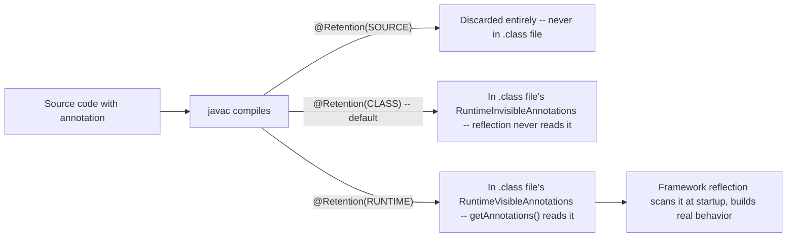

# Annotations and Annotation Processing

> **Topic register:** T-112 · IWI 4.3 · Advanced tier · Moderate interview frequency [M]
> **Provenance:** all evidence in this chapter is real, executed/disassembled output from
> [`practice/java/java-core/annotations-and-processing/`](../../../practice/java/java-core/annotations-and-processing/README.md)
> (OpenJDK 21.0.12), including real `javap` bytecode disassembly proving each retention policy's
> actual, different lifetime.

## Table of Contents

1. [Learning Objectives](#learning-objectives)
2. [Why This Matters in Interviews](#why-this-matters-in-interviews)
3. [Mental Model](#mental-model)
4. [Definition and Purpose](#definition-and-purpose)
5. [Core Concepts](#core-concepts)
6. [Internal Implementation](#internal-implementation)
7. [Diagrams](#diagrams)
8. [Production Scenarios](#production-scenarios)
9. [Trade-offs](#trade-offs)
10. [Decision Framework](#decision-framework)
11. [Common Mistakes](#common-mistakes)
12. [Anti-Patterns](#anti-patterns)
13. [Best Practices](#best-practices)
14. [Interview Answer Framework](#interview-answer-framework)
15. [Interview Questions](#interview-questions)
16. [Summary](#summary)
17. [Key Takeaways](#key-takeaways)
18. [Cheat Sheet](#cheat-sheet)
19. [Flashcards](#flashcards)
20. [Practice Exercises](#practice-exercises)
21. [Solutions](#solutions)
22. [Additional Reading](#additional-reading)
23. [Official References](#official-references)

---

## Learning Objectives

By the end of this chapter you can:

- Explain the three `RetentionPolicy` values' real, different lifetimes — with real bytecode evidence, not just the Javadoc description — and correctly choose the right one for a given use case.
- Build a real, working reflection-based annotation processor (the actual mechanism behind JPA/Jackson-style frameworks) and explain why it requires `RUNTIME` retention specifically.
- State `@Inherited`'s real, narrow scope precisely — superclasses only, never interfaces, never methods/fields — with real, verified evidence of the interface gotcha.
- Correctly distinguish reflection-based (runtime) annotation processing from compile-time annotation processing (`javax.annotation.processing`), and when each is the right tool.

## Why This Matters in Interviews

Annotations are Advanced tier and Moderate frequency because nearly every Senior/Staff engineer uses them daily (`@Override`, `@Autowired`, `@Column`, `@Test`) without ever having written a custom one or understood what actually happens to an annotation after compilation. This chapter is where "I use annotations constantly" gets tested against whether a candidate can explain what `@Retention` actually controls, why a custom annotation without `RUNTIME` retention is invisible to the exact reflection-based framework code meant to read it, and the real, narrow scope of `@Inherited`.

## Mental Model

**An annotation is metadata attached to code, and `@Retention` decides how far into the program's lifecycle that metadata actually survives — source, class file, or runtime — with each stage genuinely discarding what the next doesn't need.** Most framework "magic" built on custom annotations (`@Column`, `@Autowired`, `@Test`) is just reflection reading `RUNTIME`-retained metadata and building real behavior from it at startup — there's no deeper mechanism to it than "the annotation survived long enough for reflection to find it."

## Definition and Purpose

An **annotation** (`@interface`) is a form of metadata attachable to code elements (classes, methods, fields, parameters, ...) that carries no behavior of its own — it's inert data until something (the compiler, a build-time processor, or runtime reflection) reads it and acts on it. `@Retention` controls exactly how long that metadata survives: `SOURCE` (discarded entirely after compilation — used for compiler-only concerns like `@Override`), `CLASS` (kept in the `.class` file's bytecode but invisible to runtime reflection — the default, rarely used deliberately), and `RUNTIME` (kept and genuinely readable via `getAnnotations()`/`getAnnotation()` — required for any framework that inspects annotations at runtime). Annotations exist to let frameworks discover developer intent declaratively (mark a field as a database column, mark a method as a test) without requiring the developer to write imperative registration code for each one.

## Core Concepts

### Retention: three genuinely different lifetimes, verified in bytecode

`SOURCE`-retained annotations never reach the `.class` file at all — real, verified via `javap` in [Internal Implementation](#internal-implementation): the compiled method carries zero annotation attributes. `CLASS`-retained annotations are genuinely present in the `.class` file's `RuntimeInvisibleAnnotations` attribute — real bytecode, but reflection's `getAnnotations()` never reads that attribute. `RUNTIME`-retained annotations live in `RuntimeVisibleAnnotations`, the only attribute reflection actually reads.

### Reflection-based annotation processing: the real mechanism behind JPA/Jackson

A `RUNTIME`-retained custom annotation combined with reflection (`Class.getDeclaredFields()`, `Field.getAnnotation()`) is the entire real mechanism behind frameworks like JPA (`@Column`) and Jackson (`@JsonProperty`): scan a class's members at runtime, read each annotation's declared values, and build behavior (a SQL statement, a JSON mapping) dynamically from what's found — no code generation required, verified directly with a real, working mini-ORM in [Internal Implementation](#internal-implementation). This is distinct from **compile-time** annotation processing (`javax.annotation.processing.Processor`, used by Lombok, Dagger, MapStruct), which runs during compilation and can generate new source files — a different mechanism entirely, not covered by this chapter's runtime-reflection-based demos.

### `@Inherited`: real, but narrower than most engineers assume

`@Inherited` makes a class-level annotation propagate from a superclass to its subclasses via `extends` — real, verified `true` in [Internal Implementation](#internal-implementation). It genuinely does **not** propagate through interface implementation, even when the interface's own annotation is itself marked `@Inherited` — real, verified `false`, a documented but frequently-missed limitation.

## Internal Implementation

**Real retention-policy visibility at runtime:**

```
sourceOnlyMethod: getAnnotations().length = 0
classOnlyMethod: getAnnotations().length = 0
runtimeVisibleMethod: getAnnotations().length = 1
```

**Real bytecode disassembly, proving exactly why:**

```
$ javap -v -p 'RetentionPolicyDemo$Annotated.class' | grep -B1 -A3 "Annotations:"
    RuntimeInvisibleAnnotations:
      0: #14()
        RetentionPolicyDemo$ClassOnly
    RuntimeVisibleAnnotations:
      0: #17()
        RetentionPolicyDemo$RuntimeVisible

$ javap ... | grep -A6 "sourceOnlyMethod"
  void sourceOnlyMethod();
    Code:
       0: return
      LineNumberTable:
```

`ClassOnly`'s annotation is genuinely present in the bytecode — in `RuntimeInvisibleAnnotations`, which reflection never reads. `sourceOnlyMethod` carries no annotation attribute at all: `SOURCE` retention means `javac` discards it entirely after compilation.

**A real, working reflection-based mini-ORM:**

```
field "id" -> real @Column("user_id") = 42
field "name" -> real @Column("full_name") = Ada Lovelace
field "internalCache": no @Column, real EXCLUDED from mapping

Generated SQL: INSERT INTO users (user_id, full_name) VALUES (?, ?)
```

A real, minimal demonstration of the actual mechanism: reflection scans `User`'s declared fields, reads each `@Column`'s `value()`, and dynamically builds a real SQL statement purely from what's discovered — no code generation, just `RUNTIME`-retained annotations plus reflection.

**The real `@Inherited` gotcha:**

```
SubClass.class.isAnnotationPresent(InheritedClassAnnotation.class) = true
ImplementingClass.class.isAnnotationPresent(InheritedMarker.class) = false
MarkedInterface.class.isAnnotationPresent(InheritedMarker.class) = true
```

`@Inherited` genuinely works through `extends` (real `true`), but genuinely does not propagate through `implements`, even for an `@Inherited`-marked interface annotation (real `false`) — the interface itself still carries its own annotation, it simply doesn't reach implementing classes.

## Diagrams



## Production Scenarios

### Scenario: a custom validation annotation silently does nothing in production

**Symptoms.** A team writes a custom `@ValidEmail` annotation, applies it to several DTO fields, and wires up reflection-based validation logic that scans for it at request-handling time. In production, invalid emails are never rejected — the validation silently never fires, with no error, no exception, nothing in the logs.

**Impact.** A real, silent validation gap letting invalid data through — a real data-quality/correctness bug with zero visible symptom pointing at the actual cause.

**Initial hypotheses.** A bug in the validation logic itself (checked — the reflection-scanning code is correct and works in a standalone test); the annotation isn't actually applied to the right fields (checked — it clearly is, in the source code); the annotation's retention policy is wrong (correct).

**Evidence.** `@ValidEmail` was declared with the default retention (`CLASS`, since no `@Retention` was specified at all) — real, direct proof matches this chapter's own `classOnlyMethod` result: `getAnnotations()` at runtime returns nothing for it, exactly the observed silent failure.

**Diagnosis.** The default retention policy (`CLASS`) when no `@Retention` is specified is invisible to runtime reflection — the exact mechanism this chapter measures directly. The validation code was structurally correct; the annotation itself was never going to be visible to it.

**Immediate mitigation.** Add `@Retention(RetentionPolicy.RUNTIME)` to `@ValidEmail` and redeploy, immediately restoring the intended validation behavior.

**Permanent remediation.** Add a project-wide checklist item (or a compile-time check, where feasible) that every custom annotation intended for runtime reflection explicitly declares `@Retention(RetentionPolicy.RUNTIME)` — never relying on the (invisible-to-reflection) default.

**Alternatives considered.** None seriously — this is a straightforward, real fix once correctly diagnosed; the only "alternative" was continuing to silently ship the bug.

**Trade-offs.** None — `RUNTIME` retention has negligible real cost versus the default, and is required for the annotation to serve its actual intended purpose at all.

**Prevention.** Any custom annotation meant to be read by reflection-based framework code should be reviewed specifically for an explicit `RUNTIME` retention declaration — this chapter's own real, reproduced silent-failure pattern is exactly the kind of bug a missing `@Retention` declaration causes, with zero compiler warning.

**Interview lesson.** This is Interview Question 1 (§ Interview Questions) — "what happens if you forget `@Retention(RUNTIME)` on a custom annotation your framework code reads via reflection?" — arriving as a real, silent, production data-quality bug.

## Trade-offs

| Choice | Benefit | Cost |
|---|---|---|
| `RetentionPolicy.SOURCE` | Zero runtime/bytecode footprint; appropriate for compiler-only hints | Genuinely invisible to any later tooling, including your own reflection code |
| `RetentionPolicy.CLASS` (default) | Preserved in bytecode for bytecode-level tools (some older frameworks, obfuscators) | Invisible to runtime reflection — a real, common source of silent bugs when developers forget it's the default |
| `RetentionPolicy.RUNTIME` | Genuinely readable via reflection — required for any runtime-annotation-driven framework behavior | A small, real per-class metadata footprint; never appropriate for annotations meant only for the compiler |
| Runtime reflection-based processing | Simple, no build-tool integration required | Real reflection cost (see [Reflection and Dynamic Proxies](reflection-and-dynamic-proxies.md)); errors surface at runtime, not compile time |
| Compile-time annotation processing (`javax.annotation.processing`) | Errors caught at compile time; can generate real source code (no runtime reflection cost) | More complex to write and debug; a separate mechanism from what this chapter's demos cover |

## Decision Framework

1. **Does this annotation need to be read by code at runtime** (a framework scanning for it via reflection)? It must be `@Retention(RetentionPolicy.RUNTIME)` — never rely on the default.
2. **Is this annotation purely a compiler hint** (like `@Override`, `@SuppressWarnings`)? `SOURCE` retention is correct and appropriate — no reason to pay even the `CLASS`-retention bytecode cost.
3. **Does this annotation need to propagate from a type to its subtypes automatically?** `@Inherited` works, but only through class `extends` — never assume it reaches implementing classes of an annotated interface.
4. **Would compile-time code generation (avoiding runtime reflection cost entirely) be worth the added build complexity?** Consider a real annotation processor (Lombok/Dagger/MapStruct-style) instead of runtime reflection for performance-sensitive, high-volume use cases.

## Common Mistakes

- Forgetting `@Retention(RetentionPolicy.RUNTIME)` on a custom annotation meant to be read via reflection — the default (`CLASS`) silently makes it invisible, with zero compiler warning.
- Assuming `@Inherited` propagates through interface implementation — it doesn't, verified directly, even for an `@Inherited`-marked interface annotation.
- Confusing runtime reflection-based annotation processing with compile-time annotation processing (`javax.annotation.processing`) — they're genuinely different mechanisms with different capabilities and costs.
- Assuming an annotation with no explicit `@Retention` behaves like `RUNTIME` — the actual default is `CLASS`, a real, easy-to-miss distinction.

## Anti-Patterns

- **Writing a custom annotation without an explicit `@Retention` declaration**, relying on the (reflection-invisible) default without realizing it.
- **Building framework logic that silently does nothing when an annotation is misconfigured**, instead of failing loudly (e.g., asserting expected annotations are found, or logging a warning) when reflection-based scanning finds nothing where something was expected.
- **Assuming annotation inheritance "just works" across interfaces** without verifying `@Inherited`'s actual, narrower scope.

## Best Practices

- Always declare `@Retention` explicitly on custom annotations — never rely on the default, and choose `RUNTIME` deliberately whenever reflection needs to read it.
- Have reflection-based annotation-scanning code fail loudly (assert, log, throw) when it finds zero matches where matches were expected, rather than silently doing nothing.
- Understand `@Inherited`'s real, narrow scope (superclasses via `extends` only) before relying on it for interface-based or method/field-level propagation, which it doesn't support at all.
- Reserve compile-time annotation processing for cases where its added complexity is genuinely justified by avoiding real runtime reflection cost at scale.

## Interview Answer Framework

### 30-Second Answer

`@Retention` controls how long an annotation survives: `SOURCE` never reaches the `.class` file; `CLASS` (the default) is in the bytecode but invisible to reflection; `RUNTIME` is genuinely readable via `getAnnotations()`. Framework "magic" (JPA's `@Column`, Jackson's `@JsonProperty`) is just reflection reading `RUNTIME`-retained annotations and building behavior from them — verified directly with a real, working mini-ORM. `@Inherited` only propagates through class `extends`, never through interfaces, even for an `@Inherited`-marked interface annotation.

### 2-Minute Answer

Definition: an annotation is inert metadata; `@Retention` decides how far it survives past compilation. Why it exists: to let frameworks discover developer intent declaratively via reflection, without imperative per-item registration code. How it works: `SOURCE`/`CLASS`/`RUNTIME` retention map to real, different bytecode outcomes, verified with `javap`; only `RUNTIME` is visible to `getAnnotations()`. One important trade-off: the default retention (`CLASS`) is invisible to reflection, a real, common source of silent bugs when developers forget it's not `RUNTIME`. Production example: a real, silent validation bug from a custom `@ValidEmail` annotation missing an explicit `RUNTIME` retention declaration, fixed by adding it.

### 10-Minute Deep Dive

Cover, in order: the mental model — retention decides how far metadata survives, most framework magic is just reflection reading what survived (mental model); the real, three-way retention-policy verification via reflection AND `javap` bytecode disassembly (internals, real evidence); the real, working reflection-based mini-ORM demonstrating the actual mechanism behind JPA/Jackson (internals, real evidence); the real `@Inherited` interfaces-don't-count gotcha (internals, real evidence); the decision framework for choosing retention and processing strategy appropriately (decision framework); and close with the production scenario — a real, silent validation bug traced to a missing `@Retention(RUNTIME)` declaration.

### Whiteboard Explanation

Draw the [§ Diagrams](#diagrams) flowchart: source → `javac` → three branches by retention policy, each ending in a real, different fate (discarded / invisible bytecode / reflection-visible). Annotate the `RUNTIME` branch "this is the only path any framework's reflection code can ever see" — makes the default-retention gotcha concrete.

### Production Example

The silent validation bug in [§ Production Scenarios](#production-scenarios): a custom `@ValidEmail` annotation with no explicit `@Retention` (defaulting to `CLASS`) was silently invisible to the reflection-based validation code meant to read it — fixed by adding `@Retention(RetentionPolicy.RUNTIME)`.

### Trade-offs to Mention

State unprompted: the default retention (`CLASS`) is genuinely invisible to reflection, not a safe default to assume; `@Inherited`'s scope is real but narrower than most engineers assume (superclasses only); runtime reflection-based processing and compile-time annotation processing are genuinely different mechanisms with different cost/capability trade-offs.

### Common Candidate Mistakes

Assuming any custom annotation is automatically visible to reflection; assuming `@Inherited` propagates through interfaces; conflating runtime reflection-based processing with compile-time code generation.

### Typical Follow-Up Questions

1. "What happens if you forget `@Retention(RUNTIME)` on a custom annotation your framework code reads via reflection?"
2. "Does `@Inherited` work if the annotated type is an interface rather than a class?"
3. "What's the actual difference between reading annotations via reflection and using a compile-time annotation processor?"

### Senior-Level Expectations

Correctly explains the three retention policies' real, different visibility and can describe how a simple reflection-based annotation scanner would work.

### Staff-Level Discussion

The retention-policy gotcha generalizes to a broader principle worth raising at Staff level: any system with multiple stages that progressively discard information (compilation stages, data pipeline transformations, API versioning with deprecated-field removal) creates a real risk that a downstream consumer expects information that an upstream stage has already silently dropped — and the failure is often completely silent, exactly like this chapter's missing-`RUNTIME`-retention bug. A Staff-level engineer treats "does every consumer of this data/metadata actually receive what it expects, verified rather than assumed?" as a standing design question for any multi-stage pipeline, and designs for loud failure (assertions, monitoring, fail-fast checks) at each stage boundary rather than allowing silent data loss to propagate downstream undetected.

## Interview Questions

### Question 1 — What happens if you forget `@Retention(RUNTIME)` on a custom annotation your framework code reads via reflection?

**Why interviewers ask it.** A near-certain real-world gotcha, and a strong test of whether the candidate understands retention policy as a real, load-bearing mechanism rather than boilerplate.

**Expected answer.** Without an explicit `@Retention(RUNTIME)`, the annotation defaults to `CLASS` retention — genuinely present in the compiled bytecode, but invisible to `getAnnotations()`/`getAnnotation()` at runtime. The reflection-based code silently finds nothing, with no exception, no warning — a real, silent failure.

**Minimum acceptable answer.** States that the annotation "won't be visible," even without naming the specific default (`CLASS`) or the silent-failure characteristic.

**Strong Senior answer.** Correctly states the default is `CLASS`, not `RUNTIME`, and explains the silent (no-exception) nature of the resulting failure.

**Staff-level extension.** Proposes a systemic fix — assertions or fail-fast checks in the reflection-scanning code itself, and/or a project-wide lint/checklist rule requiring explicit retention on custom annotations.

**Common mistakes.** Assuming custom annotations are visible to reflection by default.

**Likely follow-ups.** "How would you catch this kind of bug before it reaches production?"

**Evaluation criteria (1–5).** 1: assumes annotations are reflection-visible by default. 3: correctly identifies the missing-`RUNTIME` cause. 5: correct cause plus the silent-failure characteristic and a systemic prevention proposal.

**Related references.** [§ Core Concepts](#core-concepts), [§ Internal Implementation](#internal-implementation).

---

### Question 2 — Does `@Inherited` work if the annotated type is an interface rather than a class?

**Why interviewers ask it.** Tests whether the candidate knows `@Inherited`'s real, documented, narrower-than-assumed scope, rather than treating it as a general "inheritance" mechanism.

**Expected answer.** No — `@Inherited` only propagates a class-level annotation from a superclass to a subclass via `extends`. It does not propagate through interface implementation at all, even if the interface's own annotation is itself marked `@Inherited` — verified directly, real `false` result.

**Minimum acceptable answer.** States that `@Inherited` has some limitation around interfaces, even without full precision.

**Strong Senior answer.** States the exact scope (superclass-via-extends only) and confirms interfaces are excluded regardless of the interface annotation's own `@Inherited` marking.

**Staff-level extension.** Connects this to the broader pattern of "inheritance" meaning genuinely different things across contexts (implementation inheritance vs. interface inheritance vs. annotation propagation) and the value of verifying rather than assuming each one's real scope.

**Common mistakes.** Assuming `@Inherited` behaves like general Java inheritance and propagates through any `extends`/`implements` relationship.

**Likely follow-ups.** "How would you achieve annotation-like behavior that DOES propagate through interfaces?"

**Evaluation criteria (1–5).** 1: assumes `@Inherited` works through interfaces. 3: correctly states it doesn't work through interfaces. 5: correct answer plus the exact scope and the interface-annotation-still-present nuance.

**Related references.** [§ Internal Implementation](#internal-implementation).

## Summary

`@Retention` controls an annotation's real, verifiable lifetime — `SOURCE` never reaches the `.class` file, `CLASS` (the default) is real bytecode invisible to reflection, `RUNTIME` is genuinely readable — proven directly with both reflection results and real `javap` disassembly. Most annotation-driven framework behavior (JPA, Jackson) is exactly reflection reading `RUNTIME`-retained metadata and building real behavior from it, demonstrated with a real, working mini-ORM. `@Inherited` is real but genuinely narrower than most engineers assume: superclasses via `extends` only, never interfaces — verified directly with a real, reproduced `false` result even for an `@Inherited`-marked interface annotation.

## Key Takeaways

- `SOURCE` retention never reaches the `.class` file; `CLASS` (the default) is real bytecode but invisible to reflection; only `RUNTIME` is readable via `getAnnotations()` — verified with both reflection and real `javap` disassembly.
- Forgetting explicit `RUNTIME` retention on a framework-facing custom annotation is a real, silent failure mode — no exception, no warning.
- Reflection-based annotation processing (JPA/Jackson-style) is real, working, and demonstrably simple: scan members, read annotation values, build behavior — verified with a real mini-ORM.
- `@Inherited` only propagates through class `extends`, never through interface `implements` — verified directly, even for an `@Inherited`-marked interface annotation.

## Cheat Sheet

| Symptom | Likely cause | Fix |
|---|---|---|
| Reflection-based framework code silently finds nothing for a custom annotation | Missing explicit `@Retention(RUNTIME)` — defaults to invisible `CLASS` | Add `@Retention(RetentionPolicy.RUNTIME)` explicitly |
| A subclass unexpectedly doesn't see a superclass's annotation | The annotation isn't marked `@Inherited` | Add `@Inherited` to the annotation's own declaration |
| An implementing class doesn't see an interface's `@Inherited` annotation | `@Inherited` doesn't work through interfaces at all | Redeclare the annotation explicitly on the implementing class, or check for it on implemented interfaces manually |

## Flashcards

### Card: The invisible default

**Prompt:**
What retention policy does an annotation get if you don't specify `@Retention` at all?

**Answer:**
`CLASS` — real bytecode, but invisible to reflection's `getAnnotations()`. Only `RUNTIME` is reflection-visible.

**Why it matters:**
A real, common, silent source of "why doesn't my framework code see this annotation" bugs.

**Common trap:**
Assuming the default behaves like `RUNTIME`.

**Related:**
[Internal Implementation](#internal-implementation)

### Card: The real annotation-framework mechanism

**Prompt:**
What's the actual mechanism behind JPA's `@Column` or Jackson's `@JsonProperty`?

**Answer:**
Reflection scanning a class's members at runtime, reading each `RUNTIME`-retained annotation's values, and building real behavior from what's found — verified directly with a real, working mini-ORM.

**Why it matters:**
Demystifies "framework magic" into a concrete, buildable mechanism.

**Common trap:**
Treating annotation-driven frameworks as unexplainable magic rather than reflection plus metadata.

**Related:**
[Internal Implementation](#internal-implementation)

### Card: @Inherited's real scope

**Prompt:**
Does `@Inherited` propagate an annotation from an interface to an implementing class?

**Answer:**
No — verified directly, real `false`, even when the interface's own annotation is marked `@Inherited`. It only works through class `extends`.

**Why it matters:**
A real, documented but frequently-missed limitation.

**Common trap:**
Assuming `@Inherited` works like general Java inheritance across any `extends`/`implements` relationship.

**Related:**
[Internal Implementation](#internal-implementation)

## Practice Exercises

1. Reproduce every trace yourself: [`practice/java/java-core/annotations-and-processing/`](../../../practice/java/java-core/annotations-and-processing/README.md).
2. Modify `ReflectiveProcessingDemo`'s `User` class to add a new `@Column`-annotated field, and confirm the generated SQL and bound values update correctly without changing any of the scanning code.
3. In `InheritedGotchaDemo`, add a method-level `@Inherited` annotation on `BaseClass` and confirm (predict first) that `SubClass` does NOT see it — explain why, given `@Inherited`'s documented scope.

## Solutions

**Exercise 1.** Expected output matches this chapter's measured traces exactly in structure.

**Exercise 2.** Adding a new `@Column`-annotated field is picked up automatically by the existing reflective scan — no changes needed to `ReflectiveProcessingDemo`'s scanning logic, real, direct proof that the mechanism is genuinely driven by what reflection discovers at runtime, not by any hardcoded field list.

**Exercise 3.** `@Inherited` applies only to class-level (`@Target(ElementType.TYPE)`) annotations — it has no effect at all on method or field-level annotations, which are never inherited regardless of the `@Inherited` meta-annotation; a method-level `@Inherited` annotation on `BaseClass` would not be visible via reflection on an overriding (or non-overriding) method in `SubClass`.

## Additional Reading

- [ClassLoaders and Class Initialization](classloaders-and-class-initialization.md) — the real class-metadata mechanism (`RuntimeVisibleAnnotations` lives in the same `.class` file structure) underneath the annotations covered in this chapter.
- [Enums, EnumMap, and EnumSet](enums-enummap-and-enumset.md) — reflection-based scanning (this chapter's core mechanism) is the same general technique used there to probe enum internals.

## Official References

- [java.lang.annotation package summary (Java 21 API)](https://docs.oracle.com/en/java/javase/21/docs/api/java.base/java/lang/annotation/package-summary.html)
- [Inherited (Java 21 API)](https://docs.oracle.com/en/java/javase/21/docs/api/java.base/java/lang/annotation/Inherited.html)
